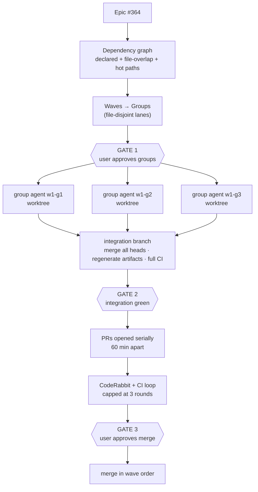

# Implement Epic

Take an epic with N sub-issues and land it as a small number of parallel,
conflict-free PR chains instead of one N-long serial queue.

`implement-issue` is the inner loop and stays the authority on how a single
ticket gets planned, built, reviewed and shipped. This skill owns everything
around it: which tickets can run at the same time, who owns which files, what
gets integrated before anything reaches `main`, and where a human says yes.

**The core idea:** ordering does not prevent merge conflicts — **disjointness**
does. A numbered branch name only decides who has to resolve the conflict. So
the central job here is partitioning the epic into groups that own
non-overlapping file territory, and serializing the handful of things that can
never be disjoint.

## Invocation

```
/implement-epic 364
/implement-epic https://github.com/org/repo/issues/364
/implement-epic plan 364
/implement-epic 364 --groups 2 --only w1
/implement-epic resume
```

- **epic number or link** → full run.
- **`plan <epic>`** → group the epic, publish every plan to its issue, write no
  code, stop. Mirrors `/implement-issue plan`.
- **`resume`** (or no argument with a state file present) → read
  `.implement-epic-state.md` and continue.
- **`--groups N`** → cap parallel lanes (default 3).
- **`--only w<N>`** → run one wave and stop.

## Mode

Run in `/caveman wenyan-ultra` so orchestration chatter stays cheap. This
governs **your conversational output only**. Plans, code, commit messages, PR
descriptions and the state file stay normal and readable — a compressed plan
defeats its purpose, since the user has to review it.

## Architecture



## Model routing

Same constraint as `implement-issue`: **you cannot switch your own model.**
Delegation to a pinned subagent is the only switch available.

| Phase | Runs on | How |
|---|---|---|
| Grouping, integration, PRs, merges | the session's model | here |
| Per-ticket research + plan | `issue-planner`'s pin | subagent |
| Per-ticket implementation | `issue-implementer`'s pin | subagent |
| Per-ticket review | Opus | `Agent(model: "opus")` from the group agent |
| Group orchestration | `epic-group-worker`'s pin | subagent, one per lane |

State the actual session model in one line before starting, as
`implement-issue` does.

If the session carries a *"Do not call the Agent tool unless the user requested
it"* rule, invoking this skill **is** that request — parallel subagents are how
this skill is specified to work.

## Step 0 — Resolve the epic

```bash
gh api repos/<owner>/<repo>/issues/<epic>/sub_issues --jq '.[] | "\(.number)|\(.title)|\(.state)"'
```

Sub-issues are **native** in this repo — read them from that endpoint, don't
scrape the epic body's table. Skip anything already closed.

If the epic has no native sub-issues, fall back to the body's issue links and
say which source you used.

## Step 1 — Build the dependency graph

Three sources, in descending confidence:

1. **Declared.** Sub-issue bodies state their edges in prose: *"Depends on
   13.1"*, *"**Blocks every other sub-issue**"*, *"Depends on #410"*. Parse
   every body and extract them. These are authoritative.
2. **Predicted file overlap.** After planning (step 4), each plan names the
   files it will touch. Two tickets sharing a file are dependent even when no
   body says so — e.g. a sidebar ticket and a header ticket both editing
   `ui/src/components/app-shell.tsx`. This is the edge type that actually
   produces merge conflicts.
3. **Hot paths — always serialized, never parallel.** Any ticket whose plan
   touches these goes in a lane by itself, or in the same lane as every other
   ticket touching them:

   | Path | Why |
   |---|---|
   | `server/src/migrations/**` | epoch-ms filename prefixes collide and misorder across branches |
   | `shared/src/**` | ripples into server and every client |
   | `ui/src/api/schema.d.ts` | generated + committed |
   | `client-admin/src/routeTree.gen.ts` | generated + committed |

Chicken-and-egg note: source 2 needs plans, and plans are cheaper once grouped.
Resolve it by grouping on sources 1 and 3 first, then **re-checking after
plans exist**. If a plan reveals an overlap that breaks the partition, move the
ticket to the owning lane and say so — do not start two lanes on the same file.

## Step 2 — Partition into waves and groups

- A **wave** is a dependency level: everything in wave N+1 depends on something
  in wave N. Waves run one after another.
- A **group** is a lane inside a wave: a sequential queue of tickets that owns a
  file territory no other lane in that wave touches. Groups run in parallel.

Rules:

- A ticket that blocks many others (`**Blocks every other sub-issue**`, e.g.
  #417, #429, #410) is a wave of its own. Don't try to parallelize around it.
- Default max 3 concurrent groups. More lanes means more worktrees, more
  review load and more PR pacing waits — it does not mean proportionally more
  throughput.
- Give each group a one-line territory description ("the `ui/` shell
  components", "server fees module + its DTOs"). If you cannot write that line,
  the partition is wrong.

### UI work needs no mockup gate

There is no design-approval step. A ticket that changes UI ships in the same run
as everything else — the standard it is held to is **consistency with the app
that already exists**: `@biddaloy/ui` components and tokens only, the
established patterns reused (the four shells, the portal card grammar, the
density modes), no one-off styles or ad-hoc colors, and Storybook stories for
the meaningful states.

If a needed component genuinely does not exist, extend the design system
following its own conventions rather than inventing a local one, and report the
addition so it lands in the PR description.

Consistency is checked in the review pass (step 4's second reviewer), not by a
human gate before the work starts.

## GATE 1 — user approves the plan

Before spawning anything, print and stop for approval:

- waves and groups, with each group's ticket queue and territory line
- the serialized hot-path lane, if any
- how many agents will run and roughly what that costs

Do not spawn on assumed approval.

## Step 3 — Write the state file

`.implement-epic-state.md` at the repo root, gitignored via
`.git/info/exclude`:

```markdown
# Epic 364 — UX & Interaction Layer
Base: main   Groups: 3   Started: 2026-08-29T11:02Z

## Wave 1
### w1-g1 — ui/ shell components
Branch chain: epic/8.14/w1-g1-01-sidebar → epic/8.14/w1-g1-02-header
- 365 sidebar        status: done      plan: <url>  files: 12
- 366 header         status: in-progress — implementing
- 367 mobile nav     status: pending
### w1-g2 — router + query layer
- 369 transitions    status: blocked — plan wrong, re-planning

## Integration
Branch: epic/8.14/integration   status: not started
## PRs
(none yet)
```

Update after **every** completed ticket and every state change, not once per
group. This plus `git log` is how a fresh session reconstructs position after
compaction or a usage limit.

## Step 4 — Run the groups

Spawn one `epic-group-worker` subagent per group in the current wave, **in a
single message so they run concurrently**, each with
`isolation: "worktree"`.

Worktree isolation is not optional. Parallel agents sharing one working tree
will `git checkout` over each other within seconds.

Give each agent: its ticket queue in order, its base branch, its branch-name
prefix, its territory line, and the file cap. Its definition
(`.claude/agents/epic-group-worker.md`) carries the rest of the contract.

### What group agents do NOT do — and why

These three overrides deviate from `implement-issue` deliberately. Anyone
"fixing" them back reintroduces the failure they prevent.

1. **No `gh pr create`.** CodeRabbit reviews shallowly when a second PR arrives
   within an hour of the first; N agents opening PRs at once buys N useless
   reviews. Agents push branches and report ready; the orchestrator opens PRs
   serially in step 6.
2. **No regenerating committed generated artifacts** (`schema.d.ts`,
   `routeTree.gen.ts`). Two branches regenerating the same committed artifact
   conflict on every merge. Regenerated once, at integration. If a ticket's
   tests need current types, generate them locally and leave them unstaged.
3. **No merging to `main`,** ever.

`graphify update .` is the opposite case: **run it freely.** `graphify-out/` is
gitignored as of 2026-08-29, so a fresh graph costs nothing but keeps every
subsequent research query accurate. Each worktree keeps its own.

### File cap — checked before, not after

A branch cannot be split by file count after its commits exist without
rewriting history. So the check runs **before each ticket starts**:

```
if files_changed_on_branch + planned_files_for_next_ticket > 50:
    cut the chain here — the next ticket starts a new branch from this one
```

Soft cap **50**, hard ceiling **90** — never crossed. Generated artifacts don't
count, since they're regenerated at integration. A cut extends the chain
(`…-02-…` follows `…-01-…`); it does not start a new group.

### Branch naming

```
epic/<epic-slug>/w<wave>-g<group>-<seq>-<slug>
epic/8.14/w1-g2-03-header-usermenu
```

Lexical sort equals safe merge order. That is bookkeeping on top of
disjointness, not a substitute for it.

### Topology

- **Within a group:** ticket N+1 branches from ticket N's branch. Stacked PRs,
  each targeting its parent, retargeted when the parent merges.
- **Across groups:** each group's chain roots at `main`, and the chain's head
  PR targets `main` directly. This is only safe because groups are
  file-disjoint — which is why step 2's partition is the load-bearing step.

Never stack a branch on another group's branch and then PR it to `main`. That
carries the parent's commits into the diff and is exactly the duplicate-commit
failure this repo hit across the 8.7.x PRs.

### Failure isolation

A failed ticket blocks only its own group's downstream tickets. Mark it
`blocked` with the reason, stop that group, let the other groups finish, and
report at the end. One bad ticket never stalls the fleet, and never silently
disappears.

## Step 5 — Integration

Every group green in isolation does not mean the union is green. Before any PR:

```bash
git checkout -b epic/<slug>/integration main
# merge every group head, in wave then group order
# regenerate schema.d.ts / routeTree.gen.ts if endpoints, DTOs or routes moved
yarn ci:local
```

Red integration is fixed **now**, on the branch that caused it, before PRs
exist. Never at merge time.

Commit the regenerated artifacts here, as their own commit, on the last group's
head branch, so they arrive with the epic rather than as an orphan.

## GATE 2 — integration green

Report the integration result, the full branch/PR table, and total files
changed per chain. Stop for approval before opening PRs — a PR is
outward-facing and hard to unpublish.

## Step 6 — Open the PRs

The orchestrator opens them, never the agents.

- Wave order, then group order, then chain order.
- **≥60 minutes between PRs** (CodeRabbit pacing, per `implement-issue`).
  Compute from the last recorded PR timestamp, not from when work finished.
- Chain heads target `main`; inner chain PRs target their parent branch.
- Each description: the issue, the approach, plan corrections the planner
  found, design-system additions, how to test, and its position in the merge
  order.
- Record every PR number and timestamp in the state file as it opens.

## Step 7 — CodeRabbit and CI

Use the `pr-fix` skill's semantics rather than restating them. **Cap: 3 rounds
per PR.** Each round reads unresolved review comments and failing checks, fixes,
pushes, and waits for re-review. After the third, stop and report that PR to
the user — an uncapped loop can burn a whole session on one stubborn PR.

If CI fails on something the epic didn't cause (a pre-existing flake — this
repo runs ~28% CI failure), say so explicitly instead of "fixing" unrelated
code to get green.

## GATE 3 — merge

Present the ordered merge list and stop. On approval, merge in branch-name
order, and after each merge rebase and retarget whatever was stacked on it.
Then delete merged branches and remove their worktrees.

## Resuming

The state file on disk and the plan comments on GitHub are the sources of
truth; conversation context is expendable. On resume: read
`.implement-epic-state.md`, confirm against `git worktree list`, `git branch -a`
and `gh pr list`, then continue from the exact recorded position. Re-check the
session model and report it. Never re-plan a ticket that already has a current
`## Plan — <id>` comment.

## Rules that hold throughout

- Groups are disjoint or they are not groups. If two lanes need the same file,
  they are one lane.
- Never spawn a group agent without `isolation: "worktree"`.
- Never let a group agent regenerate committed artifacts, open a PR, or merge
  to `main`.
- Never open two PRs within 60 minutes.
- Never cross the 90-file hard ceiling on a branch.
- Never open PRs before integration is green.
- Never pass a gate on assumed approval.
- Never bypass the design system: existing components and tokens first,
  extend it by its own conventions if something is genuinely missing.
- Never re-plan a ticket that already has a current plan comment.
- Update the state file after every ticket and every state change.

## Report at the end

```markdown
| Wave | Group | Ticket | Branch | Files | PR | Target | Opened |
|---|---|---|---|---|---|---|---|
```

Plus, in plain sentences: what merged, what is still open and why, tickets that
came back `blocked` and what blocked them, design-system additions made, and any CI failure judged pre-existing rather
than caused by this epic.
