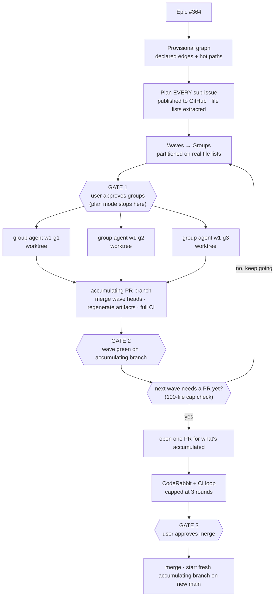

# Implement Epic

Take an epic with N sub-issues and land it as a small number of parallel,
conflict-free PR chains instead of one N-long serial queue.

`implement-issue` is the inner loop and stays the authority on how a single
ticket gets planned, built, reviewed and shipped. This skill owns everything
around it: which tickets can run at the same time, who owns which files, what
gets integrated before anything reaches `main`, and where a human says yes.

**The core idea:** ordering does not prevent merge conflicts — **disjointness**
does. A numbered branch name only decides who has to resolve the conflict. So
the central job here is partitioning the epic into groups that own
non-overlapping file territory, and serializing the handful of things that can
never be disjoint.

## Invocation

```
/implement-epic 364
/implement-epic https://github.com/org/repo/issues/364
/implement-epic plan 364
/implement-epic 364 --groups 2 --only w1
/implement-epic resume
```

- **epic number or link** → full run.
- **`plan <epic>`** → run steps 0–3 only: resolve, plan every sub-issue,
  publish each plan to its GitHub issue, partition, then stop at GATE 1 without
  writing code. Mirrors `/implement-issue plan`. A later full run picks up the
  published plans instead of redoing them.
- **`resume`** (or no argument with a state file present) → read
  `.implement-epic-state.md` and continue.
- **`--groups N`** → cap parallel lanes (default 3; for a **plan-grade** epic
  the default is one lane per sub-issue in the wave, max 8 — see step 3).
- **`--only w<N>`** → run one wave and stop. `w<N>c` is that wave's close
  sub-wave.

## Mode

Run in `/caveman ultra` so orchestration chatter stays cheap. This
governs **your conversational output only**. Plans, code, commit messages, PR
descriptions and the state file stay normal and readable — a compressed plan
defeats its purpose, since the user has to review it.

When dispatching `epic-group-worker` (and it, in turn, dispatching
`issue-planner` / `issue-implementer` / the review subagent), tell them to run
in `/caveman ultra` for their own narration, with the same carve-out —
published plans, code, tests, stories, and commit/PR text stay normal.
Subagents are separate contexts and don't inherit your mode unless told.

Also tell them to run in `/ponytail full`. Unlike caveman, this shapes the
artifact: each group's plan and code should take the leanest design that
satisfies its tickets — reuse/extend over new abstraction, no speculative
scope — never cutting input validation, auth, tenant isolation, or error
handling at a trust boundary. Say it explicitly in every dispatch prompt; it
doesn't inherit down the `epic-group-worker` → `issue-planner`/
`issue-implementer` chain either.

Batch independent tool calls into one message — dispatch all of a wave's
group agents in a single turn, and fetch every sub-issue body in one batched
call at Step 0 rather than one `gh issue view` per turn. Every group agent
pays its own fixed context floor; the orchestrator's job is to keep its own
turn count low so that floor isn't re-read more than necessary.

## Architecture



## Model routing

Same constraint as `implement-issue`: **you cannot switch your own model.**
Delegation to a pinned subagent is the only switch available.

| Phase | Runs on | How |
|---|---|---|
| Grouping, integration, PRs, merges | the session's model | here |
| Per-ticket plan — **plan-grade, standard tier** | Sonnet | folded into `issue-implementer` (`mode: self-preflight`); no separate agent |
| Per-ticket plan — **plan-grade, money tier** | Sonnet | `issue-preflight` subagent (verifies the body, publishes a `## Plan` pointer) |
| Per-ticket plan — everything else | Opus | `issue-planner` subagent |
| Per-ticket implementation | Sonnet | `issue-implementer` subagent |
| Per-ticket review — **money tier** | Opus | `issue-reviewer` subagent, from the group agent |
| Per-ticket review — **standard tier** | Sonnet | `Agent(model: "sonnet")` following `issue-reviewer.md`, from the group agent |
| CI / CodeRabbit fix rounds | Sonnet, then Opus | rounds 1–2 Sonnet; round 3 Opus for money tier only (step 8) |
| Group orchestration | Sonnet | `epic-group-worker`, one per lane |

**Plan-grade** = the sub-issue body carries `## Files`, `## Tests`,
`## Acceptance` and a how-section — `## Steps` (Epic 16) or `## Contract`
(Epics 14/15). The plan already exists on the ticket; paying Opus to re-derive
it is the single largest avoidable cost in an epic run.

**Review tier** — where the expensive model actually earns its price. A ticket
is **money** when its `## Files` touches `server/src/migrations/**`,
`server/src/modules/fees/**` (beyond `dto/` and controller-only changes),
`server/src/modules/invoices/**`, `server/src/modules/reports/**`,
`server/src/modules/auth/**`, or its body mentions an approval scope, wallet,
allocation, reversal, ledger or late fee.

A ticket is **also money-tier**, regardless of which module directory it
lives in, when its `## Files` or plan touches code that can **delete,
overwrite, or bulk-mutate tenant data outside the ticket's own new tables** —
e.g. a restore/import processor, a retention/cleanup job, a bulk deletion
endpoint. Epic 14's workbook restore module missed the path list above and
produced two critical bugs (a pin/retention race, and a TypeORM orphaning bug
that nulled cross-tenant foreign keys) — it should have been money-tier on
behavior, not on path.

Everything else — UI, docs, hooks, wave-close glue — is **standard**. An epic
body may override with an explicit list.

**You compute the tier**, once per ticket, from its `## Files` at step 2 —
it's a path match on text you've already fetched, not a job for an agent.
Record it in the state file, hand it to each group worker with its queue, and
the worker passes it to every agent it dispatches. The plan agent (pre-flight,
planner, or the implementer's self-pre-flight) writes it on the `## Plan`
comment so the reviewer has it too. The tier decides two things: whether a
standard ticket skips the separate pre-flight agent, and who reviews.

**Effort** is session-wide and cannot be set per agent (see `implement-issue`,
"Effort cannot be routed per phase"). Run the orchestrating session at
`/effort low`; model tier is the only per-phase lever, and the table above is
the whole of it. Never claim a per-phase effort split in a report.

State the actual session model in one line before starting, as
`implement-issue` does.

If the session carries a *"Do not call the Agent tool unless the user requested
it"* rule, invoking this skill **is** that request — parallel subagents are how
this skill is specified to work.

## The wave loop

A full run (no `--only`) works the waves **one at a time, to completion**:

```
for each wave N in order:
    step 5   run wave N's lanes in parallel          (GATE 1 once, before wave 1)
    step 6   merge wave N's heads into the accumulating
             PR branch, verify green                  → GATE 2 (per wave)
    w<N>c    run the wave-close task on the accumulating
             branch, add its commit                    (plan-grade epics)
    check the accumulating branch's file count against main
        still ≤ 100  → keep accumulating, go to next wave without opening a PR
        would cross  → step 7–8: open a PR for what's accumulated,
                        fix CI/CodeRabbit, GATE 3, merge, start a fresh
                        accumulating branch rooted on the new main
next wave — its lanes root at the accumulating branch's current head,
NOT necessarily at `main` (only a just-merged PR moves `main` itself)
```

Wave N+1 is never started until wave N is **integration-green on the
accumulating branch** — its tickets build on wave N's tables, services and
types, and the accumulating branch already has them even before any PR
merges to `main`. So a wave-N+1 lane's base branch is the accumulating
branch's current head, not `origin/main`, whenever a PR hasn't been cut yet.
Record this explicitly in the state file for each wave, since `resume` and
any dispatched worker need to know which branch is the real "current head"
distinct from `main`.

`--only w<N>` runs exactly one wave's step 5–6 (plus its close task) and
stops, leaving the accumulating branch exactly where it is — it does not
force a PR open. `resume` continues from the recorded wave and accumulating
branch.

PRs open back-to-back, no pacing wait between them — open the next one as soon
as the previous `gh pr create` returns, don't wait on CI or CodeRabbit first.
This matters less now that PRs are infrequent (ideally one per epic), but
still applies if the 100-file cap forces more than one. Expect a wave to still
span some real time (CI run length, CodeRabbit rounds, GATE 3 approval), and a
multi-wave epic to span hours to a day depending on epic size — but nothing in
the loop should have you sitting idle. While integration or CI runs, keep
working: dispatch the next wave's lanes against the accumulating branch. The
state file and the `## Plan` comments carry position between sessions if a run
does span more than one.

## Step 0 — Resolve the epic

```bash
gh api --paginate repos/<owner>/<repo>/issues/<epic>/sub_issues \
  --jq '.[] | "\(.number)|\(.title)|\(.state)"'
```

Sub-issues are **native** in this repo — read them from that endpoint, don't
scrape the epic body's table. Skip anything already closed. `--paginate` is not
optional: the endpoint returns 30 per page, so a large epic silently loses its
tail without it, and a missing ticket is invisible rather than loud.

If the epic has no native sub-issues, fall back to the body's issue links and
say which source you used.

## Step 1 — Build the dependency graph

Three sources, in descending confidence:

1. **Declared.** Sub-issue bodies state their edges in prose: *"Depends on
   13.1"*, *"**Blocks every other sub-issue**"*, *"Depends on #410"*. Parse
   every body and extract them. These are authoritative.
2. **Predicted file overlap.** After planning (step 2), each plan names the
   files it will touch. Two tickets sharing a file are dependent even when no
   body says so — e.g. a sidebar ticket and a header ticket both editing
   `ui/src/components/app-shell.tsx`. This is the edge type that actually
   produces merge conflicts.
3. **Hot paths — always serialized, never parallel.** Any ticket whose plan
   touches these goes in a lane by itself, or in the same lane as every other
   ticket touching them:

   | Path | Why |
   |---|---|
   | `server/src/migrations/**` | epoch-ms filename prefixes collide and misorder across branches |
   | `shared/src/**` | ripples into server and every client |
   | `ui/src/api/schema.d.ts` | generated + committed |
   | `client-admin/src/routeTree.gen.ts` | generated + committed |
   | `ui/src/hooks/**` | shared hooks; any two lanes that both touch backup/export/import features tend to share a hook file, and conflicts there are silent until merge |
   | `ui/src/i18n/locales/**` | same file per locale accumulates keys from every UI-touching lane in a wave; low conflict risk (usually additive) but still real, as seen in wave 4 |

Source 2 is the one that actually prevents conflicts, and it does not exist
until every ticket has a plan. That ordering is not negotiable: a partition
built on sources 1 and 3 alone is a **guess**, and discovering an overlap after
workers are already editing separate worktrees means two lanes have been writing
the same file for however long the discovery took. Step 2 therefore plans the
whole epic before any implementation starts.

## Step 2 — Plan the whole epic first (discovery)

Build a **provisional** grouping from sources 1 and 3 — enough to order the
planning work, not to run implementation on. Then plan every open sub-issue
before any code is written:

- Dispatch `issue-planner` per ticket. These are independent and cheap to
  parallelize; batch them, respecting the same concurrency cap as groups.
- Each plan is published to its own GitHub issue as a `## Plan — <id>` comment.
  That is the durable artifact; it survives compaction, and step 5's workers
  read it instead of re-planning.
- Skip any ticket that already carries a current plan comment.
- From each plan, extract **the list of files it intends to touch**. If a plan
  doesn't name its files, send it back for revision — the partition depends on
  it, and so does the workers' territory rule.

### Plan-grade epics — pre-flight instead of planning

Before dispatching any planner, read one sub-issue body. If it carries
`## Files`, `## Tests`, `## Acceptance` and `## Steps` or `## Contract`, the
epic is **plan-grade** (Epics 14, 15 and 16 are). Then:

- **Dispatch no plan agent at discovery.** Fetch every open sub-issue body in
  one paginated `gh api` call, take the file list straight from `## Files`,
  and compute each ticket's review tier from it. That is all step 3 needs.
  Verifying a wave-5 body against wave-0 `main` would only report seams that
  haven't merged yet, so verification belongs at the moment of implementation,
  not here.
- Pre-flight happens **inside the group worker, per ticket, against the
  chain head**: standard tier → `issue-implementer` in `self-preflight` mode
  (verify, publish the `## Plan` pointer, implement — one agent); money tier →
  `issue-preflight` first, then the implementer. Either returns
  `needs-planner` when the body is not actually plan-grade or needs structural
  correction — only then does the worker dispatch `issue-planner` for that
  ticket — and `blocked-on: #<n>` when a seam it depends on has not merged.
- If a pre-flight correction changes a ticket's `## Files` in a way that
  crosses a lane's territory, the worker reports it and you re-partition; the
  discovery-time file list was an estimate, as the file cap already assumes.
- Waves are **declared**: each body says `Wave N` and the epic body carries a
  wave table. Use them. Still verify file-disjointness inside a wave from the
  `## Files` lists — a declared wave is a claim, and step 3 checks it.

`/implement-epic plan <epic>` stops here, after GATE 1, having published every
plan and written no code. That is the whole of its contract: this phase, then
stop.

## Step 3 — Partition into waves and groups

- A **wave** is a dependency level: everything in wave N+1 depends on something
  in wave N. Waves run one after another.
- A **group** is a lane inside a wave: a sequential queue of tickets that owns a
  file territory no other lane in that wave touches. Groups run in parallel.

Rules:

- A ticket that blocks many others (`**Blocks every other sub-issue**`, e.g.
  #417, #429, #410) is a wave of its own. Don't try to parallelize around it.
- Default max 3 concurrent groups. More lanes means more worktrees and more
  review load — it does not mean proportionally more throughput.
- Give each group a one-line territory description ("the `ui/` shell
  components", "server fees module + its DTOs"). If you cannot write that line,
  the partition is wrong.
- **Plan-grade epics:** use what the epic declares.
  - If the epic body declares **lanes** inside each wave (Epics 14/15: a lane
    table with a territory and an ordered task list), the lanes *are* the
    groups — one worker per lane, tasks in the declared order, up to the
    wave's lane count (`--groups` still caps it; Epic 14 wave 2 needs
    `--groups 6` or its tab lanes queue).
  - If the epic declares only **waves** (Epic 16), every sub-issue in a wave
    is its own lane, all in parallel, up to 8.
  - A wave's **close** task, when the epic has one ("wave close — seed,
    api-types, e2e"), is not a lane in that wave: it runs as its own one-lane
    sub-wave `w<N>c` **after wave N has merged to `main`**, because it
    regenerates committed artifacts and needs every sibling landed.
  - **Disjointness is a scripted check, not an eyeball pass — this has already
    failed once.** Epic 14 wave 4's two lanes (w4-g1, w4-g2) both touched
    `ui/src/hooks/backup.ts`, its test file, and
    `ui/src/i18n/locales/*/backup.json`, undetected by inspection until the
    PRs conflicted at merge time. Before finalizing the partition, run an
    actual set-intersection check across every pair of lanes' `## Files`
    lists, e.g.:

    ```bash
    comm -12 <(sort lane-a-files.txt) <(sort lane-b-files.txt)
    ```

    Do this for every pair of lanes in the wave. Any non-empty intersection
    means those lanes must be merged into one, or the shared file must be
    pulled out as its own serialized hot-path lane. This is a hard rule, not
    a suggestion.

### UI work needs no mockup gate

There is no design-approval step. A ticket that changes UI ships in the same run
as everything else — the standard it is held to is **consistency with the app
that already exists**: `@biddaloy/ui` components and tokens only, the
established patterns reused (the four shells, the portal card grammar, the
density modes), no one-off styles or ad-hoc colors, and Storybook stories for
the meaningful states.

If a needed component genuinely does not exist, extend the design system
following its own conventions rather than inventing a local one, and report the
addition so it lands in the PR description.

Consistency is checked in the review pass (step 5's second reviewer), not by a
human gate before the work starts.

## GATE 1 — user approves the plan

Every plan is published by now (or, for a plan-grade epic, every body's
`## Files` has been read), so this gate reviews a partition built on real
file lists rather than a guess. Before spawning any implementation worker,
print and stop for approval:

- waves and groups, with each group's ticket queue, tier per ticket, and
  territory line
- the serialized hot-path lane, if any
- how many agents will run and roughly what that costs

Do not spawn on assumed approval.

## Step 4 — Write the state file

`.implement-epic-state.md` at the repo root. `.git/info/exclude` is per-clone,
so add the rule before the first write rather than assuming it exists —
otherwise a later `git add -A` in a fresh clone stages the state file into
someone's PR:

```bash
grep -qxF '.implement-epic-state.md' .git/info/exclude \
  || echo '.implement-epic-state.md' >> .git/info/exclude
```

Each worktree has its own exclude file; the workers inherit this one only if
they were created from a clone that already has it, so re-run the same
idempotent line in any worktree that writes state.

The file:

```markdown
# Epic 364 — UX & Interaction Layer
Base: main   Groups: 3   Started: 2026-08-29T11:02Z

## Wave 1
### w1-g1 — ui/ shell components
Branch chain: epic/8.14/w1-g1-01-sidebar → epic/8.14/w1-g1-02-header
- 365 sidebar        tier: standard  status: done      plan: <url>  files: 12
- 366 header         tier: standard  status: in-progress — implementing
- 367 mobile nav     tier: standard  status: pending
### w1-g2 — router + query layer
- 369 transitions    tier: money     status: blocked — plan wrong, re-planning

## Integration
Branch: epic/8.14/integration   status: not started
## PRs
(none yet)
```

Update after **every** completed ticket and every state change, not once per
group. This plus `git log` is how a fresh session reconstructs position after
compaction or a usage limit.

## Step 5 — Run the groups

Spawn one `epic-group-worker` subagent per group in the current wave, **in a
single message so they run concurrently**, each with
`isolation: "worktree"`.

Worktree isolation is not optional. Parallel agents sharing one working tree
will `git checkout` over each other within seconds.

Give each agent: its ticket queue in order, its base branch, its branch-name
prefix, its territory line, the file cap, whether the epic is **plan-grade**,
and each ticket's **review tier** (computed at step 2, in the state file).
For a non-plan-grade epic every ticket already has a published plan from
step 2, so the worker's planning step is a lookup. For a plan-grade epic the
worker pre-flights each ticket at implementation time against its chain head
(standard tier inside the implementer, money tier as a separate agent) and
only escalates to the planner on `needs-planner`. Its definition
(`.claude/agents/epic-group-worker.md`) carries the rest of the contract.

### What group agents do NOT do — and why

These three overrides deviate from `implement-issue` deliberately. Anyone
"fixing" them back reintroduces the failure they prevent.

1. **No `gh pr create`.** N agents opening PRs concurrently is still worth
   avoiding — it makes merge order and CodeRabbit's per-PR context harder to
   reason about, not because of pacing (PRs now open back-to-back with no
   wait) but because the orchestrator is the one place that knows the actual
   dependency/merge order. Agents push branches and report ready; the
   orchestrator opens PRs serially, one after another, in step 6.
2. **No regenerating committed generated artifacts** (`schema.d.ts`,
   `routeTree.gen.ts`) — **but only while a wave actually has more than one
   lane.** The reason is conflict, not hygiene: two branches regenerating the
   same committed artifact conflict on every merge. So when a wave runs two or
   more lanes, they leave the artifact alone and it is regenerated once, at
   integration; if a ticket's tests need current types, generate them locally
   and leave them unstaged.

   **When a wave has exactly ONE lane, invert this: the ticket regenerates its
   own artifacts in its own PR.** There is no second branch to conflict with,
   and the artifact is stale *because of that ticket's own change* — a DTO,
   controller or route it moved. Deferring it to a later ticket does not defer
   the breakage: `ui/scripts/check-api-types.mjs` compares `schema.d.ts`
   byte-for-byte against a fresh generation and fails the "Integration & e2e
   tests" job on the PR that moved the surface, not on the one that was
   supposed to regenerate later. Epic 33's wave 1 (#889 / PR #895) failed
   exactly this way: the orchestrator applied the multi-lane rule to a
   single-lane wave and sent a red PR for a DTO addition.

   The test is "could another branch in this wave touch this file?", not "is
   this file generated?". If the answer is no, regenerate it here. Use the
   repo's own script (`yarn workspace @biddaloy/ui api:types`) — never a hand
   edit, since the check is byte-exact — and stop and report if regeneration
   sweeps in unrelated drift that was already sitting on `main`, rather than
   letting someone else's change ride in on the ticket's diff.

   **Nothing local runs that check.** `.husky/pre-push` runs `check.mjs
   --affected` (typecheck, lint, tests) and never `check-api-types.mjs`; it
   exists only as a CI step. Any ticket that touches a DTO, controller or
   route must run `node ui/scripts/check-api-types.mjs` by hand before
   pushing — Epic 33 paid two red CI rounds learning that a clean pre-push
   hook proves nothing about the schema.
3. **No merging to `main`,** ever.

`graphify update .` is the opposite case: **run it freely.** `graphify-out/` is
gitignored as of 2026-08-29, so a fresh graph costs nothing but keeps every
subsequent research query accurate. Each worktree keeps its own.

### File cap — checked before, not after

A branch cannot be split by file count after its commits exist without
rewriting history. So the check runs **before each ticket starts**:

```
if files_changed_on_branch + planned_files_for_next_ticket > 50:
    cut the chain here — the next ticket starts a new branch from this one
```

Soft cap **50**, hard ceiling **90** — never crossed. Generated artifacts don't
count, since they're regenerated at integration. A cut extends the chain
(`…-02-…` follows `…-01-…`); it does not start a new group.

### Branch naming

```
epic/<epic-slug>/w<wave>-g<group>-<seq>-<slug>
epic/8.14/w1-g2-03-header-usermenu
```

Lexical sort equals safe merge order. That is bookkeeping on top of
disjointness, not a substitute for it.

### Topology

- **Within a group:** ticket N+1 branches from ticket N's branch. Stacked PRs,
  each targeting its parent, retargeted when the parent merges.
- **Across groups:** each group's chain roots at `main`, and the chain's head
  PR targets `main` directly. This is only safe because groups are
  file-disjoint — which is why step 2's partition is the load-bearing step.

Never stack a branch on another group's branch and then PR it to `main`. That
carries the parent's commits into the diff and is exactly the duplicate-commit
failure this repo hit across the 8.7.x PRs.

### Failure isolation

A failed ticket blocks only its own group's downstream tickets. Mark it
`blocked` with the reason, stop that group, let the other groups finish, and
report at the end. One bad ticket never stalls the fleet, and never silently
disappears.

## Step 6 — Integration

Every group green in isolation does not mean the union is green. Before any PR:

```bash
git checkout -b epic/<slug>/integration main
# merge every group head, in wave then group order
# regenerate schema.d.ts / routeTree.gen.ts if endpoints, DTOs or routes moved
yarn ci:local
```

This is the first full-suite run — per-ticket work only ran the tests
touched by that ticket, so this is where cross-lane breakage first surfaces.
Red integration is fixed **now**, before PRs exist — never at merge time: for
each failure, plan the fix (what broke and why, which chain owns it), then
apply it.

### Everything fixed here must reach the PR heads

The integration branch is throwaway; the PRs come from the group chains. So a
fix made *only* on the integration branch is tested and then thrown away, and
`main` receives the untested version. Nothing in the merge order catches this,
because each chain merges green on its own.

For every change made during integration:

1. Apply it to the **chain that owns the file** — the same territory rule the
   workers followed. Cherry-pick it onto that chain's head, or make it there
   and re-merge.
2. Regenerated artifacts (`schema.d.ts`, `routeTree.gen.ts`) go as their own
   commit on the chain that changed the endpoints, DTOs or routes behind them —
   not on whichever chain happens to be last.
3. Re-merge the updated heads into the integration branch and re-run
   `yarn ci:local`.

Then verify the transfer landed rather than assuming it: the integration tree
and the merge of the PR heads must be identical.

```bash
git diff --stat epic/<slug>/integration <last-merged-head>   # expect: empty
```

A non-empty diff means something green exists only on the integration branch.
Find it and move it before opening any PR.

## GATE 2 — integration green

Report the integration result for this wave, the full branch/PR table, total
files changed per chain, and the accumulating branch's running file count
against `main`. This gate happens **every wave**, whether or not a PR is
about to open — GATE 3 is the separate, PR-specific approval that only fires
when the file count forces one open. Stop for approval before opening any
PR — a PR is outward-facing and hard to unpublish.

## Step 7 — Open the PRs

The orchestrator opens them, never the agents.

### Default to one PR per epic — consolidate, don't fragment

**Try to ship the whole epic as a single PR to `main`.** Once a wave's chains
are integration-green, merge them into one accumulating branch rather than
opening a separate PR per chain — carry that branch forward wave after wave,
so by the time the epic is done there is (ideally) exactly one PR containing
everything, which is far easier for both CodeRabbit and a human reviewer than
a scattered stack of small ones.

The only thing that forces a split is the 100-file cap below. Check the
running file count against `main` after every wave merges into the
accumulating branch:

```bash
git diff --name-only main...<accumulating-branch> | wc -l
```

- **Still ≤ 100:** keep going — merge the next wave into the same branch, do
  not open a PR yet.
- **Would cross 100 once the next wave lands:** open a PR for what's
  accumulated so far (this closes out PR N), then start a **new** accumulating
  branch rooted on `main` (not on the just-opened PR's branch — once a PR is
  open it's outward-facing, treat it as closed to further additions) for the
  next wave onward. This becomes PR N+1. Repeat.

So in the common case a small-to-medium epic ships as **one** PR opened after
the final wave. A large epic ships as **two or three**, each as large as the
100-file cap allows, opened only when the cap would otherwise be breached —
not one per wave and not one per chain. Record each PR's wave/chain coverage
in the state file so `resume` knows which accumulating branch is still open
for additions.

This changes step 6's integration shape too: "the integration branch" is now
the same thing as "the accumulating PR branch" — there's no separate
throwaway integration branch discarded before PRs open. Build it once per
wave, verify green (GATE 2), keep accumulating, and only cut a PR out of it
when the file-count forces one.

### CodeRabbit's 100-file limit — checked before every merge into the
accumulating branch, and again immediately before every `gh pr create`

CodeRabbit does not review a PR that changes more than **100 files**; it posts
a summary and skips the line-by-line pass, which silently removes the review
the whole point of opening the PR was to get. The branch cap (soft 50 / hard
90) protects individual chains *before* the work, but three things can still
push the accumulating branch over 100 after that: multiple chains merging
into one branch, regenerated artifacts (`schema.d.ts`, `routeTree.gen.ts` —
excluded from the per-chain cap, counted by CodeRabbit), and integration fixes
cherry-picked onto chain heads. So count again immediately before each
`gh pr create`, against the branch the PR will actually target:

```bash
git diff --name-only <target>...<head> | wc -l     # must be ≤ 100, generated files included
```

If it exceeds 100, **do not open the PR.** Cut the accumulating branch at the
last wave boundary that keeps the count under the limit — open that as PR N,
then continue accumulating the rest from `main` as a fresh branch for PR N+1
(per the consolidation logic above). Within a single chain, if a chain alone
would exceed 100 (rare — the 50/90-file chain cap should prevent this), split
it at a commit boundary the same way: tickets are separate commits, cut a new
branch after the last one that keeps the count under the limit. Never trim
files to get under the number, and never rewrite history to merge commits.
Record every split in the state file.

Wave-close tasks are the usual single-chain offender (seed + regenerated
types + Playwright). If a close task alone would push its own chain over 100,
split it into "regenerated artifacts" and "everything else" as two commits at
minimum, cut at that boundary if needed.

- Consolidated-PR order, then within each PR: wave order, group order, chain
  order for how commits stack inside it.
- **No pacing wait between PRs.** Open them back-to-back as soon as each
  branch is ready — don't wait on the previous PR's CI or CodeRabbit pass
  before opening the next one. If CodeRabbit reviews a PR shallowly because
  it arrived close behind another, that's a `pr-fix`-round problem to catch
  in step 8, not a reason to sit idle in step 7.
- Chain heads target `main`; inner chain PRs target their parent branch.
- Each description: the issue, the approach, plan corrections the planner
  found, design-system additions, how to test, and its position in the merge
  order.
- Record every PR number and timestamp in the state file as it opens.

## Step 8 — CodeRabbit and CI

Use the `pr-fix` skill's semantics rather than restating them — including its
**batch-then-verify** discipline (see that skill's Tests step): diagnose every
CI failure and every actionable CodeRabbit finding you currently know about
*before* fixing anything, apply all the fixes, run the full affected suite
**once**, then push once. **Cap: 3 rounds per PR.** A round is exactly one
diagnose-all → fix-all → verify-once → push cycle, not one push per
individual fix — pushing after each fix re-triggers the entire CI matrix (14+
jobs) and a fresh CodeRabbit pass for a single line change, which is the
single largest avoidable cost in this step. After the third round, stop and
report that PR to the user — an uncapped loop can burn a whole session on one
stubborn PR.

The exception: a fix you're genuinely unsure about (touches locking,
concurrency, money-tier correctness, or anything CodeRabbit itself flagged as
subtle) is worth its own isolated commit and, if truly risky, its own
verification pass — bundling a risky fix in with four mechanical ones makes
it harder to attribute a regression to the right change, and gives it a
shallower review pass on the bundled diff. Batch the safe, obviously-correct
fixes; keep the one risky fix legible on its own.

Route the rounds by cost: **rounds 1 and 2 run on a Sonnet subagent**
(`Agent(model: "sonnet")` doing the `pr-fix` work — CI failures here are
mostly mechanical: Node 22 vs 24, the `bn` e2e locale, byte-exact `api-types`,
the 80 % branch gate). **Round 3 runs on Opus only for a money-tier PR**; a
standard-tier PR that is still red after two Sonnet rounds stops and is
reported, because a third cheap attempt on a UI flake is rarely the fix.

If CI fails on something the epic didn't cause (a pre-existing flake — this
repo runs ~28% CI failure), diagnose the actual root cause rather than
re-running until it happens to pass: reproduce it in isolation a few times to
confirm it's genuinely pre-existing and unrelated to this PR's files, and fix
the root cause if it's cheap to do so (a genuine flake is often a real, if
minor, bug — e.g. code relying on an unordered SQL read for a required order —
not pure bad luck). Say explicitly which it was (root-caused and fixed, or
confirmed pre-existing and left alone) instead of silently "fixing" unrelated
code to get green, and never silently re-run a red job without saying so.

## GATE 3 — merge

Present the ordered merge list and stop. **Merge only the PR(s) the user
explicitly approves, only when they explicitly say so — never on assumed or
standing approval, even if every prior PR in the same run was approved and
merged the same way.** Green CI is not approval. On approval for a given PR,
merge it, then rebase and retarget whatever was stacked on it.

After each merge to `main`, close every GitHub issue that landed in it: check
every box under that issue's `## Acceptance` section (`- [ ]` → `- [x]`) and
close the issue with a comment naming the merged PR and merge date. Do this
per issue, not once per wave — a wave-close task doesn't get this treatment
(it isn't a sub-issue), but every ticket sub-issue that shipped does.

### Then clean up — not optional, not "later"

Only once a lane's **final PR is merged and its tickets are closed**, tear that
lane down. Do it immediately, in the same turn as the merge, not at epic close:
a lane whose cleanup is deferred is a lane whose cleanup never happens. This
repo reached 109 live worktrees before anyone noticed, and a worktree carries a
full `node_modules` — the cost is tens of GB and a measurably slower `git` for
every later command in every later session.

```bash
git worktree remove <path>        # refuses if the tree is dirty — good
git branch -d <branch>            # lowercase -d: refuses if unmerged — good
git worktree prune
```

Use plain `-d` and plain `remove`. Both refuse when work would be lost, and
that refusal is the safety check — it is the whole point. **Never reach for
`--force` or `-D` to make a refusal go away.** A refusal means the lane still
holds something `main` does not: read it, land it or report it, then remove.
The one exception: a worktree from a subagent that died before its first
commit (usage limit, crash) holds nothing — verify zero commits and zero
uncommitted files, then `--force` is honest.

Before removing, confirm the work is genuinely on `main` — ancestry alone lies
when a PR was squash-merged, so check patch-equivalence:

```bash
git status --porcelain            # must be empty
git cherry main <branch> | grep '^+'   # must be empty: no unique commits left
```

At epic close, sweep: every branch and worktree the run created is gone, or is
listed in the final report with the reason it survived. Say which in the report
— "cleaned up" is a claim, so make it a checked one.

## Resuming

The state file on disk and the plan comments on GitHub are the sources of
truth; conversation context is expendable. On resume: read
`.implement-epic-state.md`, confirm against `git worktree list`, `git branch -a`
and `gh pr list`, then continue from the exact recorded position. Re-check the
session model and report it. Never re-plan a ticket that already has a current
`## Plan — <id>` comment.

## Rules that hold throughout

- Groups are disjoint or they are not groups. If two lanes need the same file,
  they are one lane.
- Never spawn a group agent without `isolation: "worktree"`.
- Never let a group agent in a MULTI-LANE wave regenerate committed artifacts,
  open a PR, or merge
  to `main`.
- No pacing wait between opening PRs — open the next one as soon as its
  branch is ready. Don't sit idle; while one PR's CI/CodeRabbit runs, keep
  working the next ticket or PR.
- Never cross the 90-file hard ceiling on a single chain's branch.
- Default to one PR for the whole epic — keep merging wave heads into the same
  accumulating branch instead of opening a PR per wave or per chain. Only cut
  a PR when the accumulating branch's diff against `main` would otherwise
  exceed 100 files; start a fresh accumulating branch on the new `main`
  immediately after that PR merges.
- Never open a PR whose diff against its target exceeds 100 files, generated
  files included — cut the accumulating branch at the last wave boundary that
  stays under the limit instead.
- Never open PRs before that wave's integration is green.
- Never pass a gate on assumed approval — this applies with special force to
  GATE 3: never merge a PR without the user's explicit go-ahead **for that
  specific PR**, every time, no matter how routine or how green its CI is.
  A prior approval to merge one PR is not standing approval for the next one.
- Never let a ticket proceed to commit/integration on an **alarming** plan-drift
  verdict from `issue-reviewer` without surfacing it to the user first — an
  alarming verdict means the diff may not be what was actually approved at
  plan time, which is a different question from whether the code is correct.
- Never bypass the design system: existing components and tokens first,
  extend it by its own conventions if something is genuinely missing.
- Never re-plan a ticket that already has a current plan comment.
- Never dispatch `issue-planner` for a plan-grade ticket unless
  `issue-preflight` or the implementer's self-pre-flight returned
  `needs-planner`.
- Never dispatch `issue-preflight` for a standard-tier ticket, and never
  self-pre-flight a money-tier one.
- Never run the Opus reviewer on a standard-tier ticket, and never run the
  Sonnet reviewer on a money-tier one — the tier is on the `## Plan` comment.
- Update the state file after every ticket and every state change.

## Report at the end

```markdown
| Wave | Group | Ticket | Branch | Files | PR | Target | Opened |
|---|---|---|---|---|---|---|---|
```

Plus, in plain sentences: what merged, what is still open and why, tickets that
came back `blocked` and what blocked them, design-system additions made, and any CI failure judged pre-existing rather
than caused by this epic.
