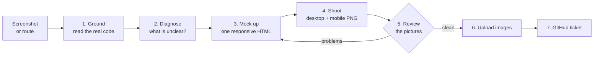

# Redesign Page

Takes one page that already exists and produces two things: **pictures of a
better version** (desktop and mobile) and **a GitHub ticket** that tells an
implementer exactly how to build it.



## Inputs

| The user gives                      | Example                                   | What you do                                   |
| ----------------------------------- | ----------------------------------------- | --------------------------------------------- |
| A screenshot                        | a pasted image of the Calendar page       | Find the route it shows, use it as "before"   |
| A route or page name                | `/redesign-page /calendar`                | Find the route file; there is no "before"     |
| An issue number as well (optional)  | `/redesign-page /calendar #1402`          | Post the result as a comment on that issue    |

If you cannot tell which page it is, that is the only thing worth asking about.

## Rules that never bend

1. **Never ask the user a design question.** When a choice comes up, list the
   options to yourself, take the one you would recommend, and write it in the
   ticket's "Decisions taken" table. The user reviews decisions in the ticket,
   not in chat.
2. **Always both sizes.** Every run produces a desktop (1440 px) and a mobile
   (390 px) screenshot. Mobile is designed, not shrunk — see below.
3. **Only real tokens.** The mockup is styled with the app's own Tailwind
   classes (`bg-surface`, `text-h1`, `border-border-subtle`, `shadow-e1`…).
   No hex colours, no arbitrary pixel values, no fonts of your own.
4. **Only real content.** Show what the page really has. Anything new (a
   label, an empty state, a control) must appear in the ticket marked **New**.
5. **No real people's data.** The repo and the `design-assets` branch are
   public. Mockups use obviously fake names. If the user's "before" screenshot
   shows real names, phone numbers or addresses, do not upload it — say so in
   the ticket and post the "after" images only.
6. **No app code changes.** This skill writes only into a temp folder and to
   GitHub. That is why it needs no worktree.

## Steps

### 1. Ground — read the real page

Do not design from the picture alone. Find and read:

- The route file and the components it renders. Routes live in
  `client-admin/src/routes/`; shared components in `ui/src/components/`.
  Example: Calendar is `client-admin/src/routes/_staff/calendar/index.tsx`
  plus `ui/src/components/calendar/month-grid.tsx`.
- `docs/architecture/09-design-direction.md` — only the sections you need:
  §4 borders, §5 elevation, §6 density, §7 motion, §11 action hierarchy,
  §12 focus, §13 responsive lists.
- `docs/architecture/15-ux-principles.md` §1 (the rules in one screen).
- The `@theme` block of `ui/src/styles/globals.css` for token names.

Write down, in one sentence, **the job of the page**:
"On Calendar, a staff member sees what is happening this month and adds an
event." Every later choice is judged against that sentence.

### 2. Diagnose — what is unclear?

Look at the page as a first-time user and list concrete problems. Use these
five questions; each "no" is a finding.

| Question                                                        | Typical finding                                     |
| --------------------------------------------------------------- | --------------------------------------------------- |
| In 5 seconds, can I tell where I am and what this page is for?  | Title repeated twice; no clear heading              |
| Is there exactly one obvious next action?                       | Five buttons with the same weight                   |
| Does each control sit next to the thing it changes?             | Filters far from the list they filter               |
| Can I see the current state?                                    | Today not marked; active filter looks like default  |
| Is anything shown that I do not need right now?                 | Rare actions taking prime space; empty side panel   |

### 3. Mock up — one responsive HTML file

Work in a temp folder (the session scratchpad if you have one, otherwise
`mktemp -d`). Copy [`starter.html`](starter.html) to `mockup.html` and replace
what is inside `<main>`. Keep the `<!-- app:head -->` marker — the screenshot
script swaps it for the app's real stylesheet and fonts.

- One file serves both sizes. Use the same responsive utilities the real
  code will use (`md:`, `lg:`, `hidden md:flex`…).
- Icons: `<i data-lucide="calendar-days"></i>` — the app uses Lucide.
- The shell (top bar, sidebar) in the starter is context only. Leave it alone
  unless the user asked for a shell change.

Design rules are in the next section. Apply them while building.

### 4. Shoot

```bash
node .claude/skills/redesign-page/scripts/shoot.mjs <folder>/mockup.html
```

It writes `desktop.png` and `mobile.png` next to the mockup and prints a
report. Exit code 1 means a hard failure (page scrolls sideways, missing or
duplicate `<h1>`, a button with no label, a script error) — fix and re-shoot.
`smallTargets` in the mobile report lists controls under 44 px tall — fix
those too, unless they are links inside a sentence.

If the user gave no "before" image and Storybook is already running, you may
shoot a "before" from the page's story. Do not start servers just for this.

### 5. Review the pictures

Open both PNGs with the Read tool and actually look. Check each line; if any
fails, go back to step 3. Three rounds at most — then ship the best one and
list what still bothers you under "Open questions" in the ticket.

- The page's job (your sentence from step 1) is obvious without reading
  body text.
- One filled brand button per view. It is visible without scrolling, at both
  sizes.
- Nothing overlaps, clips, wraps awkwardly or sits misaligned.
- Mobile: no sideways scroll, one column, the primary action reachable with
  a thumb, nothing important hidden behind a hover.
- Every problem from step 2 is visibly fixed.
- It still looks like this app — same shell, same colours, same type.

### 6. Upload

```bash
.claude/skills/redesign-page/scripts/upload.sh <slug> <folder>/desktop.png <folder>/mobile.png [before.png]
```

Prints one image URL per file, in order. `<slug>` is the page name, e.g.
`calendar`. Also send the two PNGs to the user in chat (SendUserFile) so they
see them without opening GitHub.

### 7. Ticket

Fill the template below into a file and post it:

```bash
# new ticket (default)
gh issue create --title "[UI] Calendar: clearer header, spanning events, mobile agenda" \
  --label enhancement,module-client,task,size-M --body-file <folder>/ticket.md

# the user named an existing issue
gh issue comment 1402 --body-file <folder>/ticket.md
```

Pick `size-S`, `size-M` or `size-L` honestly. If the work is larger than one
`size-L`, say so at the top of the ticket and recommend splitting — do not
split it yourself.

Finish by telling the user, in a few lines: the issue link, the decisions you
took, and anything under "Open questions".

## Design rules

The goal the user set: **a person should understand the page, and what to do
on it, at a glance.** When two rules pull apart, the one higher up wins.

### Clarity

- **One job, one primary action.** One filled brand button per view. Other
  actions are outline buttons; rare ones go into a "More" menu
  (`09-design-direction.md` §11).
- **Say it in words people use.** "October 2026", not "2026-10". A text
  label beats a bare icon unless the icon is universal (search, close, back).
- **Remove before you add.** Delete duplicate titles, labels that repeat the
  placeholder, borders around things spacing already separates, panels with
  nothing in them.
- **Group by closeness.** A control sits beside the thing it changes. Things
  that belong together share a card; things that do not are separated by
  space, not lines.
- **Show the state.** Mark today, the selected item, the active filter. An
  empty area says what to do next ("No events this month. Add one.").
- **Hierarchy from weight and colour, not size.** Use the type ramp
  (`text-h1`, `text-h2`, `text-body`, `text-label`, `text-caption`) and
  `text-text-primary` vs `text-text-secondary`. Do not invent sizes.

### Mobile is designed, not shrunk

- One column. Side panels move below the main content or behind a tab.
- A wide table or grid becomes a list of cards, or a simpler view
  (`09-design-direction.md` §13). Example: a month grid becomes a compact
  month strip with the day's events listed under it.
- The primary action stays visible: in the page header, or a bottom bar if
  the header is crowded.
- Toolbars collapse: filters go behind one "Filter" button; secondary
  actions go into "More".
- Every control is at least 44 px tall (`h-11`, or `h-(--control-h)`).
- Nothing depends on hover.

### Craft

- **Tokens only.** Spacing from the Tailwind scale (4 px steps). Radius
  `rounded-md` for controls, `rounded-lg` for cards. Shadow `shadow-e1` for
  cards, `e2`/`e3` only for things that float.
- **Two border roles.** `border-border-functional` marks a control (input,
  select, outline button). `border-border-subtle` is decoration (card edge,
  divider). Never the other way round (`09-design-direction.md` §4).
- **Motion is specific and short.** Name the properties
  (`transition-colors`, `transition-transform`) and use the motion tokens
  (`--motion-duration-fast` 120 ms for hover/focus, `base` 180 ms for
  popovers, `slow` 240 ms for dialogs). Never `transition-all`. Do not
  animate things the user does many times a minute. Motion goes in the
  ticket's steps; the mockup is static.
- **Layout does not jump.** Give lists, images and async areas a reserved
  size so loading does not push content around.

### Accessibility (not optional)

- Real elements: `<main>`, `<nav>`, `<section>`, `<header>`, `<button>`,
  `<a>`. One `<h1>`, then `<h2>`, then `<h3>` — no skipped levels.
- Icon-only buttons carry an `aria-label`.
- Colour is never the only signal — pair it with an icon or text.
- Focus ring follows `09-design-direction.md` §12; do not design your own.
- Text contrast is already guaranteed if you use role tokens
  (`text-text-primary`, `text-text-secondary`) on `bg-bg` or `bg-surface`.
  Do not put `text-text-secondary` on tinted backgrounds without checking.

### Things this app needs that generic advice forgets

- **Bangla.** Every label also renders in Bangla, which is often longer and
  taller. Leave room; never fix a width to an English word. Every new string
  needs an `en` and a `bn` key.
- **Dark mode.** Role tokens flip on their own. Raw scale colours
  (`neutral-200`, `brand-600`) do not — avoid them in the mockup so the
  ticket does not inherit a dark-mode bug.
- **Tenancy and roles.** If the redesign hides or moves an action, check who
  is allowed to see it. Do not surface an action to a role that lacks it.

## Ticket template

The four sections `## Files`, `## Steps`, `## Tests`, `## Acceptance` make the
ticket plan-grade, so `implement-issue` can run it without a planning pass.
Keep them, with those exact headings.

```markdown
## What and why

<Two or three plain sentences. The job of the page, what gets in the way
today, what the redesign does about it.>

## Before and after

| | Desktop | Mobile |
|---|---|---|
| Before |  | _not captured_ |
| After |  |  |

## Changes

| # | Where | Change | Why |
|---|---|---|---|
| 1 | Page header | Keep "Add event" as the only filled button; move Import, Clone, Export and Government holidays into a "More" menu | Five equal buttons hid the main action |
| 2 | … | … | … |

Mark anything that does not exist today with **New**.

## Mobile behaviour

<What changes below `md`, as a short list. Example: "Month grid is replaced
by a week strip; tapping a day lists its events below.">

## Decisions taken

| Decision | Options considered | Chosen | Why |
|---|---|---|---|
| Where secondary actions go | Keep all in header / "More" menu / move to settings page | "More" menu | Keeps them one click away without competing with "Add event" |

## Files

- `client-admin/src/routes/_staff/calendar/index.tsx` — header and toolbar layout
- `ui/src/components/calendar/month-grid.tsx` — spanning event bars, today marker
- `ui/src/i18n/locales/en/calendar.json`, `…/bn/calendar.json` — new keys

## Steps

1. <One concrete, ordered step per change. Name the component, the classes
   or tokens to use, and any logic that is more than styling.>
2. …

## Tests

- <Unit or component test per behaviour change — file and what it asserts.>
- <Storybook story to add or update, including a mobile-viewport story.>
- <e2e only if a user journey changes.>

## Acceptance

- [ ] Desktop at 1440 px matches the "after" screenshot.
- [ ] Mobile at 390 px matches the "after" screenshot; the page does not scroll sideways at 360 px.
- [ ] Exactly one filled brand button per view.
- [ ] Every control is at least 44 px tall on mobile and reachable by keyboard, with a visible focus ring.
- [ ] Works in Bangla (no clipped or overlapping text) and in dark mode.
- [ ] No hex colours or arbitrary values added; only existing tokens.
- [ ] <One line per change in the table above that can be checked by looking.>

## Out of scope

<What you noticed but deliberately left alone, one line each.>

## Open questions

<Only if the review in step 5 left something unresolved. Otherwise delete this section.>
```
