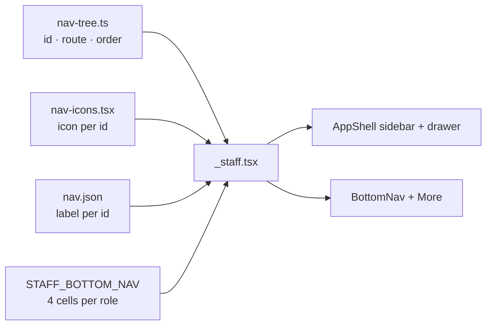
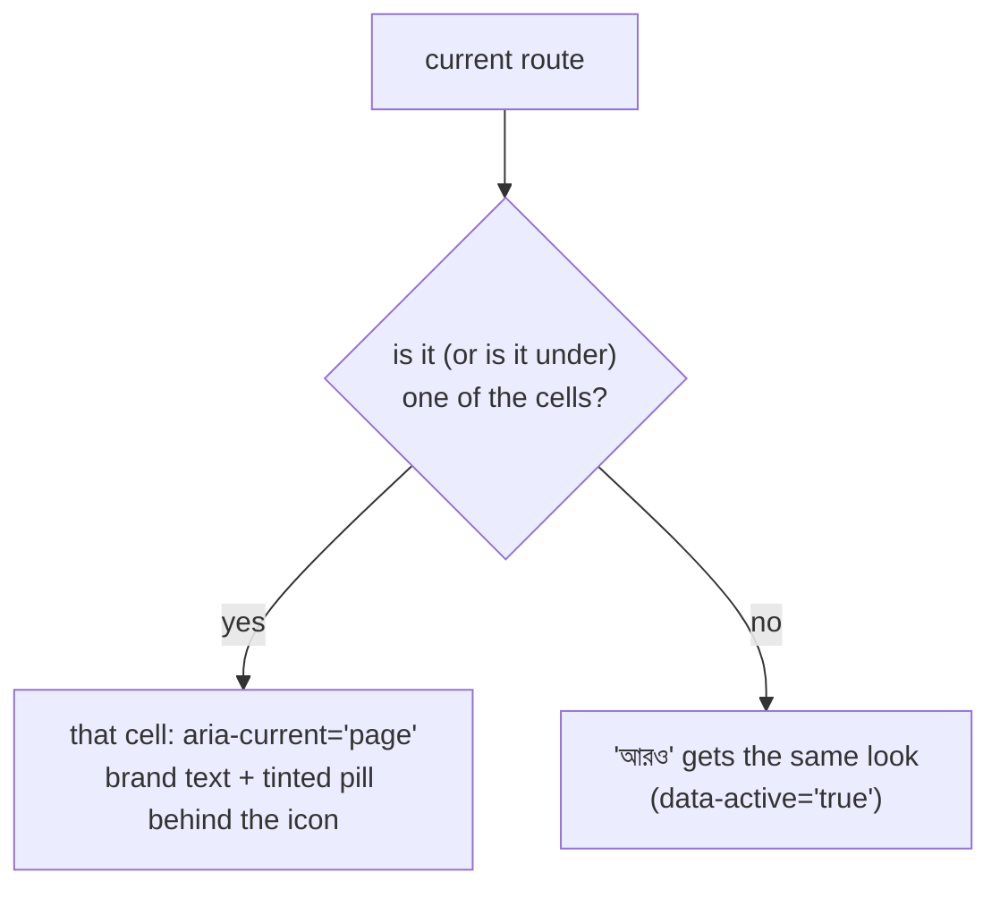

# Nav icons and bottom-bar cells (D10, D14)

One icon per nav item, **all different inside one shell**. Names are Lucide names in
kebab-case (what a mockup writes in `data-lucide="…"`); in the app the import is the
PascalCase name + `Icon` (`calendar-check-2` → `CalendarCheck2Icon`).

Every table below is read from the code, so it is what ships:

| Table | Source of truth |
|---|---|
| Staff ids, routes, order | `client-admin/src/nav-tree.ts` (`STAFF_NAV_ITEMS`, `STAFF_NAV_GROUPS`) |
| Icons | `client-admin/src/nav-icons.tsx` (`STAFF_NAV_ICONS`, `PLATFORM_NAV_ICONS`, `PORTAL_NAV_ICONS`, `MORE_ICON`) |
| Labels (bn) | `ui/src/i18n/locales/bn/nav.json`; an entity noun (students, guardians, staff, academic years, classes, exams, invoices) comes from `common.json` `entities` and a school can rename it |
| Bottom-bar cells | `STAFF_BOTTOM_NAV` in `nav-tree.ts`; short labels in `nav.json` `bottomNavCells` |

## Staff shell (`_staff.tsx`)

The sidebar also shows `/dashboard` first (no group). Items a role cannot use are
hidden by permission, so a mockup of one role keeps only its items. The first two
items of **finance** (`finance.dues`, `finance.recordPayment`) sit under the pinned
heading "দ্রুত পদক্ষেপ" (quick actions). SUPER_ADMIN's staff sidebar also gets the
two platform pages (see "Platform shell").

| Nav id | Route | Label (bn) | Icon |
|---|---|---|---|
| `dashboard` | `/dashboard` | ড্যাশবোর্ড | `layout-dashboard` |
| **people — ব্যক্তিবর্গ** | | | |
| `people.students` | `/students` | শিক্ষার্থী | `graduation-cap` |
| `people.guardians` | `/guardians` | অভিভাবক | `users-round` |
| `people.calendar` | `/calendar` | ক্যালেন্ডার | `calendar-days` |
| `people.staff` | `/staff` | কর্মী | `briefcase` |
| `people.programs` | `/programs` | প্রোগ্রাম | `milestone` |
| `people.admissionIntakes` | `/admissions/intakes` | ভর্তি পর্ব | `door-open` |
| `people.admissionApplicants` | `/admissions/applicants` | ভর্তি আবেদনকারী | `user-plus` |
| `people.admissionReports` | `/admissions/reports` | ভর্তি প্রতিবেদন | `chart-pie` |
| `people.teachingAssignments` | `/staff/teaching-assignments` | শিক্ষকের দায়িত্ব | `presentation` |
| `people.evaluations` | `/staff/evaluations` | মূল্যায়ন | `star` |
| **academics — একাডেমিক** | | | |
| `academics.academicYears` | `/academic-years` | শিক্ষাবর্ষ | `calendar-range` |
| `academics.classes` | `/classes` | শ্রেণি | `school` |
| `academics.routineSetup` | `/routines/setup` | রুটিন সেটআপ | `sliders-horizontal` |
| `academics.routineBuilder` | `/routines` | শ্রেণির রুটিন | `table` |
| `academics.routineReview` | `/routines/review` | রুটিন পর্যালোচনা | `clipboard-check` |
| `academics.routineSubstitutions` | `/routines/substitutions` | বদলি শিক্ষক | `replace` |
| `academics.myRoutine` | `/routines/my` | আমার রুটিন | `calendar-clock` |
| `academics.myClass` | `/my-class` | আমার শ্রেণি | `book-user` |
| `academics.homework` | `/academics/homework` | বাড়ির কাজ | `notebook-pen` |
| `academics.syllabus` | `/academics/syllabus` | সিলেবাস | `book-open` |
| **attendance — উপস্থিতি** | | | |
| `attendance.attendance` | `/attendance` | উপস্থিতি | `calendar-check-2` |
| `attendance.attendanceReports` | `/attendance/reports` | উপস্থিতি প্রতিবেদন | `chart-line` |
| `attendance.attendanceRegister` | `/attendance/register` | উপস্থিতির খাতা | `file-spreadsheet` |
| `attendance.staffAttendance` | `/attendance/staff` | কর্মীর উপস্থিতি | `user-check` |
| **examsResults — পরীক্ষা ও ফলাফল** | | | |
| `examsResults.exams` | `/exams` | পরীক্ষা | `file-pen-line` |
| `examsResults.examTemplates` | `/exams/templates` | পরীক্ষার কাঠামো | `file-stack` |
| `examsResults.marksEntry` | `/marks` | নম্বর দেওয়া | `pen-line` |
| `examsResults.seatPlans` | `/exams/seat-plans` | সিট প্ল্যান | `armchair` |
| `examsResults.gradingScales` | `/grading-scales` | গ্রেডিং পদ্ধতি | `ruler` |
| `examsResults.results` | `/results` | ফলাফল | `award` |
| `examsResults.analysis` | `/analysis` | ফলাফল বিশ্লেষণ | `trending-up` |
| `examsResults.promotion` | `/promotions` | প্রমোশন | `arrow-big-up-dash` |
| **finance — অর্থ** | | | |
| `finance.dues` | `/fees/dues` | শিক্ষার্থীর বকেয়া | `hand-coins` |
| `finance.recordPayment` | `/payments/record` | পেমেন্ট রেকর্ড করুন | `banknote` |
| `finance.feeStructures` | `/fee-structures` | ফি কাঠামো | `layers` |
| `finance.generateFees` | `/fees/generate` | ফির বিল তৈরি | `file-plus-2` |
| `finance.recurringSchedules` | `/fees/schedules` | স্বয়ংক্রিয় বিল | `repeat` |
| `finance.fines` | `/fees/fines` | জরিমানা | `gavel` |
| `finance.payments` | `/payments` | পেমেন্ট | `receipt-text` |
| `finance.invoices` | `/invoices` | চালান | `receipt` |
| **reports — প্রতিবেদন** | | | |
| `reports.collectionsReport` | `/reports/collections` | ফি আদায়ের প্রতিবেদন | `chart-column` |
| `reports.printables` | `/reports/printables` | প্রিন্ট ও কাগজপত্র | `printer` |
| **communications — যোগাযোগ** | | | |
| `communications.sendMessage` | `/communications/send` | বার্তা পাঠান | `send` |
| `communications.feeReminders` | `/communications/reminders` | ফি রিমাইন্ডার | `bell-ring` |
| `communications.reminderHistory` | `/communications/batches` | রিমাইন্ডার ইতিহাস | `history` |
| **administration — প্রশাসন** | | | |
| `administration.printTemplates` | `/print-templates` | প্রিন্টের নকশা | `id-card` |
| `administration.roles` | `/roles` | ভূমিকা ও অনুমতি | `shield-check` |
| `administration.auditLogs` | `/audit-logs` | কার্যক্রমের রেকর্ড | `scroll-text` |
| `administration.settings` | `/settings` | সেটিংস | `settings` |
| `administration.curriculumPreset` | `/curriculum-preset` | তৈরি শিক্ষাক্রম | `blocks` |

51 staff items (the dashboard plus 50 in groups), each with its own icon. The top bar
reuses none of them (`menu`, `search`, `bell`, `languages`, `moon`, `circle-user-round`,
`arrow-left-right`); `ellipsis` is the bottom bar's "আরও" (More).

TEACHER only: `academics.myClass` (`book-user`, route `/my-class`), permission `MY_CLASS_VIEW`.
It is the first cell of TEACHER's bottom bar.

## Portal shell (`portal.tsx`)

| Route | Label (bn, nav.json key) | Icon |
|---|---|---|
| `/portal` | সারসংক্ষেপ (`portalOverview`) | `house` |
| `/portal/fees` | ফি ও চালান (`portalFees`) | `credit-card` |
| `/portal/attendance` | উপস্থিতি (`portalAttendance`) | `calendar-check-2` |
| `/portal/routine` | রুটিন (`portalRoutine`) | `calendar-clock` |
| `/portal/calendar` | ক্যালেন্ডার (`portalCalendar`) | `calendar-days` |
| `/portal/results` | ফলাফল (`portalResults`) | `award` |
| `/portal/programs` | প্রোগ্রাম (`portalPrograms`) | `milestone` |
| `/portal/exam-schedule` | পরীক্ষার সময়সূচি (`portalExamSchedule`) | `file-clock` |
| `/portal/syllabus` | সিলেবাস (`portalSyllabus`) | `book-open` |
| `/portal/surveys` | জরিপ (`portalSurveys`) | `clipboard-pen-line` |
| `/portal/account` | অ্যাকাউন্ট (`portalAccount`) | `user-round` |

Where a portal item and a staff item are the same thing, they share the icon
(attendance, routine, calendar, programs, syllabus).

## Platform shell (`_platform/route.tsx`, D33)

| Route | Label (bn) | Icon |
|---|---|---|
| `/schools` | স্কুল (platform) | `building-2` |
| `/holiday-sets` | ছুটির তালিকা | `tree-palm` |

## Bottom-bar cells per role (D14)

Up to 4 cells + "আরও" (More, `ellipsis`). A short label is meant to fit one line in
a 64 px cell (320 px phone ÷ 5). The number in brackets is the label's length in
characters; Calendar (11) is the one that is longer than 10 and still fits. A cell
is shown only when the role holds the item's permission, and its icon is the
item's sidebar icon.

| Role | Cell 1 | Cell 2 | Cell 3 | Cell 4 |
|---|---|---|---|---|
| SUPER_ADMIN | `dashboard` — ড্যাশবোর্ড / Dashboard (10) | `people.students` — শিক্ষার্থী / Students (10) | `attendance.attendance` — উপস্থিতি / Attendance (8) | `finance.dues` — বকেয়া / Dues (6) |
| ADMIN | `dashboard` — ড্যাশবোর্ড / Dashboard (10) | `people.students` — শিক্ষার্থী / Students (10) | `attendance.attendance` — উপস্থিতি / Attendance (8) | `finance.dues` — বকেয়া / Dues (6) |
| ACCOUNTANT | `dashboard` — ড্যাশবোর্ড / Dashboard (10) | `finance.dues` — বকেয়া / Dues (6) | `finance.recordPayment` — পেমেন্ট / Payment (7) | `finance.invoices` — চালান / Invoices (5) |
| EXECUTIVE | `dashboard` — ড্যাশবোর্ড / Dashboard (10) | `people.students` — শিক্ষার্থী / Students (10) | `attendance.attendance` — উপস্থিতি / Attendance (8) | `reports.collectionsReport` — প্রতিবেদন / Reports (9) |
| TEACHER | `academics.myClass` — শ্রেণি / My class (6) | `attendance.attendance` — উপস্থিতি / Attendance (8) | `academics.myRoutine` — রুটিন / Routine (5) | `academics.homework` — বাড়ির কাজ / Homework (10) |
| OFFICE_STAFF | `dashboard` — ড্যাশবোর্ড / Dashboard (10) | `people.students` — শিক্ষার্থী / Students (10) | `people.admissionApplicants` — আবেদনকারী / Applicants (9) | `attendance.attendance` — উপস্থিতি / Attendance (8) |
| EXAM_CONTROLLER | `dashboard` — ড্যাশবোর্ড / Dashboard (10) | `examsResults.exams` — পরীক্ষা / Exams (7) | `examsResults.analysis` — বিশ্লেষণ / Analysis (8) | `people.students` — শিক্ষার্থী / Students (10) |
| COMMITTEE | `dashboard` — ড্যাশবোর্ড / Dashboard (10) | `people.calendar` — ক্যালেন্ডার / Calendar (11) | — | — |
| Guardian / student (portal) | `/portal` — সারসংক্ষেপ / Overview | `/portal/fees` — ফি ও চালান / Fees | `/portal/attendance` — উপস্থিতি / Attendance | `/portal/results` — ফলাফল / Results |
| SUPER_ADMIN (platform console) | `/schools` — স্কুল / Schools | `/holiday-sets` — ছুটি / Holidays | `/dashboard` — ড্যাশবোর্ড / Dashboard (back to the school app) | — |

The portal has 11 sidebar items but only the four cells above; everything else is
behind "আরও". The platform console has 3 cells (it has two pages; the third cell goes
back to the school app, C8). COMMITTEE has 2 cells because it holds only two
destinations — a bar never shows an empty or duplicate cell.

### How the bar marks the current page

Example: on `/students/123` the "শিক্ষার্থী" cell is marked; on `/fee-structures` no cell
matches, so "আরও" is marked. A path matches a cell when it equals the cell's route or is under
it on whole path segments (`isPathUnder` in `nav-tree.ts`); `/portal` only owns the exact path.
`BottomNav` itself uses `hasDescendantItem` (`ui/src/components/bottom-nav.tsx`) for its
own `aria-current` so two cells are never current at once.
