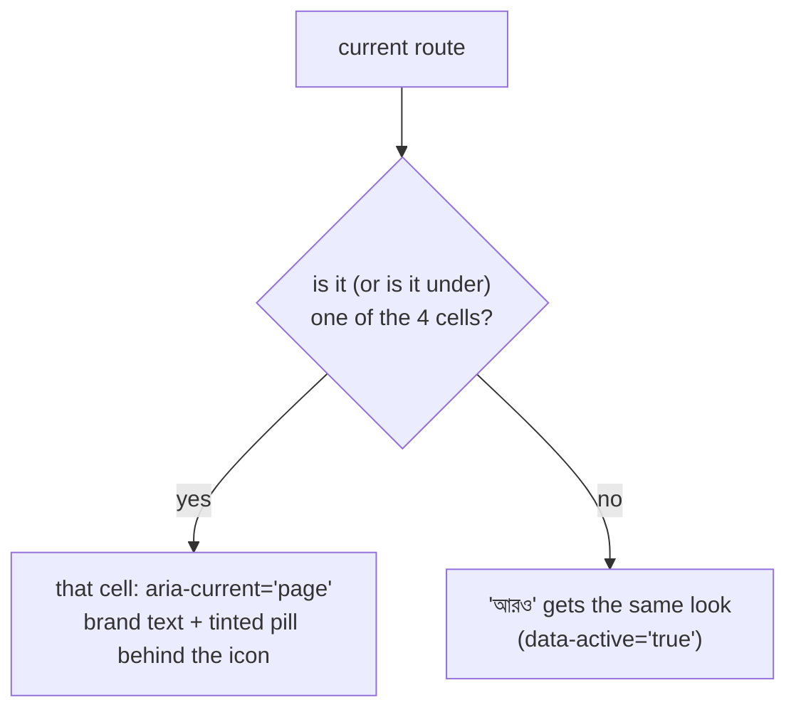

# Nav icons and bottom-bar cells (D10, D14)

One icon per nav item, **all different inside one shell**. Names are Lucide names in
kebab-case (what a mockup writes in `data-lucide="…"`); in the app the import is the
PascalCase name + `Icon` (`calendar-check-2` → `CalendarCheck2Icon`). Every name was
checked against `lucide@0.469` (mockups) and `lucide-react@1.45` (the app).

Ids, routes and order come from `client-admin/src/nav-tree.ts`; labels from
`ui/src/i18n/locales/bn/nav.json` and the entity labels in `common.json`.
"Today" is the icon in `client-admin/src/routes/_staff.tsx:66-95` (— = the item has none).

## Staff shell (`_staff.tsx`)

| Nav id | Route | Label (bn) | Icon | Today |
|---|---|---|---|---|
| `dashboard` | `/dashboard` | ড্যাশবোর্ড | `layout-dashboard` | same |
| **people — ব্যক্তিবর্গ** | | | | |
| `people.students` | `/students` | শিক্ষার্থী | `graduation-cap` | same |
| `people.guardians` | `/guardians` | অভিভাবক | `users-round` | same |
| `people.calendar` | `/calendar` | ক্যালেন্ডার | `calendar-days` | same |
| `people.staff` | `/staff` | কর্মী | `briefcase` | same |
| `people.programs` | `/programs` | প্রোগ্রাম ও মাইলস্টোন | `milestone` | — |
| `people.admissionIntakes` | `/admissions/intakes` | ভর্তি গ্রহণ | `door-open` | — |
| `people.admissionApplicants` | `/admissions/applicants` | ভর্তি আবেদনকারী | `user-plus` | — |
| `people.admissionReports` | `/admissions/reports` | ভর্তি রিপোর্ট | `chart-pie` | — |
| `people.teachingAssignments` | `/staff/teaching-assignments` | শিক্ষক নিয়োগ | `presentation` | — |
| `people.evaluations` | `/staff/evaluations` | মূল্যায়ন | `star` | — |
| **academics — একাডেমিক** | | | | |
| `academics.academicYears` | `/academic-years` | শিক্ষাবর্ষ | `calendar-range` | `calendar-days` (duplicate of Calendar) |
| `academics.classes` | `/classes` | শ্রেণি | `school` | same |
| `academics.routineSetup` | `/routines/setup` | রুটিন সেটআপ | `sliders-horizontal` | — |
| `academics.routineBuilder` | `/routines` | টাইমটেবিল ও রুটিন | `table` | — |
| `academics.myRoutine` | `/routines/my` | আমার রুটিন | `calendar-clock` | — |
| `academics.myClass` | `/my-class` | আমার শ্রেণি | `book-user` | `user-check` (duplicate of Staff attendance below; added by PR #1407, TEACHER only — `MY_CLASS_VIEW`) |
| `academics.homework` | `/academics/homework` | বাড়ির কাজ | `notebook-pen` | `list-checks` (duplicate of Fee structures) |
| `academics.syllabus` | `/academics/syllabus` | সিলেবাস | `book-open` | — |
| **attendance — উপস্থিতি** | | | | |
| `attendance.attendance` | `/attendance` | উপস্থিতি | `calendar-check-2` | same |
| `attendance.attendanceReports` | `/attendance/reports` | উপস্থিতি প্রতিবেদন | `chart-line` | `clipboard-list` (duplicate of Grading scales) |
| `attendance.attendanceRegister` | `/attendance/register` | প্রিন্টযোগ্য রেজিস্টার | `file-spreadsheet` | `printer` (duplicate of Printables) |
| `attendance.staffAttendance` | `/attendance/staff` | কর্মী হাজিরা | `user-check` | — |
| **examsResults — পরীক্ষা ও ফলাফল** | | | | |
| `examsResults.exams` | `/exams` | পরীক্ষা | `file-pen-line` | — (and no label today, #1221) |
| `examsResults.examTemplates` | `/exams/templates` | পরীক্ষার টেমপ্লেট | `file-stack` | — |
| `examsResults.seatPlans` | `/exams/seat-plans` | সিট প্ল্যান | `armchair` | — |
| `examsResults.gradingScales` | `/grading-scales` | গ্রেডিং স্কেল | `ruler` | `clipboard-list` |
| `examsResults.analysis` | `/analysis` | বিশ্লেষণ | `trending-up` | — |
| `examsResults.promotion` | `/promotions` | উত্তরণ | `arrow-big-up-dash` | — |
| **finance — অর্থ** (first two are the pinned "দ্রুত পদক্ষেপ") | | | | |
| `finance.dues` | `/fees/dues` | শিক্ষার্থীর বকেয়া | `hand-coins` | same |
| `finance.recordPayment` | `/payments/record` | পেমেন্ট রেকর্ড করুন | `banknote` | same |
| `finance.fees` | `/fees` | ফি | `wallet` | same |
| `finance.feeStructures` | `/fee-structures` | ফি কাঠামো | `layers` | `list-checks` |
| `finance.generateFees` | `/fees/generate` | ফি তৈরি | `file-plus-2` | same |
| `finance.recurringSchedules` | `/fees/schedules` | পুনরাবৃত্ত সময়সূচী | `repeat` | same |
| `finance.fines` | `/fees/fines` | জরিমানা | `gavel` | — |
| `finance.invoices` | `/invoices` | চালান | `receipt` | same |
| **reports — প্রতিবেদন** | | | | |
| `reports.collectionsReport` | `/reports/collections` | সংগ্রহ প্রতিবেদন | `chart-column` | same glyph (`BarChart3Icon`, its old name) |
| `reports.printables` | `/reports/printables` | প্রিন্ট ও ডকুমেন্ট | `printer` | same |
| **communications — যোগাযোগ** | | | | |
| `communications.sendMessage` | `/communications/send` | বার্তা পাঠান | `send` | same |
| `communications.feeReminders` | `/communications/reminders` | ফি রিমাইন্ডার | `bell-ring` | same |
| `communications.reminderHistory` | `/communications/batches` | রিমাইন্ডার ইতিহাস | `history` | same |
| **administration — প্রশাসন** | | | | |
| `administration.printTemplates` | `/print-templates` | প্রিন্ট টেমপ্লেট | `id-card` | same |
| `administration.roles` | `/roles` | রোল ও অনুমতি | `shield-check` | — |
| `administration.auditLogs` | `/audit-logs` | নিরীক্ষা লগ | `scroll-text` | same |
| `administration.settings` | `/settings` | সেটিংস | `settings` | same |
| `administration.curriculumPreset` | `/curriculum-preset` | কারিকুলাম প্রিসেট | `blocks` | — |
| *SUPER_ADMIN extra* (no id in `nav-tree.ts`) | `/schools` | স্কুল (প্ল্যাটফর্ম) | `building-2` | `school` (duplicate of Classes) |
| *SUPER_ADMIN extra* | `/holiday-sets` | ছুটির তালিকা (প্ল্যাটফর্ম) | `tree-palm` | `calendar-days` (duplicate of Calendar) |

47 staff items + 2 extras, 49 different icons (31.3.1 adds five more items and their icons). The top bar reuses none of them
(`menu`, `search`, `bell`, `languages`, `moon`, `circle-user-round`, `arrow-left-right`);
`ellipsis` is the bottom bar's "আরও".

## Portal shell (`portal.tsx`)

| Route | Label (bn, nav.json key) | Icon | Today |
|---|---|---|---|
| `/portal` | সারসংক্ষেপ (`portalOverview`) | `house` | same |
| `/portal/fees` | ফি ও চালান (`portalFees`) | `credit-card` | same |
| `/portal/attendance` | উপস্থিতি (`portalAttendance`) | `calendar-check-2` | `calendar-days` (duplicate of Calendar) |
| `/portal/routine` | রুটিন (`portalRoutine`) | `calendar-clock` | same |
| `/portal/calendar` | ক্যালেন্ডার (`portalCalendar`) | `calendar-days` | same |
| `/portal/results` | ফলাফল (`portalResults`) | `award` | `graduation-cap` (duplicate of Exam schedule) |
| `/portal/programs` | প্রোগ্রাম (`portalPrograms`) | `milestone` | same |
| `/portal/exam-schedule` | পরীক্ষার সময়সূচি (`portalExamSchedule`) | `file-clock` | `graduation-cap` |
| `/portal/syllabus` | সিলেবাস (`portalSyllabus`) | `book-open` | same |
| `/portal/account` | অ্যাকাউন্ট (`portalAccount`) | `user-round` | same |

Where a portal item and a staff item are the same thing, they share the icon
(attendance, routine, calendar, programs, syllabus).

## Platform shell (`_platform/route.tsx`, D33)

| Route | Label (bn) | Icon |
|---|---|---|
| `/schools` | স্কুল | `building-2` |
| `/holiday-sets` | ছুটির তালিকা | `tree-palm` |

## Bottom-bar cells per role (D14)

4 cells + "আরও" (More, `ellipsis`). A short label is at most 10 characters
(`[...label].length`) so it always fits one line in a 64 px cell (320 px phone ÷ 5).
A cell is shown only when the role holds the item's permission (the same filter the
sidebar uses), so the table lists items each role really has. The cell's icon is the
item's sidebar icon.

| Role | Cell 1 | Cell 2 | Cell 3 | Cell 4 |
|---|---|---|---|---|
| **ADMIN** (and SUPER_ADMIN inside a school) | `dashboard` — ড্যাশবোর্ড / Dashboard | `people.students` — শিক্ষার্থী / Students | `attendance.attendance` — উপস্থিতি / Attendance | `finance.dues` — বকেয়া / Dues |
| **ACCOUNTANT** | `dashboard` — ড্যাশবোর্ড / Dashboard | `finance.dues` — বকেয়া / Dues | `finance.recordPayment` — পেমেন্ট / Payment | `finance.invoices` — চালান / Invoices |
| **EXECUTIVE** | `dashboard` — ড্যাশবোর্ড / Dashboard | `people.students` — শিক্ষার্থী / Students | `attendance.attendance` — উপস্থিতি / Attendance | `reports.collectionsReport` — প্রতিবেদন / Reports |
| **TEACHER** | `academics.myClass` — শ্রেণি / My class | `attendance.attendance` — উপস্থিতি / Attendance | `academics.myRoutine` — রুটিন / Routine | `academics.homework` — বাড়ির কাজ / Homework |
| **Guardian / student (portal)** | `/portal` — সারসংক্ষেপ / Overview | `/portal/fees` — ফি ও চালান / Fees | `/portal/attendance` — উপস্থিতি / Attendance | `/portal/results` — ফলাফল / Results |
| **SUPER_ADMIN (platform console)** | `/schools` — স্কুল / Schools | `/holiday-sets` — ছুটি / Holidays | `/dashboard` — ড্যাশবোর্ড / Dashboard (back to the school app) | — (the console has only two pages; see conflicts.md C8) |

Changes from today: ADMIN's bar swaps "Record payment" for "Attendance" (payment is one
tap away from Dues through "ফি আদায়"); every other staff role gets its own four instead of
the admin's four minus what it cannot see. TEACHER's first cell is My class (its home page) instead of the
placeholder dashboard; its short label is শ্রেণি, the same way আমার রুটিন shortens to রুটিন — "আমার শ্রেণি" is
11 characters and is cut off in a 64 px cell. The portal keeps its four.

### Roles the brief did not list (added in Epic 24 — they need cells too)

| Role | Cell 1 | Cell 2 | Cell 3 | Cell 4 |
|---|---|---|---|---|
| OFFICE_STAFF | `dashboard` — ড্যাশবোর্ড / Dashboard | `people.students` — শিক্ষার্থী / Students | `people.admissionApplicants` — আবেদনকারী / Applicants | `attendance.attendance` — উপস্থিতি / Attendance |
| EXAM_CONTROLLER | `dashboard` — ড্যাশবোর্ড / Dashboard | `examsResults.exams` — পরীক্ষা / Exams | `examsResults.analysis` — বিশ্লেষণ / Analysis | `people.students` — শিক্ষার্থী / Students |
| COMMITTEE | `dashboard` — ড্যাশবোর্ড / Dashboard | `people.calendar` — ক্যালেন্ডার / Calendar (11 characters — the one exception; it is the nav label and still fits) | — | — |

### How the bar marks the current page

Example: on `/students/123` the "শিক্ষার্থী" cell is marked; on `/fee-structures` no cell
matches, so "আরও" is marked. `/dashboard` uses an exact match, the others a prefix match
on whole path segments (the `hasDescendantItem` rule in `ui/src/components/bottom-nav.tsx`).
