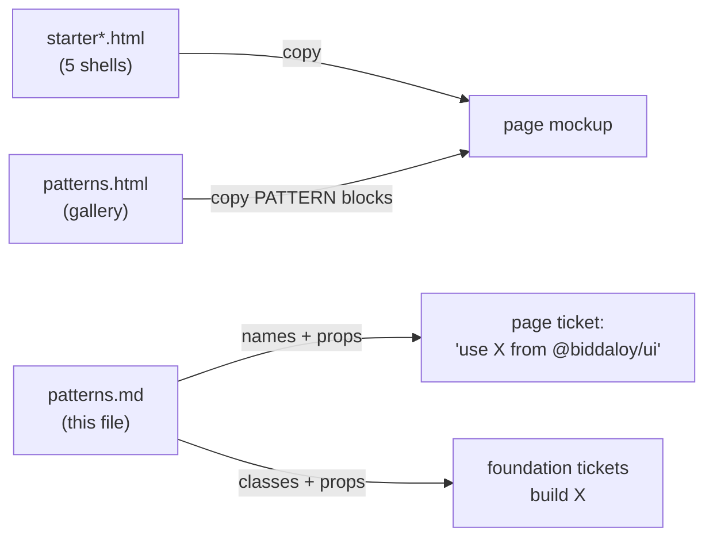

# Pattern kit — component names, props and classes

The rules behind these patterns are in [`docs/architecture/21-ui-patterns.md`](../../../docs/architecture/21-ui-patterns.md).
Decision numbers (`D5`, `D19`…) and conflict numbers (`C1`…) refer to Epic 31.0 (#811): the decisions are in that
issue's body; `DECISIONS.md` and `conflicts.md` are on branch `design-assets` under `redesign/epic31/plan/kit/`.
Every component in this file is **shipped** (Epic 31.0 waves 1–11, reconciled with the code by 31.5.4). Where this file and the code differ, the code wins: fix this file. Gaps the code still has are in [`21-ui-patterns.md`](../../../docs/architecture/21-ui-patterns.md) §14.

`patterns.html` shows every pattern; this file says what each one is called in
`@biddaloy/ui`, what a page passes to it, and the exact classes that make its look.
Decisions are cited by number (`DECISIONS.md`).



## 0. How to use the kit

| You are making… | Start from | Then |
|---|---|---|
| a staff page | `starter.html` | set the active sidebar link, the open group and the bottom-bar cell (3 marked spots), replace what is inside `<main>` |
| a guardian / student page | `starter-portal.html` | same; every control is 44 px at every width |
| a platform page | `starter-platform.html` | same |
| a full-page modal (D22/D23) | `starter-fullpage.html` | replace what is inside `<main>`; keep header and footer |
| a guest page (D34) | `starter-guest.html` | replace what is inside the card |

Find a pattern without reading the whole gallery:

```bash
grep -n "PATTERN:" .claude/skills/redesign-page/patterns.html     # line of every block; read from there to the next "/PATTERN"
```

Rules that hold for every mockup:

- **One file, two sizes.** Classes without a prefix are the phone look; `md:` classes are the desktop look.
- **Control height.** Staff and platform: `h-11 md:h-8` (44 px phone, 32 px desktop), icon buttons `size-11 md:size-8`. Portal, guest and full-page header/footer: `h-11` at every width.
- **One `<h1>`.** The gallery writes page titles as `<p data-h1 class="text-h1">` because it has its own `<h1>`; in a page write `<h1 class="text-h1">`. Card titles in the gallery are `<h3>`; in a page a card title directly under the `<h1>` is an `<h2>` (same classes).
- **Never `fixed` or `sticky bottom-0` in a mockup.** The screenshot is one tall frame, so a fixed bar is painted across the middle of it. The bottom bar and the full-page footer stay in normal flow as the last child of `<body>` (the starters already do this). `sticky top-0` on the top bar is fine.
- **No width of your own.** The page's only `max-w-*` is the PageContainer's.
- **Tokens only.** No hex, no `[12px]`. The only bracket classes in the kit are variants (`aria-[current=page]:`, `data-[active=true]:`) and `[scrollbar-width:none]` on a tab row.
- **Icons.** `<i data-lucide="name"></i>`, 18 px by default; add `class="size-3.5"` or `size-4` for a smaller one. Every icon-only button has an `aria-label`.

## 1. Shared class strings

Copy these exactly. They are the mockup spelling of what the components render.
In the app a control's height comes from the density variable (`h-[var(--control-h,2rem)]`:
32 px for staff at `md` and up, 44 px on phone and in portal / signed-out pages), so a
page never writes `h-11 md:h-8` itself. The kit does, because a mockup has no density attribute.

| Name | Classes |
|---|---|
| Button base | `inline-flex h-11 items-center justify-center gap-2 rounded-md px-4 font-medium md:h-8 md:px-3` |
| Button primary | base + `bg-primary text-primary-foreground` |
| Button outline | base + `border border-border-functional bg-surface text-text-primary hover:bg-muted` |
| Button ghost | base + `text-text-primary hover:bg-muted` |
| Button danger (confirm dialog only) | base + `bg-destructive text-destructive-foreground` (`Button variant="danger"`) |
| Button disabled | base + `cursor-not-allowed bg-muted text-text-secondary` |
| Icon button | `inline-flex size-11 shrink-0 items-center justify-center rounded-md hover:bg-muted md:size-8` + a text colour |
| Card | `rounded-lg border border-border-subtle bg-surface shadow-e1` + `p-4 md:p-5` |
| Field | `flex flex-col gap-1.5` |
| Label | `text-label text-text-primary` |
| Control (input, select trigger, picker trigger) | `h-11 w-full rounded-md border border-border-functional bg-surface px-3 text-body-lg text-text-primary md:h-8 md:text-body` |
| Help text | `text-caption text-text-secondary` |
| Error text | `flex items-center gap-1 text-caption text-destructive` (+ `circle-alert` icon) and `border-destructive` on the control |
| Desktop-only button | swap `inline-flex` for `hidden md:inline-flex` — never write `hidden` next to a base `inline-flex`/`flex` (the later rule wins and the element shows) |

`text-body-lg md:text-body` on controls keeps phone inputs at 16 px, which stops iOS from zooming the page on focus.

## 2. Spacing (D17)

| Where | px | Classes |
|---|---|---|
| Page gutter | 16 phone / 24 desktop | `px-4 md:px-6` |
| Page top and bottom | 16 / 24 | `py-4 md:py-6` |
| Between sections of a page | 24 | `space-y-6` or `gap-6` |
| Card padding | 16 / 20 | `p-4 md:p-5` |
| Dialog padding | 20 on every side | header `px-5 pt-5` · body `p-5` · footer `px-5 pb-5` |
| Between form fields | 16 | `gap-4` |
| Label to control | 6 | `gap-1.5` |
| Title to subtitle | 2 | `mt-0.5` |
| Between buttons in a row | 8 | `gap-2` |
| Table cell | 16 sides, row 40 high | `h-10 px-4 py-1` |
| Radius | controls 8, cards and dialogs 12 | `rounded-md`, `rounded-lg` |
| Elevation | card / popover / dialog | `shadow-e1` / `shadow-e2` / `shadow-e3` |

## 3. Shell

### AppShell — D10–D14, D33

```ts
// shipped props
navItems, navGroups, brand, topBar, bottomNav, openMenuLabel, closeMenuLabel, navLabel, skipLinkLabel
mobileTitle?: string;       // school (or console) name in the phone top bar (truncates)
mobileActions?: ReactNode;  // search, bell, account — the right side of the phone row
// gone since 31.3.8a: mobileHeaderActions, drawerHeader
// language / theme / switch school live in the account menu on phone (D12)
```

- **Top bar:** `AppShell` wraps it in `sticky top-0 z-30`. Desktop row (`AppHeader`): `flex h-14 w-full items-center justify-between gap-2 border-b border-border-subtle bg-surface px-4 md:px-6`; left = school + role (`TenantBar`), right = search launcher (`md:w-56`, outline button, shortcut hint), sync status, bell, language, theme, account. Top-bar icon buttons are `size-11 md:size-9`.
- **Phone row:** `flex h-14 items-center gap-1 border-b border-border-subtle bg-surface px-1 md:hidden` — menu button (`size-11`), `mobileTitle` (`text-h3`, truncates), then `mobileActions` at the end.
- **Sidebar:** `hidden w-60 shrink-0 border-r border-border-subtle bg-surface md:block`, inner `aside` `px-3 py-4`. Item: `flex items-center gap-2.5 rounded-md px-3 text-body` + `h-9` (drawer `h-11`) + `text-text-secondary hover:bg-muted hover:text-text-primary`; current: `bg-secondary font-semibold text-secondary-foreground` + `aria-current="page"`. Group header: `flex w-full items-center justify-between rounded-md px-3 text-label text-text-secondary hover:bg-muted hover:text-text-primary` + `h-9`, with a `chevron-right size-4` that turns 90° when open. A group with no saved choice starts collapsed unless it holds the current page; going to a page inside a collapsed group re-opens it (D10, B3). The choice is kept per group in `localStorage` (`nav-group-collapsed-v2:<id>`).
- **Exactly one active item:** `pickActiveNavTo` (in `app-shell.tsx`) picks the longest nav `to` that equals the path or is a whole-segment prefix of it (`/exams/templates` lights "Exam templates", not "Exams"). In a mockup mark exactly one.
- **Main:** `<main class="min-w-0 flex-1 p-4 md:p-6">`. With a bottom bar the page wrapper adds `pb-[calc(4rem+var(--safe-area-bottom))] md:pb-0`.
- **Phone:** menu button + school name on the left; search, bell, account on the right. Drawer and account menu: `PATTERN: NavDrawer`, `PATTERN: AccountMenu`.
- **Do** keep the shell markup identical to the starter. **Don't** redesign it in a page mockup, add a second active link, or leave two groups open.

### BottomNav — D14

```ts
items: readonly AppShellNavItem[];   // at most 4, chosen per role — see nav-icons.md
label: string;                       // aria-label of the <nav>
more?: { label: string; icon?: ReactNode; active?: boolean };   // active = current page is in none of the cells
```

- `AppShell` renders the bar inside `<div data-app-bottom-nav class="fixed inset-x-0 bottom-0 z-30 md:hidden">`. The `<nav>` itself is `flex border-t border-border-subtle bg-surface pb-(--safe-area-bottom)` (no `fixed` of its own). The page wrapper reserves the height (`pb-[calc(4rem+var(--safe-area-bottom))]`).
- Cell: `group flex h-16 min-w-0 flex-1 flex-col items-center justify-center gap-0.5 text-caption text-text-secondary`; icon sits in a pill `flex h-7 w-14 items-center justify-center rounded-full`; label is `max-w-full truncate px-1` (one line, always).
- Current cell: `aria-current="page"` gives `font-semibold text-secondary-foreground` and the pill gets `bg-secondary`. "More" is a `<button aria-haspopup="dialog">` that opens the drawer; when `more.active` it sets `data-active="true"` (never `aria-current`) and gets the same look.
- Up to 4 cells per role. The platform console has 3, COMMITTEE has 2. Never an empty or duplicate cell (C8).
- Hidden inside a full-page modal (the modal's portal covers it).

### PageContainer — D15

```ts
<PageContainer size="wide" | "narrow">   // default "wide"
```

- `mx-auto w-full space-y-6` + `max-w-screen-xl` (wide: lists, details, dashboards, calendar, settings) or `max-w-3xl` (narrow: forms and reading pages). **Width only:** the gutter (`p-4 md:p-6`) is on `AppShell`'s `<main>`. In a mockup the starter's `<main>` already carries it.
- Lives in `ui/src/shells/`. Rendered by `ListShell`, `DetailShell` (wide) and `FormShell` (narrow); a page without a shell wraps itself once.
- **Don't** put `max-w-*`, `mx-auto` or page padding in a route file (the `no-page-max-width` rule, D37, lints it).

### PageHeader — D16

```ts
<PageHeader
  title={string}                 // = nav label = last crumb
  subtitle?={string}             // one line
  actions?={PageAction[]}
/>
type PageAction = {
  id: string; label: string; onClick: () => void;
  allowed?: boolean;                                                  // false = hidden
  priority?: 'primary' | 'secondary' | 'tertiary' | 'destructive';   // default 'secondary'
  icon?: ReactNode; disabled?: boolean; busy?: boolean;
};
```

- Lives in `ui/src/shells/`. `PageAction` is its own type; `DetailShell` has a separate `DetailShellAction`.
- Wrapper: `flex flex-col gap-3 md:flex-row md:flex-wrap md:items-end md:justify-between md:gap-x-6 md:gap-y-3`; title `text-h1`; subtitle `mt-0.5 truncate text-text-secondary`; actions `flex w-full items-center gap-2 md:w-auto md:shrink-0`.
- Order: up to 2 outline actions, More (ghost icon button, `ellipsis`, `aria-label` "আরও অ্যাকশন"), then the one primary. Extra secondary, all tertiary and destructive actions go into More (a lone destructive with nothing else to share the menu stays inline). A second `primary` logs a dev warning. `destructive` is the tinted button, not filled red.
- Breadcrumbs are rendered by the layout directly above the title, and only when the trail has 2 or more crumbs. Crumb row: `flex flex-wrap items-center gap-1 text-label text-text-secondary`; links `inline-flex min-h-11 items-center md:min-h-6 md:min-w-6`; last crumb `text-text-primary`, not a link; separator `chevron-right size-3.5`. Phone shows the last two crumbs. While a name loads, the crumb is a grey bar `inline-block h-3 w-24 rounded-sm bg-muted` (never an id).
- **Phone:** title, subtitle, then one row: primary (`flex-1`) + More. Outline actions move into More.
- **Do** make the title equal the sidebar label. **Don't** add a "back to list" link, a second filled button, or a subtitle that wraps.

### FullPageShell — D22, D23

```ts
<FullPageShell
  title={string}
  onClose={() => void}                 // Close button and Esc; asks before discarding when dirty
  dirty?={boolean}
  size?="form" | "wide"                // max-w-3xl | max-w-5xl (table, list, preview)
  primary={{ label, onClick, busy?, disabled? }}
  secondary?={{ label, onClick }}      // usually Cancel; Back in a stepped flow
>
const close = useCloseFullPage(fallback);   // browser back when there is an in-app entry, else fallback()
```

- Lives in `ui/src/shells/`. It is a Radix dialog that is always open, so the portal covers the app bar, sidebar and bottom bar. The `primary` button sits outside the page's `<form>`: submit through `onClick`.
- Gaps (see 21 §14): the footer `secondary` skips the discard check, and neither action takes an `icon`.

- Header: `sticky top-0 z-30 border-b border-border-subtle bg-surface`, inner `flex h-14 items-center justify-between gap-4 px-4 md:h-16 md:px-6`; title is the page's `<h1>` (`truncate text-h2 md:text-h1`); Close = outline button `h-11` with `x` icon + the word "বন্ধ করুন", at every width.
- Body: `mx-auto w-full flex-1 space-y-6 px-4 py-4 md:px-6 md:py-6` + `max-w-3xl` (`size="form"`) or `max-w-5xl` (`size="wide"`).
- Footer: in the app `sticky bottom-0 z-30 border-t border-border-subtle bg-surface`; inner `mx-auto flex w-full max-w-3xl items-center justify-between gap-2 px-4 py-3 md:px-6` (same `max-w-*` as the body); secondary on the left (an empty spacer when there is none), primary on the right, both `h-11`.
- No app top bar, no sidebar, no bottom bar. The URL changes (own route, or a search param on the host route).
- **Use it** when a form has more than 6 fields, has steps, or holds a table / list / preview (D21). Otherwise use `Dialog`.

### AuthLayout — D34

```ts
<AuthLayout size?="default" | "wide">{card content}</AuthLayout>   // card max-w-md | max-w-2xl
```

- Language switcher top right (`h-11` outline button). Logo mark `size-12 rounded-lg bg-primary text-primary-foreground` + product name `text-h3`. Card is a `<section>` with the Card classes (`p-4 md:p-5`), width `max-w-md` (`wide`: `max-w-2xl`). Sets comfortable density (44 px controls) on the whole document.
- A link that stands alone ("পাসওয়ার্ড ভুলে গেছেন?") is `inline-flex h-11 items-center rounded-md px-3 font-medium text-primary hover:bg-muted` — no underline.
- **Don't** write "token", "staff account" or any technical word in guest copy.

## 4. Lists

### FilterBar — D24 (`ui/src/shells/`)

```ts
// unchanged: fields: FilterFieldDescriptor[], values, onChange, debounceMs
// shipped
resultCount?: number;      // shown on the sheet's button: "৪৮টি ফলাফল দেখুন"
// behaviour change, no new prop: every field shows its label; the field with primary: true is the search box
```

- Desktop: `grid grid-cols-12 gap-4`, each field a Field with a visible Label; search spans 4 columns and has a `search` icon inside (`pl-10`); a date range is two DatePicker triggers with "–" between, under one label.
- Chips row under the controls: chip = one button (`inline-flex h-11 items-center md:h-7`) holding a pill `inline-flex h-7 items-center gap-1 rounded-full bg-secondary pr-2 pl-3 text-label text-secondary-foreground` + `x` icon; text is "label: value". "সব মুছুন" = `inline-flex h-11 items-center rounded-md px-2 text-label font-medium text-primary hover:bg-muted md:h-7`.
- **Phone:** search field + outline button "ফিল্টার (n)" (n = active filters). The button opens a bottom sheet (`PATTERN: FilterSheet`): title + 44 px close, every field full width with its label, footer `flex gap-2 border-t border-border-subtle p-4` with "সব মুছুন" (outline) and "n টি ফলাফল দেখুন" (primary), both `flex-1`.
- **Do** keep the search visible on phone. **Don't** use a placeholder as the only label, or show raw values in chips (D9).

### DataTable — D19 (`ui/src/components/`)

```ts
// unchanged: tableId, caption, columns, data, getRowId, sorting, onSortingChange, selection, loading, error, layout …
// shipped
rowActions?: (row: TData) => RowAction[];   // renders the last column ("কাজ") and the card footer
paginated?: boolean;                        // default true; false = no pager, footer shows "মোট n টি"
emptyState?: EmptyStateProps;               // preferred over the older emptyMessage string
totalCount: number;                         // required: drives the count line and the pager
// defaults: pageSize 25, pageSizeOptions [25, 50, 100] (PAGE_SIZE_OPTIONS)
// column.align: 'end' right-aligns the column and adds tabular-nums — use it for every number, amount and count
```

- Desktop: Card with `overflow-hidden`; `thead` `border-b border-border-subtle bg-muted text-label text-text-secondary`, `th` `h-10 px-4 font-medium`; `tbody` `divide-y divide-border-subtle`, rows `hover:bg-muted`, `td` `h-10 px-4 py-1`; numeric cells `text-end tabular-nums`; the name cell `font-medium`; the actions cell `px-2` with `flex justify-end`.
- **Phone (cards):** one Card per row — title `text-h3` + StatusBadge on the right, subtitle `text-text-secondary`, fields as `dl grid grid-cols-2 gap-x-4 gap-y-2` (label `text-caption text-text-secondary`), then an action row `flex items-center border-t border-border-subtle px-1`. Cards are `space-y-3`.
- A short reference list (≤ ~20 rows, `paginated={false}`) on phone uses compact two-line rows inside one Card instead of big cards (`PATTERN: DataTable (unpaginated)`).
- **Do** show the total on every table. **Don't** show a pager on an empty table, put text links in the actions column, or centre-align numbers.

### TableCount (used by DataTable) — D19

```ts
<TableCount total={number} from?={number} to?={number} />
// en "Showing 1–25 of 312" / "Total 12"     bn "১–২৫ দেখানো হচ্ছে, মোট ৩১২" / "মোট ১২টি"
```

- `text-text-secondary`. Paginated footer (always `print:hidden`): `flex flex-col gap-2 pt-3 md:flex-row md:items-center md:justify-between md:border-t md:border-border-subtle md:px-4 md:py-2` (the border and padding apply only when the table is framed in its card); right side = "প্রতি পাতায়" + Select (`w-20`) + pager (outline icon buttons `chevron-left` / `chevron-right` around "পাতা ১ / ১৩"). Unpaginated footer: `border-t border-border-subtle px-4 py-3`.

### RowActions — D19

```ts
type RowActionIntent = 'view' | 'edit' | 'delete' | 'remove' | 'print' | 'download' | 'pay'
  | 'approve' | 'reject' | 'duplicate' | 'archive' | 'restore' | 'send';
interface RowAction {
  intent: RowActionIntent;
  label: string;            // tooltip + aria-label; visible text on phone and in the More menu
  onClick?: () => void;
  to?: string;              // renders a link instead of a button
  allowed?: boolean;        // false = hidden, never disabled (09 §11 rule 5)
  icon?: ReactNode;         // only to override the default below
  'data-focus-anchor'?: string;   // copied onto the button / link so Back restores focus to the row
}
<RowActions actions={RowAction[]} />     // first 3 allowed actions are icons, the rest go into More
// no per-row name prop: `label` is the tooltip and aria-label — write "View Rahim Uddin" if rows must be told apart (21 §14)
```

| Intent | Lucide icon | Colour class | Meaning |
|---|---|---|---|
| view | `eye` | `text-text-secondary` | open / see |
| edit | `pencil` | `text-primary` | change |
| delete | `trash-2` | `text-destructive` | the record is gone |
| remove | `circle-minus` | `text-destructive` | take out of this list; the record stays |
| print | `printer` | `text-text-secondary` | |
| download | `download` | `text-text-secondary` | |
| pay | `hand-coins` | `text-status-paid-fg` | collect / record money |
| approve | `circle-check` | `text-status-paid-fg` | |
| reject | `circle-x` | `text-destructive` | |
| duplicate | `copy` | `text-text-secondary` | |
| archive | `archive` | `text-text-secondary` | |
| restore | `archive-restore` | `text-primary` | |
| send | `send` | `text-primary` | message / reminder |
| more | `ellipsis-vertical` | `text-text-secondary` | menu with icon + text items; delete goes last, below a separator |

- Desktop: Icon button + colour, `aria-label`, and a tooltip (`rounded-md bg-foreground px-2 py-1 text-caption whitespace-nowrap text-background shadow-e2`, above the button).
- **Phone:** the same actions with the label visible, because there is no hover: `inline-flex h-11 min-w-0 flex-1 items-center justify-center gap-1.5 rounded-md text-label font-medium hover:bg-muted` + the colour class; More stays an icon.
- **Do** keep the order view → edit → domain action → More. **Don't** use more than 3 icons, colour an icon outside this table, or put delete among the 3 when a More menu exists (the component moves `delete` / `remove` to the end of More, below a separator).

### Tabs / DetailShell — D20 (`ui/src/shells/`)

```ts
// DetailShell — unchanged: name, statusBadge, actions, tabs, activeTab, onTabChange
// shipped
facts?: { label: string; value: ReactNode }[];   // replaces the free-form `identifiers` (still accepted, @deprecated)
// TabsList: the default variant is "line"; no prop change for pages
```

- Tab row: `flex overflow-x-auto border-b border-border-subtle [scrollbar-width:none]`. Tab: `inline-flex h-11 shrink-0 items-center border-b-2 border-transparent px-3 whitespace-nowrap text-text-secondary hover:text-text-primary md:h-10`; selected: `border-primary font-semibold text-primary` (`aria-selected="true"`).
- Overflow: the row scrolls sideways, never wraps; a fade on the right edge (`pointer-events-none absolute inset-y-0 right-0 w-12 bg-linear-to-l from-bg to-transparent`) shows there is more. Selected tab is in the URL (`?tab=`). Only the selected panel is in the page.
- Detail header (`PATTERN: DetailHeader`): crumbs, then `flex flex-wrap items-center gap-x-3 gap-y-1` with the name (`text-h1`) + StatusBadge, then facts `dl mt-3 grid grid-cols-2 gap-x-6 gap-y-2 md:flex md:flex-wrap` (label `text-caption text-text-secondary`, value `font-medium`), actions as in PageHeader. Panel content sits in Cards; label/value pairs use `FieldGrid` (`grid gap-4 md:grid-cols-3`).
- **Don't** wrap tabs onto two lines, use the pill style, or keep a "back to list" link.

### StatusBadge — D27

```ts
<StatusBadge domain="fee" status={...} />        // a shared enum: tone and label come from the domain table
<StatusBadge tone="success" | "info" | "warning" | "danger" | "neutral" label={string} />   // no shared enum
// no className prop (21 §14): wrap it in a span for layout
```

`inline-flex h-6 shrink-0 items-center gap-1 rounded-full px-2 text-label whitespace-nowrap` + tone, icon `size-3.5`.

| Tone | Classes | Icon | Use for |
|---|---|---|---|
| success | `bg-status-paid-bg text-status-paid-fg` | `circle-check` | paid, active, present, approved, published, delivered |
| info | `bg-status-partial-bg text-status-partial-fg` | `circle-dashed` | partly done, in progress, issued, sent |
| warning | `bg-status-due-bg text-status-due-fg` | `clock` | waiting, due, pending review, late |
| danger | `bg-status-overdue-bg text-status-overdue-fg` | `triangle-alert` | overdue, failed, rejected, absent, suspended |
| neutral | `bg-muted text-text-secondary` | `circle-minus` | draft, cancelled, waived, inactive, archived |

**Don't** show a status as plain text, invent a sixth tone, or show the enum constant (D9).

## 5. States — D28

### EmptyState

```ts
title, explanation, action?, secondaryAction?, kind?: 'empty' | 'no-results', icon?,
headingLevel?: 1 | 2 | 3   // default 2 (the page already has an h1); a whole-route placeholder passes 1
// action = outline button; secondaryAction = ghost button
```

Card (`rounded-lg border border-border-subtle bg-surface shadow-e1`) + `flex flex-col items-center gap-2 px-4 py-10 text-center`; icon well (only when an `icon` is passed) `flex size-12 items-center justify-center rounded-full` — `bg-muted text-text-secondary` for `empty`, `bg-secondary text-secondary-foreground` for `no-results`; title `text-h3`; sentence `max-w-prose text-text-secondary`; buttons in `mt-2 flex flex-wrap items-center justify-center gap-2`.

### ErrorState

```ts
message, onRetry, retryLabel?, icon?, onHome?, homeLabel?, title?: string   // title renders as an <h2>
```

Same card layout as EmptyState, `role="alert"`; icon well `bg-status-overdue-bg text-status-overdue-fg` with `triangle-alert`; outline "আবার চেষ্টা করুন" with `rotate-ccw`. The message is a translated sentence, never a backend string.

### Skeleton

Bars `h-3 rounded-sm bg-muted` laid out like the content (table header band + rows of `h-10`), on a region with `aria-busy="true"`. `DataTable loading` renders this by itself.

## 6. Forms — D25, D26

### FormField, Input, Select, Textarea, Checkbox

- Field = Label + control + optional help or error. Required mark: `<span class="text-destructive" aria-hidden="true">*</span>` + `<span class="sr-only">(আবশ্যক)</span>`.
- Sections: a Card per `FormSection`, title `text-h3` (or `text-h2` when it is the only heading level), fields in `grid gap-4 md:grid-cols-2`.
- Select: a trigger button with the Control classes + `flex items-center justify-between gap-2 text-left`, `chevron-down size-4`; empty shows the placeholder "বাছুন" in `text-text-secondary` and keeps the full width.
- Checkbox row: the whole row is the target — `flex min-h-11 items-center gap-3 md:min-h-8`, box `size-5 rounded-sm bg-primary text-primary-foreground`.
- Footer: `mt-5 flex flex-col-reverse gap-2 border-t border-border-subtle pt-4 md:flex-row md:justify-end` — Cancel (outline) then the primary. Phone: both full width, primary on top.
- **Don't** use `<select>`, `<input type="date|time|month">`, a placeholder as a label, or a half-width empty select.

### DatePicker

```ts
value: Date | undefined; onValueChange: (d: Date | undefined) => void;
config: RegionConfig;       // required — pass useRegionConfig()
'aria-label': string;       // required
placeholder?: string;       // default t('common:date.pick') = "তারিখ বাছুন" / "Pick a date"
min?: Date; max?: Date;     // inclusive
// the trigger is a button showing formatDate(value); there is no typed YYYY-MM-DD input
```

- Trigger: Control classes, text left, `calendar size-4` on the right.
- Popover: `w-fit rounded-lg border border-border-subtle bg-surface p-3 shadow-e2`. Header (shared `MonthHeader`): month label `text-h3` on the left, then "আজ" (outline button), `chevron-left`, `chevron-right` icon buttons. Weekday row `grid grid-cols-7 text-center text-caption text-text-secondary`, cells `h-8`. Day button `flex size-11 items-center justify-center rounded-md hover:bg-muted md:size-9` with the number in `flex size-7 items-center justify-center rounded-full text-label`.
- Day states: today `font-semibold text-primary ring-2 ring-primary ring-inset`; selected `bg-primary font-semibold text-primary-foreground`; outside the month `text-text-secondary opacity-60`. With no value, today is the selected day.

### MonthPicker

```ts
<MonthPicker value={string | undefined /* "2026-10" */} onValueChange={(v: string) => void} aria-label={string} placeholder?={string} min?={string} max?={string} />
```

Trigger as DatePicker with `calendar-range`, text = `formatMonth(value)`. Popover `w-full md:w-72`, header = year with prev/next year, then `grid grid-cols-3 gap-1` of month buttons `h-11 md:h-9 rounded-md`; selected filled like a selected day.

### TimeInput

```ts
<TimeInput value={string | undefined /* "08:00" */} onValueChange={(v: string) => void} aria-label={string} stepMinutes?={number /* 30 */} placeholder?={string} min?={string /* "00:00" */} max?={string /* "23:59" */} id? disabled? />
```

Built on `Combobox`. Trigger as DatePicker with `clock`, text = `formatTime(value)`. Popover: a listbox of times `w-full rounded-lg border border-border-subtle bg-surface p-1 shadow-e2 md:w-72`; option `flex h-11 items-center justify-between rounded-md px-3 md:h-8`; selected `bg-secondary font-semibold text-secondary-foreground` + `check`. Typing filters the list.

## 7. Overlays

### Dialog — D17, D21

```ts
<DialogContent size="sm" | "md" | "lg">     // default "md"
```

| Size | Width | Class |
|---|---|---|
| sm | 400 | `max-w-100` |
| md | 560 | `max-w-140` |
| lg | 720 | `max-w-180` |

- Box: `flex w-full flex-col rounded-lg border border-border-subtle bg-surface shadow-e3`.
- Header `flex items-start justify-between gap-4 px-5 pt-5`: title `text-h2`, description `mt-1 text-text-secondary`, close = Icon button with `-mt-2 -mr-2` so the X lines up with the padding.
- Body `flex flex-col gap-4 p-5`. Footer `flex flex-col-reverse gap-2 px-5 pb-5 md:flex-row md:justify-end`: Cancel (outline), then the primary. No tinted footer band, no divider.
- **Use a dialog** for ≤ 6 fields with no steps, table, list or preview; anything bigger is a `FullPageShell`.

### ConfirmDialog — D29

```ts
<ConfirmDialog open onOpenChange title={string} description={string}
  confirmLabel={string} cancelLabel?={string} tone?="danger" | "default" onConfirm={() => void} busy?={boolean} />
```

Dialog `sm`, `role="alertdialog"`, no close button; a click outside is ignored, and Esc is ignored while `busy`. There is no error slot (21 §14). `tone="danger"` gives the confirm button the danger classes (+ `trash-2`). The description names the thing ("রহিম উদ্দিন (REG-2026-0001)…") and says what cannot be undone. This is the only place a red filled button exists.

## 8. Calendar — D26

### MonthGrid + DayPanel (`ui/src/components/calendar/`)

```ts
// month, firstDayOfWeek, weeklyOffDays, events, terms?, weekdayLabels, maxEventsPerCell?, moreLabel, onDayClick?, onEventClick?
// all three below are optional
selectedDate?: string;                      // "2026-10-08"; default = today
today?: string;                             // default = today
onMonthChange?: (month: string) => void;    // when set, MonthGrid draws its own MonthHeader (prev / next / আজ)
<DayPanel date={string} events={MonthGridEvent[]} onEventClick?={(id: string) => void} />
```

- Card `overflow-hidden`; header = the DatePicker's `MonthHeader` in `p-3 md:px-4`; weekday band `grid grid-cols-7 border-t border-border-subtle bg-muted text-center text-label text-text-secondary`, cells `h-8`.
- Grid: `grid grid-cols-7 gap-px border-t border-border-subtle bg-border-subtle` — the gaps are the lines. Cell (a button): `flex min-h-12 min-w-0 flex-col items-center gap-1 p-1 text-left md:min-h-24 md:items-stretch md:p-1.5` + ground: `bg-surface`, weekly off day `bg-muted`, outside the month `bg-bg`, selected `bg-secondary`. Day number: same span and states as the DatePicker.
- Desktop: events are chips `truncate rounded-sm px-1.5 py-0.5 text-caption`; the DayPanel is a Card `md:w-80 md:shrink-0` to the right (`flex flex-col gap-4 md:flex-row md:items-start md:gap-6`).
- **Phone:** chips become dots (`size-1.5 rounded-full`, up to 3); the DayPanel sits under the grid. No grid/agenda toggle.
- Event tones: exam `status-partial`, holiday `status-overdue`, deadline `status-due`, other events `bg-secondary text-secondary-foreground` (dot `bg-primary`).
- DayPanel: title `text-h3` = `formatDate(date)`, then weekday + count in `text-text-secondary`, then `ul divide-y divide-border-subtle` of rows `flex items-start gap-3 py-3` (dot `mt-2 size-2 rounded-full`, name `font-medium`, detail `text-text-secondary`).

## 9. Settings — D30

### SettingsLayout + SettingsSection — D30

Live in `client-admin/src/pages/settings/settings-layout.tsx` (not in `ui/`).

```ts
<SettingsLayout
  categories={{ id: SettingsCategoryId; label: string; icon: LucideIcon }[]}
  active={SettingsCategoryId | undefined}   // undefined = the phone shows the category list
  fallback={SettingsCategoryId}             // what desktop shows when active is undefined
  renderPanel={(id) => ReactNode} />        // visited categories stay mounted, so unsaved form state survives a switch
<SettingsSection id? title description? badge? onSubmit? saving? saveLabel? actions? footerStart? advanced? advancedSummary? advancedOpen?>
// no onSubmit = a plain <section> with no Save; `actions` is then the card's one primary
```

- The 7 sections and icons: স্কুল `building-2` · একাডেমিক `graduation-cap` · অর্থ `wallet` · যোগাযোগ `message-square` · প্রিন্টিং `printer` · সাইন-ইন ও নিরাপত্তা `lock` · ব্যাকআপ `database`. Active one is in the URL (`?section=`).
- Desktop: `flex flex-row items-start gap-6`; side list `w-56 shrink-0`, items = sidebar item classes; sections `min-w-0 flex-1 space-y-6`.
- Section: a Card that is a `<form>`: title `text-h2`, description, fields `mt-4 grid gap-4 md:grid-cols-2`, optional "উন্নত সেটিং" disclosure (`border-t border-border-subtle pt-2`), footer `mt-4 flex justify-end border-t border-border-subtle pt-4` with its own primary "সংরক্ষণ করুন".
- **Phone:** with no `?section=`, the page is the category list (one Card, rows `h-12` with a `chevron-right`). With a section, the page shows a back control (`inline-flex h-11 items-center gap-1 font-medium text-primary`, `chevron-left` + "সেটিংস") and the section; Save is full width.
- One filled button per section card is allowed here: each card is its own form.

## 10. Small pieces

### Buttons and links — D29, D18

| Tier | Look | Rule |
|---|---|---|
| Primary | filled brand | one per view (page header, dialog footer, section card) |
| Secondary | outline | 0–2 next to the primary |
| Tertiary | ghost | low-weight actions, "Clear all", standalone links |
| Icon | ghost icon button | always `aria-label` + tooltip |
| Danger | filled red | only as the confirm button of a `ConfirmDialog` |
| Link | `font-medium text-primary underline underline-offset-2` | only for navigation inside a sentence |

Busy: same button, `loader-circle` (spinning) before the label, `aria-busy="true"`, width unchanged. Disabled: `cursor-not-allowed bg-muted text-text-secondary`. Everything clickable gets `cursor: pointer` from a global base rule.

### Card — D17

`<section class="rounded-lg border border-border-subtle bg-surface p-4 shadow-e1 md:p-5">`, title `text-h2`, text under it `mt-1 text-text-secondary`. A card that holds a table or a grid uses `overflow-hidden` and no padding. Don't nest cards; don't draw a border around something spacing already separates.

### NotificationBell — D31

Badge: `absolute start-1/2 top-0.5 ms-0.5 flex h-5 min-w-5 items-center justify-center rounded-full bg-destructive px-1 text-caption font-medium text-destructive-foreground md:-top-0.5` on a `relative size-11 md:size-9` icon button. Text: the count in the tenant's numerals up to `৯৯৯৯` (no grouping comma), then the overflow label. It starts just right of the bell's centre and grows to the right. `--color-destructive-foreground` is a real token (31.1.1).

### NavDrawer and AccountMenu — D12, D13

- Drawer: full-height sheet from the start edge (`inset-0 h-dvh w-full max-w-xs`, no radius), `bg-surface shadow-e3`; header `sticky top-0 z-10 flex h-14 items-center justify-between border-b border-border-subtle bg-surface ps-4 pe-1` with the brand (`text-h3`) and a 44 px close button (`size-11`); body `p-2` = the sidebar's nav with rows `h-11`.
- Account menu: `rounded-lg border border-border-subtle bg-surface p-1 shadow-e2`; name + role block `px-3 py-2`; items `flex h-11 w-full items-center gap-2.5 rounded-md px-3 hover:bg-muted`: ভাষা (current value on the right), থিম, নিরাপত্তা, স্কুল বা ভূমিকা পরিবর্তন করুন, separator, সাইন আউট.

## 11. Formatters (`ui/src/utils`) — D5–D8

All take the tenant's `RegionConfig` (numerals, locale, timezone) and never throw on display. A missing or empty value renders `—`.

| Function | Signature | en | bn |
|---|---|---|---|
| `formatDate` | `(value: Date \| string \| null \| undefined, config: RegionConfig) => string` | `9th September, 2026` | `৯ই সেপ্টেম্বর, ২০২৬` |
| `formatDateTime` | `(value, config) => string` (tenant clock, `config.timezone`) | `9th September, 2026, 3:45 PM` | `৯ই সেপ্টেম্বর, ২০২৬, বিকাল ৩:৪৫` |
| `formatDateRange` | `(from, to, config) => string` | `8th – 10th October` | `৮ই – ১০ই অক্টোবর` |
| `formatMonth` | `(value /* Date or "2026-10" */, config) => string` | `October 2026` | `অক্টোবর ২০২৬` |
| `formatTime` | `(value /* Date or "08:00" */, config) => string` | `8:00 AM` | `সকাল ৮:০০` |
| `formatNumber` | `(value: number \| null \| undefined, config, options?: { decimals?: number }) => string` | `1,200` | `১,২০০` |
| `formatPhone` | `(value: string \| null \| undefined, config) => string` | `01711-000004` | `01711-000004` |
| `formatCurrency` | `(amountMinorUnits: number \| null \| undefined, config) => string` | `৳1,200.00` | `৳১,২০০.০০` |
| `formatServerAmount` | `(amount: number \| string \| null \| undefined, config) => string` (server decimal) | `৳1,200.00` | `৳১,২০০.০০` |
| `toIsoDate` | `(date: Date) => string` (local date, `2026-09-09`) | for data only | for data only |

- `formatNumber` always groups by thousands. Its only option is `decimals` (default 0); there is no "no separator" option.
- **Phone:** `formatPhone` strips the country code or a leading `0`, validates against the region's pattern, and applies the region's mask (`0XXXX-XXXXXX`). Latin digits always (D6). A number it cannot parse is shown as typed, never hidden. `parsePhone` accepts Bangla or Latin digits.
- Bangla day ordinals: ১লা, ২রা, ৩রা, ৪ঠা, ৫ই–১৮ই, ১৯শে–৩১শে. English: 1st, 2nd, 3rd, 4th … 21st, 22nd, 23rd, 31st.
- Bangla time words (by 24-hour clock): রাত 00:00–03:59 · ভোর 04:00–05:59 · সকাল 06:00–11:59 · দুপুর 12:00–14:59 · বিকাল 15:00–17:59 · সন্ধ্যা 18:00–19:59 · রাত 20:00–23:59.
- A string input is an ISO date (`2026-09-09`), ISO date-time, `YYYY-MM` or `HH:mm`.
- Latin digits stay in identifiers a person copies or dials: registration, invoice and receipt numbers, phone numbers, emails, codes (D6).
- Date ranges read `৮ই – ১০ই অক্টোবর` inside one month and `২৮শে সেপ্টেম্বর – ৩রা অক্টোবর, ২০২৬` across months; across years both ends are full dates.
