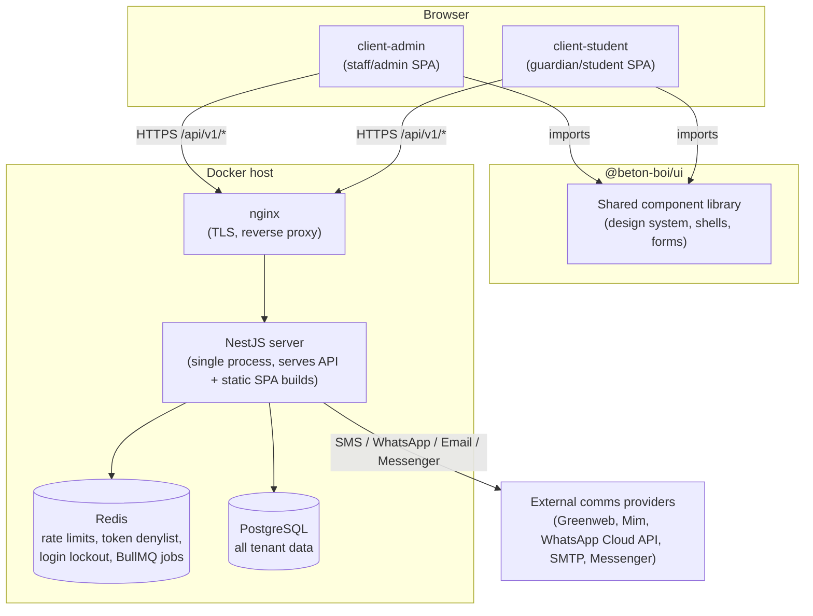

# Overview

## What this is

beton-boi is a **multi-tenant school management platform**. It started as a
single-school "print fee invoices and remind guardians" tool and grew, during
build, into a system that hosts **many independent schools** on one
deployment. Each school (called a **tenant**) has its own students, classes,
fees, staff, and settings — completely isolated from every other school.

Core workflows today:

- Bulk-create students and guardians from an Excel sheet.
- Define fee structures per class/section/academic-year, generate monthly
  fee obligations from them, and record payments (cash, cheque, etc.)
  against those obligations, split across multiple periods if needed.
- Print/issue invoices for any payment.
- Flag guardians with overdue fees and send reminders via SMS, WhatsApp,
  Messenger, or email — one at a time or in bulk.
- Full audit trail of every meaningful action, for compliance and dispute
  resolution.

## System diagram



One NestJS process serves the JSON API **and** the built static files for
every client SPA (see `server/src/main.ts`) — there's no separate frontend
host. `shared/` holds TypeScript types/DTOs/enums imported by both the
server and every client so the wire contract can't drift.

## Tech stack

| Layer                     | Choice                                                                                                                                             |
| ------------------------- | -------------------------------------------------------------------------------------------------------------------------------------------------- |
| Backend                   | NestJS, TypeORM, PostgreSQL                                                                                                                        |
| Frontend                  | React 19, Vite, Tailwind CSS v4, TanStack Query                                                                                                    |
| Shared component library  | `ui/` (`@beton-boi/ui`) — Radix primitives wrapped in a design system, published only through curated subpaths                                     |
| Auth                      | JWT access tokens + rotating refresh tokens (httpOnly cookie)                                                                                      |
| Background jobs / caching | Redis + BullMQ                                                                                                                                     |
| i18n                      | i18next, namespace-lazy-loaded                                                                                                                     |
| Testing                   | Vitest everywhere (unit/integration/e2e on the server, unit/component on the frontend), Playwright for e2e UI, Storybook for component development |
| Deployment                | Docker Compose (app + Postgres + Redis + nginx + Certbot)                                                                                          |
| Monorepo                  | Yarn workspaces (`server`, `shared`, `ui`, `client-*`)                                                                                             |

## How this repo is organized

```
beton-boi/
├── server/           # NestJS backend (see 03-backend-modules.md)
├── shared/           # Types/DTOs/enums shared by server + every client
├── ui/                # Shared component library (see 06-frontend-architecture.md)
├── client-admin/     # Staff/admin SPA
├── client-student/   # Guardian/student self-service SPA
├── docs/architecture/ # You are here
└── scripts/, nginx/, docker-compose.yml  # Build & deploy (see 07-deployment.md)
```

## Where this deviated from the original plan

The original plan (`.hermes/plans/`, now removed — this doc supersedes it)
described a **single school**, no explicit tenancy, Twilio for SMS/WhatsApp,
and treated Docker deployment, discounts, and a `client-teacher` app as
future work. What actually got built differs in a few deliberate ways:

- **Multi-tenancy was added.** The system now hosts many schools
  (`School` entity = tenant) on one deployment, with users able to hold
  different roles at different schools via a `user_tenants` join table
  instead of a single `role` column on `User`. This is the single biggest
  architectural shift — see [02-auth-and-multitenancy.md](02-auth-and-multitenancy.md).
- **SMS/WhatsApp providers are not Twilio.** The system uses **Greenweb**
  and **Mim SMS** (Bangladeshi SMS gateways) and the **WhatsApp Cloud API**
  directly, plus a Messenger provider, all behind one adapter interface —
  see [05-communications.md](05-communications.md).
- **Discounts are implemented**, not deferred — `StudentFee.discount_amount`
  exists and is included in due/balance calculations.
- **Docker deployment shipped**, including automated Let's Encrypt
  certificate bootstrapping (`cert-bootstrap`) and a self-reloading nginx —
  see [07-deployment.md](07-deployment.md).
- **`client-teacher` was not built.** Only `client-admin` and
  `client-student` exist today; teachers currently use `client-admin`.
- **A `Reports` module was planned but not yet built.** There is no
  reporting/analytics endpoint yet — dues/payment data is queried directly
  through the fees API today.
- **An online/self-service payment flow was planned but not yet built.**
  Payments today are recorded manually by staff (`received_by` on
  `Payment`); there's no guardian-initiated online payment endpoint.

Where the current code and the old plan disagree, **the code is the source
of truth** — that's what these docs describe.
