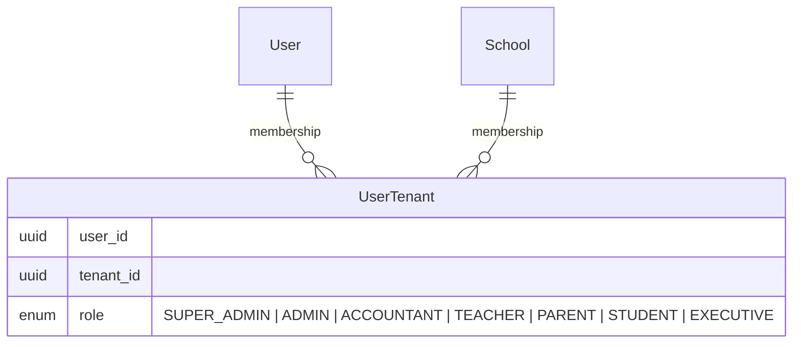
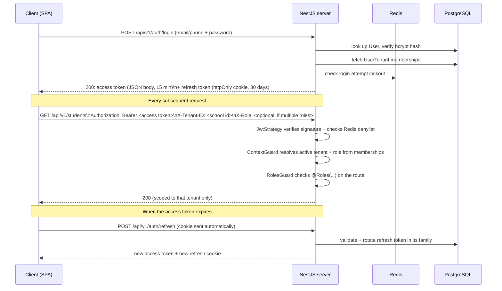
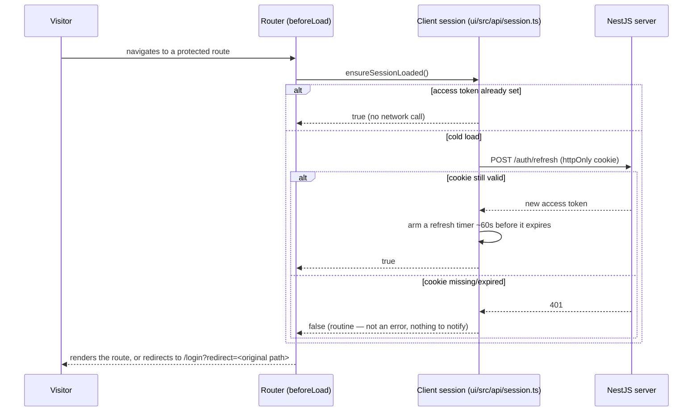
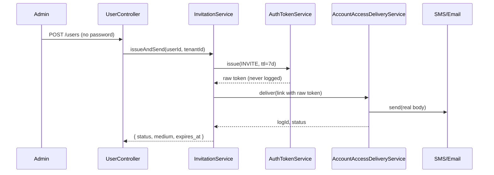

# Auth & Multi-Tenancy

> This doc explains the _shape_ of the system with diagrams. For the deep
> security rationale (CSRF posture, brute-force protection, exact TTLs,
> revocation details) see [08-security.md](08-security.md) — that document
> is kept exhaustive on purpose and this one won't repeat it.

## The core idea: tenants, not a single school

Biddaloy hosts **many independent schools** on one deployment. A `School`
row _is_ a tenant. Everything school-specific — students, classes, fees,
staff — is scoped to exactly one tenant. A single `User` account, however,
is **not** tenant-scoped: the same person can belong to multiple schools,
with a different role at each.



Example: Fatima is a `TEACHER` at Greenview School and a `PARENT` at
Riverside School (her own child studies there) — one `User` row, two
`UserTenant` rows.

## Login → request flow



Key pieces, each in its own file under `server/src/modules/auth/`:

| Concern                                              | File                                                                        |
| ---------------------------------------------------- | --------------------------------------------------------------------------- |
| Verifying the JWT on every request                   | `strategies/jwt.strategy.ts`                                                |
| Resolving active tenant + role, enforcing `@Roles()` | `guards/context.guard.ts`                                                   |
| Issuing/rotating/revoking refresh tokens             | `refresh-token.service.ts`                                                  |
| Detecting stolen/replayed refresh tokens             | `refresh-token.service.ts` (reuse detection revokes the whole token family) |
| Instant access-token revocation (logout-all)         | `access-token-denylist.service.ts` (Redis, keyed by `jti`)                  |
| Brute-force protection on login                      | `login-attempt.service.ts`                                                  |
| CSRF defense on the two cookie-authenticated routes  | `guards/same-origin.guard.ts`                                               |

## Client session lifecycle

`client-admin` keeps the access token in memory only (never
`localStorage`/`sessionStorage` — see [06-frontend-architecture.md](06-frontend-architecture.md)),
so a hard page reload always starts with nothing to send, even when the
httpOnly refresh cookie above is still valid. [8.9.3] is what makes that
transparent: every route is gated behind a check that silently tries the
refresh cookie once per page load before deciding whether the visitor is
actually logged out.



A refresh failing _after_ a session was already established (the
proactive timer above firing too late, or a request hitting a genuinely
dead token) is a different, louder event — that path already existed
before [8.9.3] (`client.ts`'s reactive 401 handling) and calls
`notifySessionExpired()`, which `client-admin/src/main.tsx` turns into the
same `/login` redirect. See [`ui/README.md`'s "Auth" section](../../ui/README.md)
for the full function-level write-up (`ensureSessionLoaded`,
`scheduleTokenRefresh`, `logout`/`logoutAll`).

## The tenant header contract

Every tenant-scoped controller is decorated with `@ApiTenantAuth()`
(`server/src/common/decorators/api-tenant-auth.decorator.ts`), which
documents and enforces:

- **`Authorization: Bearer <token>`** — required, always.
- **`X-Tenant-ID: <school id>`** — required. `ContextGuard` validates this
  against the caller's own `UserTenant` memberships; a tenant ID the caller
  doesn't belong to is rejected, not silently ignored.
- **`X-Role: <role>`** — optional. Only needed when a caller has more than
  one role _within that same tenant_; otherwise the first matching
  membership is used.

This means authorization is always **"is this user a member of this
specific tenant, and if so with what role"** — never a global role check.

## Role-Based Access Control (RBAC)

Roles are fixed and defined once in `shared/src/enums/index.ts`
(`UserRole`), shared by server and every client so they can never drift:

```
SUPER_ADMIN → ADMIN → ACCOUNTANT ≈ EXECUTIVE → TEACHER → PARENT / STUDENT
```

(highest to lowest priority — see `ROLE_PRIORITY` in `context.guard.ts`,
used as a tiebreak when a caller has multiple roles in one tenant and omits
`X-Role`). Routes declare required roles with the `@Roles(...)` decorator;
`RolesGuard` enforces it after `ContextGuard` has resolved which role the
caller is acting as.

This was a deliberate choice over attribute-based access control (ABAC):
school roles map cleanly onto real staff titles, and finer-grained rules
(e.g. "a class teacher can only see their own section") can be layered on
top of roles later if needed, without redesigning the model now.

## Invitations & account access

When an admin creates a user without a password (`POST /users`, no
`password` field), the account is created with `password_hash = null` and
cannot log in on its own — it needs an activation link. "Invited" is not a
stored status: it's derived from `password_hash` plus the newest
`auth_tokens` row for that user, so no `UserStatus` enum churn was needed.



Key points:

- **One shared `auth_tokens` table** (`AuthToken` entity) backs invitations
  today and password resets / email verification in later sub-issues
  (12.3, 12.7) — same hashed-token pattern as `refresh_tokens`: only a
  SHA-256 hash of the random secret is ever stored.

  | id      | user_id | purpose  | token_hash (64 hex) | expires_at | consumed_at                                  |
  | ------- | ------- | -------- | ------------------- | ---------- | -------------------------------------------- |
  | `a1b2…` | `u-42`  | `INVITE` | `9f86d0…`           | in 7 days  | `null`                                       |
  | `c3d4…` | `u-42`  | `INVITE` | `e3b0c4…`           | (expired)  | `2026-08-01` (consumed, from a prior resend) |

- **Delivery never leaks the secret into the communication log.**
  `AccountAccessDeliveryService` writes a `CommunicationLog` row (so the
  send is visible in the same audit trail as any other message) but with
  `message_body` redacted (`••••••` in place of the link/code) — the real
  body is a local variable, sent straight to the provider, and never
  persisted or logged. `trigger = ACCOUNT_ACCESS` marks these rows apart
  from ordinary reminders.
- **One shared `OtpService`** (Redis, 6-digit codes, 5-minute TTL, 5
  attempts then a 15-minute lock) is reused as-is by password recovery
  (12.3) and OTP login (12.5) — nothing in this ticket calls it yet, but
  it lives in the same `account-access` module.
- **Resend revokes prior links.** `POST /users/:id/invitation/resend`
  calls the same `issueAndSend` path, which revokes every still-live
  invite for that user before issuing a new one — a stale link in an old
  email can never be used once a resend happens.
- A delivery failure (bad phone number, provider outage) never rolls back
  the user that was just created — user creation and invitation dispatch
  are independent outcomes.

## Why this deviated from the original plan

The original plan assumed one school and a single `role` column directly on
`User`. Multi-tenancy was added during build because the same account needs
to represent different people-in-context at different schools — a column on
`User` can't express "TEACHER here, PARENT there" for one person. The
`UserTenant` join table is what makes that possible, and it's the reason
almost every entity in [01-domain-model.md](01-domain-model.md) carries an
explicit tenant reference.
