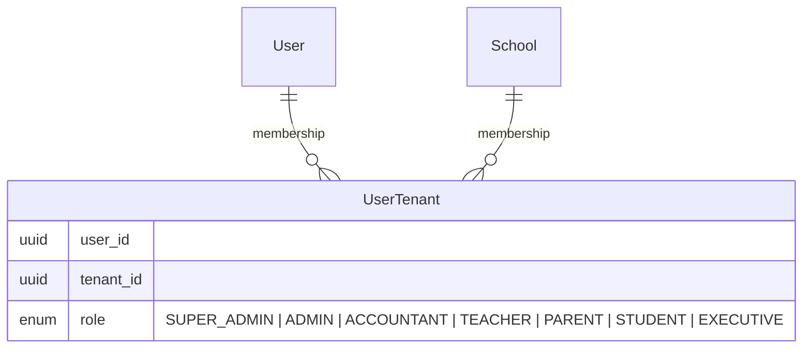
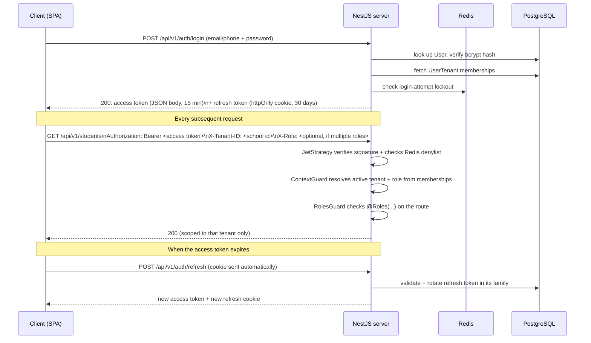

# Auth & Multi-Tenancy

> This doc explains the _shape_ of the system with diagrams. For the deep
> security rationale (CSRF posture, brute-force protection, exact TTLs,
> revocation details) see [08-security.md](08-security.md) — that document
> is kept exhaustive on purpose and this one won't repeat it.

## The core idea: tenants, not a single school

Biddaloy hosts **many independent schools** on one deployment. A `School`
row _is_ a tenant. Everything school-specific — students, classes, fees,
staff — is scoped to exactly one tenant. A single `User` account, however,
is **not** tenant-scoped: the same person can belong to multiple schools,
with a different role at each.



Example: Fatima is a `TEACHER` at Greenview School and a `PARENT` at
Riverside School (her own child studies there) — one `User` row, two
`UserTenant` rows.

## Login → request flow



Key pieces, each in its own file under `server/src/modules/auth/`:

| Concern                                              | File                                                                        |
| ---------------------------------------------------- | --------------------------------------------------------------------------- |
| Verifying the JWT on every request                   | `strategies/jwt.strategy.ts`                                                |
| Resolving active tenant + role, enforcing `@Roles()` | `guards/context.guard.ts`                                                   |
| Issuing/rotating/revoking refresh tokens             | `refresh-token.service.ts`                                                  |
| Detecting stolen/replayed refresh tokens             | `refresh-token.service.ts` (reuse detection revokes the whole token family) |
| Instant access-token revocation (logout-all)         | `access-token-denylist.service.ts` (Redis, keyed by `jti`)                  |
| Brute-force protection on login                      | `login-attempt.service.ts`                                                  |
| CSRF defense on the two cookie-authenticated routes  | `guards/same-origin.guard.ts`                                               |

## The tenant header contract

Every tenant-scoped controller is decorated with `@ApiTenantAuth()`
(`server/src/common/decorators/api-tenant-auth.decorator.ts`), which
documents and enforces:

- **`Authorization: Bearer <token>`** — required, always.
- **`X-Tenant-ID: <school id>`** — required. `ContextGuard` validates this
  against the caller's own `UserTenant` memberships; a tenant ID the caller
  doesn't belong to is rejected, not silently ignored.
- **`X-Role: <role>`** — optional. Only needed when a caller has more than
  one role _within that same tenant_; otherwise the first matching
  membership is used.

This means authorization is always **"is this user a member of this
specific tenant, and if so with what role"** — never a global role check.

## Role-Based Access Control (RBAC)

Roles are fixed and defined once in `shared/src/enums/index.ts`
(`UserRole`), shared by server and every client so they can never drift:

```
SUPER_ADMIN → ADMIN → ACCOUNTANT ≈ EXECUTIVE → TEACHER → PARENT / STUDENT
```

(highest to lowest priority — see `ROLE_PRIORITY` in `context.guard.ts`,
used as a tiebreak when a caller has multiple roles in one tenant and omits
`X-Role`). Routes declare required roles with the `@Roles(...)` decorator;
`RolesGuard` enforces it after `ContextGuard` has resolved which role the
caller is acting as.

This was a deliberate choice over attribute-based access control (ABAC):
school roles map cleanly onto real staff titles, and finer-grained rules
(e.g. "a class teacher can only see their own section") can be layered on
top of roles later if needed, without redesigning the model now.

## Why this deviated from the original plan

The original plan assumed one school and a single `role` column directly on
`User`. Multi-tenancy was added during build because the same account needs
to represent different people-in-context at different schools — a column on
`User` can't express "TEACHER here, PARENT there" for one person. The
`UserTenant` join table is what makes that possible, and it's the reason
almost every entity in [01-domain-model.md](01-domain-model.md) carries an
explicit tenant reference.
