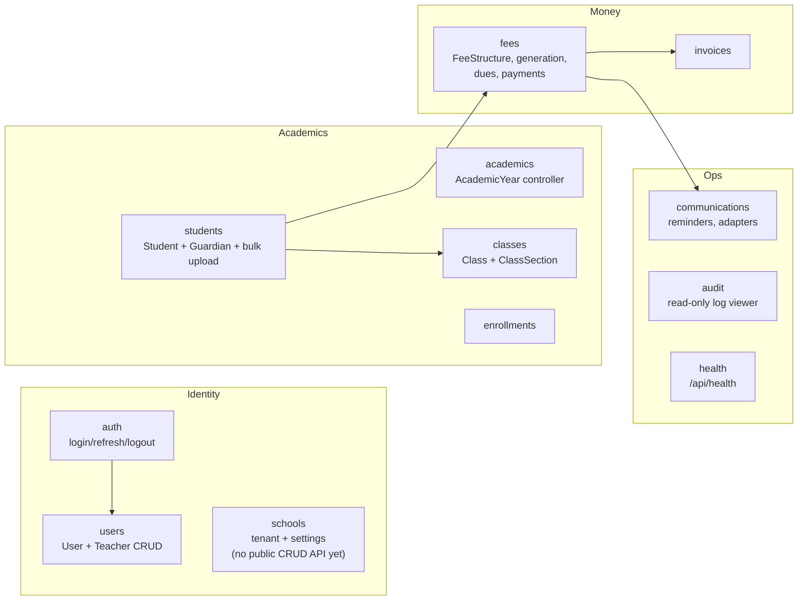

# Backend Modules

All server code lives in `server/src/modules/*`, one NestJS module per
folder. All routes are served under `/api/v1/...` (see the root README's
"API Versioning" section for the versioning/deprecation policy).

## Module reference

| Module           | Owns                                                                                   | Key routes (all under `/api/v1/`)                                                                                                                               |
| ---------------- | -------------------------------------------------------------------------------------- | --------------------------------------------------------------------------------------------------------------------------------------------------------------- |
| `auth`           | Login, refresh-token rotation, logout, access-token denylist, login lockout            | `POST auth/login`, `POST auth/refresh`, `POST auth/logout`, `POST auth/logout-all`                                                                              |
| `users`          | `User` + `Teacher` CRUD                                                                | `POST/GET/PATCH/DELETE users`, `POST/GET/PATCH teachers`                                                                                                        |
| `schools`        | `School` (tenant) entity + per-tenant settings (comms provider config, currency, etc.) | Internal service only today — no public controller yet                                                                                                          |
| `academics`      | `AcademicYear`                                                                         | `POST/GET/PATCH/DELETE academic-years`, `POST academic-years/:id/set-current`                                                                                   |
| `classes`        | `Class` + `ClassSection`                                                               | `POST/GET/PATCH/DELETE classes`, nested `.../sections` routes                                                                                                   |
| `students`       | `Student`, `Guardian`, Excel bulk upload                                               | `POST/GET/PATCH/DELETE students`, `POST students/bulk-upload`, `POST/GET/PATCH/DELETE guardians`                                                                |
| `enrollments`    | `Enrollment` history                                                                   | `POST enrollments`, `GET enrollments/student/:studentId`, `PATCH enrollments/:id`                                                                               |
| `fees`           | `FeeStructure`, fee generation engine, dues/flagging, `Payment` + allocations          | `POST/GET/PATCH/DELETE fee-structures`, `POST fees/generate`, `GET fees/dues`, `GET fees/dues/flagged`, `POST payments`, `POST payments/record-with-allocation` |
| `invoices`       | `Invoice`                                                                              | `POST/GET invoices`, `GET invoices/:id/print`                                                                                                                   |
| `communications` | `CommunicationLog`, `ReminderBatch`, provider adapters                                 | `POST communications/send`, `POST communications/reminder/single/:studentId`, `POST communications/reminder/bulk`                                               |
| `audit`          | Read access to `AuditLog`                                                              | `GET audit`                                                                                                                                                     |
| `health`         | Liveness check, version-neutral                                                        | `GET /api/health`                                                                                                                                               |

## Cross-cutting `common/`

`server/src/common/` holds code every module leans on, not owned by any one
feature:

- **`decorators/api-tenant-auth.decorator.ts`** — the `@ApiTenantAuth()`
  bundle every tenant-scoped controller applies (see
  [02-auth-and-multitenancy.md](02-auth-and-multitenancy.md)).
- **`decorators/sanitize-text.decorator.ts`** — strips/allowlists HTML from
  free-text input fields (guardian notes, reminder messages, etc.).
- **`rate-limit/`** — per-route throttling tiers, backed by a fail-open
  Redis storage (rate limiting fails _open_, not closed — a Redis outage
  degrades protection but never takes the API down).
- **`filters/http-exception.filter.ts`** — the single place every uncaught
  exception becomes a consistent JSON error body.
- **`request-context.util.ts`** — per-request context (current tenant,
  user, role) threaded through services without prop-drilling it manually.

## Adding a new module

Follow the shape of an existing one (`enrollments` is a good small
example): `*.module.ts`, `*.controller.ts` with `@ApiTenantAuth()` +
`@Roles(...)`, `*.service.ts`, `entities/*.entity.ts` with a relations
docstring (see [01-domain-model.md](01-domain-model.md) for the convention),
`dto/*.dto.ts` for request/response shapes. Every new controller/service
needs corresponding tests — see `server/CLAUDE.md` for the testing
standards enforced in this package.
