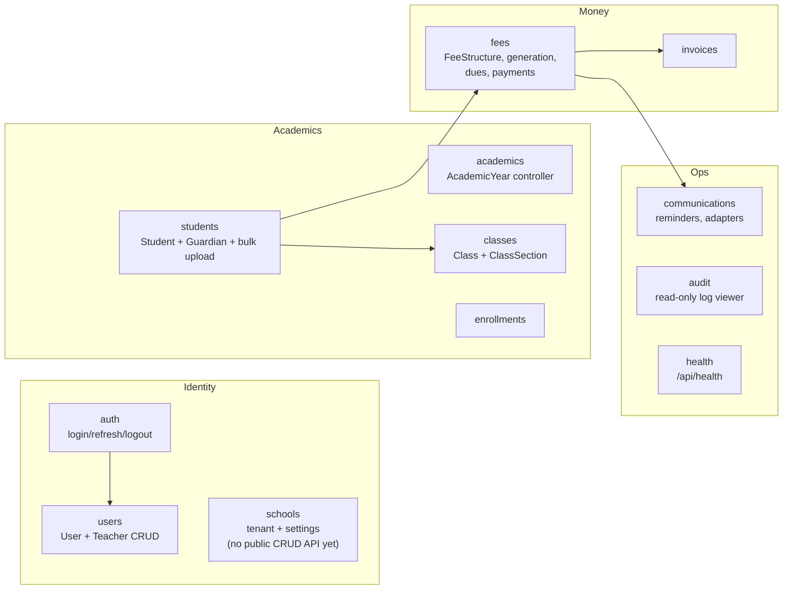

# Backend Modules

All server code lives in `server/src/modules/*`, one NestJS module per
folder. All routes are served under `/api/v1/...` (see the root README's
"API Versioning" section for the versioning/deprecation policy).

## Module reference

| Module           | Owns                                                                                   | Key routes (all under `/api/v1/`)                                                                                                                               |
| ---------------- | -------------------------------------------------------------------------------------- | --------------------------------------------------------------------------------------------------------------------------------------------------------------- |
| `auth`           | Login, refresh-token rotation, logout, access-token denylist, login lockout            | `POST auth/login`, `POST auth/refresh`, `POST auth/logout`, `POST auth/logout-all`                                                                              |
| `users`          | `User` + `Teacher` CRUD                                                                | `POST/GET/PATCH/DELETE users`, `POST/GET/PATCH teachers`                                                                                                        |
| `schools`        | `School` (tenant) entity + per-tenant settings (comms provider config, currency, etc.) | Internal service only today — no public controller yet                                                                                                          |
| `academics`      | `AcademicYear`                                                                         | `POST/GET/PATCH/DELETE academic-years`, `POST academic-years/:id/set-current`                                                                                   |
| `classes`        | `Class` + `ClassSection`                                                               | `POST/GET/PATCH/DELETE classes`, nested `.../sections` routes                                                                                                   |
| `students`       | `Student`, `Guardian`, Excel bulk upload                                               | `POST/GET/PATCH/DELETE students`, `POST students/bulk-upload`, `POST/GET/PATCH/DELETE guardians`                                                                |
| `enrollments`    | `Enrollment` history                                                                   | `POST enrollments`, `GET enrollments/student/:studentId`, `PATCH enrollments/:id`                                                                               |
| `fees`           | `FeeStructure`, fee generation engine, dues/flagging, `Payment` + allocations          | `POST/GET/PATCH/DELETE fee-structures`, `POST fees/generate`, `GET fees/dues`, `GET fees/dues/flagged`, `POST payments`, `POST payments/record-with-allocation` |
| `invoices`       | `Invoice`                                                                              | `POST/GET invoices`, `GET invoices/:id/print`                                                                                                                   |
| `communications` | `CommunicationLog`, `ReminderBatch`, provider adapters                                 | `POST communications/send`, `POST communications/reminder/single/:studentId`, `POST communications/reminder/bulk`                                               |
| `audit`          | Read access to `AuditLog`                                                              | `GET audit`                                                                                                                                                     |
| `health`         | Liveness check, version-neutral                                                        | `GET /api/health`                                                                                                                                               |

## Cross-cutting `common/`

`server/src/common/` holds code every module leans on, not owned by any one
feature:

- **`decorators/api-tenant-auth.decorator.ts`** — the `@ApiTenantAuth()`
  bundle every tenant-scoped controller applies (see
  [02-auth-and-multitenancy.md](02-auth-and-multitenancy.md)).
- **`decorators/sanitize-text.decorator.ts`** — strips/allowlists HTML from
  free-text input fields (guardian notes, reminder messages, etc.).
- **`rate-limit/`** — per-route throttling tiers, backed by a fail-open
  Redis storage (rate limiting fails _open_, not closed — a Redis outage
  degrades protection but never takes the API down).
- **`filters/http-exception.filter.ts`** — the single place every uncaught
  exception becomes a consistent JSON error body.
- **`request-context.util.ts`** — per-request context (current tenant,
  user, role) threaded through services without prop-drilling it manually.

## API versioning

All routes are served under `/api/v1/` (`main.ts`'s `enableVersioning`, URI
style — visible in logs, curl-able, cacheable, and trivially routable at
nginx via a broad `location /api/` prefix match, no rewrite needed).
`/api/health` is version-neutral (`@Version(VERSION_NEUTRAL)` on
`AppController.health`) and stays reachable at that exact path regardless of
version bumps, so orchestrator health checks never break on one.

`server/src/api-versioning.ts` is the single place that knows the current
version string, read by both `main.ts` and `server/test/helpers/e2e-app.helper.ts`.
That covers today's single-version setup (every route is `1` by default);
it is **not** by itself enough to run two versions side by side — see below.

### Deprecation policy

Introducing `/api/v2/...` while `/api/v1/...` stays live is not a one-line
change: `enableVersioning`'s `defaultVersion` would need to become `['1',
'2']`, and every route whose v2 behavior differs from v1 needs an explicit
`@Version('1')` (or `'2'`) so the two don't collide on the same handler.
There's no code for this yet — it's written up here so the first real bump
follows a plan instead of improvising one under pressure:

- `/api/v2/...` is added alongside `/api/v1/...` — routes are never removed
  in the same change that adds their replacement.
- `/api/v1/...` stays live for **at least 90 days** after `/api/v2/...`
  ships, giving the first-party SPAs (the only current consumers) a full
  sprint-scale window to migrate.
- Once a removal date is set, deprecated (`/api/v1/...`) responses carry a
  `Deprecation` header per [RFC 9745](https://www.rfc-editor.org/rfc/rfc9745.html)
  (a structured Unix timestamp, e.g. `Deprecation: @1735689600`) and a
  `Sunset` header per [RFC 8594](https://www.rfc-editor.org/rfc/rfc8594.html)
  (an HTTP-date, e.g. `Sunset: Thu, 01 Jan 2026 00:00:00 GMT`), so any
  consumer — including a future third-party one — can detect the
  deprecation programmatically without reading docs.
- The bump and its sunset date are announced in this section and in the
  epic/issue tracking the migration — there's no separate public changelog
  yet.

## API documentation (Swagger)

Interactive docs (`server/src/swagger.ts`, `server/src/docs-auth.ts`) are
reachable at **`/api/docs`** — version-neutral, like `/api/health`, so the
docs URL doesn't move on a version bump. The bearer scheme and the
`X-Tenant-ID`/`X-Role` header contract (see `ApiTenantAuth` in
`server/src/common/decorators/`) are documented on every guarded
controller, so "Try it out" works once you paste in a token.

**Gating** (`shouldMountDocs` in `swagger.ts`):

- Outside production, docs always mount, unauthenticated — nothing sensitive
  about a dev environment's own API shape.
- In production, docs are off by default: the route doesn't exist (a real
  404, not a rejection) unless `ENABLE_API_DOCS=true` is set.
- With `ENABLE_API_DOCS=true` in production, the route is additionally
  gated by Basic Auth (`API_DOCS_USER`/`API_DOCS_PASSWORD`, both required —
  the app refuses to boot with `ENABLE_API_DOCS=true` and no credentials
  set, rather than silently serving the docs unauthenticated).

**Generating a client**: `yarn docs:generate` (from `server/`) writes the
current OpenAPI document to `server/openapi.json`, for the SPAs to generate
a typed client from (`yarn api:types` at the repo root runs both steps —
see the root README's "Regenerating API types"). This runs `nest build`
first and executes the **compiled** script (`node dist/scripts/generate-openapi.js`),
not `ts-node` — `@nestjs/swagger`'s CLI plugin (`nest-cli.json`'s
`compilerOptions.plugins`), which auto-infers `@ApiProperty()` for DTO/
entity fields from their TypeScript types, only runs through Nest's own
build compiler. Running the script via `ts-node` instead produces a
document with every DTO schema empty — Nest's compiler is what makes the
annotations effectively free instead of a decorator on every one of ~50
DTO classes.

**No sensitive field ever appears in a schema**: `User.password_hash` is
marked `@ApiHideProperty()` directly on the entity, so it's excluded from
every schema that references `User` — including ones no current endpoint
actually returns with that relation populated (Guardian.user, Student.user,
Payment.received_by) — not just the ones a controller happens to sanitize
today. Verified by generating the real document (`yarn docs:generate`) and
confirming zero `password_hash` occurrences; this can't be verified by an
ordinary Vitest test, since the CLI plugin (and therefore the schema
shape) doesn't run under Vitest's SWC-based transform at all.

## Adding a new module

Follow the shape of an existing one (`enrollments` is a good small
example): `*.module.ts`, `*.controller.ts` with `@ApiTenantAuth()` +
`@Roles(...)`, `*.service.ts`, `entities/*.entity.ts` with a relations
docstring (see [01-domain-model.md](01-domain-model.md) for the convention),
`dto/*.dto.ts` for request/response shapes. Every new controller/service
needs corresponding tests — see `server/CLAUDE.md` for the testing
standards enforced in this package.
