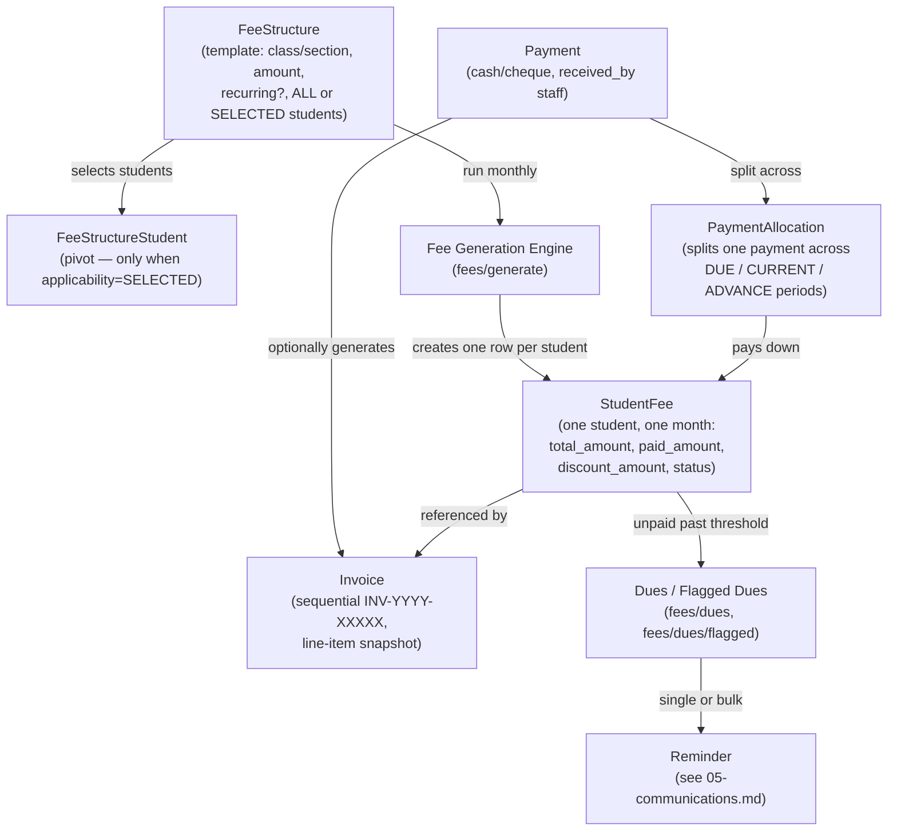

# Fees, Payments & Invoices

This is the core business flow the whole system exists for. Four entities
work together, each with a distinct job:

| Entity         | Question it answers                                                               |
| -------------- | --------------------------------------------------------------------------------- |
| `FeeStructure` | "What _should_ students in Class 10-A pay this month, and to whom does it apply?" |
| `StudentFee`   | "What does _this specific student_ owe for _this specific month_?"                |
| `Payment`      | "What did the student actually pay, and when?"                                    |
| `Invoice`      | "The printable/shareable receipt for that payment."                               |

## Lifecycle diagram

## Step by step

### 1. Define a `FeeStructure`

An admin/accountant creates a fee template scoped to a `Class` (optionally
narrowed to one `ClassSection`), an `AcademicYear`, and a month.
`applicability` is either `ALL` (every student in that class/section) or
`SELECTED` — in which case `FeeStructureStudent` rows record exactly which
students it applies to. `is_recurring=true` means it auto-generates every
month from its start month onward; a one-time structure only generates for
its exact month.

### 2. Generate `StudentFee` obligations

`FeeGenerationService` (`fees/generate`) turns matching `FeeStructure`
templates into one `StudentFee` row per (student, month, academic year).
Running generation twice for the same period doesn't duplicate rows — it's
idempotent per student/month/structure.

### 3. Record a `Payment`

Staff record what a student/guardian actually paid — today this is always a
manual entry (cash/cheque) with a `received_by` reference to the staff
`User`; there's no guardian-initiated online payment yet (flagged as future
work in [00-overview.md](00-overview.md)). A single payment can cover
several months at once (last month's due + this month + an advance), which
is where `PaymentAllocation` comes in: each allocation row says how much of
the payment went to which `StudentFee`, tagged `DUE`, `CURRENT`, or
`ADVANCE`. `StudentFee.paid_amount` and `.status` (`PENDING` →
`PARTIALLY_PAID` → `PAID`) update as allocations land against it.

### 4. Issue an `Invoice`

Generated automatically when a payment is recorded (or manually), with a
sequential number (`INV-YYYY-XXXXX`). It snapshots the line items at
generation time, so it stays historically accurate even if the underlying
fee structure is edited later. Supports printing (`invoices/:id/print`) and
digital delivery via the communications module.

### 5. Flag overdue fees and remind guardians

`FeeDuesService` (`fees/dues`, `fees/dues/flagged`) aggregates every
`StudentFee` still in `PENDING`/`PARTIALLY_PAID` status past a threshold
date into per-student due summaries. Staff can then send a reminder — single
or bulk — from that flagged list; see
[05-communications.md](05-communications.md) for how the actual message
gets sent.

## Notable design decisions

- **Discounts are first-class**, not bolted on: `StudentFee.discount_amount`
  factors directly into the balance calculation used everywhere dues are
  computed. (The original plan flagged discounts/scholarships as a future
  gap — they shipped as part of the core model instead.)
- **Advance payments are supported** — a guardian can pre-pay a future
  month, recorded as an `ADVANCE`-type allocation against a `StudentFee`
  that doesn't exist yet at generation time (allocations reference the
  period, generation reconciles against them).
- **Everything is tenant-scoped**: `FeeStructure` and `Payment` both carry
  their own `tenant_id` directly (not just derived through `Student`) — see
  the tenancy convention note in
  [01-domain-model.md](01-domain-model.md#conventions-worth-knowing-before-you-add-a-table).
