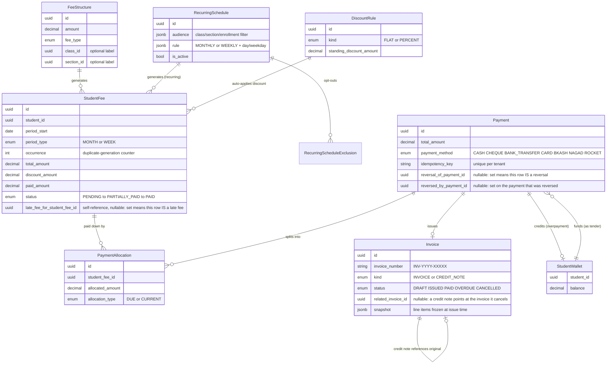
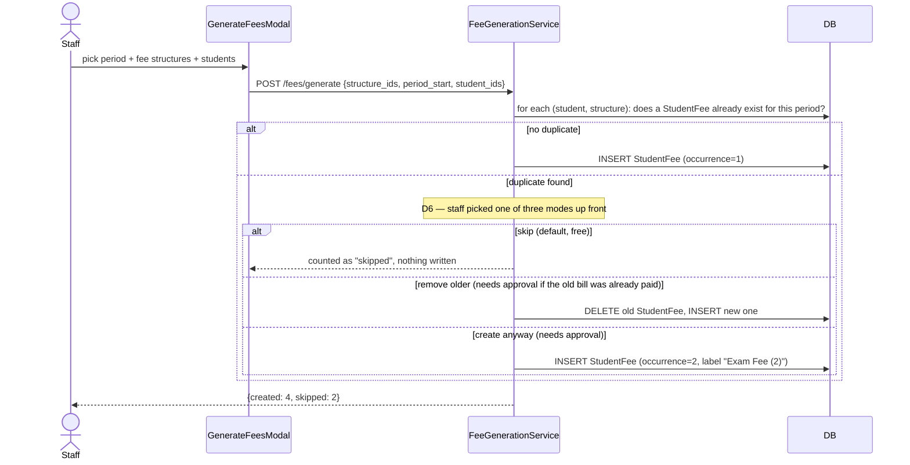
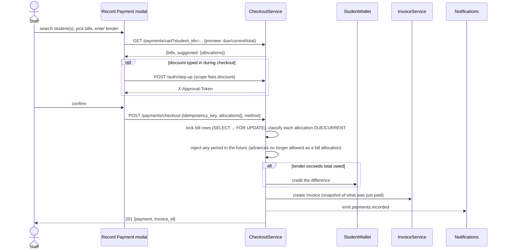
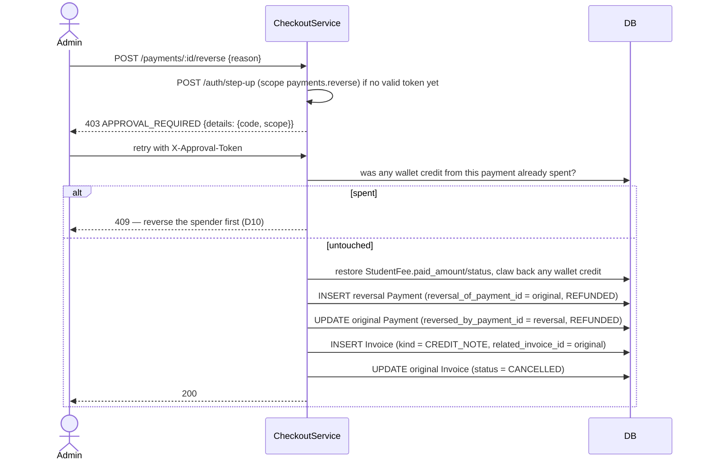
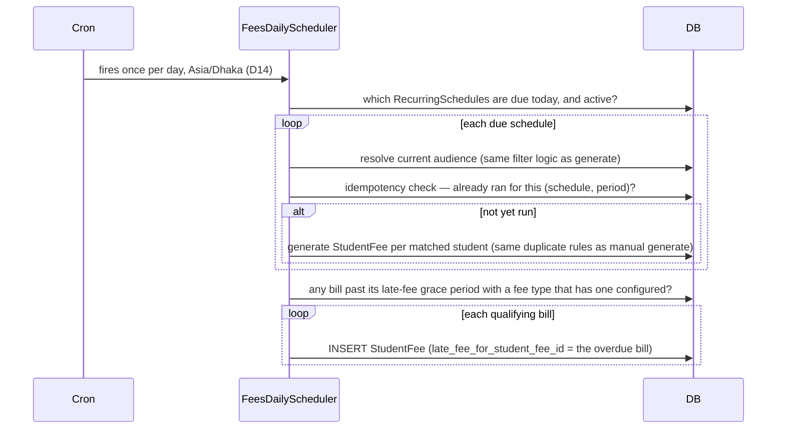

# Fees, Payments & Invoices

This is the core business flow the whole system exists for: charge students
for fees, collect payments, and prove what was charged and paid. It was
rebuilt end-to-end in Epic 16 — the section at the bottom explains what
changed and why, if you're looking for something this doc used to describe.

## The entities



A `StudentFee` row is one student owing one fee for one period — the
"bill." Two bills for the same student in the same month are two separate
rows (e.g. tuition + exam fee), never merged. `FeeStructure` is a price tag
consumed at generation time; editing it later doesn't change bills already
generated, only future ones.

**"Is this a late fee / a reversal?" is a relationship, not a flag.** There
is no `is_late_fee` or `is_reversal` column. The API fields of those names
are derived in the DTO mappers from whether the self-reference is set:

```ts
// server/src/modules/fees/dto/family.dto.ts
is_late_fee: fee.late_fee_for_student_fee_id !== null,
is_reversal: payment.reversal_of_payment_id !== null,
```

That way the row always says _which_ bill it is a late fee for, or _which_
payment it reverses — a boolean alone could never be reconciled.

## Generate: turning a price tag into bills



Example response for a run that generated 2 real bills and skipped 2
pre-existing duplicates:

```json
{
  "generation_id": "8e2f...",
  "created": 2,
  "skipped": 2,
  "student_fees": [
    { "id": "a1b2...", "student_id": "c3d4...", "fee_name": "Tuition", "total_amount": "1500.00" }
  ]
}
```

`RecurringSchedule` runs the same generation logic on a timer (see
"Daily job" below) instead of a staff click — audience is a filter
(class/section/program/enrollment status), evaluated fresh every run day, so a
student who joins mid-year starts getting billed automatically and one who
leaves stops, without editing the schedule (D4). `RecurringScheduleExclusion`
opts one specific student out of an otherwise-matching schedule. [34.2.2] A
`program_id` audience bills students with an ACTIVE `ProgramEnrollment` in
that program AND an ACTIVE class enrollment in the schedule's academic year —
combinable with class/section (both filters intersect), e.g.
`{ "program_id": "…", "enrollment_status": "ACTIVE" }`. One-off generation
(`POST /fees/generate`, `/fees/generate/preview`) accepts the same
`program_id`, resolved through the identical join and intersected with any
explicit `student_ids`.

`DiscountRule` (FLAT or PERCENT, scoped to all fee types or a chosen list,
optionally dated) auto-applies at generation time and writes to
`StudentFee.standing_discount_amount`. A one-off discount typed in during
checkout writes to `one_off_discount_amount` instead; `discount_amount` is
always their sum. Both discount paths go through the same approval-gated
flow described below (D8).

## Checkout: turning bills into a payment



Multi-child checkout is one `Payment` + one `Invoice`, allocations grouped
per student; each child's dues update independently (D12). Overpayment goes
to `StudentWallet.balance` rather than a `PaymentAllocationType.ADVANCE`
row — the old advance-payment type was removed (D5, see below); wallet
balance can be spent as tender on a later checkout instead. `idempotency_key`
is unique per tenant, so a retried request (e.g. a double-click, or a client
retry after a timeout) returns the original payment rather than double
charging (D20).

## Reversal: undoing a payment



Note the shape: a reversal is a **second, positive `Payment` row** pointing
back at the first, not a negative amount and not a deleted row. The two
rows reference each other (`reversal_of_payment_id` one way,
`reversed_by_payment_id` the other), so the original stays on the books
with a visible audit trail. The credit note works the same way — a second
`Invoice` row, never an edit.

Reversal is only ever full, never partial, and only ADMIN can call it —
`PAYMENT_REVERSE` stays admin-gated by explicit decision, not just an
approval-scope check (confirmed again during wave 8: granting it to
ACCOUNTANT would need a deliberate widening, not a side effect of any
ticket). A payment whose wallet credit has already been spent by a later
checkout can't be reversed until that later payment is reversed first (D10)
— otherwise the wallet balance would go negative with no record of why.

The 403 body shape matters here: `ApprovalRequiredException` nests its
`code`/`scope` under a `details` key (`{"details": {"code": "APPROVAL_REQUIRED", "scope": "..."}}`).
Every real consumer (`ui/src/hooks/approval.tsx`, `ui/src/api/errors.ts`)
reads `error.details.code` — a mismatch here silently breaks every step-up
retry flow in the app while still passing unit tests that mock the body
directly. See [02-auth-and-multitenancy.md](02-auth-and-multitenancy.md)
for the full step-up sequence (request OTP → verify → token → retry).

## Invoices

Generated automatically when a payment is recorded, with a sequential
number (`INV-YYYY-XXXXX`). The `snapshot` field freezes the line items at
issue time, so an invoice stays historically accurate even if the
underlying fee structure is edited later. `kind` is `INVOICE` or
`CREDIT_NOTE`; `ISSUED` is a `status`, not a kind.

Invoices are immutable after issue (D21) — a reversal never edits the
original invoice, it creates a second `Invoice` row with
`kind = CREDIT_NOTE` and `related_invoice_id` pointing at it. "Immutable"
here means the _financial_ fields: once `status` leaves `DRAFT`, only
`status`, `updated_at` and `deleted_at` may change on that row
(`invoice.entity.ts`). That is what lets a reversal flip the original to
`CANCELLED` while its amounts and `snapshot` stay exactly as issued.

Two ways to view an invoice:

- **Print** (`GET /invoices/:id/print`) — server-rendered HTML sized for
  A4 or POS 80mm (`@page { size: 80mm auto }`), reachable by staff and by
  the paying family (PARENT/STUDENT roles).
- **Public share link** (`POST /invoices/:id/share`, admin/accountant
  only) — a 32-byte random token (hash stored, not the token itself), no
  expiry, individually revocable, rate-limited, opens at `/i/<token>` with
  no login required (D15). The content shown there is receipt-only — no
  internal remarks, no staff user IDs.

  > As of wave 8, family callers (PARENT/STUDENT) cannot mint or list
  > their own share link — only print. A family-visible "get me a link to
  > share" affordance would need a new family-scoped share endpoint; not
  > built yet, tracked as follow-up.

## Daily job: schedules and late fees



Late fees are off by default, configured per fee type (`grace_days`, FLAT
or PERCENT of the outstanding balance, applied once, never compounding —
D11). A late fee is its own `StudentFee` row linked back to the bill it's
late on via `late_fee_for_student_fee_id`, not a field mutated on the
original bill. Waiving a late fee is just a one-off discount on that row,
not a special "waive" action.

Notification on a schedule-generated bill defaults **on**; a manually-run
batch defaults **off** — staff have to opt in explicitly for a one-time
run (D13). Channel order is push → WhatsApp → SMS, with SMS only sent if
the school has it enabled and has credit remaining. See
[05-communications.md](05-communications.md).

## Family-facing access

Parents/students see a deliberately narrower view of all of the above —
`server/src/modules/fees/dto/family.dto.ts` is the single module that owns
every family-facing DTO and mapper, with an explicit allow-list per
resource (bill, wallet, payment, invoice, schedule, discount rule). Fields
like `approved_by_user_id`, `reversal_reason`, internal notes, and a
full (non-last-4) payment reference are withheld everywhere a family caller
can read — this was tightened during wave 8 after an audit found four real
routes leaking staff-internal fields to PARENT/STUDENT (discount-rule
`reason` and approver IDs, wallet transaction notes, invoice notes, and an
unmasked payment reference).

## Notable design decisions (D1–D21, from Epic 16 #637)

| #   | Decision                                                                                                                                             |
| --- | ---------------------------------------------------------------------------------------------------------------------------------------------------- |
| D1  | Student-only payee. Guardian/company/`payee_type` generalisation is a future epic.                                                                   |
| D2  | One bill per student × fee structure × period. Unique `(student_id, fee_structure_id, period_start, occurrence)`.                                    |
| D3  | Fee structure is just a price tag — dropped `month`, `is_recurring`, `applicability` (`FeeApplicability` enum), `fee_structure_students`.            |
| D4  | Recurring audience is a filter + exclusions, evaluated fresh on each run day.                                                                        |
| D5  | Advances became the student wallet. `PaymentAllocationType.ADVANCE`, `is_advance_payment`, `original_advance_month/year` removed.                    |
| D6  | Duplicate-generation offers skip / remove-older / create-anyway (see "Generate" above).                                                              |
| D7  | Structure amount edits are audit-logged, effective next generation; bills snapshot the amount at generation time. Soft-delete only.                  |
| D8  | Discount rules are FLAT or PERCENT, admin-verified once on create/edit; one-off checkout discounts are admin-verified every time.                    |
| D9  | Approval is the permission `FEE_APPROVE`, re-verified every time regardless of role. See [02-auth-and-multitenancy.md](02-auth-and-multitenancy.md). |
| D10 | Reversal is full-only; a payment whose wallet credit was already spent can't be reversed until the spender is.                                       |
| D11 | Late fees: off by default, FLAT/PERCENT, `grace_days`, once per bill, no compounding.                                                                |
| D12 | Multi-child checkout is one payment + one invoice, grouped by student.                                                                               |
| D13 | Notify defaults: schedules on, manual batches off.                                                                                                   |
| D14 | Scheduling runs in `Asia/Dhaka` (`SCHOOL_TZ`).                                                                                                       |
| D15 | Public invoice links: 32-byte token, hash stored, revocable, rate-limited.                                                                           |
| D16 | Payment methods: `CASH, CHEQUE, BANK_TRANSFER, CARD, BKASH, NAGAD, ROCKET` — `UPI`/`ONLINE` removed.                                                 |
| D17 | Barcode/QR is keyboard-wedge only; camera scanning is out of scope.                                                                                  |
| D18 | Both old wizards (`generate-fees-wizard.tsx`, `record-payment-wizard.tsx`) deleted, replaced by single modal forms.                                  |
| D19 | No production data existed yet — migrations were free to drop/recreate; seed/`e2e/seed-contract`/`api-types` regenerated at each wave close.         |
| D20 | Checkout is idempotent (`idempotency_key` unique per tenant), locks bill rows during allocation.                                                     |
| D21 | Invoices immutable after issue; changes produce a credit note, never an edit.                                                                        |

## What was removed, and why

- **`FeeApplicability` (`ALL`/`SELECTED`)** — the old fee-structure model
  could target a whole class/section or an explicit student list. D3
  replaced this with the price-tag model: a `FeeStructure` no longer
  targets anyone directly, and `RecurringSchedule`'s audience filter (D4)
  is the only targeting mechanism left. Removed from `shared/src/enums`
  in wave 8, having had zero remaining consumers since wave 1.
- **`PaymentAllocationType.ADVANCE`** — pre-paying a future bill used to
  create a `StudentFee` row with an `ADVANCE`-type allocation. D5 replaced
  this with `StudentWallet`: an overpayment now credits a balance the
  student can spend later, rather than pre-allocating against a specific
  future bill. A future-dated allocation attempt now throws
  `BadRequestException` instead of succeeding.
- **Generate/record-payment wizards** — multi-step wizards were replaced
  with single modal forms (D18); the wizard route names and nav entries
  are gone.
- **`UPI`/`ONLINE` payment methods** — dropped per D16; not a supported
  gateway in this market segment at this time.

## See also

- Multi-tenancy and the tenant-scoping convention every table here
  follows: [01-domain-model.md](01-domain-model.md#conventions-worth-knowing-before-you-add-a-table).
- Approval/step-up flow in full: [02-auth-and-multitenancy.md](02-auth-and-multitenancy.md).
- How a flagged-overdue bill turns into a reminder message:
  [05-communications.md](05-communications.md).
