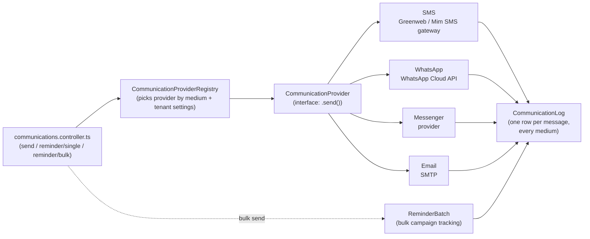
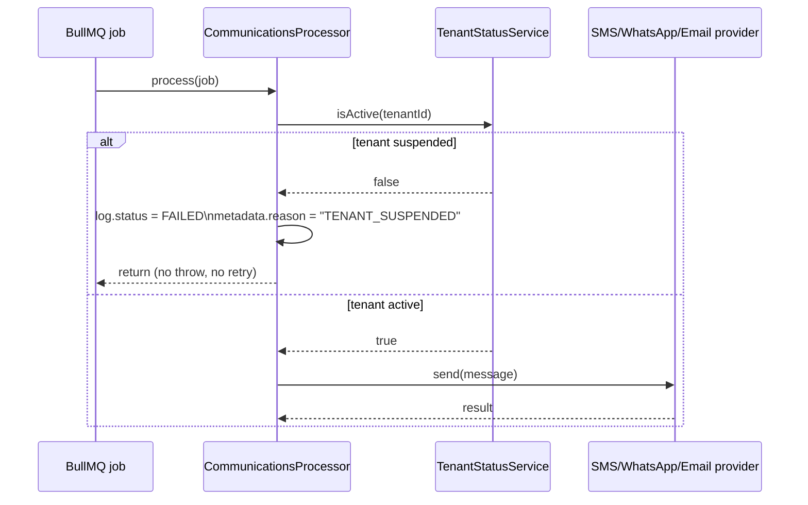

# Communications (Reminders)

Guardians who haven't paid fees get reminded via SMS, WhatsApp, Messenger,
or email — one guardian at a time, or in bulk across every flagged student
from [04-fees-payments-invoices.md](04-fees-payments-invoices.md#5-flag-overdue-fees-and-remind-guardians).

## Provider adapter pattern

Every channel implements the same `CommunicationProvider` interface
(`modules/communications/providers/communication-provider.interface.ts`), so
the controller/service layer never branches on medium — it asks the
registry for "whatever handles WHATSAPP for this tenant" and calls
`.send()`. Per-tenant provider configuration (which SMS gateway, which SMTP
account, credentials) lives in `School.settings` / the tenant-settings
module, so different schools can use different providers without any code
change.

## Where this deviated from the original plan

The original plan specified **Twilio** for both SMS and WhatsApp. What
shipped instead:

- **SMS** — **Greenweb** and **Mim SMS**, two Bangladeshi SMS gateways
  (`providers/sms/greenweb-sms.gateway.ts`, `.../mim-sms.gateway.ts`),
  selected per-tenant via `sms-provider.factory.ts`. Twilio's per-message
  pricing and lack of local carrier relationships make it a poor fit for a
  Bangladesh-market product; local gateways are both cheaper and more
  reliable for BD phone numbers.
- **WhatsApp** — the **WhatsApp Cloud API** directly (Meta's own API), not
  Twilio's WhatsApp product.
- **Messenger** was added as a full channel, beyond the original three.

## Single vs. bulk sends

- **Single**: `POST communications/reminder/single/:studentId` (with a
  `.../preview` variant to show staff the rendered message before sending).
- **Bulk**: `POST communications/reminder/bulk` creates a `ReminderBatch`
  row up front (tracking the filter used and progress), then fans out to
  one `CommunicationLog` row per recipient as each send completes —
  `GET communications/reminder/bulk/:id` polls that batch's status.

## Delivery tracking & debugging

Every send — success or failure, automated or staff-triggered — gets a
`CommunicationLog` row: recipient, channel, message content, delivery
status, and who/what triggered it (`sent_by` is null for
automatically-triggered sends). This is the first place to look when a
guardian says "I never got the reminder."

`CommunicationLog.status` moves through:

- `QUEUED` — waiting for `CommunicationsProcessor` to pick it up.
- `SENT` — the provider accepted it.
- `FAILED` — permanently failed (bad provider, no retries left, or the
  tenant is suspended — see below); `metadata.reason` / `metadata.error`
  says why.

## Suspended tenants: queued work is cancelled, not paused

A school (tenant) can be suspended by a SUPER_ADMIN
(`TenantStatusService`, `server/src/modules/schools/tenant-status.service.ts`).
`CommunicationsProcessor.process()` checks `tenantStatus.isActive(tenantId)`
before doing anything else — no provider call, no SMS credit debit for a
suspended tenant:

**Important:** this cancels the job, it does not pause it. A message
queued while a school is suspended ends up `FAILED` with
`metadata.reason = "TENANT_SUSPENDED"` and stays that way — reactivating
the school does **not** automatically resend it. Example: a bulk fee
reminder queues 200 `CommunicationLog` rows, the school gets suspended
mid-batch, and 80 rows haven't been picked up by a worker yet — those 80
end up `FAILED`. When the school is reactivated, staff have to trigger a
new send (single or bulk) for anyone who still needs the reminder.
