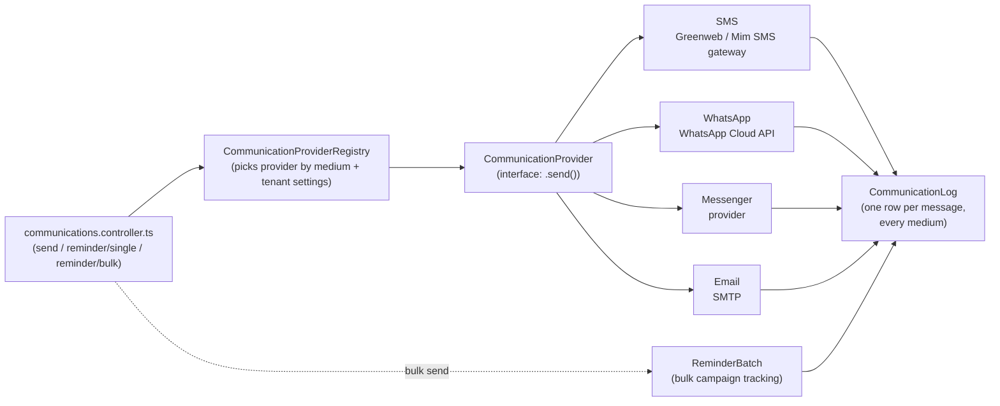
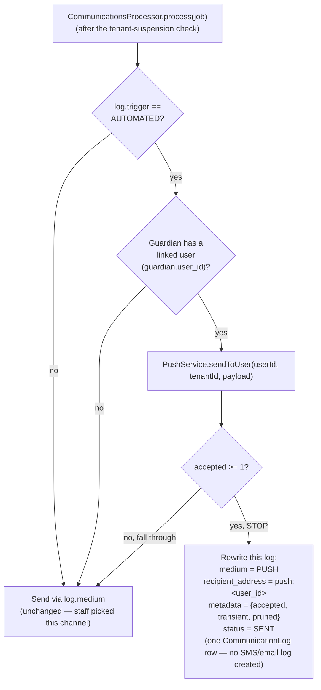
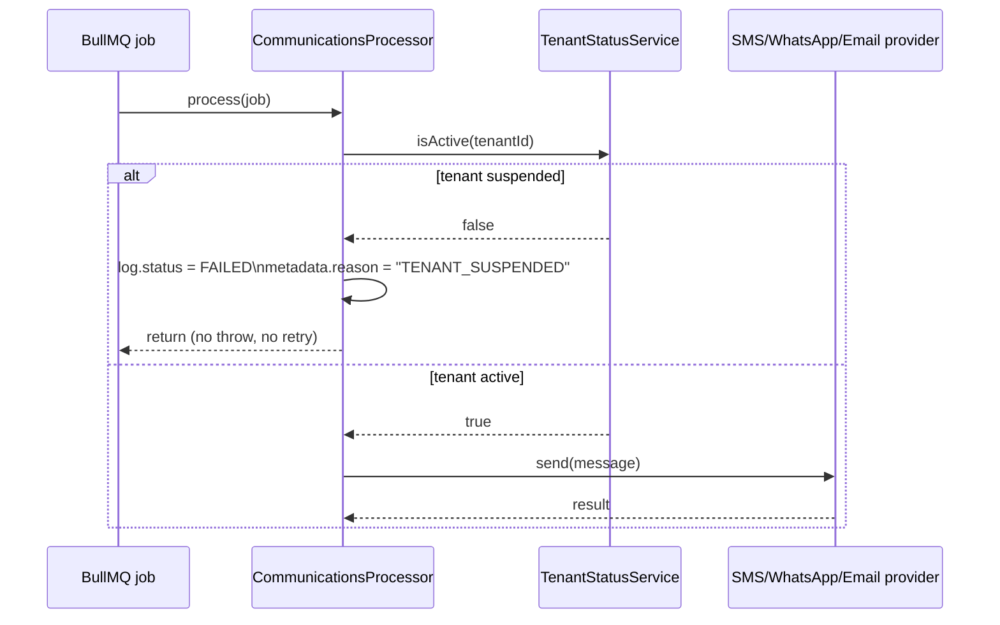
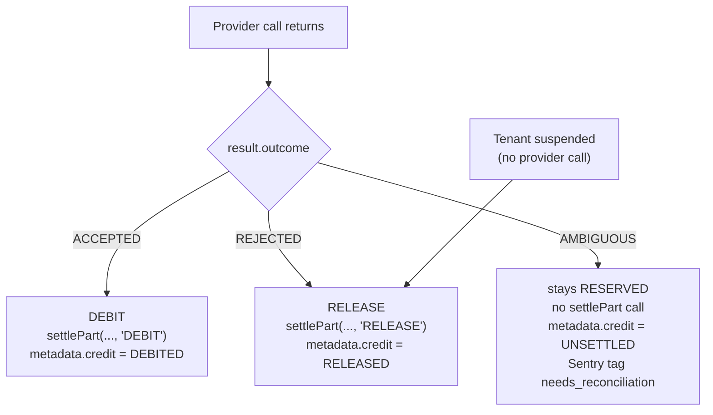

# Communications (Reminders)

Guardians who haven't paid fees get reminded via SMS, WhatsApp, Messenger,
or email — one guardian at a time, or in bulk across every flagged student
from [04-fees-payments-invoices.md](04-fees-payments-invoices.md#5-flag-overdue-fees-and-remind-guardians).

## Provider adapter pattern



Every channel implements the same `CommunicationProvider` interface
(`modules/communications/providers/communication-provider.interface.ts`), so
the controller/service layer never branches on medium — it asks the
registry for "whatever handles WHATSAPP for this tenant" and calls
`.send()`. Per-tenant provider configuration (which SMS gateway, which SMTP
account, credentials) lives in `School.settings` / the tenant-settings
module, so different schools can use different providers without any code
change.

## Where this deviated from the original plan

The original plan specified **Twilio** for both SMS and WhatsApp. What
shipped instead:

- **SMS** — **Greenweb** and **Mim SMS**, two Bangladeshi SMS gateways
  (`providers/sms/greenweb-sms.gateway.ts`, `.../mim-sms.gateway.ts`),
  selected per-tenant via `sms-provider.factory.ts`. Twilio's per-message
  pricing and lack of local carrier relationships make it a poor fit for a
  Bangladesh-market product; local gateways are both cheaper and more
  reliable for BD phone numbers.
- **WhatsApp** — the **WhatsApp Cloud API** directly (Meta's own API), not
  Twilio's WhatsApp product.
- **Messenger** was added as a full channel, beyond the original three.

## Single vs. bulk sends

- **Single**: `POST communications/reminder/single/:studentId` (with a
  `.../preview` variant to show staff the rendered message before sending).
- **Bulk**: `POST communications/reminder/bulk` creates a `ReminderBatch`
  row up front (tracking the filter used and progress), then fans out to
  one `CommunicationLog` row per recipient as each send completes —
  `GET communications/reminder/bulk/:id` polls that batch's status.

## Delivery tracking & debugging

Every send — success or failure, automated or staff-triggered — gets a
`CommunicationLog` row: recipient, channel, message content, delivery
status, and who/what triggered it (`sent_by` is null for
automatically-triggered sends). This is the first place to look when a
guardian says "I never got the reminder."

`CommunicationLog.status` moves through:

- `QUEUED` — waiting for `CommunicationsProcessor` to pick it up.
- `SENT` — the provider accepted it.
- `FAILED` — permanently failed (bad provider, no retries left, or the
  tenant is suspended — see below); `metadata.reason` / `metadata.error`
  says why.

## Push-first dispatch for routine automated notifications [#555]

"Push" here means a browser/OS notification delivered through the [Web
Push API](https://developer.mozilla.org/en-US/docs/Web/API/Push_API) to a
device the guardian's linked user account has subscribed from (see
`modules/push/`) — not SMS, WhatsApp, Messenger, or email. Free to send
(no gateway cost), so it's tried first for **routine** notifications, with
the guardian's normal preferred channel as the fallback.

**Routine** = `CommunicationLog.trigger === CommunicationTrigger.AUTOMATED`
— today that's only attendance-absence notices
(`absence-notice.scheduler.ts`'s daily sweep, and the same code path when
a class teacher finalizes a register early). A **staff-initiated** send —
one guardian (`SINGLE_REMINDER`), a bulk campaign (`BULK_REMINDER`), or a
freeform message (`MANUAL`) — always goes straight to the guardian's
preferred channel, exactly as before. `ACCOUNT_ACCESS` sends (invites,
OTPs, password resets) are excluded too: a fallback delay is not
acceptable for those.



Decision table (opt-out is checked upstream — see
`reminder-recipients.util.ts#partitionByOptOut` — and stays authoritative:
an opted-out guardian never gets a `CommunicationLog` row queued at all,
so it never reaches this table):

| Trigger                                                           | Guardian has linked user + push subscription? | Push result      | What gets logged / sent                                                          |
| ----------------------------------------------------------------- | --------------------------------------------- | ---------------- | -------------------------------------------------------------------------------- |
| `AUTOMATED` (routine)                                             | No                                            | —                | Preferred channel, unchanged (SMS/WhatsApp/Email)                                |
| `AUTOMATED` (routine)                                             | Yes                                           | `accepted >= 1`  | **One** `CommunicationLog` (`medium = PUSH`) — preferred channel is **not** sent |
| `AUTOMATED` (routine)                                             | Yes                                           | `accepted === 0` | Falls back to preferred channel, unchanged                                       |
| `MANUAL` / `SINGLE_REMINDER` / `BULK_REMINDER` / `ACCOUNT_ACCESS` | irrelevant                                    | —                | Preferred channel, unchanged — never tried via push                              |

Example: a guardian with the app installed as a PWA on their phone gets an
absence notice as a push notification instead of an SMS. A `push` medium
log for them looks like:

```json
{
  "medium": "PUSH",
  "recipient_address": "push:3f2a1c9e-...-user-id",
  "metadata": { "accepted": 1, "transient": 0, "pruned": 1 },
  "status": "SENT"
}
```

No push endpoint or subscription key ever lands in `CommunicationLog` —
only which user it went to and the accept/transient/pruned counts
`PushService.sendToUser` returned (see `modules/push/push.service.ts`).

For VAPID key generation, storage, and rotation cost, see
[`12-operations.md` §5 Web push](12-operations.md#5-web-push-vapid-keys).

`medium = 'PUSH'` is a value only `communication_logs.medium`'s own DB
enum accepts (`communication_logs_medium_enum`,
migration `1789400000000-AddPushCommunicationMedium.ts`) — it is
deliberately **not** part of the shared `CommunicationMedium` enum used
elsewhere (e.g. `guardian.preferred_communication`), because a guardian
can never _choose_ push as a preferred channel the way they can choose
SMS or email.

No SMS credit is reserved or debited on the push path: credit reservation
only happens for the bulk-reminder flow's _metered_ SMS batches
(`isSettleableSmsBatchJob` requires `job.data.batchId`, which `AUTOMATED`
jobs never carry), so there is nothing to release when push succeeds.

## Suspended tenants: queued work is cancelled, not paused

A school (tenant) can be suspended by a SUPER_ADMIN
(`TenantStatusService`, `server/src/modules/schools/tenant-status.service.ts`).
`CommunicationsProcessor.process()` checks `tenantStatus.isActive(tenantId)`
before doing anything else — no provider call, no SMS credit debit for a
suspended tenant:



**Important:** this cancels the job, it does not pause it. A message
queued while a school is suspended ends up `FAILED` with
`metadata.reason = "TENANT_SUSPENDED"` and stays that way — reactivating
the school does **not** automatically resend it. Example: a bulk fee
reminder queues 200 `CommunicationLog` rows, the school gets suspended
mid-batch, and 80 rows haven't been picked up by a worker yet — those 80
end up `FAILED`. When the school is reactivated, staff have to trigger a
new send (single or bulk) for anyone who still needs the reminder.

## SMS credit settlement [15.6.6/#549]

A metered tenant's bulk SMS send **reserves** credits for the whole batch
up front (`batch:<batchId>`, epic #508's `RESERVE` ledger kind — see
[the credits doc/#546] for the batch-level reservation). Each individual
SMS job then **settles its own slice** of that reservation, once, right
after the provider call returns — this is the part this section documents.



| Provider outcome             | Meaning                                                                             | Ledger kind | Balance effect                                  | `metadata.credit` |
| ---------------------------- | ----------------------------------------------------------------------------------- | ----------- | ----------------------------------------------- | ----------------- |
| `ACCEPTED`                   | Provider took the message                                                           | `DEBIT`     | `reserved -= segments`, credits spent           | `DEBITED`         |
| `REJECTED`                   | Provider (or a pre-flight check) definitely refused it — 4xx/validation, never sent | `RELEASE`   | `reserved -= segments`, `available += segments` | `RELEASED`        |
| `AMBIGUOUS`                  | Timeout/5xx/unknown error _after_ the request went out — unclear if it was sent     | none        | untouched — stays reserved                      | `UNSETTLED`       |
| Tenant suspended before send | No provider call was made                                                           | `RELEASE`   | `reserved -= segments`, `available += segments` | `RELEASED`        |

A **post-acceptance delivery failure** (the SMS was accepted by the
gateway but never reaches the handset — bad number on the carrier side,
etc.) is **not** one of these outcomes: it's invisible to this processor,
which only sees the gateway's immediate accept/reject response. It stays
billed — this mirrors how a real carrier charges: you pay to hand the
message to the network, not for confirmed handset delivery.

### Where settlement happens, and why it's outside the log-save transaction

`CommunicationsProcessor.settle()` (the log-save + batch-counter update)
already runs in one DB transaction — see its doc comment. Credit
settlement is a **separate, later** step, deliberately **not** part of
that transaction: a `SmsCreditService.settlePart` failure must never roll
back (or block recording) a send that already happened. If it fails, the
processor logs the error and writes `metadata.credit = 'UNSETTLED'`
instead of throwing — throwing here would risk BullMQ retrying a job
whose SMS was _already sent_, resending it to the guardian a second time.

### Idempotency and the retry/crash window

`settlePart(tenantId, batchKey, logKey, units, outcome)` is idempotent on
`` `${logKey}:settle` `` (`log:<logId>:settle`) — a second call with the
same key is a no-op. Since every settlement call in the processor uses
the same `log:<logId>` key regardless of how many times that job runs,
a BullMQ retry or stalled-job replay settles at most once.

This does **not** close the existing duplicate-send crash window
documented on `CommunicationsProcessor` itself: if the worker crashes
_after_ the provider accepts the message but _before_ the log save
commits, a replay resends the SMS (the log's status guard only catches a
replay _after_ that save landed). What settlement adds: if that same
crash happens after the provider call but before this class gets a chance
to run `settlePart`, the reservation for that log is left in its original
"neither debited nor released" state. The next time this job is
processed, it goes through the outcome mapping again and settles
normally — so the crash window is closed for credit-correctness the same
way it already is for the log/batch state. The `AMBIGUOUS` case is the
one that's expected to require a human: reconciliation tooling looks for
`metadata.credit = 'UNSETTLED'` and the `needs_reconciliation` Sentry tag
(reusing 15.1.4's queue-failure telemetry — see
`CommunicationsProcessor.flagAmbiguousSettlement`) to find these and
resolve them manually.
