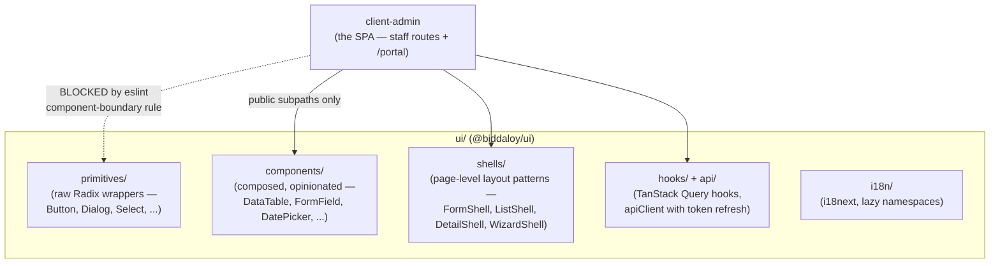
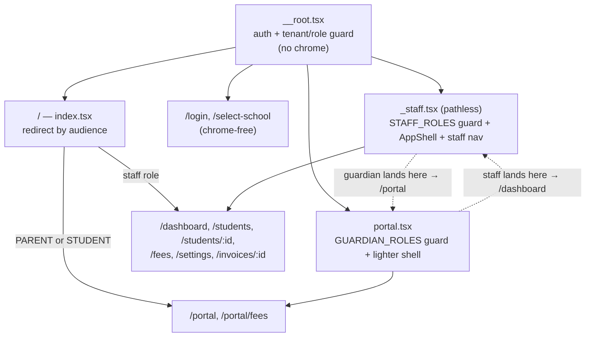
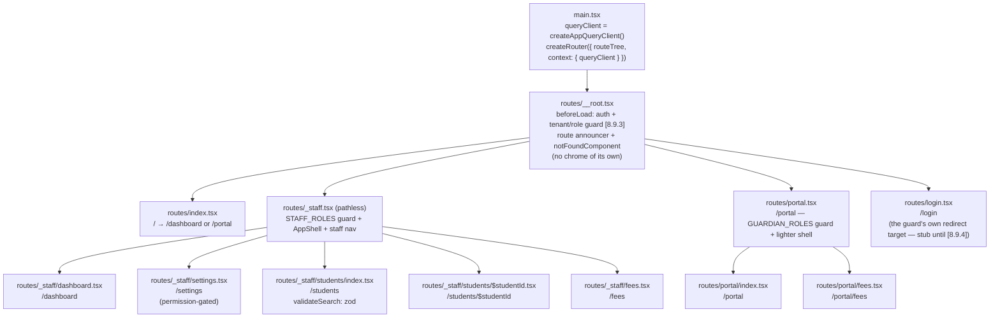
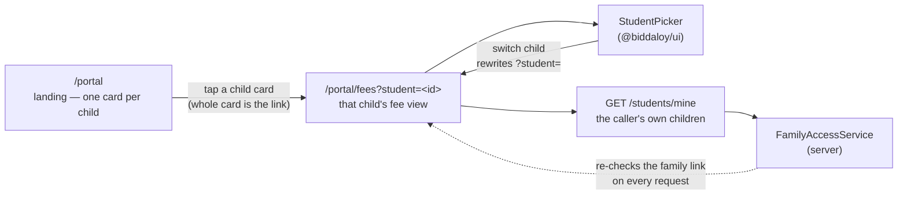

# Frontend Architecture

Three frontend packages, one strict rule about how they relate:



## One SPA, two audiences

There is **one** client package, served at `/`. Staff and guardians are
separated by _route_, not by package ([8.9.10]) — `ROLE_PERMISSIONS[PARENT]`
and `ROLE_PERMISSIONS[STUDENT]` are byte-identical, so a package (or a route
tree) per role would be two copies of the same thing.



Concretely: a PARENT signing in is sent to `/portal`; typing `/students`
redirects them back to `/portal` rather than rendering a page whose every
request returns 403. An ADMIN typing `/portal` is sent to `/dashboard`.
Because `_staff` is a _pathless_ layout, staff URLs are unchanged — only the
dashboard moved, from `/` to `/dashboard`, freeing `/` to be the redirect.

The audience lists live in `shared/src/enums/audiences.ts`
(`STAFF_ROLES`, `GUARDIAN_ROLES`) and both guards are the existing
`ui/src/routes/require-role.tsx`. Client-side gating is a UX nicety: the
server's `RolesGuard`/`ContextGuard` remain the security boundary.

**When does a second client package become right?** When the entry bundle
says so. `client-admin/scripts/check-route-chunks.mjs` gzips the entry
chunk and fails CI above a fixed ceiling (220,000 B today, against 215,380 B
measured), so "split it later if it gets heavy" is a number, not a memory.

## The component boundary rule (enforced, not a convention)

`client-admin` may **only** import from
`@biddaloy/ui`'s published subpaths — never Radix directly, never a deep
`ui/src/...` or `.../primitives/...` path, never a raw `Intl`/
`toLocaleString()` call in place of a shared formatter. This is enforced by
a custom ESLint rule (`ui/eslint-rules/component-boundary.mjs`), registered
only in the client apps' eslint configs — `ui/` itself is exempt, since its
own wrapper components are exactly the code that's supposed to reach into
Radix and primitives.

**Why this matters when you're adding a feature**: if you need a UI piece
that doesn't exist yet in `ui/components/`, build it _there_ and export it
through a public subpath — don't reach past the boundary from a client app,
even for "just this one case." The lint rule will fail CI if you do.

## `ui/` structure

| Folder           | What lives here                                                                                                                                                                                                                                                                                                                |
| ---------------- | ------------------------------------------------------------------------------------------------------------------------------------------------------------------------------------------------------------------------------------------------------------------------------------------------------------------------------ |
| `primitives/`    | Thin Radix wrappers (Button, Dialog, Select, Checkbox, Tooltip, Skeleton, …) — the only place allowed to `import { ... } from 'radix-ui'`                                                                                                                                                                                      |
| `components/`    | Composed, opinionated components built on primitives (DataTable, FormField, DatePicker, Combobox, FileUpload, Pagination, Menu, …)                                                                                                                                                                                             |
| `shells/`        | Reusable **page-level** layout patterns — `FormShell` (create/edit forms with autosave/draft-restore), `ListShell` (filterable/sortable lists), `DetailShell` (tabbed detail views), `WizardShell` (multi-step flows). Both client apps build their actual pages by composing these rather than laying out pages from scratch. |
| `hooks/`, `api/` | TanStack Query hooks (e.g. `useCreatePayment`) and the shared `apiClient` — including the access-token-refresh flow described in [02-auth-and-multitenancy.md](02-auth-and-multitenancy.md)                                                                                                                                    |
| `i18n/`          | i18next setup with per-namespace lazy loading and locale persistence                                                                                                                                                                                                                                                           |
| `test/`          | Shared test factories and MSW request handlers, reused by both client apps' test suites                                                                                                                                                                                                                                        |

Storybook documents every `components/`/`primitives/` entry with stories;
Tailwind design tokens live in `tailwind.preset.ts`, checked for
WCAG contrast compliance by `ui/scripts/check-contrast.mjs` in CI.

## The financial-mutation guard (enforced, not a convention)

A second custom ESLint rule, `no-optimistic-financial-mutation`
(`ui/eslint-rules/financial-mutation.mjs`), blocks optimistic UI on any
`useMutation` call touching a payment or enrollment endpoint. Reasoning,
straight from the rule's own comment: showing "৳4,500 received" and then
rolling back on error means the UI confirmed a payment that didn't
happen — at a cash counter, with the parent standing there, that's not a
glitch, it's an argument. This is a lint rule specifically so it's caught
every time a mutation is added or edited, not just when someone remembers
to check for it in review.

**If you're building a form that touches money or enrollment status**:
don't add optimistic updates to its mutation. Show a pending state and wait
for the server response.

## The client app

- **`client-admin`** — the whole SPA, both audiences. Staff routes manage
  students/guardians/classes/fee structures/payments, send reminders and
  view audit logs (teachers use these too — no separate `client-teacher`
  app was built, see [00-overview.md](00-overview.md)). Its `/portal`
  routes are the guardian/student self-service side: a placeholder shell
  today, filled in by Epic 5.0 (#187).

One Vite + React 19 SPA consuming `@biddaloy/ui`, built once and served as
static assets at `/` by the NestJS server in production (see
[00-overview.md](00-overview.md) for the system diagram). The package name
is a leftover from when a second client package was planned; renaming it is
its own mechanical change.

## Routing

`client-admin` uses **TanStack Router**, file-based: every file under
`src/routes/` becomes a route, and `@tanstack/router-plugin`'s Vite plugin
generates `src/routeTree.gen.ts` (committed, never hand-edited — same
treatment as `ui/src/api/schema.d.ts`) and code-splits each route into its
own chunk automatically. It was chosen specifically for typed, per-route
search-param validation: a route declares a Zod `validateSearch` schema
with `.catch()` fallbacks, so `?page=abc` degrades to a sensible default
instead of crashing the page — see [`ui/README.md`'s Routing
section](../../ui/README.md) for the hooks and test harness this is built
on.



Every route runs `ROOT`'s `beforeLoad` — `/login` included, which is why
that guard explicitly skips redirecting when already there. See
[02-auth-and-multitenancy.md](02-auth-and-multitenancy.md)'s "Client
session lifecycle" for the full cold-load-vs-mid-session sequence.

**Hover a sidebar link, and its route chunk _and_ its data start loading**
before the click lands — `defaultPreload: 'intent'` on the router, paired
with each route's own `loader` calling
`context.queryClient.ensureQueryData(...)` so the prefetch populates
TanStack Query's cache, not just a separate router-level cache. A route
with no `loader` still gets its JS chunk preloaded on hover; only the data
prefetch needs one.

The router's own `defaultPreloadStaleTime: 0` hands freshness off to Query
entirely: `createAppQueryClient()` (`ui/src/api/query-client.ts`) sets
`staleTime: 30_000`, so a prefetched result that's still within its 30s
window is served straight from Query's cache instead of being silently
re-fetched by the router's separate preload cache. See [`ui/README.md`'s
"The app's query client" section](../../ui/README.md) for the full set of
tuned defaults and why each one is set the way it is.

### How a guardian moves between their children

A guardian linked to several students switches children by **navigating**,
not by holding state. The chosen child rides in the `?student=` search
param, so every switch is an ordinary URL:

```text
/portal/fees?student=8f3c1e02-4b7a-4d19-9c55-2a1f6b0d77e4
```

That single decision is what makes switching bookmarkable, back-button
friendly, and keyboard-operable and screen-reader-announced without any
extra ARIA wiring — the chips are real links, so an `<a>` is focusable,
activates on Enter, and the active one carries `aria-current="page"`.



Two rules hold at both ends of that flow:

- **Fewer than two children renders no switcher at all.** `StudentPicker`
  returns `null` below two items, so the rule lives in the component
  rather than in each call site. A guardian of one child sees no chips and
  no chevrons anywhere.
- **`?student=` never widens access.** It is a hint, not an authorization.
  A value the caller cannot see falls back to their first linked student
  rather than erroring (see `feesSearchSchema`), and the server re-checks
  the family link on every request regardless — so hand-editing the URL to
  another family's student id returns that guardian's own data, not
  someone else's.

**404s render inside the shell, not a bare page** — `notFoundComponent` is
set on the _root_ route, so when nothing matches, the root's own
`AppShell` (sidebar, header) still renders around the not-found content,
in the same `<Outlet />` position a matched route's content would occupy.

## Testing

Vitest for unit/component tests (colocated `*.test.tsx`), Playwright for
end-to-end flows, MSW for mocking the API in both. Shared test factories
and handlers live in `ui/src/test/` so admin and student test suites build
fixtures the same way. See `ui/CONTRIBUTING.md` and `ui/README.md` for the
exact commands and CI gates.
