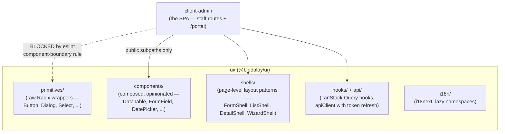
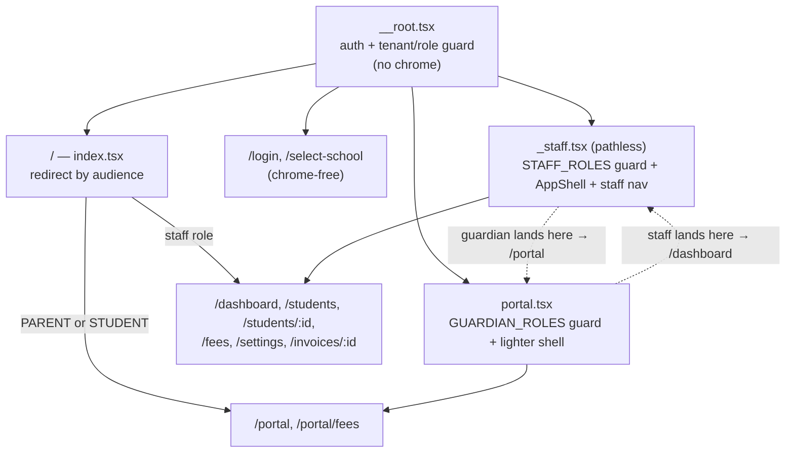
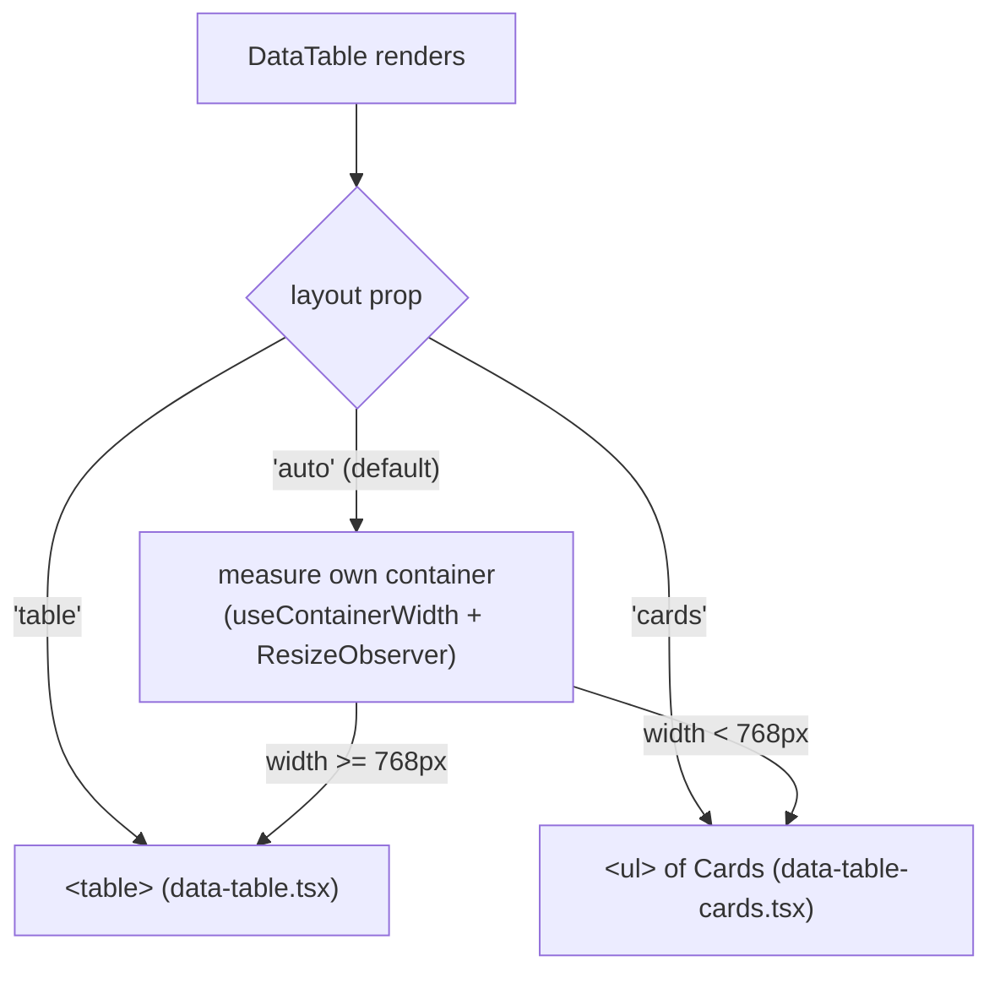
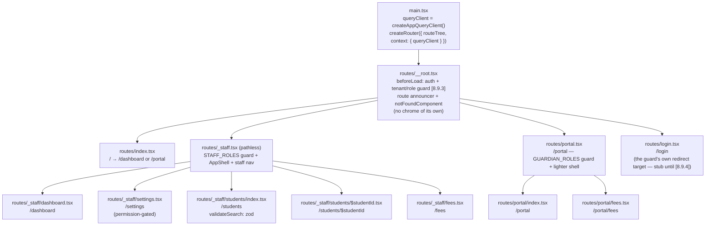
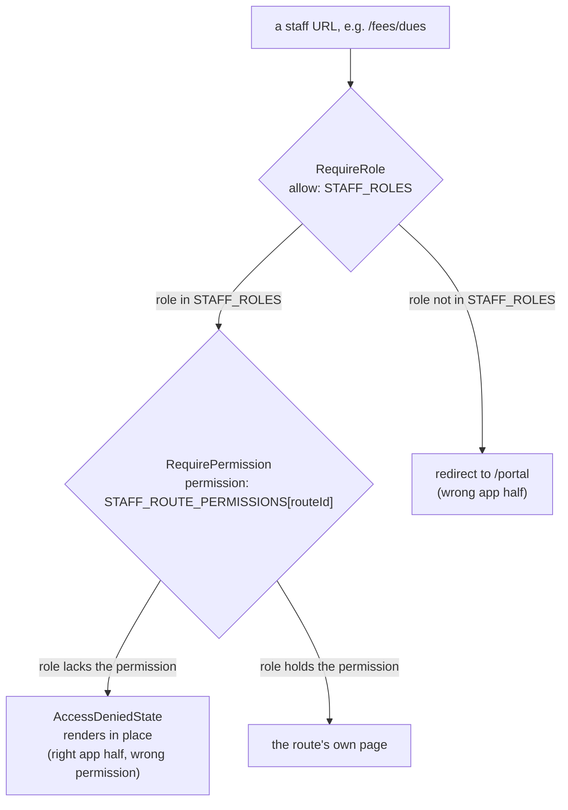
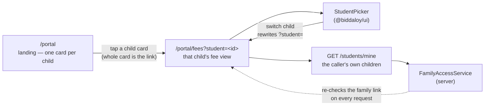
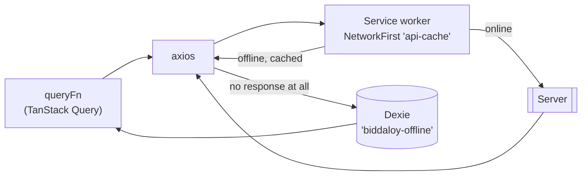
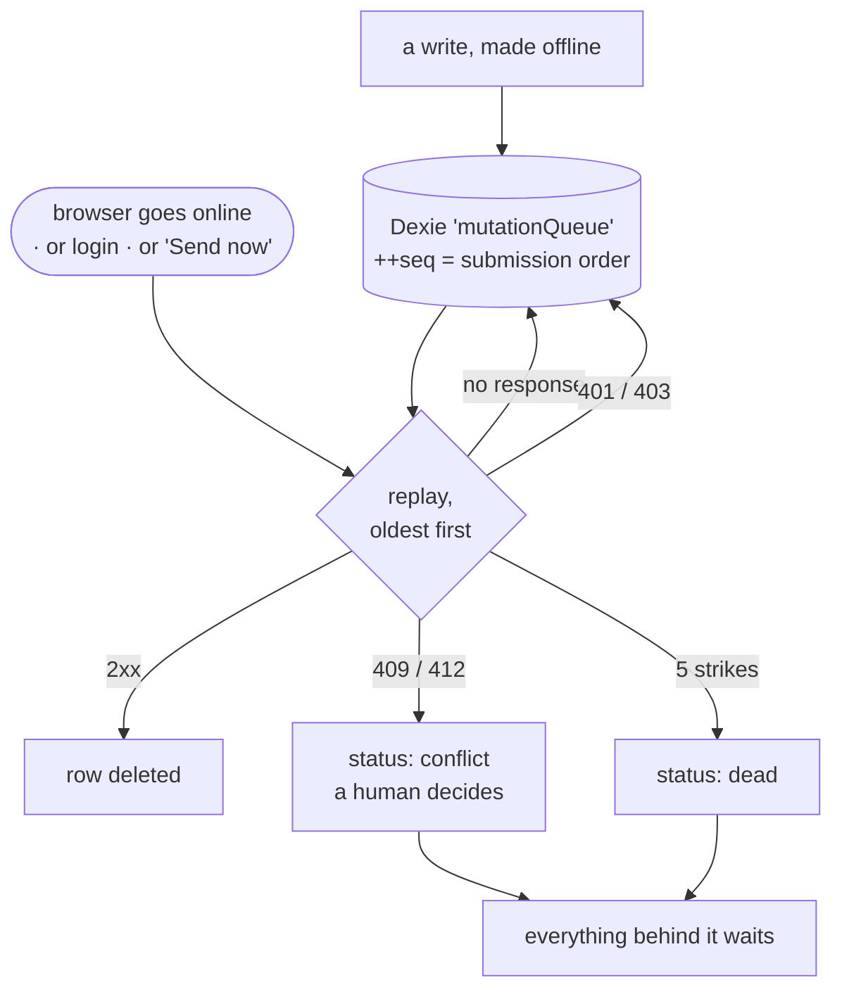

# Frontend Architecture

Three frontend packages, one strict rule about how they relate:



## One SPA, two audiences

There is **one** client package, served at `/`. Staff and guardians are
separated by _route_, not by package ([8.9.10]) — `ROLE_PERMISSIONS[PARENT]`
and `ROLE_PERMISSIONS[STUDENT]` are byte-identical, so a package (or a route
tree) per role would be two copies of the same thing.



Concretely: a PARENT signing in is sent to `/portal`; typing `/students`
redirects them back to `/portal` rather than rendering a page whose every
request returns 403. An ADMIN typing `/portal` is sent to `/dashboard`.
Because `_staff` is a _pathless_ layout, staff URLs are unchanged — only the
dashboard moved, from `/` to `/dashboard`, freeing `/` to be the redirect.

The audience lists live in `shared/src/enums/audiences.ts`
(`STAFF_ROLES`, `GUARDIAN_ROLES`) and both guards are the existing
`ui/src/routes/require-role.tsx`. Client-side gating is a UX nicety: the
server's `RolesGuard`/`ContextGuard` remain the security boundary.

**When does a second client package become right?** When the entry bundle
says so. `client-admin/scripts/check-route-chunks.mjs` gzips the entry
chunk and fails CI above a fixed ceiling (220,000 B today, against 215,380 B
measured), so "split it later if it gets heavy" is a number, not a memory.

## The component boundary rule (enforced, not a convention)

`client-admin` may **only** import from
`@biddaloy/ui`'s published subpaths — never Radix directly, never a deep
`ui/src/...` or `.../primitives/...` path, never a raw `Intl`/
`toLocaleString()` call in place of a shared formatter. This is enforced by
a custom ESLint rule (`ui/eslint-rules/component-boundary.mjs`), registered
only in the client apps' eslint configs — `ui/` itself is exempt, since its
own wrapper components are exactly the code that's supposed to reach into
Radix and primitives.

**Why this matters when you're adding a feature**: if you need a UI piece
that doesn't exist yet in `ui/components/`, build it _there_ and export it
through a public subpath — don't reach past the boundary from a client app,
even for "just this one case." The lint rule will fail CI if you do.

## `ui/` structure

| Folder           | What lives here                                                                                                                                                                                                                                                                                                                |
| ---------------- | ------------------------------------------------------------------------------------------------------------------------------------------------------------------------------------------------------------------------------------------------------------------------------------------------------------------------------ |
| `primitives/`    | Thin Radix wrappers (Button, Dialog, Select, Checkbox, Tooltip, Skeleton, …) — the only place allowed to `import { ... } from 'radix-ui'`                                                                                                                                                                                      |
| `components/`    | Composed, opinionated components built on primitives (DataTable, FormField, DatePicker, Combobox, FileUpload, Pagination, Menu, …)                                                                                                                                                                                             |
| `shells/`        | Reusable **page-level** layout patterns — `FormShell` (create/edit forms with autosave/draft-restore), `ListShell` (filterable/sortable lists), `DetailShell` (tabbed detail views), `WizardShell` (multi-step flows). Both client apps build their actual pages by composing these rather than laying out pages from scratch. |
| `hooks/`, `api/` | TanStack Query hooks (e.g. `useCreatePayment`) and the shared `apiClient` — including the access-token-refresh flow described in [02-auth-and-multitenancy.md](02-auth-and-multitenancy.md)                                                                                                                                    |
| `i18n/`          | i18next setup with per-namespace lazy loading and locale persistence                                                                                                                                                                                                                                                           |
| `test/`          | Shared test factories and MSW request handlers, reused by both client apps' test suites                                                                                                                                                                                                                                        |

Storybook documents every `components/`/`primitives/` entry with stories;
Tailwind design tokens live in `tailwind.preset.ts`, checked for
WCAG contrast compliance by `ui/scripts/check-contrast.mjs` in CI.

## `DataTable`'s two render modes: table and cards

[8.14.7] `DataTable` (`ui/src/components/data-table.tsx`) renders either a
`<table>` or a `<ul>` of `Card`s from the exact same props — same columns,
same selection set, same sorting, same pagination. Nothing above it (not
`ListShell`, not the page) needs to know which mode is active:



**Why the table's own container width, not the viewport.** A
`useMediaQuery`-style check against `window.innerWidth` would get this
wrong for a table sitting inside a narrow detail pane or a dialog on an
otherwise wide screen — that table is narrow regardless of what the
viewport measures. `useContainerWidth` (`ui/src/hooks/
use-container-width.ts`) instead watches `DataTable`'s own root element
with a `ResizeObserver`.

**Why one component picks between two trees in JS, instead of `@container`
CSS hiding one and showing the other.** CSS can only pick between
pre-rendered markup; it can't stop React from mounting a `<table>` that
will never be shown. A hidden `<table>` and a hidden `<ul>` rendered
side-by-side would double the accessible tree (two captions, two sets of
row checkboxes, two live regions) and break every existing table-mode
locator that assumes there is exactly one table. So `DataTable` decides in
JS which single tree to render, not which one to hide.

**Worked example** — a money column that right-aligns in both modes:

```ts
const columns: DataTableColumn<Student>[] = [
  { id: 'name', header: 'Name', accessorFn: (row) => row.name, card: 'title' },
  { id: 'balance', header: 'Balance', accessorFn: (row) => row.balance, align: 'end' },
];
```

`card: 'title'` places a column's value as the card's heading instead of a
`<dl>` field (see `DataTableCardRole` for the other roles — `'subtitle'`,
`'badge'`, `'actions'`, `'hidden'`); `align: 'end'` right-aligns the
column and adds `tabular-nums` in **both** the table's `<td>` and the
card's `<dd>`. Neither prop is required — a column with neither declared
still renders (as a `dl` field, start-aligned), so a page that hasn't been
tuned for cards yet still produces a usable one.

## The financial-mutation guard (enforced, not a convention)

A second custom ESLint rule, `no-optimistic-financial-mutation`
(`ui/eslint-rules/financial-mutation.mjs`), blocks optimistic UI on any
`useMutation` call touching a payment or enrollment endpoint. Reasoning,
straight from the rule's own comment: showing "৳4,500 received" and then
rolling back on error means the UI confirmed a payment that didn't
happen — at a cash counter, with the parent standing there, that's not a
glitch, it's an argument. This is a lint rule specifically so it's caught
every time a mutation is added or edited, not just when someone remembers
to check for it in review.

**If you're building a form that touches money or enrollment status**:
don't add optimistic updates to its mutation. Show a pending state and wait
for the server response.

## The client app

- **`client-admin`** — the whole SPA, both audiences. Staff routes manage
  students/guardians/classes/fee structures/payments, send reminders and
  view audit logs (teachers use these too — no separate `client-teacher`
  app was built, see [00-overview.md](00-overview.md)). Its `/portal`
  routes are the guardian/student self-service side: a placeholder shell
  today, filled in by Epic 5.0 (#187).

One Vite + React 19 SPA consuming `@biddaloy/ui`, built once and served as
static assets at `/` by the NestJS server in production (see
[00-overview.md](00-overview.md) for the system diagram). The package name
is a leftover from when a second client package was planned; renaming it is
its own mechanical change.

## Routing

`client-admin` uses **TanStack Router**, file-based: every file under
`src/routes/` becomes a route, and `@tanstack/router-plugin`'s Vite plugin
generates `src/routeTree.gen.ts` (committed, never hand-edited — same
treatment as `ui/src/api/schema.d.ts`) and code-splits each route into its
own chunk automatically. It was chosen specifically for typed, per-route
search-param validation: a route declares a Zod `validateSearch` schema
with `.catch()` fallbacks, so `?page=abc` degrades to a sensible default
instead of crashing the page — see [`ui/README.md`'s Routing
section](../../ui/README.md) for the hooks and test harness this is built
on.



Every route runs `ROOT`'s `beforeLoad` — `/login` included, which is why
that guard explicitly skips redirecting when already there. See
[02-auth-and-multitenancy.md](02-auth-and-multitenancy.md)'s "Client
session lifecycle" for the full cold-load-vs-mid-session sequence.

**Hover a sidebar link, and its route chunk _and_ its data start loading**
before the click lands — `defaultPreload: 'intent'` on the router, paired
with each route's own `loader` calling
`context.queryClient.ensureQueryData(...)` so the prefetch populates
TanStack Query's cache, not just a separate router-level cache. A route
with no `loader` still gets its JS chunk preloaded on hover; only the data
prefetch needs one.

The router's own `defaultPreloadStaleTime: 0` hands freshness off to Query
entirely: `createAppQueryClient()` (`ui/src/api/query-client.ts`) sets
`staleTime: 30_000`, so a prefetched result that's still within its 30s
window is served straight from Query's cache instead of being silently
re-fetched by the router's separate preload cache. See [`ui/README.md`'s
"The app's query client" section](../../ui/README.md) for the full set of
tuned defaults and why each one is set the way it is.

### Route access: two gates, refuse-in-place

**[8.14.17]:** every staff route now sits behind two client-side gates,
stacked inside `routes/_staff.tsx`, each answering a different question:



1. **`RequireRole`** (`ui/src/routes/require-role.tsx`) answers "is this
   the right _app half_" — staff chrome vs. `/portal`. A guardian who
   types `/students` is simply lost, so this one **redirects** (defaults
   to `/`, the same role-aware redirect `routes/index.tsx` uses).
2. **`RequirePermission`** (`ui/src/routes/require-permission.tsx`)
   answers "does this role hold the right _permission_, given it's
   already in the right app half" — e.g. a `TEACHER` on `/fees/dues`,
   which needs `FEE_COLLECT`. This one **refuses in place**: no redirect,
   no `useEffect`, no `navigate` call anywhere in the component. Silently
   bouncing a teacher who typed a URL somewhere unexplained is its own
   bug, not a fix — the whole point is that the refusal explains itself
   on the URL the person actually visited.

`RequirePermission` renders `AccessDeniedState`
(`ui/src/components/access-denied-state.tsx`) — a sibling of
`EmptyState`/`RouteStatusState`, same dashed/flat/`bg-muted` treatment,
`role="status"` because a refusal is not an application fault. It ships
its own i18n copy (`common.json`'s `accessDenied` block) so 27 route
files don't each repeat the same three translated strings; a route with
more specific copy (`/audit-logs`) overrides just the `explanation`.

**The permission-to-route map is one file,** `client-admin/src/
route-permissions.ts`'s `STAFF_ROUTE_PERMISSIONS`, keyed by TanStack
Router's own route ID (not URL path — an index route's ID carries a
trailing slash, e.g. `/_staff/students/`). Its value type is
non-optional: "no permission required" is not an expressible value, so a
route added later without an entry **fails closed** — it refuses
everyone, including admins — rather than rendering to everyone.
`client-admin/src/route-permissions.test.ts` is the drift guard: it
diffs the map's key set against the route tree's actual leaves in both
directions, so a typo'd key (which would otherwise silently mean "no
gate") fails a test instead of shipping.

The full table, one row per staff route:

| Route ID                                  | Permission                |
| ----------------------------------------- | ------------------------- |
| `/_staff/dashboard`                       | `DASHBOARD_VIEW`          |
| `/_staff/students/`                       | `STUDENT_READ`            |
| `/_staff/students/new`                    | `STUDENT_CREATE`          |
| `/_staff/students/import`                 | `STUDENT_BULK_UPLOAD`     |
| `/_staff/students/$studentId`             | `STUDENT_READ`            |
| `/_staff/students/$studentId_/edit`       | `STUDENT_UPDATE`          |
| `/_staff/guardians/`                      | `GUARDIAN_READ`           |
| `/_staff/guardians/$guardianId`           | `GUARDIAN_READ`           |
| `/_staff/staff/`                          | `USER_READ`               |
| `/_staff/staff/$userId`                   | `USER_READ`               |
| `/_staff/fees/`                           | `FEE_STRUCTURE_READ`      |
| `/_staff/fees/dues`                       | `FEE_COLLECT`             |
| `/_staff/fees/generate`                   | `FEE_GENERATE`            |
| `/_staff/fee-structures/`                 | `FEE_STRUCTURE_READ`      |
| `/_staff/invoices/`                       | `INVOICE_READ`            |
| `/_staff/invoices/$invoiceId`             | `INVOICE_READ`            |
| `/_staff/payments/record`                 | `PAYMENT_RECORD`          |
| `/_staff/communications/send`             | `COMMUNICATION_SEND`      |
| `/_staff/communications/reminders`        | `COMMUNICATION_BULK_SEND` |
| `/_staff/communications/batches/`         | `COMMUNICATION_BULK_SEND` |
| `/_staff/communications/batches/$batchId` | `COMMUNICATION_BULK_SEND` |
| `/_staff/academic-years/`                 | `ACADEMIC_YEAR_MANAGE`    |
| `/_staff/academic-years/$academicYearId`  | `ACADEMIC_YEAR_MANAGE`    |
| `/_staff/classes/`                        | `CLASS_MANAGE`            |
| `/_staff/classes/$classId`                | `CLASS_MANAGE`            |
| `/_staff/audit-logs/`                     | `AUDIT_LOG_READ`          |
| `/_staff/settings`                        | `SETTINGS_MANAGE`         |

Each permission is the same one `_staff.tsx`'s sidebar already gates that
route's nav item on — a route and its own nav entry cannot drift apart
about who's allowed in, because they're checked from the same map.

**No route ships a reduced, still-visible read-only view under this
gate.** A role either holds the route's permission and sees the whole
page, or it doesn't and sees `AccessDeniedState` — there is no partial
middle ground (e.g. `EXECUTIVE` seeing `/invoices` read-only). Adding
one would mean _granting_ a new permission in `shared/src/enums/
permissions.ts`'s `ROLE_PERMISSIONS` (e.g. `INVOICE_READ` to
`EXECUTIVE`), which is a product decision this client-only change does
not make — flagged in that file's own comments, not resolved here.

**This closes a UI hole, not a security one.** Both gates are
client-side convenience: the actual security boundary is the server's
`RolesGuard`/`ContextGuard` stack, which already 403s a role the API
doesn't trust. Before [8.14.17], a `TEACHER` who typed `/fees/dues`
directly saw every student's payment balance rendered in the browser —
the _page_ rendered even though every request it made would eventually
fail or (worse, for some endpoints) succeed because the server's
`@Roles` list is broader than `ROLE_PERMISSIONS` for that role. This
ticket stops the client from _showing_ data a role shouldn't see. It does
not stop a script from calling the same API directly and getting the
same over-broad response the server already returns — closing **that**
gap is [#399](https://github.com/tareq89/biddaloy/issues/399) (Epic
10.0)'s job, not this one's.

### How a guardian moves between their children

A guardian linked to several students switches children by **navigating**,
not by holding state. The chosen child rides in the `?student=` search
param, so every switch is an ordinary URL:

```text
/portal/fees?student=8f3c1e02-4b7a-4d19-9c55-2a1f6b0d77e4
```

That single decision is what makes switching bookmarkable, back-button
friendly, and keyboard-operable and screen-reader-announced without any
extra ARIA wiring — the chips are real links, so an `<a>` is focusable,
activates on Enter, and the active one carries `aria-current="page"`.



Two rules hold at both ends of that flow:

- **Fewer than two children renders no switcher at all.** `StudentPicker`
  returns `null` below two items, so the rule lives in the component
  rather than in each call site. A guardian of one child sees no chips and
  no chevrons anywhere.
- **`?student=` never widens access.** It is a hint, not an authorization.
  A value the caller cannot see falls back to their first linked student
  rather than erroring (see `feesSearchSchema`), and the server re-checks
  the family link on every request regardless — so hand-editing the URL to
  another family's student id returns that guardian's own data, not
  someone else's.

**404s render inside the shell, not a bare page** — `notFoundComponent` is
set on the _root_ route, so when nothing matches, the root's own
`AppShell` (sidebar, header) still renders around the not-found content,
in the same `<Outlet />` position a matched route's content would occupy.

## Offline reads: two caches, one rule

The admin SPA keeps working when the network drops. Two independent layers
do that, and they answer different questions.



|                                                              | Service worker `api-cache`                                       | Dexie `biddaloy-offline`                                  |
| ------------------------------------------------------------ | ---------------------------------------------------------------- | --------------------------------------------------------- |
| Added by                                                     | [8.12.1]                                                         | [8.12.3]                                                  |
| Caches                                                       | every `GET /api/v1/*`, as raw HTTP responses                     | 4 reference lists, as structured rows                     |
| Knows the data's age?                                        | yes — it stamps `x-sw-cached-at` on every response it stores     | yes — `fetchedAt` per row                                 |
| Works with no service worker (dev, first visit, other SPAs)? | no                                                               | yes                                                       |
| Cap / expiry                                                 | 100 entries, 24h                                                 | 20 rows per tenant+entity, 24h                            |
| Lives in                                                     | `client-admin/src/sw.ts`, `client-admin/src/pwa/cache-policy.ts` | `ui/src/api/offline-db.ts`, `ui/src/api/offline-cache.ts` |

The Dexie layer **complements** the service worker; it does not replace it.

**What is cached: students, classes, class sections, fee structures.** That
list is a closed union (`CacheableEntity`), not a convention — so wrapping a
money query is a compile error.

**What is deliberately never cached: fee dues, invoices, payments.** A
balance that is silently an hour old is how a school takes a payment twice.
If a later issue needs one of these offline, it has to build the "this
figure is N hours old, do not act on it" affordance first.

**Cached data is always labelled.** `CachedDataNotice` renders
`"Showing saved data from 23 hours ago"` above any list served from either
cache, and adds an offline hint when `navigator.onLine` is false. It
renders nothing for fresh data. The age travels beside the query result in
a side channel (`ui/src/api/freshness.ts`) rather than inside it, so no
query's data type or route loader had to change.

**How "is this stale?" is decided.** The service worker stamps every
response it stores with `x-sw-cached-at`, holding `Date.now()` at the
moment it cached it; the presence of that header is what marks a response
as a replay. It is deliberately _not_ decided by comparing the server's
`Date` header against the browser's clock — that compares two different
clocks, so a phone running a couple of minutes fast would label every
fresh response stale and show "showing saved data" permanently to a
fully-online user. Unsynced clocks are routine on the low-end Android this
work targets. Same clock in, same clock out.

**An HTTP error is never answered from cache.** A 401/403/404 means the
server refused the request — often because the caller lost access to that
tenant — so serving the cached copy would render data the server just said
this user may not see. Only a _no-response_ network failure falls back.

### The write path: queue, replay, and telling the user

Reads are only half of it. A write made with no connection is persisted
and replayed later, and the user is told where it stands.



**Ordering is the point.** Replay walks ascending `seq` and stops at the
first row it cannot clear. Queued writes commonly touch the same record —
correcting a mark you just made — so letting later rows overtake a blocked
one applies edits out of order against server state nobody reconciled.
`SyncStatus` explains the block rather than working around it.

**Money is never queued.** `QueueableEntity` is a closed union, so
`entity: 'payments'` does not compile; a second, case-insensitive path
guard catches strings built at runtime, which the union cannot see. A
queued payment replayed hours later — after the parent walked out with a
receipt — is unrecoverable.

**A 401 during replay is not a strike and never ends the session.** A token
routinely expires while a tab sits offline, so the first replayed row would
otherwise trigger the refresh-then-logout path, and logout deletes the whole
database. Replay opts out of that branch: it stops, changes nothing, and
waits for the user to re-authenticate.

| State the user sees              | Means                                        |
| -------------------------------- | -------------------------------------------- |
| _(nothing)_                      | online, queue empty and readable             |
| "N changes waiting to send"      | queued, will go on their own                 |
| "Some changes need attention"    | a conflict or dead row is blocking the queue |
| "Can't check for unsent changes" | the queue could not be read — **not** zero   |

That last row is the one worth guarding: "you have nothing unsynced" and
"I cannot tell whether you have anything unsynced" must never look the same
to someone deciding whether it is safe to close the tab.

**Nothing produces queued mutations yet.** [8.12.4] shipped the engine and
[8.12.5] the indicator, but the anticipated first consumer — a teacher
marking attendance — needs attendance endpoints that are not in
`openapi.json`, and a `client-teacher` app that does not exist. The engine
is wired (`startQueueReplay()` runs at boot in `client-admin/src/main.tsx`)
and tested against mocks; it is not yet exercised by a real feature.

### Tenant isolation

Same rule as everywhere else in Biddaloy, with two independent mechanisms
because one silent failure shows one school's students under another
school's name:

1. **Structural.** Every Dexie row's primary key starts with its tenant id,
   and every read filters on the _currently active_ tenant. A cross-tenant
   hit is impossible even if every purge below failed.
2. **Purge.** `setActiveTenant` (a real switch) drops the leaving tenant's
   rows; `clearAuthState` (logout, session expiry, failed refresh) deletes
   the whole database. These are the same two funnels that already clear
   the service-worker cache.

Both funnels also clear the freshness map and — as of [8.12.3] — every
autosaved form draft. Draft storage keys are tenant-scoped too
(`form-shell-draft:<tenantId>:<formKey>`); before that, an administrator of
two schools was offered school A's abandoned draft while working in
school B.

## Testing

Vitest for unit/component tests (colocated `*.test.tsx`), Playwright for
end-to-end flows, MSW for mocking the API in both. Shared test factories
and handlers live in `ui/src/test/` so admin and student test suites build
fixtures the same way. See `ui/CONTRIBUTING.md` and `ui/README.md` for the
exact commands and CI gates.
