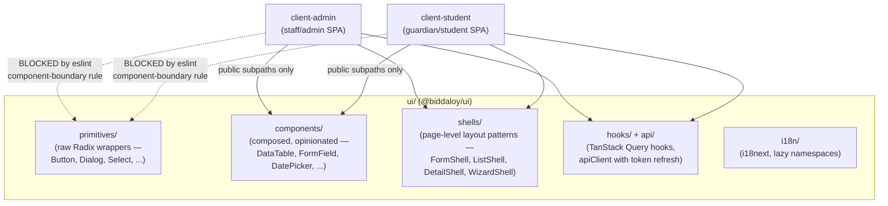
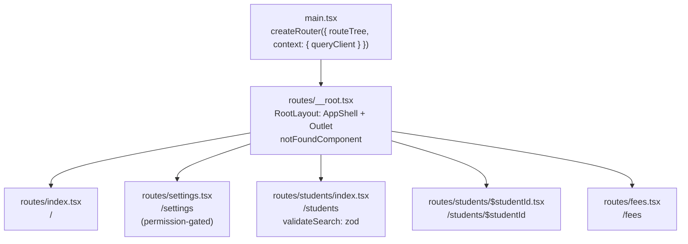

# Frontend Architecture

Three frontend packages, one strict rule about how they relate:

## The component boundary rule (enforced, not a convention)

`client-admin` and `client-student` may **only** import from
`@biddaloy/ui`'s published subpaths — never Radix directly, never a deep
`ui/src/...` or `.../primitives/...` path, never a raw `Intl`/
`toLocaleString()` call in place of a shared formatter. This is enforced by
a custom ESLint rule (`ui/eslint-rules/component-boundary.mjs`), registered
only in the client apps' eslint configs — `ui/` itself is exempt, since its
own wrapper components are exactly the code that's supposed to reach into
Radix and primitives.

**Why this matters when you're adding a feature**: if you need a UI piece
that doesn't exist yet in `ui/components/`, build it _there_ and export it
through a public subpath — don't reach past the boundary from a client app,
even for "just this one case." The lint rule will fail CI if you do.

## `ui/` structure

| Folder           | What lives here                                                                                                                                                                                                                                                                                                                |
| ---------------- | ------------------------------------------------------------------------------------------------------------------------------------------------------------------------------------------------------------------------------------------------------------------------------------------------------------------------------ |
| `primitives/`    | Thin Radix wrappers (Button, Dialog, Select, Checkbox, Tooltip, Skeleton, …) — the only place allowed to `import { ... } from 'radix-ui'`                                                                                                                                                                                      |
| `components/`    | Composed, opinionated components built on primitives (DataTable, FormField, DatePicker, Combobox, FileUpload, Pagination, Menu, …)                                                                                                                                                                                             |
| `shells/`        | Reusable **page-level** layout patterns — `FormShell` (create/edit forms with autosave/draft-restore), `ListShell` (filterable/sortable lists), `DetailShell` (tabbed detail views), `WizardShell` (multi-step flows). Both client apps build their actual pages by composing these rather than laying out pages from scratch. |
| `hooks/`, `api/` | TanStack Query hooks (e.g. `useCreatePayment`) and the shared `apiClient` — including the access-token-refresh flow described in [02-auth-and-multitenancy.md](02-auth-and-multitenancy.md)                                                                                                                                    |
| `i18n/`          | i18next setup with per-namespace lazy loading and locale persistence                                                                                                                                                                                                                                                           |
| `test/`          | Shared test factories and MSW request handlers, reused by both client apps' test suites                                                                                                                                                                                                                                        |

Storybook documents every `components/`/`primitives/` entry with stories;
Tailwind design tokens live in `tailwind.preset.ts`, checked for
WCAG contrast compliance by `ui/scripts/check-contrast.mjs` in CI.

## The financial-mutation guard (enforced, not a convention)

A second custom ESLint rule, `no-optimistic-financial-mutation`
(`ui/eslint-rules/financial-mutation.mjs`), blocks optimistic UI on any
`useMutation` call touching a payment or enrollment endpoint. Reasoning,
straight from the rule's own comment: showing "৳4,500 received" and then
rolling back on error means the UI confirmed a payment that didn't
happen — at a cash counter, with the parent standing there, that's not a
glitch, it's an argument. This is a lint rule specifically so it's caught
every time a mutation is added or edited, not just when someone remembers
to check for it in review.

**If you're building a form that touches money or enrollment status**:
don't add optimistic updates to its mutation. Show a pending state and wait
for the server response.

## Client apps

- **`client-admin`** — staff-facing: manages students/guardians/classes/fee
  structures/payments, sends reminders, views audit logs. Currently also
  serves teachers (no separate `client-teacher` app was built — see
  [00-overview.md](00-overview.md)).
- **`client-student`** — guardian/student self-service: view fees,
  enrollment, invoices.

Both are Vite + React 19 SPAs, both consume `@biddaloy/ui`, both are built
independently and served as static assets by the NestJS server in
production (see [00-overview.md](00-overview.md) for the system diagram).

## Routing

`client-admin` uses **TanStack Router**, file-based: every file under
`src/routes/` becomes a route, and `@tanstack/router-plugin`'s Vite plugin
generates `src/routeTree.gen.ts` (committed, never hand-edited — same
treatment as `ui/src/api/schema.d.ts`) and code-splits each route into its
own chunk automatically. It was chosen specifically for typed, per-route
search-param validation: a route declares a Zod `validateSearch` schema
with `.catch()` fallbacks, so `?page=abc` degrades to a sensible default
instead of crashing the page — see [`ui/README.md`'s Routing
section](../../ui/README.md) for the hooks and test harness this is built
on.

**Hover a sidebar link, and its route chunk _and_ its data start loading**
before the click lands — `defaultPreload: 'intent'` on the router, paired
with each route's own `loader` calling
`context.queryClient.ensureQueryData(...)` so the prefetch populates
TanStack Query's cache, not just a separate router-level cache. A route
with no `loader` still gets its JS chunk preloaded on hover; only the data
prefetch needs one.

**404s render inside the shell, not a bare page** — `notFoundComponent` is
set on the _root_ route, so when nothing matches, the root's own
`AppShell` (sidebar, header) still renders around the not-found content,
in the same `<Outlet />` position a matched route's content would occupy.

## Testing

Vitest for unit/component tests (colocated `*.test.tsx`), Playwright for
end-to-end flows, MSW for mocking the API in both. Shared test factories
and handlers live in `ui/src/test/` so admin and student test suites build
fixtures the same way. See `ui/CONTRIBUTING.md` and `ui/README.md` for the
exact commands and CI gates.
