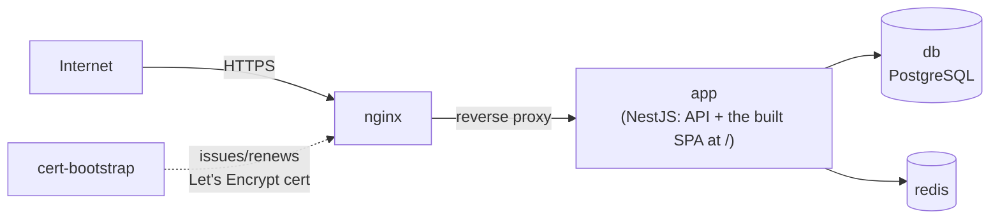
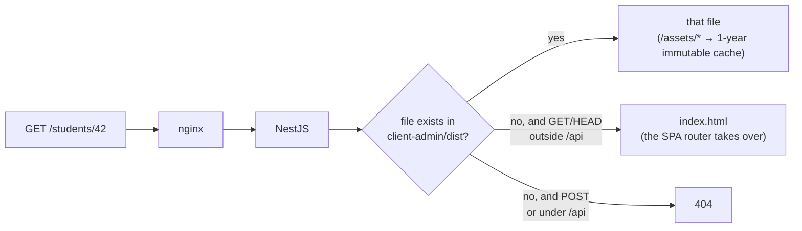

# Deployment

> Full step-by-step deploy/renewal instructions live in the root
> [`README.md`](../../README.md#docker-deployment) — this doc is just the
> shape of it, for orientation.

## Docker Compose topology

Services (`docker-compose.yml`): `app`, `db` (Postgres), `redis`, `nginx`,
`cert-bootstrap` (automated Let's Encrypt issuance — nginx self-reloads
every 6h to pick up renewed certs, see `nginx/reload-loop.sh`).

This whole stack — including automated TLS — was **not** in the original
plan, which treated Docker as a future migration. It shipped as the actual
deployment mechanism.

## Build pipeline

`yarn build:all` (`scripts/build-all.sh`) builds `shared` → `ui` →
`client-admin` → `server`, and assembles a single deployable
`build-output/` folder that can be zipped and shipped to a VPS without
Docker too — see the README's "Production Build" / "Deploy to VPS"
sections for that path.

## How a request is served

One SPA at `/` since [8.9.10] — no `/admin/` or `/student/` prefix, and no
root redirect. The rules above live in `server/src/spa-fallback.ts`
(unit-tested there); nginx's long-cache rule matches `^/assets/`
accordingly. Two behaviours this fixed: `GET /teacher/*` used to return
**500** (the directory never existed, so `sendFile` hit ENOENT with no
error callback) and `POST /admin/anything` used to return **200 + HTML**.

## CI

GitHub Actions (`.github/workflows/ci.yml`) runs, per the root README's
"CI" section: build, lint, unit tests, an integration/e2e job against a
real Postgres, a dependency audit, and a non-blocking dead-code check
(`knip`). See `ui/CONTRIBUTING.md` for the PR checklist tied to these gates.
