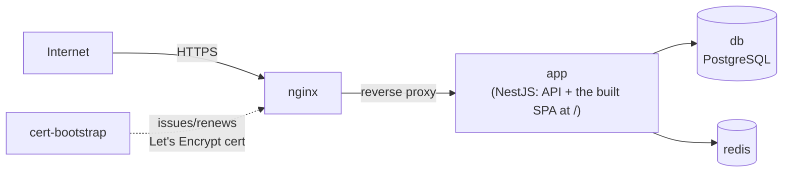
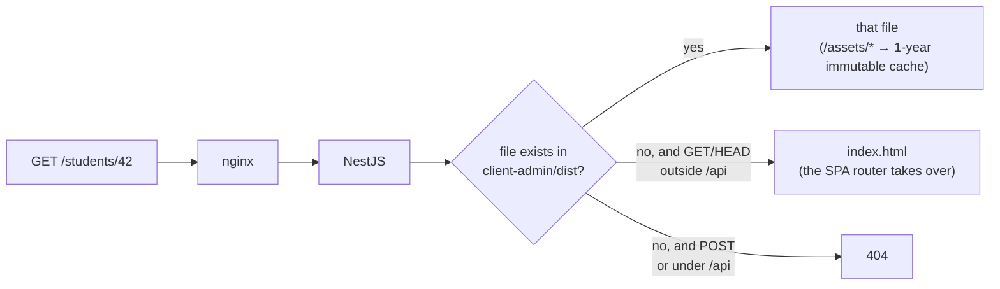

# Deployment

> Full step-by-step deploy/renewal instructions live in the root
> [`README.md`](../../README.md#docker-deployment) — this doc is just the
> shape of it, for orientation.

## Docker Compose topology



Services (`docker-compose.yml`): `app`, `db` (Postgres), `redis`, `nginx`,
`cert-bootstrap` (automated Let's Encrypt issuance — nginx self-reloads
every 6h to pick up renewed certs, see `nginx/reload-loop.sh`).

This whole stack — including automated TLS — was **not** in the original
plan, which treated Docker as a future migration. It shipped as the actual
deployment mechanism.

## Build pipeline

`yarn build:all` (`scripts/build-all.sh`) builds `shared` → `ui` →
`client-admin` → `server`, and assembles a single deployable
`build-output/` folder that can be zipped and shipped to a VPS without
Docker too — see the README's "Production Build" / "Deploy to VPS"
sections for that path.

## Error tracking and Web Vitals (Sentry)

The SPA reports errors and real-user performance (LCP/CLS/INP) to Sentry.
Three build-time knobs, all optional — every one of them missing is a
supported configuration, it just means less telemetry:

| Variable                                              | Read by                                      | Missing means                                                       |
| ----------------------------------------------------- | -------------------------------------------- | ------------------------------------------------------------------- |
| `VITE_SENTRY_DSN`                                     | the browser, at runtime                      | `initSentry` no-ops; nothing is sent                                |
| `VITE_SENTRY_TRACES_SAMPLE_RATE`                      | the browser, at runtime                      | 10% of transactions sampled (the default)                           |
| `SENTRY_AUTH_TOKEN` + `SENTRY_ORG` + `SENTRY_PROJECT` | `client-admin/vite.config.ts`, at build time | no source-map upload and no release tag; stack traces stay minified |

There is no separate deploy pipeline to hang the source-map upload on
(the build _is_ `scripts/build-all.sh`), so the upload is a Vite plugin
that only switches on when `SENTRY_AUTH_TOKEN` is present. With the
token set, the build emits `sourcemap: 'hidden'` maps, uploads them, and
deletes them from `dist/` — so users never download them:

```bash
SENTRY_ORG=biddaloy SENTRY_PROJECT=client-admin SENTRY_AUTH_TOKEN=sntrys_... \
  yarn build:all
```

The plugin also stamps the release (the git SHA by default), which is
what ties an issue in Sentry to the deploy that introduced it.

**Sentry is scrubbed allow-list style, on every egress path.**
`ui/src/api/sentry.ts` filters errors (`beforeSend`), breadcrumbs
(`beforeBreadcrumb`), transactions (`beforeSendTransaction`) and
standalone spans (`beforeSendSpan` — the path INP takes, which bypasses
the others). Free-form key/value bags are rebuilt from an allow-list, so
a field the SDK adds in a future version is dropped by default rather
than shipped unreviewed. Query strings are removed from URLs entirely,
because this app puts free text in them (`/students?search=…`), and DOM
paths in span names have their attribute selectors stripped, because
Sentry builds those from `aria-label`/`alt`/`title`.

What that does and does not promise: the mechanism is structural, not a
pattern-matcher, so it does not depend on recognising a name — but it is
only as good as the allow-list. **Adding a key to it is a decision about
data protection**, and the tests in `ui/src/api/sentry.test.ts` assert
the allow-list rather than trying to detect PII, because "no addresses"
is not something a regex can check.

## How a request is served



One SPA at `/` since [8.9.10] — no `/admin/` or `/student/` prefix, and no
root redirect. The rules above live in `server/src/spa-fallback.ts`
(unit-tested there); nginx's long-cache rule matches `^/assets/`
accordingly. Two behaviours this fixed: `GET /teacher/*` used to return
**500** (the directory never existed, so `sendFile` hit ENOENT with no
error callback) and `POST /admin/anything` used to return **200 + HTML**.

## CI

GitHub Actions (`.github/workflows/ci.yml`) runs, per the root README's
"CI" section: build, lint, unit tests, an integration/e2e job against a
real Postgres, a dependency audit, and a non-blocking dead-code check
(`knip`). See `ui/CONTRIBUTING.md` for the PR checklist tied to these gates.
