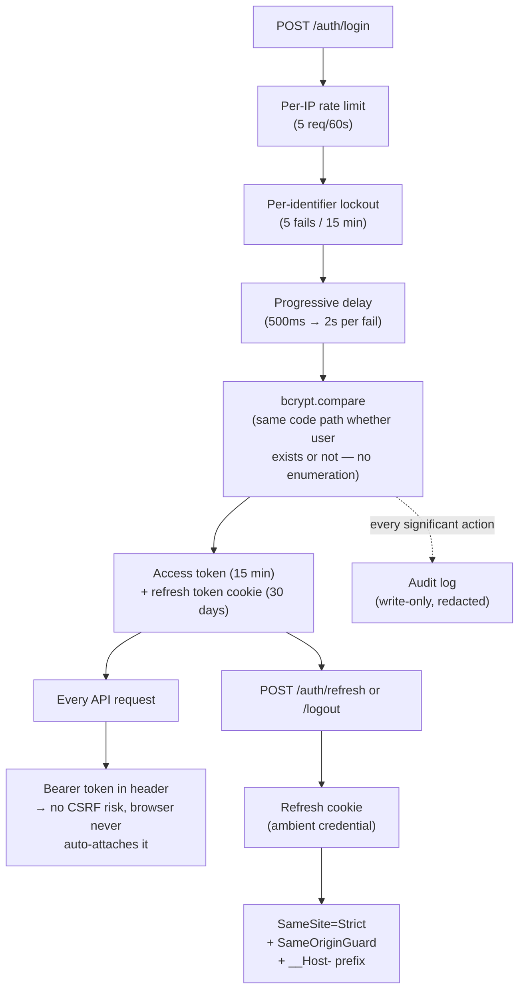
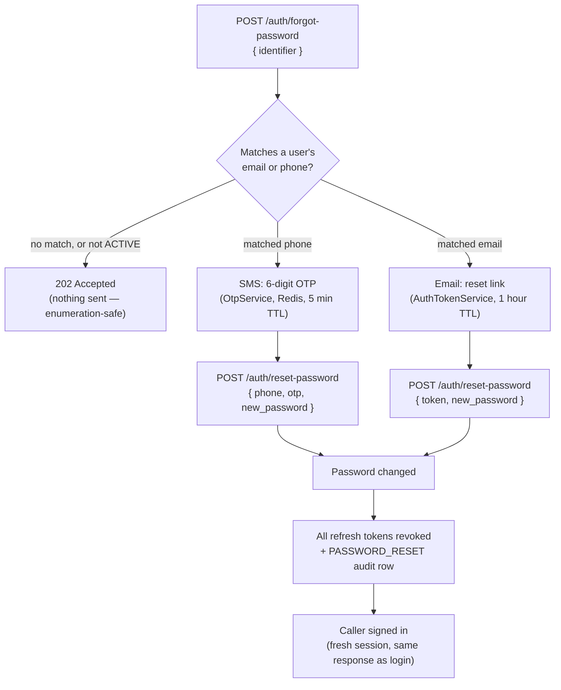

# Security

This is the deep rationale behind the auth/data-protection posture — moved
here from the root README so that README stays a practical "get the app
running" doc. See also [02-auth-and-multitenancy.md](02-auth-and-multitenancy.md)
for the higher-level shape (diagrams) this detail sits underneath.

## The layers, at a glance

Each box below is one paragraph in this doc — read the section with the
matching name for the full reasoning.

## Login brute-force protection

`POST /auth/login` layers three controls, defined in
`server/src/modules/auth/`:

- **Per-IP rate limit** — the same `strict` tier (5 requests/60s) used on
  other expensive endpoints (see `rate-limit.ts`).
- **Per-identifier lockout** (`login-attempt.service.ts`) — the normalized
  email/phone is locked out after **5 failed attempts** within a **15-minute
  window**, both Redis-backed and configurable via `LOGIN_LOCKOUT_THRESHOLD`
  and `LOGIN_LOCKOUT_WINDOW_MS`. A successful login resets the counter. The
  lock expires automatically after the window — there is no admin-reset
  path, since a pure admin-reset lock is itself a denial-of-service vector
  against a known account.
- **Progressive delay** — failures before the lockout threshold add an
  increasing delay (500ms per attempt, capped at 2s), to blunt a slow
  distributed attack without hard-locking real users on a couple of typos.

The response body, status, and code path are identical for "no such user",
"wrong password", and "locked out" — `AuthService.validateUser` always runs
`bcrypt.compare` (against a dummy hash when no user is found), so there's no
timing or content difference an attacker could use to enumerate accounts.

Both lockout and the strict rate-limit tier are disabled under
`NODE_ENV=test` — the e2e suite logs in repeatedly against the same seeded
account and would otherwise lock itself out.

## Password recovery

`POST /auth/forgot-password` and `POST /auth/reset-password`
(`server/src/modules/account-access/recovery.service.ts`) let a locked-out
user recover on their own, without an admin's help. The channel is picked
by **which field on the account the typed identifier matched** — not by
preference:

Both endpoints are public and `strict`-rate-limited, same as `/auth/login`.

- **Enumeration safety.** An unknown identifier, a suspended account, or an
  account with no matching contact all return the exact same `202` as a
  real request that dispatched something — `RecoveryService.forgot()`
  never lets the caller distinguish "sent" from "nothing to send".
- **OTP lockout** is `OtpService`'s own counter (D3, epic #409), separate
  from `login-attempt.service.ts`'s: **6 digits, 5-minute code TTL, 5 wrong
  guesses locks the identifier for 15 minutes, with a 60-second cooldown**
  between two OTP requests for the same identifier. A reset link instead
  expires outright after **1 hour** and is single-use (`AuthTokenService
.consume`) — there's no "wrong guess" to lock out.
- **Multi-tenant wrinkle (D5).** A user's login identifier lives on the
  `users` row, not on any one tenant — but _sending_ the SMS/email still
  needs one school's provider configuration (its SMS gateway credentials,
  its sender email). `forgot-password` is a user-level action with no
  acting tenant in the request (unlike an admin sending an invite, which
  has `X-Tenant-ID`), so it resolves the tenant via
  `AuthService.primaryTenantId()` — the user's **earliest membership**,
  the same "which school is this session's default" rule `login()` already
  uses for its own audit rows. A school with no provider configured yet
  falls back to the platform's env-level SMS/email config, same as every
  other `account-access` send.
- **Sessions.** On success, every refresh token for the account is revoked
  (`RefreshTokenService.revokeAllForUser`) before the caller is signed back
  in with a fresh session — mirrors `AuthService.changePassword`'s "kill
  every other session" behavior, since a password reset is exactly the
  moment an attacker who guessed or leaked the old password must be cut
  off.
- **Admin-initiated reset** (`POST /users/:id/reset-password`, ADMIN only)
  is the same machinery with one difference: the target's sessions are
  revoked **immediately**, before the OTP/link is even sent — an admin
  resetting a compromised account must not leave a live session running
  while the reset is in flight.

## Session & token lifecycle

`POST /auth/login` returns two things: a short-lived (**15 minutes** by
default, `ACCESS_TOKEN_TTL_MS`) bearer access token in the JSON body, and a
long-lived (**30 days** by default, `REFRESH_TOKEN_TTL_MS`) refresh token
set as an `httpOnly`, `__Host-`-prefixed cookie (`server/src/modules/auth/token-cookie.ts`).

**Transport decision:** bearer access token + httpOnly-cookie refresh token,
per the plan in issue #42. This is why the API's CORS config sets
`credentials: true` — it carries a cookie, not just a header — and why
**CSRF protection (issue #48) was real, required work**, not the N/A verdict
it would have been under a pure-bearer design. See "CSRF posture" below for
how that's addressed.

**Rotation and reuse detection** (`server/src/modules/auth/refresh-token.service.ts`):
every refresh token belongs to a rotation "family" started at login. Using a
refresh token invalidates it and issues a new one in the same family
(`POST /auth/refresh`). Presenting an already-used token is treated as
theft — the **entire family is revoked** and a `TOKEN_REUSE_DETECTED` audit
row is written — _unless_ it's within a 10-second grace window of its own
rotation, which is treated as two concurrent requests racing on the same
token rather than an attack, and both get a valid fresh pair instead of one
being wrongly logged out.

Refresh tokens are stored as a hash (SHA-256 of a 256-bit random secret,
selector/validator split) — the raw token is never persisted, only ever
seen by the client.

**Revocation:**

- `POST /auth/logout` revokes the presented refresh token. It does **not**
  require a live access token — the access token has likely already expired
  by the time a user gets around to logging out, and that must not block
  revoking the refresh token.
- `POST /auth/logout-all` (requires a valid access token) revokes every
  refresh token for the user and denylists the access token used to call it,
  so that specific session ends immediately rather than riding out its
  remaining ~15-minute lifetime. The denylist
  (`server/src/modules/auth/access-token-denylist.service.ts`) is a Redis
  key per `jti` with a TTL matching the access token's own lifetime — viable
  specifically because that lifetime is now short; this is not a full
  blacklist of every issued token.
- A tenant/role change (`user_tenants`) takes effect on the _next refresh_,
  not after the old token's full lifetime — `POST /auth/refresh` re-fetches
  memberships rather than copying them from the token being replaced.

Expired `refresh_tokens` rows (revoked or not) are deleted by an hourly
BullMQ job (`refresh-token-cleanup.processor.ts`/`.scheduler.ts`).

## CSRF posture

The API splits cleanly into two authentication modes, and the CSRF argument
depends entirely on which one a route uses:

- **Bearer-authenticated routes** — everything except `POST /auth/login`
  and the two cookie-authenticated routes below — read the access token
  from the `Authorization` header. Browsers never attach that header
  automatically to a request they didn't construct, so a cross-site page
  cannot make an authenticated call to these routes no matter what it does
  — there's no ambient credential to ride. This is the vast majority of
  the API and needs no CSRF handling at all; adding blanket CSRF
  middleware here would add token plumbing to every request for zero
  additional protection, which is why there isn't any.
- `POST /auth/login` requires no authentication at all — it's how a client
  obtains a token in the first place, so there's nothing for a cross-site
  request to ride: it can trigger a login with attacker-known credentials,
  but not act as the victim.
- **Cookie-authenticated routes** — `POST /auth/refresh` and
  `POST /auth/logout` — read the refresh cookie, which _is_ an ambient
  credential a browser attaches automatically. These are the only routes
  where CSRF is a real question, and they're deliberately layered:
  1. **`SameSite=Strict`** on the cookie (`token-cookie.ts`) is the primary
     defense: the browser simply never attaches it to a cross-site
     request in the first place. This alone closes the practical attack
     for this deployment, where the SPAs are served same-origin by this
     same app (`main.ts`).
  2. **`SameOriginGuard`** (`server/src/modules/auth/guards/same-origin.guard.ts`)
     checks the `Origin` header against the request's own origin as a
     second, independent layer — in case `SameSite` is ever bypassed by a
     legacy browser or a future relaxation to `Lax`. A request with no
     `Origin` header (not something a browser sends for a state-changing
     method) passes through rather than being rejected, since that shape
     of request is outside this check's threat model, not a bypass of it.
  3. The `__Host-` cookie prefix (`token-cookie.ts`) is a related but
     separate guarantee: it stops a compromised sibling origin on the same
     parent domain from ever setting a cookie that shadows this one.
- `POST /auth/logout-all` is bearer-authenticated (`AuthGuard('jwt')`, not
  the cookie) despite being auth-adjacent, so it falls in the first
  category and needs neither of the above.

**The invariant this rests on:** the SPAs are same-origin with the API. If
that ever stops being true — the SPAs move to their own domain/CDN — `Origin`
becomes cross-origin by definition and `SameOriginGuard` needs a real
allowlist (reusing `CORS_ORIGINS`) instead of a same-origin check, and
double-submit CSRF tokens become worth adding on top. Nothing about today's
implementation prevents that; it just isn't needed yet.

## Audit trail

Every significant action — login/logout, a fee-structure edit, an invoice
being generated, a payment received, a reminder sent, a student bulk upload —
is recorded to the write-only `audit_logs` table via a single entry point,
`AuditService.record()` (`server/src/modules/audit/`). No other module holds
a direct repository for this table.

- **Tenant scoping.** `audit_logs.tenant_id` is nullable, unlike other
  tenant-scoped tables: `LOGIN`/`LOGIN_FAILED` can happen against an
  unrecognized identifier _before_ a tenant is ever selected, and there is
  genuinely no tenant to attribute that attempt to. Every other action is
  tenant-scoped and always gets one. The admin read endpoint
  (`GET /audit-logs`) is itself tenant-scoped, so an unattributed row simply
  never surfaces on any tenant's trail — that's correct, not a gap.
- **Redaction.** `old_values`/`new_values` are `jsonb` snapshots, recursively
  scrubbed against a denylist (`password_hash`, `token`, `refresh_token`,
  `api_key`, `secret`, `jti`, and variants — see `redact.util.ts`) before
  they're ever written, since the write-only trigger means a bad value here
  can never be corrected after the fact.
- **Transactional vs. ancillary writes.** `record()` takes an optional
  `EntityManager`. Passed one (payment receipt, invoice-from-payment), the
  write participates in the caller's transaction and a failure rolls back
  with it — the audit row is part of the record of truth. Without one
  (login, a fee-structure edit, a reminder send), the write is ancillary to
  an already-decided outcome and fails open (catches, logs, never throws) —
  a DB hiccup on the audit write must not turn a successful action into a 500.
- **Mechanical CRUD vs. direct calls.** The `@Audited()` decorator +
  `AuditInterceptor` cover the one case where a response body alone is
  enough to write a useful record (`POST /invoices` — a pure create with no
  prior state to diff). Deliberately not a blanket interceptor: an update
  needs old-vs-new diffing the response can't provide (fee-structure
  changes call `AuditService.record()` directly, using the pre-update
  entity already fetched for validation), and a batch send needs one row
  per action rather than one per response (bulk/single reminders do the
  same).

**Retention.** The write-only trigger (`block_audit_logs_write_only`, added
in the initial migration) blocks `UPDATE` and `DELETE` on every row, so a
naive "delete rows older than N days" job cannot work — it would hit the
same trigger a manual edit would. This is documented rather than
implemented, since the table has not yet grown large enough to need it: the
mechanism that respects the write-only guarantee is range partitioning by
`created_at` (e.g. yearly), with old partitions retired via `DROP TABLE`
rather than `DELETE FROM` — a table drop isn't a row-level write the
trigger fires on. An archival job that copies old partitions to cold
storage before dropping them is the natural next step once retention
actually needs enforcing.

## Data protection: transit, at rest, and logs

This app handles student/guardian PII and payment records. The posture below
covers connection security, storage, and what does (and deliberately does
not) get encrypted at the column level.

**Transit to Postgres.** `DATABASE_URL` carries the DB password, and every
query carries whatever PII it touches, over whatever transport TypeORM is
given — a bare TCP socket unless told otherwise. `DB_SSL` (`server/src/db-ssl.ts`)
controls this:

- Unset or not `production`: SSL is off by default (a local docker-compose
  Postgres has none to negotiate), but can still be opted into by setting
  `DB_SSL=true`.
- `NODE_ENV=production`: `DB_SSL` **must** be exactly `"true"` — the app
  refuses to boot otherwise, the same "loud failure beats a silent gap"
  posture as `ENABLE_API_DOCS`'s Basic Auth requirement. Use an
  `sslmode=require`-style `DATABASE_URL` (or the managed provider's
  equivalent) alongside it.
- `DB_SSL_REJECT_UNAUTHORIZED=false` disables certificate verification —
  sometimes genuinely necessary for a managed Postgres with a self-signed
  cert, but logs a boot-time warning every time it's set, since it's also a
  common copy-paste that silently defeats the whole point of enabling TLS.
- This requirement is unconditional — it does not matter whether Postgres
  happens to be on the same private Docker network as the app. The bundled
  `docker-compose.yml`'s `db` service does not configure TLS today, so
  deploying it as-is with `NODE_ENV=production` will refuse to boot until
  that's addressed (see [07-deployment.md](07-deployment.md)) — a known gap,
  not an oversight papered over here.

**At rest.** Required as a deployment property, not an optional hardening
step: the Postgres data volume must sit on encrypted storage — either the
self-hosted compose stack's volume backed by a LUKS-encrypted (or
cloud-provider-encrypted) disk, or a managed Postgres with encryption at
rest enabled (the default on every major provider today). There is
currently no automated check for this; it's an operational requirement on
whoever provisions the host/database.

**PII column inventory** (for any future data-subject/erasure request):

| Entity             | Column(s)                                                                                                                                                                                                                        |
| ------------------ | -------------------------------------------------------------------------------------------------------------------------------------------------------------------------------------------------------------------------------- |
| `User`             | `email`, `phone`, `full_name`, `password_hash` (bcrypt, already hashed), `profile_picture_url`                                                                                                                                   |
| `Guardian`         | `full_name`, `phone`, `alternate_phone`, `email`, `address`, `occupation`                                                                                                                                                        |
| `Student`          | `full_name`, `date_of_birth`, `gender`, `home_address`                                                                                                                                                                           |
| `School`           | `address`, `phone`, `email` (tenant-level contact info)                                                                                                                                                                          |
| `RefreshToken`     | `ip_address`, `user_agent`                                                                                                                                                                                                       |
| `AuditLog`         | `ip_address`, `user_agent`, and `old_values`/`new_values` jsonb snapshots — redacted for credentials/tokens (`redact.util.ts`), but can still carry names/emails/phones since those aren't secrets by that redactor's definition |
| `CommunicationLog` | `recipient_address`, `recipient_name`, `message_body` (free text)                                                                                                                                                                |
| `Payment`          | `remarks` (free text)                                                                                                                                                                                                            |
| `Invoice`          | `notes` (free text)                                                                                                                                                                                                              |

**Column-level encryption: deliberately deferred.** The original ask was to
evaluate encrypting PII columns directly. Evaluated and not done, because it
breaks core access patterns this app depends on:

- Login (`AuthService.validateUser`) looks users up by **exact match** on
  `email`/`phone`. Encrypting those columns makes login impossible without
  a deterministic scheme or a blind index — and a deterministic scheme
  leaks equality anyway (two rows with the same email produce the same
  ciphertext), buying much less protection than it costs in complexity.
- Student/guardian name search and sort are core to every list view.
  Encrypted columns can't be `LIKE`-searched, range-scanned, or usefully
  indexed.
- The threat model volume/managed encryption at rest actually addresses is
  **stolen storage media** — a disk, volume, snapshot, or backup taken
  without valid database credentials. It does _not_ protect a `pg_dump`
  (or any other logical export) taken by someone who already has DB
  credentials: Postgres decrypts pages before returning query results, so a
  logical dump is plaintext regardless of what the underlying storage does.
  That scenario is a credential/access-control problem — least-privilege DB
  roles, credential rotation, and the audit trail (#37) — not a storage-
  encryption one, and column-level encryption wouldn't fully close it either
  (an attacker with valid app-level credentials can just query the API).

Neither at-rest volume encryption nor this deferral claims to fully defend
against a compromised, credentialed actor — that requires the access-control
and credential-hygiene work above, not a storage or column-encryption
mechanism.

This would be revisited if either changes: a regulatory requirement forcing
column-level encryption regardless of the login/search cost, or a KMS
becoming available that makes searchable/blind-index encryption practical
without hand-rolling one.

**Logs.** TypeORM's query logger (`server/src/db-logger.ts`) logs query text
but never bound parameters — the default logger appends them as a trailing
`-- PARAMETERS: [...]` comment, which is exactly where an email or phone
passed into a `WHERE` clause would otherwise land in plaintext. The global
exception filter (`AllExceptionsFilter`) redacts email- and phone-shaped
substrings, plus known-sensitive query-param values, from the request URL
and error detail before logging (`common/redact-log.util.ts`) — verified
against a _failing_ request, not just a successful one, since the leak is
usually in an error log written under debugging pressure. Request bodies
(the login path carries a plaintext password) are never logged at all.
