# Design Direction — Epic 8.13 Visual Design Layer

**Status:** approved 2026-08-28 · **Decided in:** [#342](https://github.com/tareq89/biddaloy/issues/342) · **Implemented by:** #343–#354

This is the agreed _look_ of Biddaloy: the exact type, colour, elevation,
border, density and motion values that epic 8.13 puts into the code.

**Approved mockups:** [six artboards](https://claude.ai/code/artifact/7d5dc600-404b-42b4-8067-e6997434fb7a)
— guardian portal landing (360 px, Bangla), admin invoice list (1280 px,
English) and the record-payment form, each in light and dark, rendered with
every value below.

Read this before touching `ui/tailwind.preset.ts` or
`ui/src/styles/globals.css`. It exists so that no implementation ticket has
to invent a value. Every hex, every pixel and every millisecond below was
decided here and verified here.

---

## 1. Why this document exists

Biddaloy today uses stock Tailwind defaults: `blue-600` as the brand, the
system font stack, `shadow-sm/md/lg` picked ad hoc, one border colour for
everything. That is not _wrong_ — it is _unowned_. It reads as a template.

Epic 8.13 fixes that by changing three files, which then propagate to
roughly fifty components:

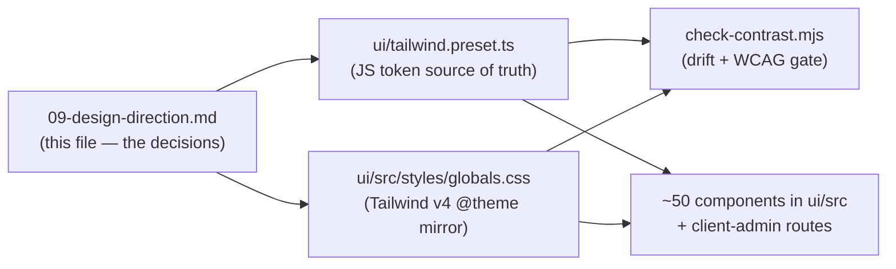

`ui/scripts/check-contrast.mjs` reads _both_ the preset and the CSS, but
it only guards names it has been told about: the raw neutral/brand scales,
radius, the status vars, and the six role vars in its `roleVarNames` map.
A token it has never heard of drifts freely. So every ticket below that
introduces a token family also extends the gate, in the same PR:

| Ticket | Adds to `ui/tailwind.preset.ts`            | Adds to `check-contrast.mjs`                                 |
| ------ | ------------------------------------------ | ------------------------------------------------------------ |
| #345   | `light.borderSubtle` / `dark.borderSubtle` | `borderSubtle: '--color-border-subtle'` in `roleVarNames`    |
| #346   | a `shadows` export (e1–e3, light + dark)   | drift check for the `--elevation-*` wiring, three scopes     |
| #347   | a `motion` export (durations, easings)     | drift check for `--motion-*` (plain `:root`, never `@theme`) |

The density vars in §6 (`--control-h`, row heights) are set per shell by a
`data-density` attribute, not declared in `@theme` — they sit outside this
gate, stated here so nobody assumes otherwise.

"Three scopes" for #346 is not a typo, and it is the one place this document
originally got the mechanism wrong. §5 below explains why; the short version
is that a shadow cannot be themed from `@theme` the way a colour can, so the
values do not live where the other families' values live.

Two families keep their values **outside** `@theme`, for two different
reasons that land on the same shape:

| Family          | Why not `@theme`                                                                  | Where the values live        |
| --------------- | --------------------------------------------------------------------------------- | ---------------------------- |
| `--elevation-*` | `@theme` shadows are inlined at build time, so dark mode cannot retheme them (§5) | plain `:root` + dark `:root` |
| `--motion-*`    | `@theme` is tree-shaken, so a token with no scanned consumer ships nothing (§7)   | plain `:root`                |

`check-contrast.mjs` guards both by scope, and additionally **compiles**
`globals.css` with the pinned Tailwind and asserts each value is present in
the build output — reading the source file alone cannot tell you what
actually shipped.

---

## 2. Typography — one superfamily, two scripts

Biddaloy renders Bengali and English side by side. A guardian sees
`পরিশোধিত ৳ ১,২০০` on the same row as a Latin date. Two unrelated
typefaces would show two different apparent weights on one line.

**Decision: Anek Latin + Anek Bangla (Ek Type), served under one CSS family
name `Biddaloy Sans`.**

Anek is a multiscript superfamily whose scripts were drawn together — shared
x-height logic, shared apparent weight, shared vertical proportions. Inter
and Geist have no Bengali sibling at all, which disqualifies them here.

Licence: SIL OFL 1.1 for both. Self-hosting is permitted.

### How the two faces are wired

One family name, split by Unicode range, so the browser picks the script
automatically with no `lang`-based CSS:

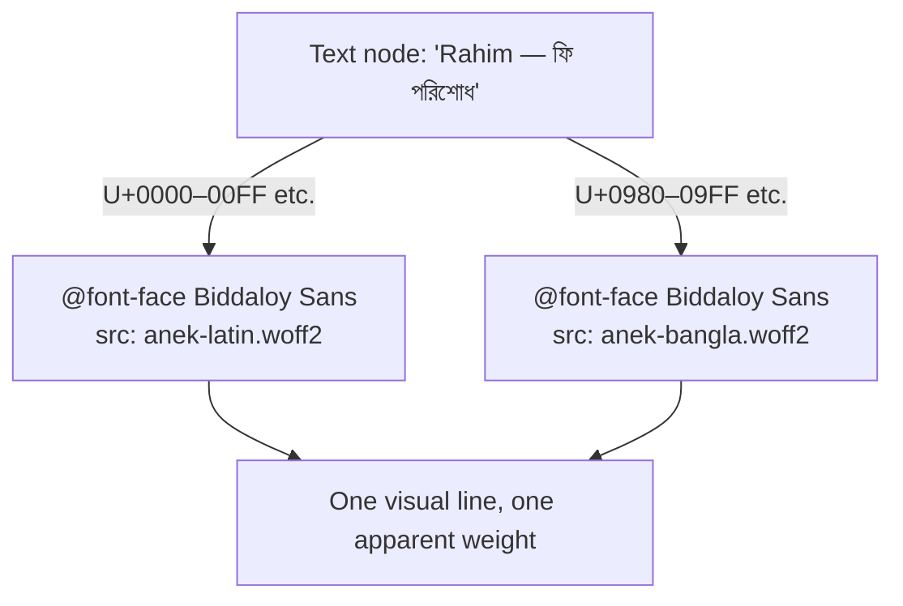

Concrete `unicode-range` values #343 must ship:

| Face           | `unicode-range`                                                                                   |
| -------------- | ------------------------------------------------------------------------------------------------- |
| Anek Latin VF  | `U+0000-00FF, U+0131, U+0152-0153, U+2013-2014, U+2018-201A, U+201C-201E, U+2022, U+2026, U+2212` |
| Anek Bangla VF | `U+0980-09FF, U+0964-0965, U+200C-200D, U+25CC`                                                   |

The Taka sign `৳` is `U+09F3`, inside the Bengali block — it comes from the
Bangla face, which is correct: it should match the Bangla numerals beside it.

Both faces: `font-display: swap`, variable `wght` axis subset to **400–800**
for Latin and **400–700** for Bangla (see the budget table below for why),
`wdth` axis **pinned to 100** via `fonttools varLib.instancer` (dropping an
axis is a large byte win and Biddaloy never uses width variation).

**Fallback stack:** `'Biddaloy Sans', system-ui, 'Segoe UI', sans-serif`, plus
a metric-matched local fallback `@font-face` using `size-adjust`,
`ascent-override`, `descent-override` and `line-gap-override` so the swap
does not move layout. The `0.1` CLS budget in `lighthouserc.cjs` currently
runs only against `/login` and `/fees/dues` (plus a seeded student-detail
URL appended in CI) — the portal landing page is not measured today. #343
adds `http://localhost:5174/portal` to that url list in the same PR,
because the portal landing is the page a font swap is most likely to
shift.

### Webfont budget

| Asset                                  | Budget (woff2) | Measured in #343        |
| -------------------------------------- | -------------- | ----------------------- |
| Anek Latin VF, subset, `wght` 400–800  | **45 KB**      | 38,720 B (37.8 KB) ✅   |
| Anek Bangla VF, subset, `wght` 400–700 | **135 KB**     | 135,952 B (132.8 KB) ✅ |
| **Total**                              | **180 KB**     | 174,672 B (170.6 KB) ✅ |

**Relief valve used.** At the originally specified `wght` 400–800 the Bangla
subset measured **141,116 B (137.8 KB)** — over budget. #343 applied the
sanctioned narrowing to 400–700, which is where the 135,952 B above comes
from. The heaviest step in the ramp is 620, so nothing in this document is
lost; only the Latin face still reaches 800.

Lighthouse CI (`lighthouserc.cjs`) throttles to 700 kbps / 400 ms RTT / 4×
CPU on a 360×640 viewport, with `LCP ≤ 4000 ms`. 180 KB at 700 kbps is
about 2.1 s of transfer, and `font-display: swap` means text paints from
the metric-matched fallback immediately — the font is not on the LCP path.

**Relief valve, if a re-subset measures over budget:** narrow the Bangla
`wght` range from 400–800 to 400–700 (already applied, see above); do not
silently exceed 180 KB.

### Measured metric-override numbers

The metric-matched fallback described above needs real numbers, which only
exist once the subsets exist. #343 measured them with
`node ui/scripts/fonts/build-fonts.mjs --metrics` and committed them into
`globals.css`:

| Fallback face                  | `size-adjust` | `ascent-override` | `descent-override` | `line-gap-override` |
| ------------------------------ | ------------- | ----------------- | ------------------ | ------------------- |
| Latin, vs `Arial`              | 113.274%      | 79.453%           | 17.656%            | 0%                  |
| Bangla, vs `Noto Sans Bengali` | 115.053%      | 108.646%          | 53.541%            | 0%                  |

Derived with the web.dev "Improved font fallbacks" formula from the shipped
subsets' own `head`/`hhea`/`OS/2` tables — Latin 2000 upm, 1800/−400/0,
xAvg 1000; Bangla 2000 upm, 2500/−1232/0, xAvg 1307.

**No preload.** The LCP reasoning above only works while the fonts stay off
the critical path: `font-display: swap` plus the metric-matched fallback
means text paints before the fonts arrive. A `<link rel="preload">` would put
170 KB back on that path, so #343 deliberately shipped none, and the PWA
precache globs in `client-admin/vite.config.ts` deliberately do not match
`.woff2` either.

### The ramp

`rem` values assume a 16 px root. Line-heights are deliberately loose:
Bengali has a taller vertical extent than Latin at the same font size.

| Step      | Size / line | Weight | Tracking | Used for                   |
| --------- | ----------- | ------ | -------- | -------------------------- |
| `display` | 28 / 36 px  | 620    | −0.01em  | Portal page title          |
| `h1`      | 22 / 30 px  | 620    | −0.01em  | Admin page titles          |
| `h2`      | 18 / 26 px  | 600    | 0        | Section headings           |
| `h3`      | 16 / 24 px  | 600    | 0        | Card headings              |
| `body-lg` | 16 / 26 px  | 400    | 0        | Portal default body        |
| `body`    | 14 / 22 px  | 400    | 0        | Admin default body         |
| `label`   | 13 / 18 px  | 500    | 0        | Form labels, table headers |
| `caption` | 12 / 17 px  | 400    | 0        | Help text, timestamps      |

Two more rules:

- **Money and number columns use `font-variant-numeric: tabular-nums`**, so
  amounts in an invoice table align on the decimal.

  Honest limitation: this works on **Latin digits only** (`REGION_BD_EN`, e.g.
  `৳ 12,345.00`). The shipped `anek-bangla.woff2` subset has no `tnum` GSUB
  feature and its Bengali digits have proportional advance widths, so
  `tabular-nums` is a **no-op on Bengali numerals** — and `bn` is the app's
  default locale (`ui/src/i18n/locale-storage.ts`). Bangla money columns
  therefore do **not** align on the decimal; we keep the class on every money
  column anyway because it is correct under `en` and harmless under `bn`.
  Fixing it properly would mean a Bangla face that ships tabular figures, which
  no subset of Anek Bangla provides, so this is a documented limitation rather
  than a promise the code cannot keep.

- **No italic faces are shipped.** This UI never needs them, and skipping
  them saves bytes on both scripts.

---

## 3. Colour — "ink on paper"

### 3.1 The brand hue

**Decision: a deep indigo we call "ink". `brand-600` becomes `#4a3fd4`,
replacing the stock `#2563eb`.**

Why indigo, and why not the obvious alternatives:

| Candidate                             | Verdict                                                                                                                                                                                |
| ------------------------------------- | -------------------------------------------------------------------------------------------------------------------------------------------------------------------------------------- |
| Tailwind `blue-600` `#2563eb` (today) | Rejected — it is the default every framework ships. It is why the product reads as unstyled.                                                                                           |
| Bangladesh green `#006a4e`            | **Rejected.** Green already means `paid` in the fees product. A green brand would make every screen look like a success state, and would force a re-grade of the whole status palette. |
| Deep indigo "ink" `#4a3fd4`           | **Chosen.** Fountain-pen ink suits a school product. It is the only hue region not already claimed by a status colour.                                                                 |

The four status colours already occupy most of the wheel — paid ≈ 140°,
partial ≈ 192°, due ≈ 40°, overdue ≈ 0°. Indigo (≈ 245°) is genuinely free.

### 3.2 The brand ramp

| Token       | Value     | Verified contrast                                               |
| ----------- | --------- | --------------------------------------------------------------- |
| `brand-50`  | `#eef1fe` | Tint only — never a text colour                                 |
| `brand-100` | `#dfe3fd` | Tint only                                                       |
| `brand-400` | `#8f96f4` | 6.66:1 on dark bg `#0f172a`; 5.46:1 on dark surface `#1e293b`   |
| `brand-600` | `#4a3fd4` | 7.11:1 on white; 6.80:1 on ground `#f8fafc`; white on it 7.11:1 |
| `brand-700` | `#3d33b8` | 8.88:1 on white; 7.89:1 on `brand-50`; 7.00:1 on `brand-100`    |

Every ratio above was computed with the same WCAG 2.2 relative-luminance
formula `ui/scripts/check-contrast.mjs` uses. They are exact, not estimates.

### 3.3 Ground and surface — the inversion

This is the single change that does the most visual work, and it costs no
new colour at all.

Today: the page is white (`light.bg = neutral[0]`) and cards are grey
(`light.surface = neutral[50]`). Cards sink into the page.

**Decision: swap the two roles.**

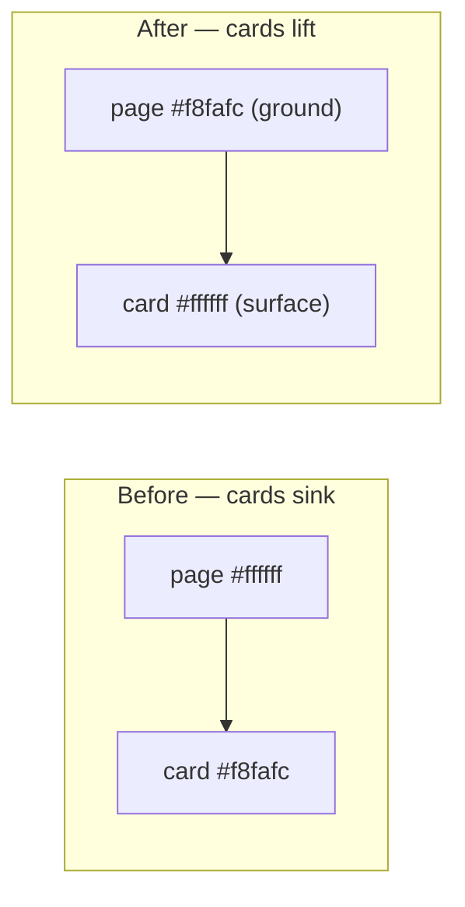

| Role                            | Before                  | After                   |
| ------------------------------- | ----------------------- | ----------------------- |
| `light.bg` (page ground)        | `neutral[0]` `#ffffff`  | `neutral[50]` `#f8fafc` |
| `light.surface` (cards, panels) | `neutral[50]` `#f8fafc` | `neutral[0]` `#ffffff`  |

**No neutral scale value changes.** Only which role points at which value.
That keeps `check-contrast.mjs`'s drift check purely mechanical.

**The role swap alone does not produce the picture below — on its own it
makes things worse.** Nearly every surface component paints
`bg-background`, and `--color-background` aliases `--color-bg` — the
_ground_ role. After the swap those components repaint `#f8fafc`. The
utility that reads the _surface_ role is `bg-card` (`--color-card` →
`--color-surface`). So the inversion ships in three parts: #344 swaps the
roles, #348 makes the page itself read the ground token, and #350 moves
every lifted surface to `bg-card`.

Between those tickets the epic branch renders an **inverted interim
state**, and this is expected rather than a defect. #344 alone leaves
`client-admin/index.html`'s `<body>` hardcoded to `bg-white` (that line is
\#348's), so cards, the bottom nav, outline buttons and the active tab
render `#f8fafc` on a white page — grey panels on white, which is exactly
the _Before_ "cards sink" picture this section sets out to fix. It is safe
to pass through because the epic merges to `main` as a **single PR**, so
no user ever sees a branch state; and because every text and border pair
on the new ground still clears AA, so accessibility does not regress while
it is in that state. Do not "fix" it inside #344 by pulling #348's or
\#350's work forward — that collapses three reviewable tickets into one.

> **Resolved by #350 ([8.13.9]).** The interim state above no longer exists
> on the epic branch. #350 moved all 15 lifted-surface call sites to
> `bg-card` — `card.tsx`, `bottom-nav.tsx`, `student-picker.tsx` (inactive
> branch), `skip-link.tsx`, `tabs.tsx`'s active trigger, `button.tsx`'s
> outline variant, `input.tsx`, `select.tsx` and `textarea.tsx` (from `bg-transparent`) and six raw
> `<select>`/`<input>` elements in `client-admin` — so cards are white on a
> `#f8fafc` ground and the _After_ picture in this section is what the app
> actually renders. Keep the paragraph: it explains why the intermediate
> commits look the way they do to anyone reading the branch history.

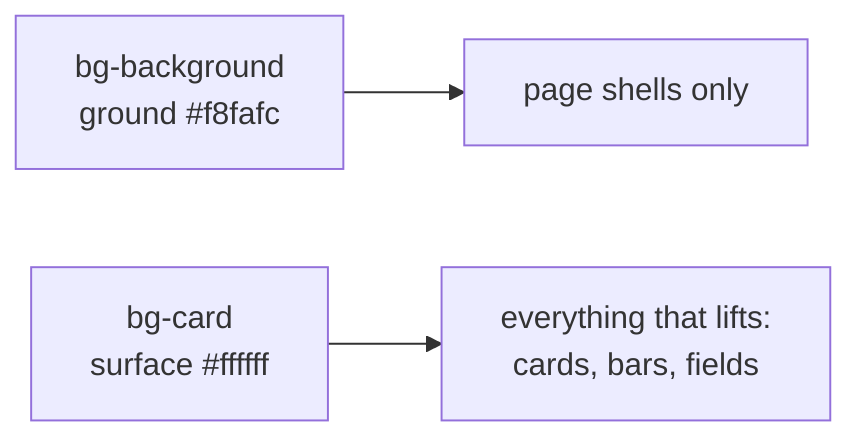

| Call site                                                                                                                                                                            | Today                               | #350 changes it to                                                                                                            |
| ------------------------------------------------------------------------------------------------------------------------------------------------------------------------------------ | ----------------------------------- | ----------------------------------------------------------------------------------------------------------------------------- |
| `ui/src/components/card.tsx:35`                                                                                                                                                      | `bg-background`                     | `bg-card`                                                                                                                     |
| `ui/src/components/bottom-nav.tsx:72`                                                                                                                                                | `bg-background`                     | `bg-card`                                                                                                                     |
| `ui/src/components/student-picker.tsx:67`                                                                                                                                            | `bg-background`                     | `bg-card`                                                                                                                     |
| `ui/src/components/skip-link.tsx:24`                                                                                                                                                 | `bg-background`                     | `bg-card`                                                                                                                     |
| `ui/src/primitives/tabs.tsx:59` (active trigger)                                                                                                                                     | `data-[state=active]:bg-background` | `data-[state=active]:bg-card`                                                                                                 |
| `ui/src/primitives/button.tsx:29` (outline variant)                                                                                                                                  | `bg-background`                     | `bg-card`                                                                                                                     |
| `ui/src/primitives/input.tsx:11`                                                                                                                                                     | `bg-transparent`                    | `bg-card` — a field reads as fillable white on the grey ground                                                                |
| `ui/src/primitives/select.tsx:38` (`SelectTrigger`)                                                                                                                                  | `bg-transparent`                    | `bg-card` — same rationale as `input.tsx`; a `<Select>` and an `<Input>` in one form row must not read as two different fills |
| `ui/src/primitives/textarea.tsx:10`                                                                                                                                                  | `bg-transparent`                    | `bg-card` — same rationale as `input.tsx`                                                                                     |
| `client-admin` raw inputs: `components/SecretField.tsx:86`, `pages/SchoolSettingsPage.tsx:75`, `pages/settings/SmsSection.tsx:172`, `pages/settings/RegionalSection.tsx:164,230,267` | `bg-background`                     | `bg-card`                                                                                                                     |

That is 15 call sites plus their tests — #350 is materially bigger than
its original "swap six shadow classes" shape. §9 says so on its row.

_Line numbers corrected while implementing #350: the outline variant is
`button.tsx:29`, not `:14`, and the active tab trigger is `tabs.tsx:59`
(`:57` is the trigger's base class string, which is where the `shadow-sm` in
§5's table lives). All 15 were applied — `select.tsx` and `textarea.tsx`
were added during review, because leaving them on `bg-transparent` made a
`<Select>`/`<Textarea>` render grey beside a white `<Input>` in the same form
row, and made the design-system `Select` disagree with the six raw
`<select>` elements this same table moved to `bg-card`. `SelectTrigger` also
picked up `disabled:bg-input/50` and `dark:disabled:bg-input/80` — it was the
one field primitive without them, and once the resting fill is opaque a
disabled select with no disabled fill is indistinguishable from an enabled
one. `textarea.tsx` already carried both._

Verified on the new `#f8fafc` ground:

| Pair                                      | Ratio   | Minimum |
| ----------------------------------------- | ------- | ------- |
| `neutral-900` text on ground              | 17.06:1 | 4.5     |
| `neutral-600` text on ground              | 7.24:1  | 4.5     |
| `neutral-500` functional border on ground | 4.55:1  | 3       |
| `brand-600` on ground                     | 6.80:1  | 4.5     |
| `paid` fg `#15803d` on ground             | 4.79:1  | 4.5     |
| `partial` fg `#0e7490` on ground          | 5.12:1  | 4.5     |
| `due` fg `#b45309` on ground              | 4.80:1  | 4.5     |
| `overdue` fg `#b91c1c` on ground          | 6.18:1  | 4.5     |

**Known consequences, each with a decided treatment** (today
`--color-secondary`, `--color-muted` and `--color-accent` in `globals.css`
are all aliases of `--color-surface`, so the swap reaches further than
cards):

1. `--color-secondary` **stays** an alias of `--color-surface`: secondary
   buttons become white pills on the grey ground. Intended — the
   fee/invoice mockup shows it. Their hover already darkens via
   `color-mix`, so the hover direction survives.

   **Known limitation, allocated to #351. #351 must ship both a token/variant
   change _and_ a real boundary — a border alone or a surface alone is not
   enough.** The white-pill reasoning holds for page-level chrome sitting on
   the ground, but not inside the card interiors this same section turns
   white. `ui/src/primitives/button.tsx` renders the secondary variant as
   `bg-secondary text-secondary-foreground`, and the shared base class string
   sets `border border-transparent` — so there is no boundary either.
   Measured, with `--color-secondary` aliasing `--color-surface`:

   | Secondary button sits on  | Button fill | Behind it | Contrast   | SC 1.4.11 needs |
   | ------------------------- | ----------- | --------- | ---------- | --------------- |
   | a `bg-card` panel (light) | `#ffffff`   | `#ffffff` | **1.00:1** | 3:1             |
   | the page ground (light)   | `#ffffff`   | `#f8fafc` | **1.03:1** | 3:1             |
   | a `bg-card` panel (dark)  | `#1e293b`   | `#1e293b` | **1.00:1** | 3:1             |

   Dark mode is the same shape, not a saving grace: `--color-secondary` and
   `--color-card` both resolve to `#1e293b`. The button is invisible in both
   themes until its `color-mix(… 5%)` hover fires — and hover is not
   available to keyboard or touch users, so it does not count.

   This is latent today — no `variant="secondary"` call site exists anywhere —
   and becomes a real defect the moment one is added. #351 owns the fix, not
   #344: changing the token value here would undo the deliberate white-pill
   decision above.

2. `--color-muted` and `--color-accent` **stop** aliasing
   `--color-surface`. Kept as aliases they turn white, and every
   `hover:bg-muted` / `focus:bg-accent` highlight becomes white-on-white —
   invisible inside a white card or popover. #344 re-points both to
   `neutral-100` `#f1f5f9` in light mode; the dark block keeps
   `var(--color-surface)`. Verified: `neutral-600` muted text on
   `#f1f5f9` is 6.92:1, `neutral-900` on it is 16.30:1.
3. The outline button (`ui/src/primitives/button.tsx:14`,
   `bg-background hover:bg-muted`) would otherwise _invert its hover
   direction_: resting grey — invisible against the grey page — and hover
   white. With the two fixes above it rests `bg-card` white and hovers to
   `#f1f5f9`, the same direction as today.
4. The AdminShell sidebar. **An earlier draft of this section described
   tokens that nothing renders.** The `--color-sidebar-*` group is dead
   code: `bg-sidebar`, `bg-sidebar-accent` and `bg-sidebar-primary` appear
   in no component in `ui/src` or `client-admin/src`. What actually paints
   the rail is `bg-muted/30` (`ui/src/components/app-shell.tsx:333`), and
   nav state is `hover:bg-accent` plus `activeProps: 'bg-accent'`
   (`app-shell.tsx:160-161`).

   So the token that really governs the nav is `--color-accent`, which
   §3.3 re-points to `neutral-100` `#f1f5f9`. The honest consequence:
   hovered and selected nav items get **darker** — a light grey wash —
   rather than lifting to white as the earlier draft claimed. The rail
   itself becomes `neutral-100` at 30% over the page. **Approved as-is**:
   a subtly tinted rail beside lifting white content is the intended
   relationship, and a darker-on-hover nav is conventional for a rail that
   is itself tinted. The `brand-50`/`brand-700` selected-item treatment
   (7.89:1, §3.6) is **not** implemented and is not implied by this
   ticket; #351 owns interactive states, and #353 owns deciding whether to
   wire the `--color-sidebar-*` group up or delete it.

### 3.4 Dark mode

| Role                                      | Value     | Change?                      |
| ----------------------------------------- | --------- | ---------------------------- |
| `dark.bg`                                 | `#0f172a` | unchanged                    |
| `dark.surface`                            | `#1e293b` | unchanged                    |
| `dark.textPrimary`                        | `#f8fafc` | unchanged                    |
| `dark.textSecondary`                      | `#cbd5e1` | unchanged                    |
| `dark.brand`                              | `#8f96f4` | **changed** — was `#60a5fa`  |
| `--color-primary-foreground` (dark scope) | `#0f172a` | **new override** — see below |

Status `fgDark` values are unchanged. Status light tints (`-bg`) stay
light-scope-only.

**White text on the dark primary button fails AA.** `globals.css:98` sets
`--color-primary-foreground: var(--color-neutral-0)` once, and the
`:root[data-theme="dark"]` block never overrides it. A dark primary button
therefore renders white on `--color-brand-400` `#8f96f4` = **2.68:1**.
\#344 adds the override `--color-primary-foreground: var(--color-neutral-900)`
to the dark block — `#0f172a` on `#8f96f4` is 6.66:1 — in the same PR that
changes `dark.brand`.

### 3.4.1 The `dark:` variant is wired to the wrong switch

The token overrides key off `:root[data-theme="dark"]`. But no
`@custom-variant dark` exists anywhere in `ui/src` or `client-admin/src`,
so Tailwind v4 compiles every `dark:` utility to
`@media (prefers-color-scheme: dark)` — the OS setting, not the attribute:

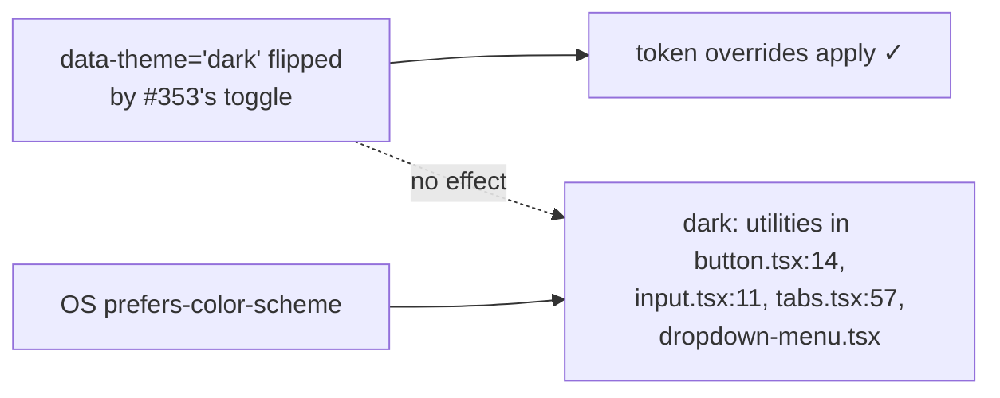

Flip the attribute on a light-OS machine and those utilities stay inert —
a half-dark UI. **#348 adds one line to `globals.css`, so it lands before
\#353 ships a toggle:**

```css
@custom-variant dark (&:where([data-theme="dark"], [data-theme="dark"] *));
```

(This is the form Tailwind v4 documents for attribute-driven dark mode;
verify against the installed 4.x minor at implementation time.)

### 3.4.2 Runtime resolution — one source of truth, no cache

[8.13.12]'s toggle (`ui/src/theme/`) resolves a `Theme` from two signals:

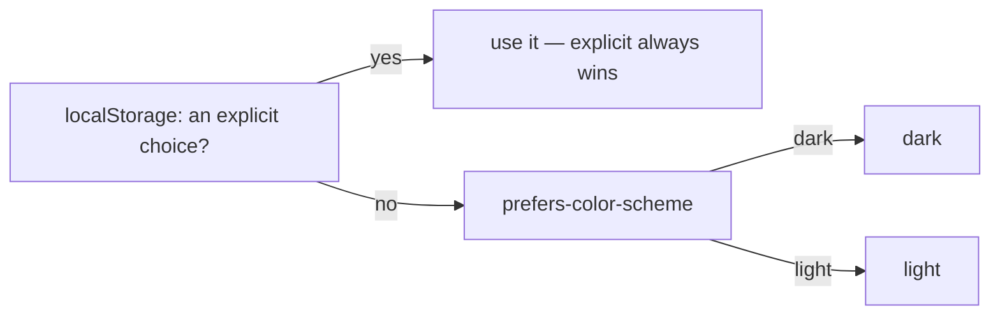

`theme-storage.ts`'s `resolveTheme(stored, systemPrefersDark)` is that whole
diagram in one line: `stored ?? (systemPrefersDark ? 'dark' : 'light')`.
`theme-provider.tsx`'s `useTheme()` deliberately holds **no cached `Theme`**
of its own — every read recomputes from storage + OS preference, so a
component can never render a value that has drifted from what
`localStorage`/`matchMedia` actually say. The one place this matters in
practice: `setExplicitTheme()` applies `computeTheme()` (the recomputed
result) to the DOM, not the raw requested value — so if `persistTheme()`
silently loses the write (quota exceeded, disabled storage), the DOM and
every future `getSnapshot()` read still agree with each other, instead of
the DOM briefly showing a choice that storage never actually recorded.

`client-admin/index.html`'s inline boot script re-implements the read half
of this in plain JS, to avoid a flash of the wrong theme before any bundle
has loaded — see that file's own comment, and keep the two in sync by hand
if the resolution rule ever changes.

### 3.4.3 Storybook: two mechanisms, one DOM attribute, a fixed mount order

Dark tokens live behind `:root[data-theme="dark"]` (§3.4.1), so nothing but
`document.documentElement` can reach them — a class or attribute on a
wrapping `<div>` cannot. Two independent pieces of Storybook config both
mutate that same document-level attribute, for different reasons:

| Mechanism              | Purpose                                                                           | Lives in                        |
| ---------------------- | --------------------------------------------------------------------------------- | ------------------------------- |
| Toolbar `theme` global | Browse the whole component tree in one theme at a time                            | `.storybook/preview.tsx`        |
| `darkDecorator`        | Pin one story dark regardless of the toolbar — a fixed reference/regression story | `.storybook/dark-decorator.tsx` |

Storybook composes the toolbar's preview-level decorator **outside** any
story-level `darkDecorator`, but React fires mount effects inner-before-outer
— so on a story using both, `darkDecorator`'s effect wins the DOM write
first, then the toolbar's effect immediately overwrites it:

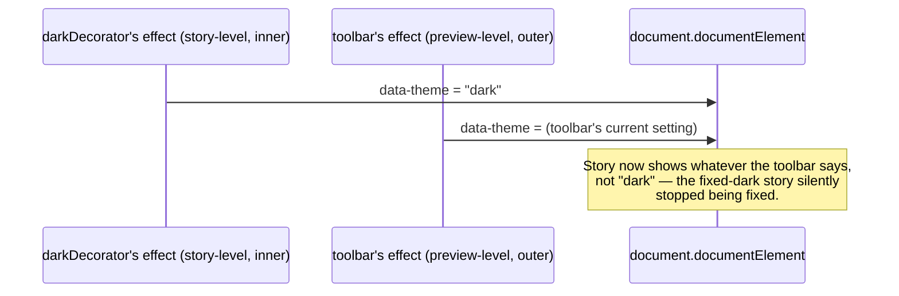

The fix is an opt-out, not a mount-order change: every story using
`darkDecorator` must also spread `darkDecoratorParameters` (`{ theme:
'fixed' }`) into its own `parameters`, which tells the toolbar's effect to
skip that story entirely. `dark-decorator.tsx`'s own file comment is the
canonical explanation (including the exported constant, so a consumer can't
drift by retyping the literal) and the warning that this already broke
silently once — a code-review catch after [8.13.12] missed 4 of 9
consumers.

### 3.5 Status colours — unchanged

All four states keep their existing `fg` / `bg` / `fgDark` values and their
paired icons (`check-circle`, `circle-half`, `clock`, `alert-triangle`).
Colour is never the only signal. This epic does not touch them.

### 3.5.1 Dark-mode status tokens — an explicit override, not a `dark:` variant

`status-badge.tsx` renders `text-status-*-fg` on `bg-status-*-bg`
unconditionally — it never grew a `dark:` variant of its own. In light mode
`-bg` is a light pastel tint (`paid` = `#dcfce7`), which is illegible under
dark tokens if inherited as-is. [8.13.12] adds a dark-scope override for
both `-fg` and `-bg` in `globals.css`'s `:root[data-theme="dark"]` block —
deep, desaturated tints rather than the light pastels above, **computed, not
eyeballed**, so each `fgDark` clears 4.5:1 against its own `bgDark`:

| Status  | Light `bg` | Dark `bg` |
| ------- | ---------- | --------- |
| paid    | `#dcfce7`  | `#052e16` |
| partial | `#cffafe`  | `#083344` |
| due     | `#fef3c7`  | `#451a03` |
| overdue | `#fee2e2`  | `#450a0a` |

`tailwind.preset.ts`'s `status.*.bgDark` doc comment carries the exact
ratios; `check-contrast.mjs` asserts every one of these dark-scope values
against the compiled CSS output (not just the source `tailwind.preset.ts`
object), the same "verify the compiled artifact" discipline §3.6 and the
elevation gate (§5) both use — a token that looks declared and reads as
working code but emits nothing is the specific failure mode this epic kept
finding.

### 3.6 `CONTRAST_PAIRS` — what actually changes in the file

Every line below is pre-computed and passes. But not every line is a new
row: `CONTRAST_PAIRS` in `ui/tailwind.preset.ts` already holds four of
them as _references_ (`brand[600]`, `brand[700]`, `dark.brand`,
`light.border`/`light.bg`), which re-verify the new values automatically
once #344/#345 change what the references point at. Two more are symmetric
duplicates, which the file's own convention skips (contrast is symmetric).
Adding those six again would be duplicates. The file gains **three new
rows and two literal updates**, all in #344:

| Name                                      | fg        | bg        | min | actual | Status in `CONTRAST_PAIRS`                                                                        |
| ----------------------------------------- | --------- | --------- | --- | ------ | ------------------------------------------------------------------------------------------------- |
| brand-600 text on white                   | `#4a3fd4` | `#ffffff` | 4.5 | 7.11   | exists — `brand[600]` ref, auto-updates                                                           |
| white on brand-600 (primary button)       | `#ffffff` | `#4a3fd4` | 4.5 | 7.11   | symmetric of the row above — no entry                                                             |
| brand-700 text on white                   | `#3d33b8` | `#ffffff` | 4.5 | 8.88   | exists — `brand[700]` ref, auto-updates                                                           |
| brand-700 on brand-50 (selected nav item) | `#3d33b8` | `#eef1fe` | 4.5 | 7.89   | **add**                                                                                           |
| brand-600 on ground                       | `#4a3fd4` | `#f8fafc` | 4.5 | 6.80   | **add**                                                                                           |
| brand-400 on dark bg                      | `#8f96f4` | `#0f172a` | 4.5 | 6.66   | exists — `dark brand text on dark bg`, `dark.brand` ref                                           |
| brand-400 on dark surface                 | `#8f96f4` | `#1e293b` | 4.5 | 5.46   | **add**                                                                                           |
| dark primary-button text on brand-400     | `#0f172a` | `#8f96f4` | 4.5 | 6.66   | symmetric of `brand-400 on dark bg` — no entry                                                    |
| functional border on ground               | `#64748b` | `#f8fafc` | 3   | 4.55   | exists — `light border on light bg`, `light.border`/`light.bg` refs                               |
| muted-foreground on muted                 | `#475569` | `#f1f5f9` | 4.5 | 6.92   | **update** — the literal row's bg moves `neutral[50]` → `neutral[100]`, per §3.3's muted re-alias |
| secondary-foreground on secondary         | `#0f172a` | `#ffffff` | 4.5 | 17.85  | **update** — the literal row's bg moves `neutral[50]` → `neutral[0]`, per the inversion           |

The existing `light textPrimary on light bg` / `light textSecondary on
light bg` pairs re-verify the new ground role automatically, because they
reference `light.bg` rather than a literal.

**`--color-border-subtle` gets no pair, on purpose.** It is decorative — the same
`neutral-200` `#e2e8f0` that today's comment already documents as ~1.2:1 on
white and unfit for anything conveying state. See §4.

---

## 4. Borders — two roles, not one

Today `light.border` and `dark.border` are both `neutral[500]` `#64748b`,
and `card.tsx` draws its outline with it. A 4.55:1 line around every card
is visually loud: it is a _control_ border doing a _decoration_ job.

**Decision: split into two named roles.**

| Role                        | Light                   | Dark                    | Use for                                                               |
| --------------------------- | ----------------------- | ----------------------- | --------------------------------------------------------------------- |
| `--color-border-subtle`     | `neutral-200` `#e2e8f0` | `neutral-700` `#334155` | Card outlines, dividers, table rules — decoration                     |
| `--color-border-functional` | `neutral-500` `#64748b` | `neutral-500` `#64748b` | Inputs, selects, checkboxes, anything focus-adjacent — must clear 3:1 |

Concretely, `ui/src/components/card.tsx:35` read, before #350:

```text
'rounded-lg border border-border bg-background'
```

After #345 + #346 + #350 it reads, and now really does read:

```text
'rounded-lg border border-border-subtle bg-card shadow-e1'
```

A hairline and a lift, instead of a hard outline on a grey panel.

**Where the functional role stays.** #350 routed ~55 `border-border` call
sites to `border-border-subtle`. Four lines were deliberately left on
`border-border` (which aliases the functional role) because the edge _is_ the
control affordance — remove it and the user cannot tell the thing is
pressable:

| Kept functional                                              | Why                                     |
| ------------------------------------------------------------ | --------------------------------------- |
| `ui/src/components/data-table.tsx:576`, `:584`               | Prev/next pagination buttons            |
| `ui/src/components/student-picker.tsx:67`                    | Unselected child option (selectable)    |
| `ui/src/primitives/button.tsx:29`                            | The `outline` button variant's own edge |
| `client-admin/.../payments/-record/find-student-step.tsx:49` | Search-result row, a button             |

`border-input` sites are already functional through the `--color-input`
alias and were left alone.

**Utility names, exactly.** Tailwind v4 derives the utility from the full
variable name after the namespace: `--color-border` → `border-border`, so
`--color-border-subtle` → **`border-border-subtle`** and
`--color-border-functional` → **`border-border-functional`**. There is no
`border-subtle` utility — written that way the class compiles to no colour
rule at all and the border falls back to a black `currentColor` hairline.
(`--shadow-e1` → `shadow-e1` is fine: the `shadow` namespace strips.)

Contrast rule: functional borders are gated at 3:1; subtle borders are
exempt because they never convey state. If a border ever _does_ convey
state (an error field, a selected row), it uses the functional role.

---

## 5. Elevation — three steps, each with a job

`ui/src` currently uses `shadow-sm` once, `shadow-md` three times and
`shadow-lg` twice, chosen ad hoc. Three named steps replace them.

| Token                                                | Light                                                                           | Dark                                                                      |
| ---------------------------------------------------- | ------------------------------------------------------------------------------- | ------------------------------------------------------------------------- |
| `--shadow-e1`<br/>_cards, resting panels, tabs_      | `0 1px 2px 0 rgb(15 23 42 / 0.05), 0 1px 3px 0 rgb(15 23 42 / 0.06)`            | `0 1px 2px 0 rgb(0 0 0 / 0.40), 0 1px 3px 0 rgb(0 0 0 / 0.45)`            |
| `--shadow-e2`<br/>_dropdown, select, popover_        | `0 4px 6px -1px rgb(15 23 42 / 0.07), 0 8px 24px -4px rgb(15 23 42 / 0.10)`     | `0 4px 6px -1px rgb(0 0 0 / 0.50), 0 8px 24px -4px rgb(0 0 0 / 0.55)`     |
| `--shadow-e3`<br/>_dialog, drawer, toast, skip-link_ | `0 12px 24px -6px rgb(15 23 42 / 0.14), 0 24px 48px -12px rgb(15 23 42 / 0.18)` | `0 12px 24px -6px rgb(0 0 0 / 0.60), 0 24px 48px -12px rgb(0 0 0 / 0.65)` |

**Dark-mode rule:** a shadow alone does not read on `#0f172a`. So every
elevated surface in dark mode _also_ carries a 1px subtle border
(`border-border-subtle`, `#334155` in dark). Elevation in dark mode is a
border-plus-shadow pair, never a shadow alone.

### How these are actually wired (corrected in [8.13.5])

The obvious wiring — put the light values on `--shadow-e1..e3` in `@theme`
and override the same names in the dark block — **does not work**, and fails
silently. Tailwind v4 treats a `--shadow-*` theme variable as a build-time
value and inlines it into the utility rather than emitting a `var()`:

```css
/* what `--shadow-e1: 0 1px 2px 0 rgb(15 23 42 / 0.05)` in @theme compiles to */
.shadow-e1 {
  --tw-shadow: 0 1px 2px 0 var(--tw-shadow-color, rgb(15 23 42 / 0.05));
}
```

The numbers are baked in, so `.shadow-e1` never reads `--shadow-e1` at
runtime and a dark-block override of that name is dead CSS. No error, no
warning — dark mode just silently keeps the light shadow. Colour roles do not
have this problem because `bg-background` compiles to
`background-color: var(--color-bg)`.

The fix is one hop of indirection. `@theme` points the shadow at a plain
custom property; the values live in ordinary `:root` blocks, which are
runtime and therefore themeable:

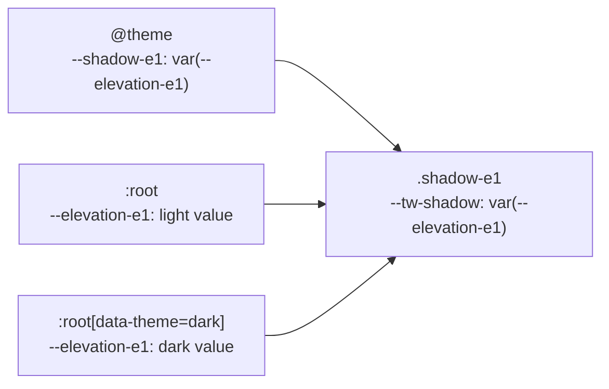

So three scopes, and `check-contrast.mjs` guards all three: `@theme` must
hold the `var(--elevation-*)` reference (not a literal — that is the
regression this catches), plain `:root` must hold `shadows.light`, and
`:root[data-theme="dark"]` must hold `shadows.dark`. Comparison is
character-exact, so `0.40` may not be shortened to `0.4`.

The values in the table above are unchanged by this correction; only where
they are written changed.

One accepted limitation: Tailwind's shadow-colour modifier (`shadow-e1/50`,
`shadow-e1 shadow-brand-600`) cannot reach inside an opaque `var()`, so it
has no effect on these steps. Nothing in the repo uses it.

Existing call sites map one-to-one — #350 makes these edits:

| File                                      | Today       | Becomes     |
| ----------------------------------------- | ----------- | ----------- |
| `ui/src/primitives/tabs.tsx:57`           | `shadow-sm` | `shadow-e1` |
| `ui/src/primitives/select.tsx:64`         | `shadow-md` | `shadow-e2` |
| `ui/src/primitives/popover.tsx:29`        | `shadow-md` | `shadow-e2` |
| `ui/src/primitives/dropdown-menu.tsx:36`  | `shadow-md` | `shadow-e2` |
| `ui/src/primitives/dropdown-menu.tsx:233` | `shadow-lg` | `shadow-e3` |
| `ui/src/components/skip-link.tsx:24`      | `shadow-lg` | `shadow-e3` |
| `ui/src/primitives/dialog.tsx:56`         | _none_      | `shadow-e3` |

The `dialog.tsx` row was added during #350. The table was written by reading
the source for existing `shadow-*` utilities, and `DialogContent` had none —
it carried only `ring-1 ring-foreground/10`. But the `--shadow-e3` row above
names _dialog_ as the first thing that step is for, so a dialog with no
elevation at all was a gap in the contract, not a deliberate exemption.

**Dark mode on ring-carrying overlays.** The dark-mode rule above ("every
elevated surface also carries a 1px subtle border") prescribes a _border_,
and five overlays — `popover.tsx:29`, `select.tsx:64`, `dropdown-menu.tsx:36`
and `:233`, `dialog.tsx:56` — draw their edge with `ring-1
ring-foreground/10` instead. Adding a border to those would give them two
concentric edges. They satisfy the rule by **recolouring the ring they
already have**: `dark:ring-border-subtle` re-points `--tw-ring-color` at
`#334155` in dark mode, which is the same 1px `border-border-subtle` edge the
rule asks for, drawn by the utility already present.

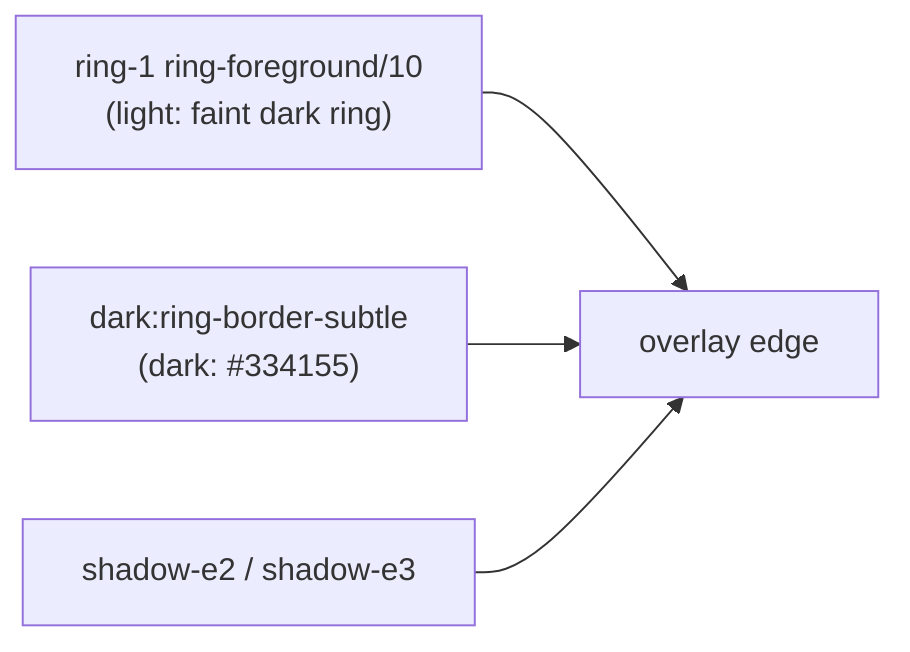

Surfaces that draw a real border — `Card`, `bottom-nav`, the active tab —
satisfy the rule directly through `border-border-subtle`, whose dark value
is already `#334155`.

### The gate (added in [8.13.9])

`ui/scripts/check-raw-palette.mjs` now fails the build on any raw Tailwind
shadow-scale class (`shadow-sm`, `focus-visible:shadow-lg`, …) anywhere in
`ui/src` or a `client-*` app, and on an inlined arbitrary shadow value
(`shadow-[0_1px_2px_rgb(0_0_0/0.1)]`) — which is the same escape hatch written
the most direct way there is. `shadow-none`, `shadow-e1/e2/e3` and
`shadow-[var(--…)]` stay legal. The reason is the same one this section already
explains: Tailwind inlines the literal rgba value, so a shadow written that way
can never follow the theme, and nothing reports an error when it doesn't.

Two deliberate limits on the gate, both settled in review:

- **`drop-shadow-*` is not banned.** There is no `--drop-shadow-e*` token and
  `filter: drop-shadow()` cannot take a `box-shadow` value, so the ban demanded
  a replacement that does not exist. A gate with no green path is a gate people
  switch off. Add the tokens first if a themed drop-shadow scale is ever needed.
- **Comments are stripped before scanning.** The scan is a raw line match, so it
  could not tell a `className` from prose about one: the explanatory comment in
  `ui/src/foundations/elevation.stories.tsx` had to be reworded around the regex
  rather than saying what it meant. It now says what it means, and
  `ui/scripts/check-raw-palette.spec.mjs` holds that as a negative test.

`ui/scripts/check-raw-palette.spec.mjs` covers the rules directly — every banned
spelling and, more importantly, every legal one — because a check whose only
test is "the repo passes today" cannot tell a working rule from a rule that
matches nothing.

### tailwind-merge has to know the elevation scale

`cn()` (`ui/src/primitives/lib/utils.ts`) extends tailwind-merge so `e1`/`e2`/
`e3` are members of the real `shadow` class group. Stock tailwind-merge has
never heard of them: it parses `shadow-<unknown>` as a shadow _colour_, files
`shadow-e1` under `shadow-color`, and then finds no conflict with `shadow-none`
or `shadow-md`, which live in the `shadow` group.

```js
twMerge('shadow-e1', 'shadow-none'); // -> 'shadow-e1 shadow-none'   ← both
cn('shadow-e1', 'shadow-none'); // -> 'shadow-none'             ← fixed
```

That mattered the moment `card.tsx` baked `shadow-e1` into its base string:
`<Card className="shadow-none">` only _looked_ flat because `.shadow-none` is
emitted after `.shadow-e1` in the compiled stylesheet. The caller's override was
silently riding on source order. Registering the scale fixes it once for every
component that uses `cn`, and colour modifiers still merge correctly
(`cn('shadow-e1', 'shadow-brand-600')` keeps both — a size and a colour do not
conflict).

`ui/scripts/check-contrast.mjs` compiles the seven surface utilities this
section and §3.3/§4 depend on — `bg-card`, `border-border-subtle`,
`border-border-functional`, `shadow-e1/e2/e3`, `dark:ring-border-subtle` — and
asserts each produced the declaration it is named after. It also compiles the
near-miss `border-subtle` and asserts it produces **nothing**, because that is
the trap: the utility name is the token name minus the `--color-` prefix, so
`border-subtle` matches no colour utility, emits no rule, and leaves a black
`currentColor` hairline with no error anywhere.

---

## 6. Density — two numeric modes

"Comfortable" and "compact" are not adjectives here. They are numbers.

|                                        | **compact**<br/>staff routes (AdminShell), default | **comfortable**<br/>`/portal`, auth screens |
| -------------------------------------- | -------------------------------------------------- | ------------------------------------------- |
| Control height (button, input, select) | 32 px (today's `h-8`)                              | **44 px**                                   |
| Minimum interactive target             | 24 px (existing e2e gate)                          | **44 px** (WCAG SC 2.5.5)                   |
| Table / list row                       | 40 px                                              | ≥ 48 px                                     |
| Card padding                           | 16 px                                              | 20 px                                       |
| Page gutter                            | 24 px (desktop)                                    | 16 px (at 360 px)                           |
| Section gap                            | 24 px                                              | 24 px                                       |
| Default body step                      | `body` 14/22                                       | `body-lg` 16/26                             |

Why two: a staff member scanning 200 fee rows wants information density. A
guardian on a 360 px phone tapping one button wants a 44 px target.

**Mechanism (this is the direction #349 implements):** a
`data-density="comfortable"` attribute sets CSS variables (`--control-h`,
`--row-h`) for the routes that want them. The size classes in
`ui/src/primitives/button.tsx` and `input.tsx` do **not** read any
variable today — they are literal `h-8` / `h-7` / `size-8`. #349 rewrites
each one to `h-[var(--control-h,<today's height>)]` (and
`size-[var(--control-h,<today's size>)]` for icon variants): where the
variable is unset — every compact shell — the fallback keeps today's exact
height, and the comfortable shell lifts every variant with one declaration,
`--control-h: 2.75rem`.

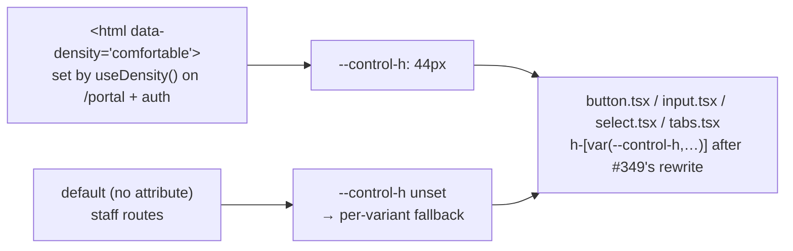

**The attribute goes on `document.documentElement`, not on a wrapper around
the shell.** `ui/src/hooks/use-density.ts` (`useDensity('comfortable')`) sets
it on mount and restores the previous value on unmount, the same shape
`.storybook/dark-decorator.tsx` uses for `data-theme`.

A wrapper `<div data-density="comfortable">` looks like it should work —
custom properties inherit down the DOM tree, so even a `position: fixed`
descendant resolves `--control-h` from an ancestor. It fails for a different
reason: **React portals**. Radix mounts `Dialog`, `Select`, `DropdownMenu`,
`Popover` and `Tooltip` content into `document.body` (see
`primitives/dialog.tsx` — `DialogPrimitive.Portal` with no `container`), so
that content is a sibling of the app root and inherits from `<html>`, never
from a wrapper inside it. On the guardian surface that is not a corner case:

| Portalled thing                                           | What a wrapper would have missed                                                 |
| --------------------------------------------------------- | -------------------------------------------------------------------------------- |
| `app-shell.tsx` mobile off-canvas nav (a `DialogContent`) | its close button (`size="icon-sm"`) and every nav link — 28 px on a 360 px phone |
| `locale-switcher.tsx` on `/login`, `/select-school`       | the `MenuContent` items, while the trigger itself grew to 44 px                  |

`document.documentElement` is an ancestor of `document.body`, so portalled
content inherits like everything else.

The complete per-variant mapping #349 implements — every size variant
clamps to 44 px under comfortable, because WCAG SC 2.5.5 has no "small"
exception and `xs`/`sm` exist for dense staff tables, which are compact:

| Size variant           | Today (compact keeps it via fallback) | Comfortable |
| ---------------------- | ------------------------------------- | ----------- |
| `button` `default`     | `h-8` — 32 px                         | 44 px       |
| `button` `xs`          | `h-6` — 24 px                         | 44 px       |
| `button` `sm`          | `h-7` — 28 px                         | 44 px       |
| `button` `lg`          | `h-9` — 36 px                         | 44 px       |
| `button` `icon`        | `size-8` — 32 px                      | 44 px       |
| `button` `icon-xs`     | `size-6` — 24 px                      | 44 px       |
| `button` `icon-sm`     | `size-7` — 28 px                      | 44 px       |
| `button` `icon-lg`     | `size-9` — 36 px                      | 44 px       |
| `input.tsx`            | `h-8` — 32 px                         | 44 px       |
| `select.tsx` `default` | `data-[size=default]:h-8` — 32 px     | 44 px       |
| `select.tsx` `sm`      | `data-[size=sm]:h-7` — 28 px          | 44 px       |
| `tabs.tsx` `TabsList`  | `h-8` (horizontal) — 32 px            | 44 px       |

The two `select.tsx` rows were added during #349 and were not in this
table's first draft. A `Select` trigger is a control exactly like `button`
and `input` — it just carries its height on a `data-[size=…]` variant rather
than a plain class, which is why a first read missed it. Left out, a
`<Select>` on `/portal` would have stayed 32 px next to 44 px neighbours,
and the e2e gate would have failed on a control this contract never named.

**Checkbox and radio are the one exception to the `--control-h` rule.**
`primitives/checkbox.tsx` and `primitives/radio-group.tsx` are 16 px boxes
(`size-4`) whose real target is a negative-inset `::after` pseudo-element.
The visible box is small on purpose — growing it to 44 px would make a
checkbox the size of a button. Their effective target today is 40x32 px,
which clears SC 2.5.8's 24 px but not SC 2.5.5's 44 px. So they read a second
variable, `--target-inset`, set to `0.875rem` (14 px) in the comfortable
block: 16 + 2 x 14 = 44 on both axes. One variable, a different fallback per
axis, because the compact insets are asymmetric while the comfortable one is
square:

```text
after:-inset-x-[var(--target-inset,0.75rem)]   compact 12px -> comfortable 14px
after:-inset-y-[var(--target-inset,0.5rem)]    compact  8px -> comfortable 14px
```

**Known constraint — checkbox/radio targets can overlap.** The `::after`
extension is not clipped, so two adjacent boxes closer together than twice
the inset share hit area, and in the overlap the later-painted one wins the
click. The minimum safe gap between two 16 px boxes is therefore:

| Mode        | Inset | Minimum gap between boxes | Row pitch |
| ----------- | ----- | ------------------------- | --------- |
| compact     | 12 px | 24 px                     | 40 px     |
| comfortable | 14 px | 28 px                     | 44 px     |

`RadioGroup`'s default `gap-2` (8 px) is below that in **both** modes — this
predates #349, which only widens the overlap. It is not a live bug today: no
comfortable route renders a multi-item checkbox or radio group. The first
screen that does must set its own spacing rather than take the default, and
`e2e/responsive/target-size.spec.ts` measures size, not overlap, so it will
not catch this for you.

**Not in scope for #349:** the table-row, card-padding, page-gutter and
body-step rows of the first table. `--row-h` is named in the mechanism sketch
above but has no consumer — no `/portal` route renders `DataTable` today, and
inventing one to carry the variable would be worse than leaving it to the
ticket that first needs it.

**No component prop API changes.** No `<Button density="...">`. That
satisfies the epic's constraint that this layer stays invisible to callers.

---

## 7. Motion — three durations, two easings

| Token                    | Value                        | Used by                            |
| ------------------------ | ---------------------------- | ---------------------------------- |
| `--motion-duration-fast` | `120ms`                      | Hover, focus ring, active          |
| `--motion-duration-base` | `180ms`                      | Dropdown, popover, select, tooltip |
| `--motion-duration-slow` | `240ms`                      | Dialog, drawer, toast              |
| `--motion-ease-standard` | `cubic-bezier(0.2, 0, 0, 1)` | Enter and move                     |
| `--motion-ease-exit`     | `cubic-bezier(0.4, 0, 1, 1)` | Exit                               |

That is the entire motion vocabulary. Nothing else animates.

**These live in a plain `:root`, not in `@theme`.** Tailwind v4 tree-shakes
`@theme`: a custom property declared there is emitted only once the class
scanner sees a utility that reads it. Because `--motion-*` is not one of
Tailwind's utility namespaces (`--duration-*` and `--ease-*` are), no utility
ever reads these names, so an `@theme` declaration compiles to **zero bytes**
— verified against the pinned tailwindcss 4.3.3, not assumed. The first
consumer to reach for one outside a scanned class (a hand-written rule, a
`style={{ transitionDuration: 'var(--motion-duration-base)' }}`, a class name
assembled at runtime) would then resolve an undefined variable, compute
`transition-duration: 0s`, and silently not animate. This is the same trap
§5's shadow inlining sets, arrived at from the other direction.

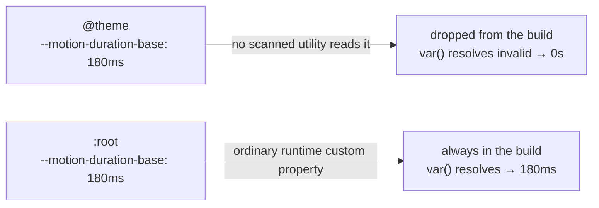

A plain `:root` costs nothing and works with Tailwind's arbitrary
custom-property syntax exactly as a theme variable would:

```html
<button
  class="transition-colors duration-(--motion-duration-fast) ease-(--motion-ease-standard)"
></button>
```

`check-contrast.mjs` compiles the stylesheet and fails if any of the five
values is absent from the output, so this cannot regress unnoticed.

**Amendment ([8.13.10]):** the table above assigns durations to utilities
that did not exist when #347 wrote it — `animate-in`, `fade-in-0`,
`zoom-in-95`, `slide-in-from-*` are not Tailwind v4 core, and this repo did
not depend on anything that defined them, so every overlay's enter/exit
class strings compiled to nothing and every overlay snapped open with no
animation at all. `tw-animate-css@^1.4.0` (imported in `globals.css`
immediately after `@import "tailwindcss"`) is the Tailwind v4 successor to
`tailwindcss-animate` and is what actually provides `animate-in` and the
rest — installing it is what makes the seven already-written class strings
across the five overlay primitives (popover, tooltip, dialog, dropdown-menu,
select) live. Durations still bind exactly as this section already
documents: `tw-animate-css` reads Tailwind's own `--tw-duration`, which
`duration-(--motion-duration-base)` / `duration-(--motion-duration-slow)`
set per component, so no separate binding mechanism was needed once the
package existed. `scripts/check-contrast.mjs` compiles this stylesheet and
asserts a canary set of those utilities produce real rules, so removing the
import fails a gate rather than silently re-deadening the animations.

**Reduced motion is global, not per-component.** #347 adds one rule in
`globals.css`:

```css
@media (prefers-reduced-motion: reduce) {
  *,
  *::before,
  *::after {
    animation-duration: 0.01ms !important;
    animation-iteration-count: 1 !important;
    transition-duration: 0.01ms !important;
    scroll-behavior: auto !important;
  }
}
```

`0.01ms` rather than `0s` on purpose: at `0s` the browser skips the
transition entirely and never dispatches `transitionend`, so any code
awaiting that event hangs. At `0.01ms` the transition still runs, lands its
end state, and fires the event within a frame. `e2e/reduced-motion.spec.ts`
asserts that by awaiting the event, not by reading the duration back.

One sharp edge to know about before anyone reaches for an `!important`
animation utility: per CSS Cascade 5, **layer order is reversed for
`!important` declarations**. A normal declaration in a later layer wins, but
an `!important` one in an _earlier_ layer wins — and unlayered `!important`
declarations lose to `!important` declarations inside any layer. This rule is
unlayered, so a `!` modifier on an animation utility (which Tailwind emits
into `@layer utilities`) would beat it. Nothing in the repo does that today;
if something ever needs to, the rule has to move into a layer rather than
gain more `!important`.

---

## 8. Brand colour outside the token files

Several places hardcode the brand hex outside `ui/`. All must change to
`#4a3fd4` in **#344**, or the PWA install banner, the browser tab and the
mobile browser chrome will keep showing the old blue:

| File                                         | What                              |
| -------------------------------------------- | --------------------------------- |
| `client-admin/index.html:18`                 | `<meta name="theme-color">`       |
| `client-admin/src/pwa/manifest.ts:30`        | `THEME_COLOR`                     |
| `client-admin/src/pwa/manifest.test.ts:38`   | the assertion on that constant    |
| `client-admin/public/favicon.svg:2`          | the `<rect fill>` behind the "B"  |
| `client-admin/public/icons/pwa-192.png`      | raster install icon (same mark)   |
| `client-admin/public/icons/pwa-512.png`      | raster install icon (same mark)   |
| `client-admin/public/icons/maskable-512.png` | maskable install icon (same mark) |

The bottom four rows were missed when this section was first written and
were found during #344; recorded here per §10.3. There is no SVG→PNG step
in the repo and no rasteriser on the build image, so the three PNGs were
re-coloured in place rather than re-rendered: each pixel's blend fraction
between the old brand and white was solved from its own channels and
re-mixed against the new brand, leaving geometry, alpha and dimensions
byte-identical. Anything that changes the icon _shape_ still needs a real
rasteriser.

Separately, `client-admin/index.html:20` currently hardcodes
`class="bg-white text-zinc-900 dark:bg-zinc-900 dark:text-zinc-100"` on
`<body>`. #348 replaces it with `class="bg-background text-foreground"` so
the body follows the tokens instead of raw Tailwind zinc.

Two more #348 edits ride along with that change:

- `client-admin/src/pwa/manifest.ts:64` sets `background_color: '#ffffff'`,
  and its own comment justifies white by "the app boots onto a white
  surface (index.html's bg-white)" — the very premise #348 removes. Left
  alone, the PWA splash flashes white and then snaps to the `#f8fafc`
  ground. #348 sets it to `#f8fafc`, rewrites that comment, and updates
  the assertion at `client-admin/src/pwa/manifest.test.ts:40`.
- the `@custom-variant dark` line from §3.4.1, so the `dark:` utilities it
  stops relying on in `index.html` are re-wired to `data-theme` for
  everything else before #353 ships a toggle.

---

## 9. What each ticket receives

This table is the contract. If a downstream ticket needs a value that is
not here, that is a gap in this document — reopen #342 rather than
inventing one.

| Ticket                                          | Receives from this document                                                                                                                                                                                                                                                                                                                                                                                                                                                                                                                                                                                                                                                                                                                                                                                                                                                                                                                       |
| ----------------------------------------------- | ------------------------------------------------------------------------------------------------------------------------------------------------------------------------------------------------------------------------------------------------------------------------------------------------------------------------------------------------------------------------------------------------------------------------------------------------------------------------------------------------------------------------------------------------------------------------------------------------------------------------------------------------------------------------------------------------------------------------------------------------------------------------------------------------------------------------------------------------------------------------------------------------------------------------------------------------- |
| **#343** Two-script type system                 | §2 in full: Anek Latin + Anek Bangla, family name `Biddaloy Sans`, both `unicode-range` strings, `wght` 400–800, `wdth` pinned 100, `font-display: swap`, metric-matched fallback, the 8-step ramp, 45 + 135 = 180 KB budget and the 400–700 relief valve. Also: add `http://localhost:5174/portal` to `lighthouserc.cjs`'s url list (§2), and rewrite the now-stale "Spacing and typography are deliberately absent" comment block in `ui/tailwind.preset.ts` — the type ramp is exactly the "real need" that comment was waiting for                                                                                                                                                                                                                                                                                                                                                                                                            |
| **#344** Palette re-grade                       | §3: brand ramp `#eef1fe` / `#dfe3fd` / `#8f96f4` / `#4a3fd4` / `#3d33b8`; ground↔surface inversion; `dark.brand` → `#8f96f4`; dark `--color-primary-foreground` → `#0f172a` (§3.4); `--color-muted` / `--color-accent` → `neutral-100` in light (§3.3); the `CONTRAST_PAIRS` changes in §3.6 — 3 adds + 2 literal updates, not nine adds; plus §8's `theme-color` and `THEME_COLOR` → `#4a3fd4`                                                                                                                                                                                                                                                                                                                                                                                                                                                                                                                                                   |
| **#345** Split border roles                     | §4: `--color-border-subtle` (`#e2e8f0` light / `#334155` dark) and `--color-border-functional` (`#64748b` both); the utility is `border-border-subtle` / `border-border-functional` (§4); the rule that subtle gets no contrast pair. Also: `light.borderSubtle` / `dark.borderSubtle` in the preset and the `roleVarNames` extension in `check-contrast.mjs` (§1)                                                                                                                                                                                                                                                                                                                                                                                                                                                                                                                                                                                |
| **#346** Elevation scale                        | §5: the three `--shadow-e*` token values, light and dark; the dark border-plus-shadow rule. Also: a `shadows` export in the preset and its drift check (§1)                                                                                                                                                                                                                                                                                                                                                                                                                                                                                                                                                                                                                                                                                                                                                                                       |
| **#347** Motion tokens                          | §7: three durations, two easings, and the exact global reduced-motion rule. Also: a `motion` export in the preset and its drift check (§1)                                                                                                                                                                                                                                                                                                                                                                                                                                                                                                                                                                                                                                                                                                                                                                                                        |
| **#348** Token-driven `<body>`                  | §8 in full: `client-admin/index.html:20` → `bg-background text-foreground`; PWA `background_color` → `#f8fafc` plus its comment and `manifest.test.ts:40`; §3.4.1's `@custom-variant dark` line. **Size note:** bigger than its `size-S` label: three files plus a behavioural prerequisite for #353                                                                                                                                                                                                                                                                                                                                                                                                                                                                                                                                                                                                                                              |
| **#349** Density modes                          | §6: the full numeric table, the `data-density` CSS-variable mechanism, and the complete per-variant 44 px mapping table. The mechanism is a _rewrite_ of every literal size class to `h-[var(--control-h,…)]` — not a read of a variable that already exists. No prop API change                                                                                                                                                                                                                                                                                                                                                                                                                                                                                                                                                                                                                                                                  |
| **#350** Elevation and borders on every surface | §4 + §5, including the six-row shadow mapping table in §5, **plus the `bg-card` migration table in §3.3** (~12 call sites across `ui/src` and `client-admin`, with their tests). **Size note:** materially bigger than the shadow swap its `size-M` label priced — the inversion is invisible without it                                                                                                                                                                                                                                                                                                                                                                                                                                                                                                                                                                                                                                          |
| **#351** Interactive-state pass                 | §3.2 (`brand-600` / `brand-700` for hover and active), §4 (functional border for focus-adjacent edges), §7 (`--motion-duration-fast`). Also owns two things found during #344's review: the latent white-on-white `bg-secondary` button (§3.3 item 1) — measured 1.00:1 inside a card and 1.03:1 on the ground in light mode, 1.00:1 inside a card in dark mode, with `border border-transparent` supplying no boundary either, so the fix must give the variant both a distinguishable surface and a real border, and making the overlay animations real — `animate-in`/`fade-in-0`/`zoom-in-95` appear 7 times across 5 primitives but **no animation package is installed**, so they compile to nothing and every overlay snaps today. Install `tw-animate-css` (the Tailwind v4 successor to `tailwindcss-animate`), which makes the existing class strings live with zero component edits; the result must honour #347's reduced-motion rule |
| **#352** Empty, loading, error, skeleton states | §3.3 ground/surface (skeletons sit on `surface`, shimmer toward `muted` `#f1f5f9`), §2 `caption` step for helper copy, §7 `--motion-duration-base`                                                                                                                                                                                                                                                                                                                                                                                                                                                                                                                                                                                                                                                                                                                                                                                                |
| **#353** Expose dark mode                       | §3.4 dark role values, §5 dark shadows plus the border rule, §4 dark border values. Prerequisite: #348's `@custom-variant dark` (§3.4.1) must already be on the branch, or the toggle produces a half-dark UI. Also decide the fate of the dead `--color-sidebar-*` group (§3.3 item 4): wire it up or delete it — nothing renders it today                                                                                                                                                                                                                                                                                                                                                                                                                                                                                                                                                                                                       |
| **#354** Storybook Foundations page             | Every table in this document is the page's content. **No visual-baseline re-pin exists to do**: the repo has no visual-regression harness — no `toHaveScreenshot`, no snapshot directories; that harness is #128 ([8.5.4], still open). If #128 lands before this ticket, re-pin there; otherwise #354's PR carries manual before/after screenshots of the three mockup screens in light and dark                                                                                                                                                                                                                                                                                                                                                                                                                                                                                                                                                 |

---

## 10. What was left open

Three things are deliberately _not_ decided here, because they can only be
answered by measurement or by real screens:

1. **The measured font subset size.** 45 KB / 135 KB are engineering
   estimates. #343 measures the real `woff2` output and records it. If
   Bangla exceeds 135 KB, narrow `wght` to 400–700 — do not exceed the
   180 KB total silently.
2. **Anek at 13–14 px.** Bengali conjuncts are dense at small sizes. If
   Anek Bangla reads poorly at the `label` and `caption` steps, the
   pre-agreed fallback pairing is **Noto Sans + Noto Sans Bengali**, which
   is the same wiring with different files. Switching costs nothing at
   #343; it costs a lot once #344–#353 have hand-verified every screen
   against the shipped face — and more still once #128's visual-regression
   harness (a separate, still-open epic-8.5 ticket) pins baselines over it.
3. **Anything a mockup reveals.** If a value changes during
   implementation, re-run the contrast formula on it and update this
   document in the same PR. This file, not an issue comment, is the record.

## 11. Action hierarchy

Every page surface (a detail header, a list toolbar, a dialog footer) gets
**exactly one** primary action. Four tiers, each pinned to one existing
`Button` variant — the table below is the 1:1 map; adding a variant means
editing this table first.

| Tier        | `Button` variant                                          | Where it renders                                                                             | How many per surface |
| ----------- | --------------------------------------------------------- | -------------------------------------------------------------------------------------------- | -------------------- |
| Primary     | `default` (solid fill)                                    | inline, right-most                                                                           | **0 or 1**           |
| Secondary   | `outline`                                                 | inline                                                                                       | 0–2                  |
| Tertiary    | — (renders as `MenuItem`)                                 | inside overflow menu                                                                         | any                  |
| Destructive | `destructive` inline, or `MenuItem variant="destructive"` | inline when it is the only overflow candidate, otherwise in the menu below a `MenuSeparator` | 0–1                  |

### Rules

1. **One primary, at most.** If a surface wants two primaries, one is
   actually a secondary. If a read-only page wants none, ship none — do not
   promote a filter or back link just to fill the slot.

2. **Three inline actions, at most.** One primary plus two secondaries. A
   fourth action goes into the overflow menu, lowest-frequency first.

3. **The overflow menu is `Menu`** from `@biddaloy/ui/components`, opened
   by an icon-only ghost button:

   ```tsx
   <Button variant="ghost" size="icon" iconOnly aria-label={t('actions.moreActions')}>
     <MoreHorizontalIcon />
   </Button>
   ```

   Never a hand-rolled `<div>` popover. Radix's menu already gives you
   arrow-key navigation, typeahead, Escape-to-close, and focus returning to
   the trigger on close.

4. **Destructive is never primary.** It keeps its tinted fill and coloured
   label, which reads differently from primary's solid fill and inverted
   label — two different fill weights, not two hues fighting each other.
   When it shares the overflow menu with tertiary items, a `MenuSeparator`
   sits above it.

5. **Permission-gated actions are hidden, not disabled** via
   `DetailShellAction.allowed`. Hiding one action never re-tiers the
   others. If the primary is hidden, the surface simply has no primary; a
   secondary is not promoted to fill the gap.

6. **Field grids have a measure.** A `<dl>` of label/value pairs is capped
   at `max-w-4xl` and steps 1 → 2 → 3 columns. A label and its value are
   never more than one column apart. Use `FieldGrid` and `Field` from
   `@biddaloy/ui/components`; do not hand-roll `<dl>` classes.

### Worked example — `/students/$studentId`

Five actions, one menu:

| Action                   | Tier        | Result                     |
| ------------------------ | ----------- | -------------------------- |
| Collect fees             | primary     | solid button, right-most   |
| Edit                     | secondary   | outline button             |
| Send reminder            | tertiary    | menu item                  |
| Transfer / change status | tertiary    | menu item                  |
| Delete                   | destructive | menu item, below separator |

Collect fees is primary rather than Edit because collecting fees is the
highest-frequency task on this screen. Consistency across other detail
routes loses to frequency here, deliberately.
