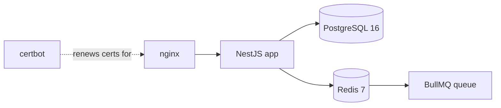

# Third-Party Services

What Biddaloy talks to outside its own containers, and what it deliberately
doesn't.

## Self-hosted infrastructure

Runs as containers in [`docker-compose.yml`](../../docker-compose.yml) — not
managed cloud services, but still "third party" software the app depends on.

| Service    | Image                | Role                                                  |
| ---------- | -------------------- | ----------------------------------------------------- |
| PostgreSQL | `postgres:16-alpine` | Primary database, all tenant data                     |
| Redis      | `redis:7-alpine`     | BullMQ queue backend + distributed rate-limit storage |
| nginx      | `nginx:1.27-alpine`  | TLS termination, reverse proxy                        |
| certbot    | `certbot/certbot`    | Let's Encrypt certificate issuance/renewal            |

Server libraries that talk to these (see
[`server/package.json`](../../server/package.json)):

- `pg` + `typeorm` + `@nestjs/typeorm` — Postgres, with TLS enforced in
  production via `DB_SSL=true` (see [`server/src/db-ssl.ts`](../../server/src/db-ssl.ts)).
- `ioredis` — Redis client.
- `bullmq` + `@nestjs/bullmq` — job queue, backs the communications module.
- `@nest-lab/throttler-storage-redis` + `@nestjs/throttler` — rate limiting
  state shared across app instances via Redis.

## External APIs called at runtime

All optional — every one no-ops or is simply unavailable if its env vars are
unset. None are required to boot the app.

| Provider                     | Host                   | Purpose                              | Config                                                              |
| ---------------------------- | ---------------------- | ------------------------------------ | ------------------------------------------------------------------- |
| GreenWeb                     | `api.greenweb.com.bd`  | SMS (Bangladesh)                     | `GREENWEB_API_KEY`                                                  |
| MiM SMS                      | `api.mimsms.com`       | SMS (Bangladesh)                     | `MIMSMS_API_KEY`, `MIMSMS_SENDER_ID`                                |
| Meta WhatsApp Business Cloud | `graph.facebook.com`   | WhatsApp messages                    | `WHATSAPP_ACCESS_TOKEN`, `WHATSAPP_PHONE_NUMBER_ID`                 |
| SMTP (any provider)          | operator-supplied host | Email, via `nodemailer`              | `SMTP_HOST`, `SMTP_PORT`, `SMTP_USER`, `SMTP_PASSWORD`, `SMTP_FROM` |
| Sentry                       | `*.ingest.sentry.io`   | Frontend error tracking + Web Vitals | `VITE_SENTRY_DSN` (see [`07-deployment.md`](07-deployment.md))      |

`SMS_PROVIDER` selects `greenweb` or `mimsms`. All calls go through `undici`
directly — no vendor SDK is installed for any of these. See
[`05-communications.md`](05-communications.md) for how the communications
module dispatches to them.

**Per-tenant credentials.** A school can supply its own WhatsApp/SMS/email
credentials instead of the platform-wide ones above. Those are encrypted at
rest with AES-256-GCM (`SETTINGS_ENCRYPTION_KEY`), in
[`server/src/modules/schools/settings`](../../server/src/modules/schools/settings).

## Dev / CI only

Not present in the running application — only used to build, test, and ship
it: GitHub Actions, CodeQL, Lighthouse CI (`@lhci/cli`), CodeRabbit,
Playwright, Storybook.

## Deliberately not used

Worth stating explicitly so nobody assumes one of these is wired up
somewhere:

- **No payment gateway.** No bKash, Nagad, SSLCommerz, or Stripe. Payments
  are recorded manually as `Payment` rows — see
  [`04-fees-payments-invoices.md`](04-fees-payments-invoices.md).
- **No object storage.** No S3, GCS, Cloudinary, or MinIO. Excel exports are
  generated in-process with `exceljs`.
- **No Twilio, no Firebase, no external auth/identity provider.** JWTs are
  issued in-house (`@nestjs/jwt`, `passport-jwt`, `bcrypt`).
