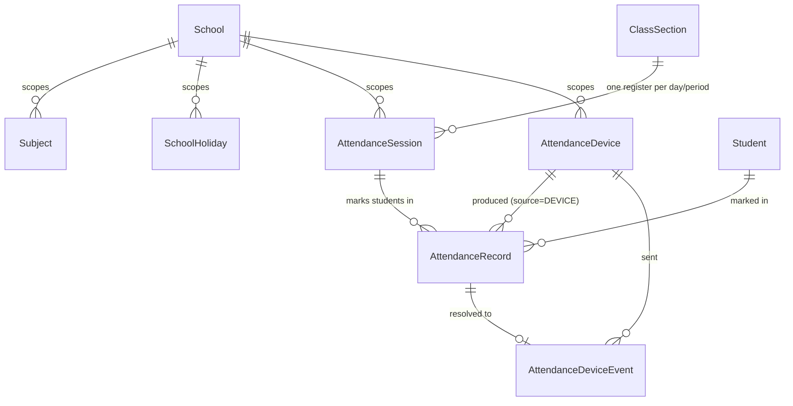
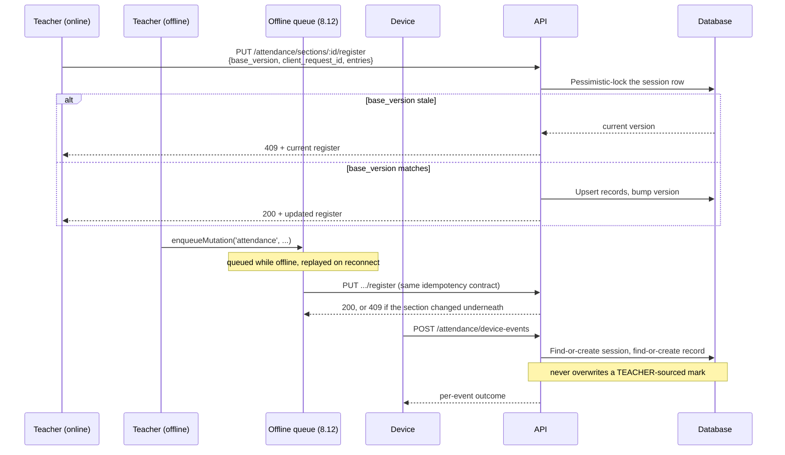
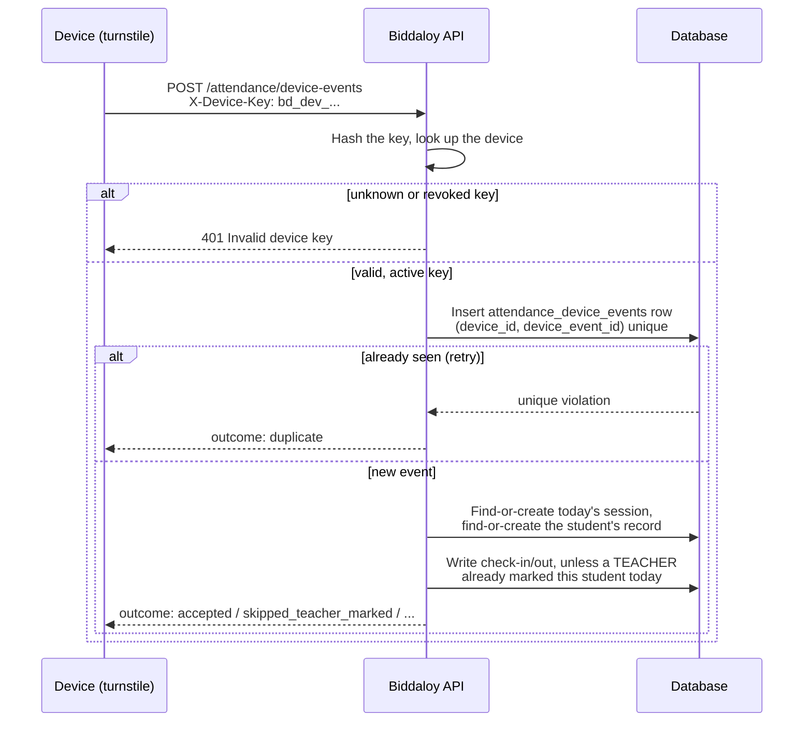

# Attendance

Attendance answers three questions: who was in class today, who gets a
low-attendance flag this month, and — for a future exam module — how much of
the year did a student actually attend.

## 1. What attendance is here

A **register** is one section, on one school day (or one period, if a school
marks period-by-period). Every student in that section gets one **mark**:
`PRESENT`, `ABSENT`, `LATE`, or `LEAVE`. A mark is never deleted — it's
corrected, and every correction leaves an audit trail a teacher or admin can
read later (["The correction rules"](#4-the-correction-rules) below).

## 2. Entities



- **`AttendanceSession`** (`server/src/modules/attendance/entities/attendance-session.entity.ts`)
  — one register. Holds no marks itself; `version` (a TypeORM
  `@VersionColumn`) is what the offline-conflict dialog checks against.
- **`AttendanceRecord`** — one student's mark within one session.
  `source` (`TEACHER` / `DEVICE` / `IMPORT` / `SYSTEM`) says who produced it —
  see ["Teacher authority wins"](#7-integrating-a-device).
- **`AttendanceDevice`** / **`AttendanceDeviceEvent`** — see
  ["Integrating a device"](#7-integrating-a-device).
- **`SchoolHoliday`** (`modules/academics`) — a calendar entry the
  working-day calculator reads. An academics concern, not an attendance one;
  attendance only ever reads it.
- **`Subject`** (`modules/academics`) — only meaningful for period-level
  attendance (`AttendanceSession.subject_id`), unused until a later epic.

See [01-domain-model.md](01-domain-model.md) for the full-schema diagram and
each entity's own docstring for column-level detail.

## 3. How a mark gets recorded

Three paths write the same tables, and all three respect the same
version/conflict contract:



`client_request_id` is the offline-replay idempotency key: a re-sent write
that already succeeded returns the same 200 and writes nothing a second
time — the fix for the duplicate-write hole `ui/src/api/mutation-queue.ts`
used to document as unresolved (see
[06-frontend-architecture.md](06-frontend-architecture.md)).

## 4. The correction rules

| Situation                                                                 | Who                                                            | Requires                              |
| ------------------------------------------------------------------------- | -------------------------------------------------------------- | ------------------------------------- |
| Marking today's register for the first time                               | Any caller with section access                                 | Nothing extra                         |
| Editing a register inside the tenant's correction window (default 2 days) | Any caller with section access                                 | Nothing extra                         |
| Editing a register **outside** the window                                 | A caller holding `ATTENDANCE_CORRECT`                          | A reason (≥ 3 characters)             |
| Editing a **finalized** register                                          | A caller holding `ATTENDANCE_CORRECT`                          | A reason                              |
| Marking a **future** date                                                 | A caller with section access, only if `allowFutureDates` is on | Status must be `LEAVE` — nothing else |
| Marking a non-working day (holiday/weekly-off)                            | A caller holding `ATTENDANCE_CORRECT`                          | `force_non_working_day: true`         |

Every correction that touches an existing mark writes an `audit_logs` row
(`entity_type: 'AttendanceRecord'`, `old_values`, `new_values`, the reason)
— `GET /attendance/records/:id/history` renders it. No soft-delete column
exists on either attendance table; there is nothing to delete, only marks to
correct.

## 5. Working days and the percentage

The formula, from `attendance-summary.service.ts`'s
`computeAttendancePercentage`:

```
denominator = (percentageDenominator === 'MARKED_DAYS' ? marked_days : working_days)
              − (leaveCountsAsWorkingDay ? 0 : leave_days)
numerator   = present_days + (lateCountsAsPresent ? late_days : 0)
percentage  = round(numerator / denominator × 100, 2)   — or null if denominator ≤ 0
```

**Worked example** (the tenant's default policy: `lateCountsAsPresent: true`,
`leaveCountsAsWorkingDay: false`):

> September 2026 has 30 days. Fridays are the school's weekly off (4 of
> them). Eid holidays cover 3 more. So `working_days = 23`.
> Rahim was present 19 days, late 2, absent 1, on approved leave 1.
> `denominator = 23 − 1 = 22`, `numerator = 19 + 2 = 21`,
> `percentage = 21 / 22 × 100 = 95.45`.

This exact case (23 working days → 95.45%) is asserted in
`attendance-percentage.spec.ts`, so the doc cannot silently drift from the
code.

**`null`, never `0`.** A student with zero working days in the requested
range (a brand-new enrollment, a range entirely on holidays) gets `null`,
not `0` — `0%` would read as "attended nothing," which is a different claim
than "there is nothing to measure yet." Every UI surface (the portal
summary card, the reports table) renders `null` as an em dash.

## 6. The exam-module contract

`AttendanceSummaryService`'s `AttendanceSummary` type is a frozen key set —
the contract a future exam module (or any other consumer) can depend on
without reading this module's internals:

```ts
interface AttendanceSummary {
  student_id: string;
  from: string;
  to: string;
  working_days: number;
  marked_days: number;
  present_days: number;
  late_days: number;
  absent_days: number;
  leave_days: number;
  unmarked_days: number;
  attendance_percentage: number | null;
  policy: {
    late_counts_as_present: boolean;
    leave_counts_as_working_day: boolean;
    denominator: 'WORKING_DAYS' | 'MARKED_DAYS';
  };
}
```

Adding a key is fine. Renaming or removing one is a breaking change that
needs a decision, not a silent edit —
`attendance-summary.contract.spec.ts` is what makes that deliberate: it
fails CI the moment the key set changes.

## 7. Integrating a device

A biometric fingerprint reader, a face-recognition camera, or an RFID card
turnstile can post attendance directly, without a human ever opening the app.
Biddaloy authenticates these devices with a long-lived key instead of the
usual login — there's no user to log in as, and no browser to hold a session.



### The key lifecycle

1. An `ADMIN`/`EXECUTIVE` calls `POST /attendance/devices` (ordinary JWT
   auth). The response is the **only time** the raw key is ever shown:
   `{ "device": { "id": "...", "token_last4": "9f3a", ... }, "key": "bd_dev_..." }`.
2. The device stores that key and sends it as `X-Device-Key` on every
   request from then on. Biddaloy stores only a SHA-256 hash of it — even a
   database leak doesn't hand out working credentials.
3. If a key leaks, `POST /attendance/devices/:id/rotate` issues a new one
   immediately — the old key stops working the instant the call succeeds,
   no grace period.
4. `DELETE /attendance/devices/:id` revokes a device. This sets
   `status = REVOKED`; it never deletes the row, so the device's past scans
   still resolve to a named device in the history.

### A worked example

```bash
curl -X POST https://school.example.com/api/v1/attendance/device-events \
  -H 'X-Device-Key: bd_dev_9f3a...' \
  -H 'Content-Type: application/json' \
  -d '{
        "events": [
          {
            "device_event_id": "scan-88213",
            "occurred_at": "2026-09-04T02:12:00Z",
            "direction": "IN",
            "external_ref": "REG-2026-0042"
          }
        ]
      }'
```

Response — always `200`, even when individual events failed, since a batch is
not atomic (one bad scan must not fail the other 199):

```jsonc
{
  "results": [
    {
      "device_event_id": "scan-88213",
      "outcome": "accepted",
      "student_id": "...",
      "status": "LATE",
      "minutes_late": 12,
    },
  ],
  "accepted": 1,
  "duplicate": 0,
  "failed": 0,
}
```

### Outcomes

| `outcome`                | Meaning                                                                                                                                                                           |
| ------------------------ | --------------------------------------------------------------------------------------------------------------------------------------------------------------------------------- |
| `accepted`               | A new check-in/out was recorded.                                                                                                                                                  |
| `duplicate`              | This exact `device_event_id` was already processed — the device retried a batch it wasn't sure went through.                                                                      |
| `unknown_student`        | Neither `student_id` nor `external_ref` (registration number) matched a student in this device's tenant.                                                                          |
| `skipped_teacher_marked` | A teacher already marked this student today. The device may still fill a blank `check_in_at`, but the `status` a teacher set is never overwritten.                                |
| `out_of_window`          | `occurred_at` is more than 2 days from today — a scanner with a badly-set clock cannot rewrite attendance history.                                                                |
| `rejected`               | Everything else: an `OUT` scan with no matching `IN` (`reason: "no_check_in"`), or a section-bound device scanning a student from another section (`reason: "section_mismatch"`). |

### Teacher authority wins

A record with `source: "TEACHER"` is never overwritten by a device event —
a device may only fill in `check_in_at`/`check_out_at` if the teacher left
them blank. This is a deliberate contract for a future exam module, tested in
both directions: a device scan can never turn a teacher's `PRESENT` into
`ABSENT`, and a teacher's later correction can still override anything a
device wrote first.

A device's clock can be off — the ±2-day window above is the guard for
that — and `attendance_device_events` (the raw-scan forensic trail) grows
without bound; there is no retention job for it yet (see below).

## 8. Tenant policy settings

Every field lives under `School.settings.attendance`, resolved against
these defaults (`tenant-settings-defaults.ts`):

| Field                               | Default        | What visibly changes when you move it                                                    |
| ----------------------------------- | -------------- | ---------------------------------------------------------------------------------------- |
| `weeklyOffDays`                     | `[5]` (Friday) | Which weekdays never need marking and never count as a working day.                      |
| `lateAfter`                         | `08:15`        | The check-in cutoff (local time) after which a mark becomes `LATE` instead of `PRESENT`. |
| `absentAfter`                       | `10:00`        | The cutoff after which a mark becomes `ABSENT` instead of `LATE`.                        |
| `correctionWindowDays`              | `2`            | How many days after a register's date it stays editable without `ATTENDANCE_CORRECT`.    |
| `lowAttendanceThresholdPercent`     | `75`           | The cutoff `GET /attendance/flags/low` and the reports page use to flag a student.       |
| `lateCountsAsPresent`               | `true`         | Whether a `LATE` day adds to the percentage's numerator.                                 |
| `leaveCountsAsWorkingDay`           | `false`        | Whether an approved `LEAVE` day is removed from the percentage's denominator.            |
| `percentageDenominator`             | `WORKING_DAYS` | Whether the percentage divides by calendar working days or by days actually marked.      |
| `allowFutureDates`                  | `false`        | Whether a future date can be marked at all (and then, only `LEAVE`).                     |
| `autoAbsentNotification.enabled`    | `false`        | Whether finalizing a register triggers guardian notifications for that day's absences.   |
| `autoAbsentNotification.cutoffTime` | `11:00`        | The local time after which the auto-absent sweep considers a register due.               |

## 9. What this epic deliberately did not build

- **Period-level attendance UI** — the columns (`AttendanceSession.period_no`,
  `Subject`) exist end to end, nothing in the UI uses them yet.
- **Half-day and "excused" statuses** — only `PRESENT` / `ABSENT` / `LATE` /
  `LEAVE` exist. `LEAVE` is the only "not a plain absence" state.
- **Approval workflows for corrections** — a correction with a reason is
  immediate, not a request that waits on someone else's approval.
- **Class-level (not section-level) rollups** — every read endpoint is
  scoped to a section or a student, never "this whole class across all its
  sections."
- **CSV export** of registers, summaries, or the low-attendance list.
- **A device-management UI** — device create/rotate/revoke is API-only
  today (see [§7](#7-integrating-a-device)).
- **`attendance_device_events` retention** — every raw scan is kept
  forever; there is no job that prunes old ones.

One line each here so the next person who goes looking for one of these
knows it was a decision, not an oversight.
