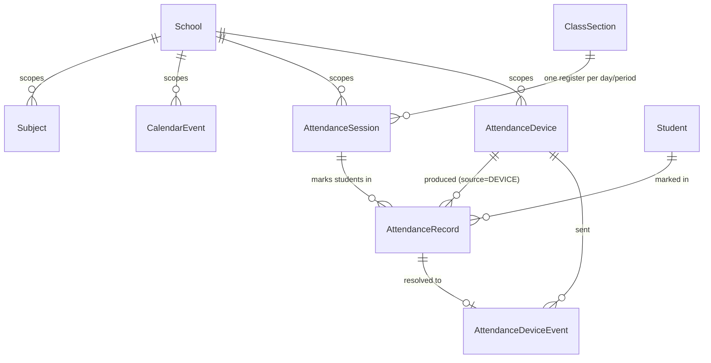
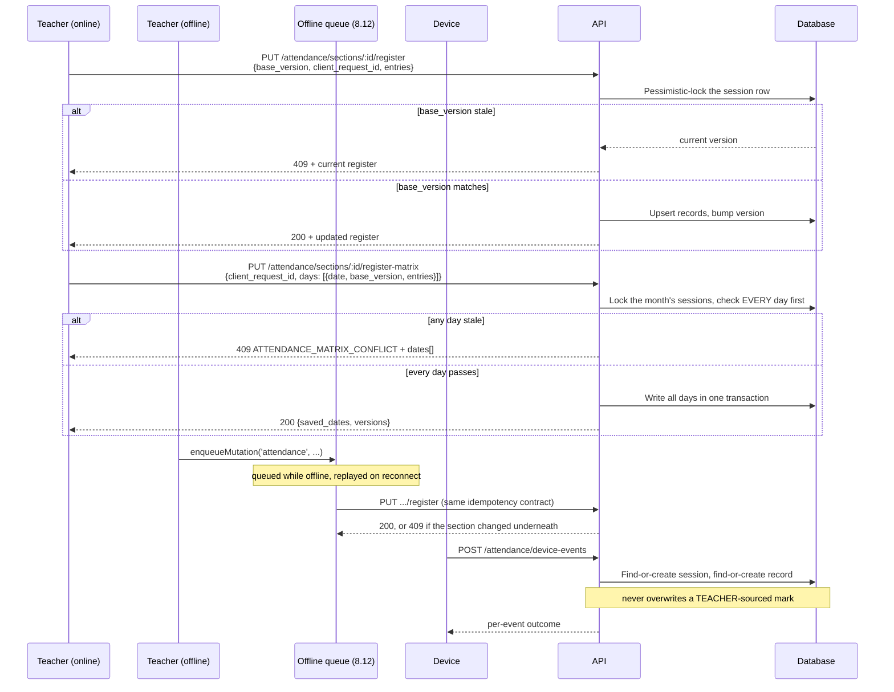
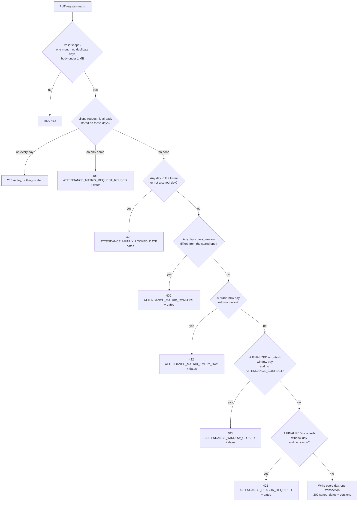
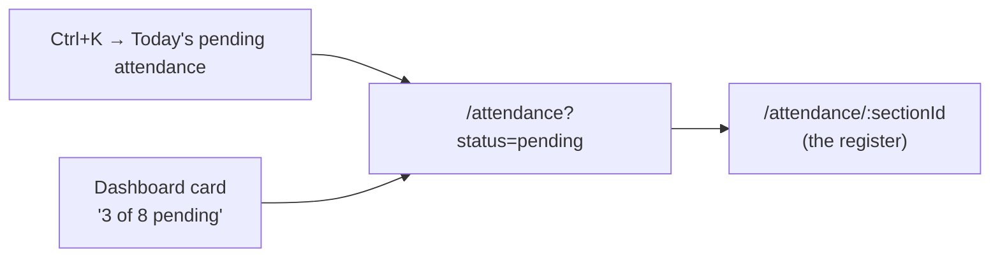
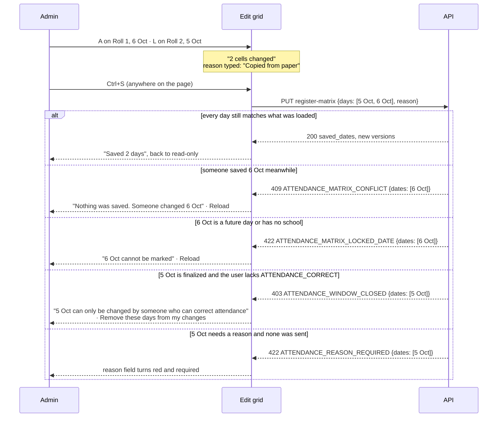
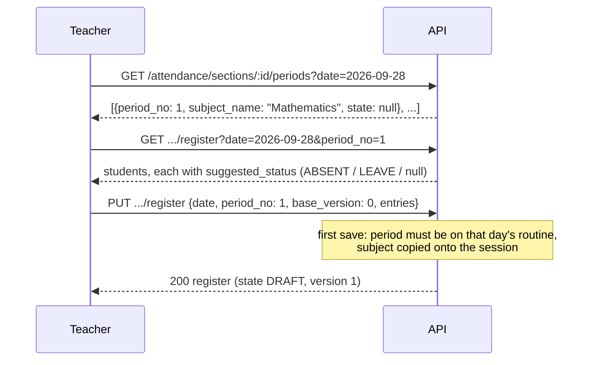
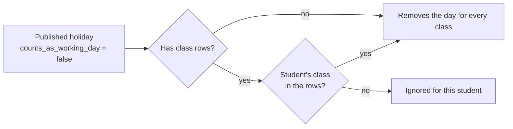
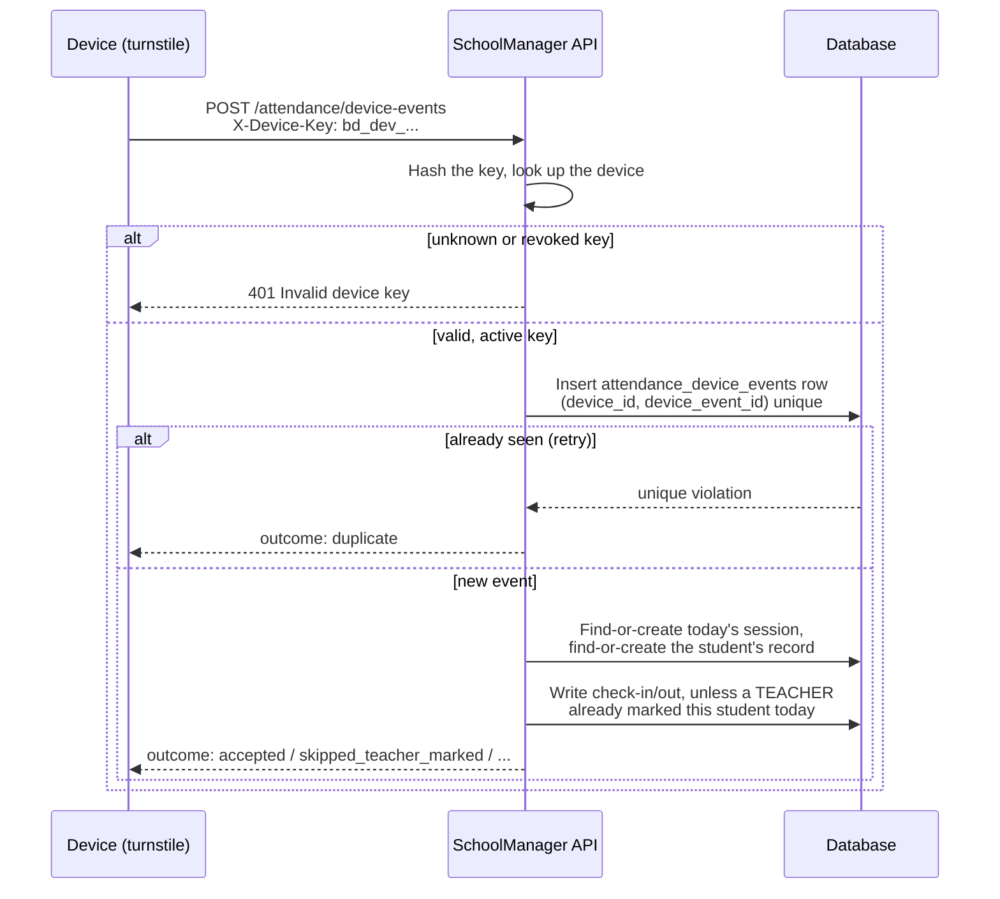
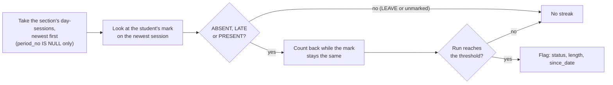

# Attendance

Attendance answers three questions: who was in class today, who gets a
low-attendance flag this month, and — for a future exam module — how much of
the year did a student actually attend.

## 1. What attendance is here

A **register** is one section, on one school day (or one period, if a school
marks period-by-period). Every student in that section gets one **mark**:
`PRESENT`, `ABSENT`, `LATE`, or `LEAVE`. A mark is never deleted — it's
corrected, and every correction leaves an audit trail a teacher or admin can
read later (["The correction rules"](#4-the-correction-rules) below).

## 2. Entities


```mermaid
erDiagram
    School            ||--o{ Subject             : scopes
    School            ||--o{ CalendarEvent       : scopes
    School            ||--o{ AttendanceSession   : scopes
    School            ||--o{ AttendanceDevice    : scopes
    ClassSection      ||--o{ AttendanceSession   : "one register per day/period"
    AttendanceSession ||--o{ AttendanceRecord    : "marks students in"
    Student           ||--o{ AttendanceRecord    : "marked in"
    AttendanceDevice  ||--o{ AttendanceRecord    : "produced (source=DEVICE)"
    AttendanceDevice  ||--o{ AttendanceDeviceEvent : "sent"
    AttendanceRecord  ||--o| AttendanceDeviceEvent : "resolved to"
```

- **`AttendanceSession`** (`server/src/modules/attendance/entities/attendance-session.entity.ts`)
  — one register. Holds no marks itself; `version` (a TypeORM
  `@VersionColumn`) is what the offline-conflict dialog checks against.
- **`AttendanceRecord`** — one student's mark within one session.
  `source` (`TEACHER` / `DEVICE` / `IMPORT` / `SYSTEM`) says who produced it —
  see ["Teacher authority wins"](#7-integrating-a-device).
- **`AttendanceDevice`** / **`AttendanceDeviceEvent`** — see
  ["Integrating a device"](#7-integrating-a-device).
- **`CalendarEvent`** (`modules/calendar`, [16-academic-calendar.md](16-academic-calendar.md)) — a
  calendar entry the working-day calculator reads. Renamed from
  `SchoolHoliday` in [17.1.2]. A `calendar` concern, not an attendance one;
  attendance only ever reads it, and only published (non-draft) events —
  a draft never counts toward working-day math or attendance.
- **`Subject`** (`modules/academics`) — only set on period registers
  (`AttendanceSession.subject_id`, copied from the routine when the register
  is first saved — see [§4a](#4a-period-attendance)).

See [01-domain-model.md](01-domain-model.md) for the full-schema diagram and
each entity's own docstring for column-level detail.

## 3. How a mark gets recorded

Four paths write the same tables, but not the same contract: teacher
writes (one day, or a whole month at once; online or replayed from the
offline queue) share the
`base_version`/`client_request_id` conflict contract; device ingest has
no `base_version` — it uses `device_event_id` idempotency, a per-event
outcome, and teacher precedence instead (see [§7](#7-integrating-a-device)).


```mermaid
sequenceDiagram
    participant T as Teacher (online)
    participant TO as Teacher (offline)
    participant Q as Offline queue (8.12)
    participant D as Device
    participant A as API
    participant DB as Database

    T->>A: PUT /attendance/sections/:id/register<br/>{base_version, client_request_id, entries}
    A->>DB: Pessimistic-lock the session row
    alt base_version stale
        DB-->>A: current version
        A-->>T: 409 + current register
    else base_version matches
        A->>DB: Upsert records, bump version
        A-->>T: 200 + updated register
    end

    T->>A: PUT /attendance/sections/:id/register-matrix<br/>{client_request_id, days: [{date, base_version, entries}]}
    A->>DB: Lock the month's sessions, check EVERY day first
    alt any day stale
        A-->>T: 409 ATTENDANCE_MATRIX_CONFLICT + dates[]
    else every day passes
        A->>DB: Write all days in one transaction
        A-->>T: 200 {saved_dates, versions}
    end

    TO->>Q: enqueueMutation('attendance', ...)
    Note over Q: queued while offline, replayed on reconnect
    Q->>A: PUT .../register (same idempotency contract)
    A-->>Q: 200, or 409 if the section changed underneath

    D->>A: POST /attendance/device-events
    A->>DB: Find-or-create session, find-or-create record
    Note over A,DB: never overwrites a TEACHER-sourced mark
    A-->>D: per-event outcome
```

`client_request_id` is the offline-replay idempotency key: a re-sent write
that already succeeded returns the same 200 and writes nothing a second
time — the fix for the duplicate-write hole `ui/src/api/mutation-queue.ts`
used to document as unresolved (see
[06-frontend-architecture.md](06-frontend-architecture.md)).

### The teacher's check-list: `GET /attendance/my-sections`

The landing screen asks one question per section: "has today's register been
started?" Each item carries what the screen needs, with no second call:

| Field                | Meaning                                                                             |
| -------------------- | ----------------------------------------------------------------------------------- |
| `class_id`           | The class (a holiday can be class-scoped, so the working-day check uses it).        |
| `class_teacher_name` | The section's `CLASS_TEACHER` only (not assistants or subject teachers), or `null`. |
| `is_working_day`     | `false` on a weekly-off day or a holiday for that class.                            |
| `today`              | `null` = **not started**; otherwise `state` (`DRAFT`/`FINALIZED`) and the counts.   |

Example, a Monday in the demo school (`yarn seed` creates exactly this):

```jsonc
[
  {
    "section_name": "A",
    "class_teacher_name": "Demo Teacher",
    "is_working_day": true,
    "today": null,
  },
  {
    "section_name": "B",
    "class_teacher_name": null,
    "is_working_day": true,
    "today": { "state": "DRAFT", "present": 2, "absent": 1, "late": 0, "leave": 0, "unmarked": 0 },
  },
]
```

Only the whole-day register counts here; a period register on the same date
never shows up in `today`. A future `date` is 422 `ATTENDANCE_FUTURE_DATE`
(the same rule as saving a register) unless the school has `allowFutureDates`
on.

### Saving a whole month: `PUT /attendance/sections/:id/register-matrix`

The monthly grid sends many days of one section in one request. It is
**all-or-nothing**: every day is checked first, and one bad day rejects the
whole save, so the grid never half-saves.


```mermaid
flowchart TD
    S[PUT register-matrix] --> V{Valid shape?<br/>one month, no duplicate days,<br/>body under 1 MB}
    V -- no --> E400[400 / 413]
    V -- yes --> R{client_request_id already<br/>stored on these days?}
    R -- on every day --> RP[200 replay, nothing written]
    R -- on only some --> ER[409 ATTENDANCE_MATRIX_REQUEST_REUSED + dates]
    R -- on none --> L{Any day in the future<br/>or not a school day?}
    L -- yes --> E422[422 ATTENDANCE_MATRIX_LOCKED_DATE + dates]
    L -- no --> C{Any day's base_version<br/>differs from the stored one?}
    C -- yes --> E409[409 ATTENDANCE_MATRIX_CONFLICT + dates]
    C -- no --> M{A brand-new day<br/>with no marks?}
    M -- yes --> EM[422 ATTENDANCE_MATRIX_EMPTY_DAY + dates]
    M -- no --> W{A FINALIZED or out-of-window day<br/>and no ATTENDANCE_CORRECT?}
    W -- yes --> E403[403 ATTENDANCE_WINDOW_CLOSED + dates]
    W -- no --> RS{A FINALIZED or out-of-window day<br/>and no reason?}
    RS -- yes --> E422R[422 ATTENDANCE_REASON_REQUIRED + dates]
    RS -- no --> OK[Write every day, one transaction<br/>200 saved_dates + versions]
```

Things worth knowing:

- `base_version` is `null` for "I saw no register for this day" and a number
  (minimum 1) for an existing one. A mismatch is the 409.
- A **past day that has no register yet is born `FINALIZED`**; **today's stays
  `DRAFT`**. An existing register keeps its state. A new day must carry at
  least one mark, because a finalized empty day could only be fixed with
  `ATTENDANCE_CORRECT`.
- **Send only the days you changed.** Every day in the request is checked as
  a correction, even if its marks are the same. A `FINALIZED` or
  out-of-window day needs `ATTENDANCE_CORRECT` (else 403
  `ATTENDANCE_WINDOW_CLOSED`) and a `reason` (else 422
  `ATTENDANCE_REASON_REQUIRED`).
- `client_request_id` is one key for the whole request. A replay (the id is
  already on every day) returns 200 and writes nothing. If the id is on only
  some of the days, either it was already used for a different save or some
  of these days changed since (someone else saved them after your first
  try): 409 `ATTENDANCE_MATRIX_REQUEST_REUSED`, nothing written. The grid
  should treat it like `ATTENDANCE_MATRIX_CONFLICT` and reload the month.
- The grid sends a status only. A **new** `LATE` mark is saved with
  `minutes_late = NULL` (a mark that was already `LATE` keeps its minutes). A
  fine rule with `min_minutes_late` still counts a `NULL` (see
  [section 9](#9-attendance-fines)). **Open product question:** should a
  grid-entered `LATE` count toward a minimum-minutes rule? Kept as-is for now.
- It never touches period registers and never queues a guardian notification.
- JSON bodies are capped at 1 MB (`JSON_BODY_LIMIT`, `server/src/body-parser.ts`),
  which is far above a 31-day section grid.
- The reply's `versions` map (`{ "2026-09-04": 3, ... }`) is what the grid
  sends back as each day's next `base_version`. `GET .../register-matrix`
  returns the same `versions` map.

## 3a. The check-list and the month edit screens

### The pending check-list

"Pending" means: **a section with students, on a school day for its class,
whose register for the day is not `FINALIZED`**. That includes a section nobody
has touched ("Not started") and a `DRAFT` one (marks saved, not finalized).
Left out of the list and the count:

- a section with no students;
- a section whose **class** has no school that day (`is_working_day` is per
  class: an exam break, a class-level holiday). It cannot be marked, so it
  must not sit in "pending" all day.

When no class has school, the list shows "School is closed" and no count.


```mermaid
flowchart LR
    P["Ctrl+K → Today's pending attendance"] --> L["/attendance?status=pending"]
    D["Dashboard card<br/>'3 of 8 pending'"] --> L
    L --> R["/attendance/:sectionId<br/>(the register)"]
```

Both entry points show the **same number**, because both read
`GET /attendance/my-sections` (an admin sees every section, a teacher only
their own). Example: with 8 sections, 5 finalized and 1 draft, the header reads
"3 of 8 sections pending" and the filtered list has 3 rows.

### Editing a month from the grid

`/attendance/register?edit=true` turns the month register into an editable grid
(desktop only). The grid only remembers the cells you changed. Save sends
**only the changed days**, in one request.

**Who can save what.** Opening the grid needs `ATTENDANCE_MARK`. Saving a day
is a different question, answered per day by the server:

| The changed day                                                 | Needs                                              |
| --------------------------------------------------------------- | -------------------------------------------------- |
| has no register yet                                             | nothing extra (a past one is born `FINALIZED`)     |
| has a `DRAFT` register inside the correction window             | nothing extra                                      |
| has a register that is `FINALIZED` **or** older than the window | `ATTENDANCE_CORRECT` **and** a reason (3+ letters) |

So a teacher (`ATTENDANCE_MARK` only) can fill gaps and fix this week's drafts,
but gets `403 ATTENDANCE_WINDOW_CLOSED` for almost any older day, because
teachers finalize every day and back-filled days are born finalized.

**The reason field.** Whatever the user types (3+ letters) is always sent. It
is marked required up front only when the page can see it is needed: a changed
day that already has a register and is older than the window. (The window is
the tenant's own for `SETTINGS_MANAGE`, else the 2-day default.) A finalized
day inside the window looks the same as a draft in the matrix, so for that one
the server's 422 turns the field red.


```mermaid
sequenceDiagram
    participant U as Admin
    participant G as Edit grid
    participant A as API
    U->>G: A on Roll 1, 6 Oct · L on Roll 2, 5 Oct
    Note over G: "2 cells changed"<br/>reason typed: "Copied from paper"
    U->>G: Ctrl+S (anywhere on the page)
    G->>A: PUT register-matrix {days: [5 Oct, 6 Oct], reason}
    alt every day still matches what was loaded
        A-->>G: 200 saved_dates, new versions
        G-->>U: "Saved 2 days", back to read-only
    else someone saved 6 Oct meanwhile
        A-->>G: 409 ATTENDANCE_MATRIX_CONFLICT {dates: [6 Oct]}
        G-->>U: "Nothing was saved. Someone changed 6 Oct" · Reload
    else 6 Oct is a future day or has no school
        A-->>G: 422 ATTENDANCE_MATRIX_LOCKED_DATE {dates: [6 Oct]}
        G-->>U: "6 Oct cannot be marked" · Reload
    else 5 Oct is finalized and the user lacks ATTENDANCE_CORRECT
        A-->>G: 403 ATTENDANCE_WINDOW_CLOSED {dates: [5 Oct]}
        G-->>U: "5 Oct can only be changed by someone who can correct attendance"<br/>· Remove these days from my changes
    else 5 Oct needs a reason and none was sent
        A-->>G: 422 ATTENDANCE_REASON_REQUIRED {dates: [5 Oct]}
        G-->>U: reason field turns red and required
    end
```

The save is all-or-nothing (see the API section above), so after any refusal
**no** day is written. Closing a conflict dialog any way (Esc, outside click)
also reloads the month, so a stale draft cannot fail the next Save again.

Keyboard: arrows move, `P` / `A` / `L` / `E` set the status, `Space` flips
present/absent, `Home` / `End` jump to the first / last open day, `Esc`
cancels. `Ctrl+S` saves from anywhere on the page while editing, the reason
field included. The palette reaches it with **Edit monthly register**.

## 4. The correction rules

| Situation                                                                 | Who                                                            | Requires                              |
| ------------------------------------------------------------------------- | -------------------------------------------------------------- | ------------------------------------- |
| Marking today's register for the first time                               | Any caller with section access                                 | Nothing extra                         |
| Editing a register inside the tenant's correction window (default 2 days) | Any caller with section access                                 | Nothing extra                         |
| Editing a register **outside** the window                                 | A caller holding `ATTENDANCE_CORRECT`                          | A reason (≥ 3 characters)             |
| Editing a **finalized** register                                          | A caller holding `ATTENDANCE_CORRECT`                          | A reason                              |
| Marking a **future** date                                                 | A caller with section access, only if `allowFutureDates` is on | Status must be `LEAVE` — nothing else |
| Marking a non-working day (holiday/weekly-off)                            | A caller holding `ATTENDANCE_CORRECT`                          | `force_non_working_day: true`         |
| Saving several days from the monthly grid                                 | Same rules, per day                                            | One reason for the whole save         |

Every correction that touches an existing mark writes an `audit_logs` row
(`entity_type: 'AttendanceRecord'`, `old_values`, `new_values`, the reason)
— `GET /attendance/records/:id/history` renders it. No soft-delete column
exists on either attendance table; there is nothing to delete, only marks to
correct.

## 4a. Period attendance

Off by default. A school turns it on with `settings.attendance.periodAttendance.enabled`
([§8](#8-tenant-policy-settings)). While it is off, every period route refuses
with `403 ATTENDANCE_PERIOD_DISABLED`, and `GET .../periods` returns `[]`.

A **period register** is an ordinary register with two extra columns:

- `period_no` — the **period slot's sequence** in the shift (period 1, period 2 ...).
- `subject_id` — a **snapshot** of the routine's subject, copied when the
  register is first saved. Later routine edits never rewrite an old register.


```mermaid
sequenceDiagram
    participant T as Teacher
    participant A as API
    T->>A: GET /attendance/sections/:id/periods?date=2026-09-28
    A-->>T: [{period_no: 1, subject_name: "Mathematics", state: null}, ...]
    T->>A: GET .../register?date=2026-09-28&period_no=1
    A-->>T: students, each with suggested_status (ABSENT / LEAVE / null)
    T->>A: PUT .../register {date, period_no: 1, base_version: 0, entries}
    Note over A: first save: period must be on that day's routine,<br/>subject copied onto the session
    A-->>T: 200 register (state DRAFT, version 1)
```

Rules:

- **Who may mark.** Anyone with section access. Beyond that, a teacher who is
  that date's **substitute** for a period may open and mark that one period of
  that one date: not the day register, another period, or another date.
  Everyone else gets the same 403 as a section they cannot see.
- **Which periods are listed.** The routine's slots for that date, cancelled
  ones removed. With section access you see all of them; as a substitute only
  your own.
- **Prefill.** An unsaved period register suggests `ABSENT` or `LEAVE` from
  that day's whole-day register (`suggested_status`). It is read-only: nothing
  is stored until the teacher saves.
- **First save only is checked against the routine.** A new period register for
  a period the routine does not schedule is `400 ATTENDANCE_PERIOD_NOT_SCHEDULED`.
  An existing one is never re-checked, so a routine edit cannot lock a teacher
  out of their own draft.
- **What period marks never feed.** The monthly percentage, flags, fines and
  guardian SMS all read **whole-day registers only**. Period marks reach exactly
  one place: the subject-wise summary below.

### Subject-wise summary

`GET /attendance/sections/:id/subject-summary?from=&to=` answers "how often was
each student in Mathematics?". `held` is the number of period registers saved
for that subject in the range; each student's `by_subject[subject_id]` holds
`present` / `late` / `absent` / `leave` / `attended` / `percentage`.

```jsonc
{
  "subjects": [{ "subject_id": "…", "name": "Mathematics", "held": 2 }],
  "rows": [
    {
      "roll_number": 3,
      "full_name": "…",
      "by_subject": {
        "…": { "present": 1, "absent": 1, "late": 0, "leave": 0, "attended": 1, "percentage": 50 },
      },
    },
  ],
}
```

`percentage` is `null` (not 0) when the student has no mark for that subject.
It uses the school's `lateCountsAsPresent`. Denominator = `held`
(`WORKING_DAYS`) or the periods the student was marked in (`MARKED_DAYS`),
minus leave unless `leaveCountsAsWorkingDay`. A range over 400 days is refused
(`422 SCHOOL_CALENDAR_RANGE_TOO_WIDE`), and a switched-off school gets
`403 ATTENDANCE_PERIOD_DISABLED`.

### The period switcher and the subject-wise report

With the period switch on, the register screen shows a tab row above the
roster: **Whole day** plus one tab per period of that date's routine
(`Period 1 · Mathematics  8:00`). A period that already has a register carries
a badge, with the same words as the check-list: **Draft** or **Submitted**
(Submitted = `FINALIZED`). A substitute teacher sees only the tab of the period
they cover, no Whole day tab. Pick a tab and the same roster now saves a period
register; if the day register has absentees, the roster opens with them
pre-marked and says so ("Students absent or on leave today are already filled
in").

`/attendance/reports` gets a **By subject** tab, shown when the switch is on.
**Known limitation:** the page reads the switch from the school settings, which
only `SETTINGS_MANAGE` (admins) may read. So today only admins ever see the tab;
a teacher's settings read is refused and the tab stays hidden. Tracked in
[#1686](https://github.com/tareq89/biddaloy/issues/1686).
One column per subject, headed `Mathematics (8)` where 8 is `held`. Each cell is
`attended/held`, with the percentage under it.

```text
Roll  Student   Mathematics (8)
 3    Rahim     7/8
                87.5 %
```

Worked example: 8 Mathematics periods were held this month. Rahim was `PRESENT`
in 6, `LATE` in 1 and `ABSENT` in 1. With `lateCountsAsPresent` on, he attended
6 + 1 = 7 of 8, so 7 / 8 = **87.5 %**.

## 5. Working days and the percentage

`working_days` itself comes from `modules/calendar`'s
`SchoolCalendarService.getWorkingDays` — it walks the date range and
subtracts every published `CalendarEvent` with `counts_as_working_day =
false` (plus the weekly off-day). See
[16-academic-calendar.md](16-academic-calendar.md) for how that calendar is
built; this section only covers what attendance does with the number.

The formula, from `attendance-summary.service.ts`'s
`computeAttendancePercentage`:

```text
denominator = (percentageDenominator === 'MARKED_DAYS' ? marked_days : working_days)
              − (leaveCountsAsWorkingDay ? 0 : leave_days)
numerator   = present_days + (lateCountsAsPresent ? late_days : 0)
percentage  = round(numerator / denominator × 100, 2)   — or null if denominator ≤ 0
```

**Worked example** (the tenant's default policy: `lateCountsAsPresent: true`,
`leaveCountsAsWorkingDay: false`):

> September 2026 has 30 days. Fridays are the school's weekly off (4 of
> them). Eid holidays cover 3 more. So `working_days = 23`.
> Rahim was present 19 days, late 2, absent 1, on approved leave 1.
> `denominator = 23 − 1 = 22`, `numerator = 19 + 2 = 21`,
> `percentage = 21 / 22 × 100 = 95.45`.

This exact case (23 working days → 95.45%) is asserted in
`attendance-percentage.spec.ts`, so the doc cannot silently drift from the
code.

### Which holidays count for which student

A holiday counts for a student when it is **school-wide** (no class rows)
or **scoped to the student's class**. Summaries call `getWorkingDays` once
per class, never once per student.


```mermaid
flowchart LR
  E[Published holiday<br/>counts_as_working_day = false] --> Q{Has class rows?}
  Q -- no --> A[Removes the day for every class]
  Q -- yes --> R{Student's class<br/>in the rows?}
  R -- yes --> A
  R -- no --> B[Ignored for this student]
```

**Example.** A published holiday on 2026-09-10 is scoped to Class 9 only.
A Class 9 student has `working_days = 22` for September. A Class 11
student has `23`. The 95.45% case above is unchanged.

**Whole days only.** Percentage, the month matrix, low-attendance flags and
fines read whole-day registers only (`period_no IS NULL`). A period
register (see `periodAttendance` in section 8) never counts toward them.

**`null`, never `0`.** A student with zero working days in the requested
range (a brand-new enrollment, a range entirely on holidays) gets `null`,
not `0` — `0%` would read as "attended nothing," which is a different claim
than "there is nothing to measure yet." Every UI surface (the portal
summary card, the reports table) renders `null` as an em dash.

## 6. The exam-module contract

`AttendanceSummaryService`'s `AttendanceSummary` type is a frozen key set —
the contract a future exam module (or any other consumer) can depend on
without reading this module's internals:

```ts
interface AttendanceSummary {
  student_id: string;
  from: string;
  to: string;
  working_days: number;
  marked_days: number;
  present_days: number;
  late_days: number;
  absent_days: number;
  leave_days: number;
  unmarked_days: number;
  attendance_percentage: number | null;
  policy: {
    late_counts_as_present: boolean;
    leave_counts_as_working_day: boolean;
    denominator: 'WORKING_DAYS' | 'MARKED_DAYS';
  };
}
```

Adding a key is fine. Renaming or removing one is a breaking change that
needs a decision, not a silent edit —
`attendance-summary.contract.spec.ts` is what makes that deliberate: it
fails CI the moment the key set changes.

## 7. Integrating a device

A biometric fingerprint reader, a face-recognition camera, or an RFID card
turnstile can post attendance directly, without a human ever opening the app.
SchoolManager authenticates these devices with a long-lived key instead of the
usual login — there's no user to log in as, and no browser to hold a session.


```mermaid
sequenceDiagram
    participant D as Device (turnstile)
    participant A as SchoolManager API
    participant DB as Database

    D->>A: POST /attendance/device-events<br/>X-Device-Key: bd_dev_...
    A->>A: Hash the key, look up the device
    alt unknown or revoked key
        A-->>D: 401 Invalid device key
    else valid, active key
        A->>DB: Insert attendance_device_events row<br/>(device_id, device_event_id) unique
        alt already seen (retry)
            DB-->>A: unique violation
            A-->>D: outcome: duplicate
        else new event
            A->>DB: Find-or-create today's session,<br/>find-or-create the student's record
            A->>DB: Write check-in/out, unless a TEACHER<br/>already marked this student today
            A-->>D: outcome: accepted / skipped_teacher_marked / ...
        end
    end
```

### The key lifecycle

1. An `ADMIN`/`EXECUTIVE` calls `POST /attendance/devices` (ordinary JWT
   auth). The response is the **only time** the raw key is ever shown:
   `{ "device": { "id": "...", "token_last4": "9f3a", ... }, "key": "bd_dev_..." }`.
2. The device stores that key and sends it as `X-Device-Key` on every
   request from then on. SchoolManager stores only a SHA-256 hash of it — even a
   database leak doesn't hand out working credentials.
3. If a key leaks, `POST /attendance/devices/:id/rotate` issues a new one
   immediately — the old key stops working the instant the call succeeds,
   no grace period.
4. `DELETE /attendance/devices/:id` revokes a device. This sets
   `status = REVOKED`; it never deletes the row, so the device's past scans
   still resolve to a named device in the history.

### A worked example

```bash
curl -X POST https://school.example.com/api/v1/attendance/device-events \
  -H 'X-Device-Key: bd_dev_9f3a...' \
  -H 'Content-Type: application/json' \
  -d '{
        "events": [
          {
            "device_event_id": "scan-88213",
            "occurred_at": "2026-09-04T02:12:00Z",
            "direction": "IN",
            "external_ref": "REG-2026-0042"
          }
        ]
      }'
```

Response — always `200`, even when individual events failed, since a batch is
not atomic (one bad scan must not fail the other 199):

```jsonc
{
  "results": [
    {
      "device_event_id": "scan-88213",
      "outcome": "accepted",
      "student_id": "...",
      "status": "LATE",
      "minutes_late": 12,
    },
  ],
  "accepted": 1,
  "duplicate": 0,
  "failed": 0,
}
```

### Outcomes

| `outcome`                | Meaning                                                                                                                                                                           |
| ------------------------ | --------------------------------------------------------------------------------------------------------------------------------------------------------------------------------- |
| `accepted`               | A new check-in/out was recorded.                                                                                                                                                  |
| `duplicate`              | This exact `device_event_id` was already processed — the device retried a batch it wasn't sure went through.                                                                      |
| `unknown_student`        | Neither `student_id` nor `external_ref` (registration number) matched a student in this device's tenant.                                                                          |
| `skipped_teacher_marked` | A teacher already marked this student today. The device may still fill a blank `check_in_at`, but the `status` a teacher set is never overwritten.                                |
| `out_of_window`          | `occurred_at` is more than 2 days from today — a scanner with a badly-set clock cannot rewrite attendance history.                                                                |
| `rejected`               | Everything else: an `OUT` scan with no matching `IN` (`reason: "no_check_in"`), or a section-bound device scanning a student from another section (`reason: "section_mismatch"`). |

### Late or on time? The student's own shift decides

A scan is judged against the late/absent times of the **student's own class
shift**, not the device's section. If `settings.attendance.shiftTimes` has an
entry for that shift, its `lateAfter` / `absentAfter` are used; a class with
no shift, or a shift with no entry, uses the school-wide pair
(`policyForShift`, `attendance-policy.util.ts`).

Example: the school pair is `08:15` / `10:00`, and the Day shift has
`{ lateAfter: "12:15", absentAfter: "14:00" }`. A Day-shift student scanning in
at 12:00 is `PRESENT`; a Morning-shift student at 12:00 is `ABSENT`.

### Teacher authority wins

A record with `source: "TEACHER"` is never overwritten by a device event —
a device may only fill in `check_in_at`/`check_out_at` if the teacher left
them blank. This is a deliberate contract for a future exam module, tested in
both directions: a device scan can never turn a teacher's `PRESENT` into
`ABSENT`, and a teacher's later correction can still override anything a
device wrote first.

A device's clock can be off — the ±2-day window above is the guard for
that — and `attendance_device_events` (the raw-scan forensic trail) grows
without bound; there is no retention job for it yet (see below).

## 8. Tenant policy settings

Every field lives under `School.settings.attendance`, resolved against
these defaults (`tenant-settings-defaults.ts`):

| Field                               | Default        | What visibly changes when you move it                                                                                                                       |
| ----------------------------------- | -------------- | ----------------------------------------------------------------------------------------------------------------------------------------------------------- |
| `weeklyOffDays`                     | `[5]` (Friday) | Which weekdays never need marking and never count as a working day.                                                                                         |
| `lateAfter`                         | `08:15`        | The check-in cutoff (local time) after which a mark becomes `LATE` instead of `PRESENT`.                                                                    |
| `absentAfter`                       | `10:00`        | The cutoff after which a mark becomes `ABSENT` instead of `LATE`.                                                                                           |
| `correctionWindowDays`              | `2`            | How many days after a register's date it stays editable without `ATTENDANCE_CORRECT`.                                                                       |
| `lowAttendanceThresholdPercent`     | `75`           | The cutoff `GET /attendance/flags/low` and the reports page use to flag a student.                                                                          |
| `lateCountsAsPresent`               | `true`         | Whether a `LATE` day adds to the percentage's numerator.                                                                                                    |
| `leaveCountsAsWorkingDay`           | `false`        | Whether a `LEAVE` day stays in the denominator (`false` = removed).                                                                                         |
| `percentageDenominator`             | `WORKING_DAYS` | Whether the percentage divides by calendar working days or by days actually marked.                                                                         |
| `allowFutureDates`                  | `false`        | Whether a future date can be marked at all (and then, only `LEAVE`).                                                                                        |
| `shiftTimes`                        | `[]`           | Per-shift `lateAfter` / `absentAfter` (`{ shiftId, lateAfter, absentAfter }`). A shift with an entry uses its own cutoffs; others use the two fields above. |
| `periodAttendance.enabled`          | `false`        | Whether teachers can take a per-period register on top of the whole-day one. Period registers never feed the percentage or fines.                           |
| `autoAbsentNotification.enabled`    | `false`        | Whether finalizing a register triggers guardian notifications for that day's absences.                                                                      |
| `autoAbsentNotification.cutoffTime` | `11:00`        | The local time after which the auto-absent sweep considers a register due.                                                                                  |

`policyForShift(policy, shiftId)` (`attendance-policy.util.ts`) returns the
policy with that shift's cutoffs swapped in. No shift id, or no entry for
it, returns the policy unchanged.

**Saving is a shallow merge.** `PATCH` on settings merges `attendance` one
level deep: fields you omit (for example `shiftTimes` or
`periodAttendance`, which an older form never sends) keep their stored
value. Fields you send replace the stored value whole. So sending
`shiftTimes: []` clears every shift, and sending one entry removes the
others.

Example: an older settings form that knows nothing about shifts or period
registers sends the whole `attendance` object it knows, without those two keys.

```jsonc
// stored
{
  "attendance": {
    "weeklyOffDays": [5], "lateAfter": "08:15", "absentAfter": "10:00",
    "shiftTimes": [
      { "shiftId": "0b6f8a52-3c1e-4d7a-9f20-5e8c1a2b3c4d", "lateAfter": "07:45", "absentAfter": "09:30" }
    ],
    "periodAttendance": { "enabled": true }
  }
}

// PATCH /schools/:id/settings — every attendance field except shiftTimes and periodAttendance
{
  "version": 1,
  "attendance": {
    "weeklyOffDays": [5], "lateAfter": "08:30", "absentAfter": "10:00",
    "correctionWindowDays": 2, "lowAttendanceThresholdPercent": 75,
    "lateCountsAsPresent": true, "leaveCountsAsWorkingDay": false,
    "percentageDenominator": "WORKING_DAYS", "allowFutureDates": false,
    "autoAbsentNotification": { "enabled": false, "cutoffTime": "11:00" }
  }
}

// result: lateAfter is now "08:30"; shiftTimes and periodAttendance are unchanged
{
  "attendance": {
    "weeklyOffDays": [5], "lateAfter": "08:30", "absentAfter": "10:00",
    "correctionWindowDays": 2, "lowAttendanceThresholdPercent": 75,
    "lateCountsAsPresent": true, "leaveCountsAsWorkingDay": false,
    "percentageDenominator": "WORKING_DAYS", "allowFutureDates": false,
    "autoAbsentNotification": { "enabled": false, "cutoffTime": "11:00" },
    "shiftTimes": [
      { "shiftId": "0b6f8a52-3c1e-4d7a-9f20-5e8c1a2b3c4d", "lateAfter": "07:45", "absentAfter": "09:30" }
    ],
    "periodAttendance": { "enabled": true }
  }
}
```

`yarn seed` turns `periodAttendance.enabled` on for the demo school, but only
when it was never set: a hand-set value (even `false`) survives a re-run.

## 9. Attendance fines

`ABSENT` and `LATE` marks can trigger a fine, but the billing logic lives
outside this module. `FineSweepService` reads attendance the same way a
report does — it never writes a mark back. See
[04-fees-payments-invoices.md § Fines](04-fees-payments-invoices.md#fines)
for the full flow (rule setup, the monthly sweep, the resulting bill).

The two triggers it reads from this module:

- **`ATTENDANCE_ABSENT`** — counts `ABSENT` marks in the month.
- **`ATTENDANCE_LATE`** — counts `LATE` marks in the month; a rule can add
  `min_minutes_late` to only count a `LATE` mark once its `minutes_late`
  crosses that number (a `LATE` with `minutes_late` still `NULL` always
  counts — see D23 in 04's decisions table). The month grid always saves a
  new `LATE` with `NULL` minutes, so with such a rule every grid-entered
  `LATE` counts. Whether it should is an open product question.

## 10. Streaks

A **streak** is a student who has been absent, late or present for many
day-registers in a row. The My class screen (Epic 47.0) shows them as one
"Attendance flags" card, so a class teacher spots a problem early.

| Status    | Flagged at  |
| --------- | ----------- |
| `ABSENT`  | 3 in a row  |
| `LATE`    | 3 in a row  |
| `PRESENT` | 15 in a row |

The numbers are constants (`STREAK_THRESHOLDS` in
`server/src/modules/attendance/attendance-streaks.util.ts`), not tenant
settings. Make them settings when a school asks for different numbers.

The rule (47.0 D22):


```mermaid
flowchart LR
  A["Take the section's day-sessions,<br/>newest first<br/>(period_no IS NULL only)"] --> B["Look at the student's mark<br/>on the newest session"]
  B --> C{"ABSENT, LATE<br/>or PRESENT?"}
  C -- "no (LEAVE or unmarked)" --> X["No streak"]
  C -- yes --> D["Count back while the mark<br/>stays the same"]
  D --> E{"Run reaches<br/>the threshold?"}
  E -- yes --> F["Flag: status, length, since_date"]
  E -- no --> X
```

- Counting starts at the section's **latest** day-session, not today.
- Any other mark breaks the run. `LEAVE` breaks every run, and so does a
  missing record.
- Days with no session (holidays, weekends) are skipped. They do not break a
  run.
- Period-level sessions are ignored. Only whole-day registers count.

Example, newest day first:

| Student | Last marks (newest first) | Result                         |
| ------- | ------------------------- | ------------------------------ |
| Rina    | A, A, A, P                | flagged: `ABSENT`, length 3    |
| Sumon   | A, A, L                   | not flagged: the run is only 2 |
| Tania   | L, L, L, L                | flagged: `LATE`, length 4      |

Endpoint: `GET /attendance/sections/:sectionId/streaks`. It sits in the
attendance-summary controller, needs `ATTENDANCE_READ`, and is gated by
`AttendanceAccessService.assertCanAccessSection` (a teacher must belong to
the section). Response:

```json
{
  "as_of_date": "2026-10-03",
  "items": [
    {
      "student_id": "…",
      "student_name": "Rina Akter",
      "roll_number": 4,
      "status": "ABSENT",
      "length": 3,
      "since_date": "2026-10-01"
    }
  ]
}
```

`items` is sorted `ABSENT`, `LATE`, `PRESENT`, then longest run first, then
roll number. `as_of_date` is `null` when the section has no day-session yet.
The service loads at most the 15 newest sessions (the longest threshold).

## 11. What this epic deliberately did not build

- **A period check-list** — "Pending" ([§3a](#3a-the-check-list-and-the-month-edit-screens))
  looks at whole-day registers only; there is no "which periods are still
  unmarked today" list.
- **A portal / student-detail subject view** — the subject-wise report is a staff
  screen under `/attendance/reports`. Guardians and the student page do not
  show per-subject attendance.
- **Remind a teacher** — the check-list shows which sections are pending but
  has no "nudge the teacher" action.
- **Half-day and "excused" statuses** — only `PRESENT` / `ABSENT` / `LATE` /
  `LEAVE` exist. `LEAVE` is the only "not a plain absence" state.
- **Approval workflows for corrections** — a correction with a reason is
  immediate, not a request that waits on someone else's approval.
- **Class-level (not section-level) rollups** — every read endpoint is
  scoped to a section or a student, never "this whole class across all its
  sections."
- **CSV export** of registers, summaries, or the low-attendance list.
- **A device-management UI** — device create/rotate/revoke is API-only
  today (see [§7](#7-integrating-a-device)).
- **`attendance_device_events` retention** — every raw scan is kept
  forever; there is no job that prunes old ones.

One line each here so the next person who goes looking for one of these
knows it was a decision, not an oversight.

**Staff attendance is a separate model, not an extension of this one** —
no shared tables, no shared code, just the same status enum reused. See
[18-staff-attendance-leave.md](18-staff-attendance-leave.md).
