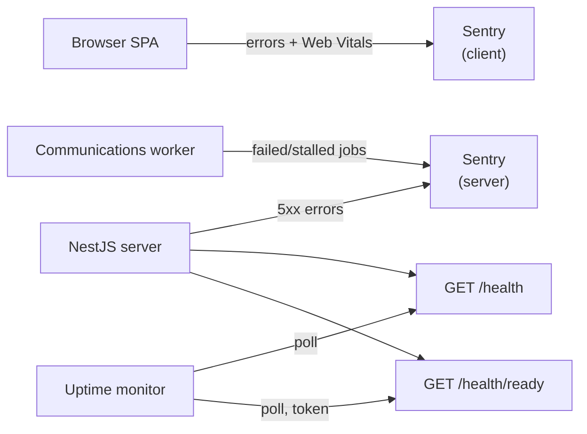
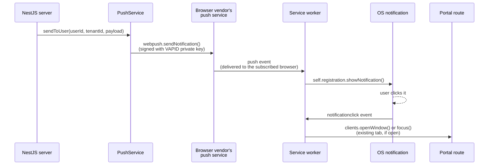
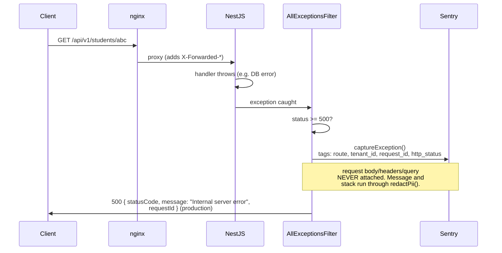

# Operations

> Written for whoever's on call at 2 a.m. Each section is short on purpose —
> if you need more detail than this, follow the link out to the code.

## 1. What is monitored



- **Sentry (client)** — render/route errors, LCP/CLS/INP. See
  [`10-third-party-services.md`](10-third-party-services.md) and
  `ui/src/api/sentry.ts`.
- **Sentry (server)** — every 5xx response and every terminal
  communications-job failure. See [§5](#5-what-gets-attached-and-what-gets-scrubbed) below.
- **`GET /health`** — liveness. Cheap, no dependency checks. Never fails
  because Postgres or Redis is down.
- **`GET /health/ready`** — readiness. Checks Postgres, Redis, and the
  communications queue. Token-protected, blocked at nginx from outside the
  cluster — see [§3.2](#32-readiness-failing).

## 2. Alert thresholds (configure these in Sentry / your uptime tool)

| Signal                               | Threshold                               | Where to configure                                           |
| ------------------------------------ | --------------------------------------- | ------------------------------------------------------------ |
| 5xx rate                             | > 1% of requests over 5 min             | Sentry alert rule on the server project                      |
| `communications job stalled` message | any occurrence                          | Sentry alert rule (issue alert, not metric)                  |
| Readiness failing                    | `/health/ready` returns 503 for > 2 min | Uptime monitor hitting `/health/ready` with `X-Health-Token` |

## 3. Runbooks

### 3.1 5xx spike

1. Open the Sentry issue — it carries `route`, `tenant_id`, `request_id`,
   `http_status` tags (never the request body/headers).
2. Cross-reference the production log by `request_id` — one JSON line per
   request, see [§4](#4-env-var-reference) for `LOG_LEVEL`.
3. If it's one tenant: check that tenant's recent config changes (schools
   settings) before assuming a code bug.
4. If it's every tenant: check the last deploy and Postgres/Redis health
   (`/health/ready`) first — a bad deploy or a dependency outage looks like
   "everything 500s at once."

### 3.2 Readiness failing

`/health/ready`'s body names exactly which dependency failed —
`{ "status": "fail", "checks": { "db": "ok", "redis": "fail", "queue": "ok" } }`
— never a hostname or error message (that would leak infra details to
anything that can reach the token-gated route).

1. **`db: fail`** — check the `db` container/instance is up and accepting
   connections; check `DATABASE_URL` hasn't rotated.
2. **`redis: fail`** — check the `redis` container/instance; check
   `REDIS_URL`. BullMQ (the communications queue) and the rate limiter both
   depend on this — expect login/throttling to degrade too.
3. **`queue: fail`** — Redis is reachable but the queue itself can't be
   read; check for a BullMQ version mismatch or a stuck connection pool.

Each probe is bounded to 2 seconds — a slow dependency fails fast rather
than hanging the whole check.

### 3.3 Failed / stalled communication jobs

A communication (SMS/WhatsApp/email) job that exhausts its retries, or
stalls, sends a Sentry event tagged `queue`, `job_name`, `tenant_id`,
`communication_log_id`, `medium` — never the recipient address or message
body.

1. Take `communication_log_id` from the Sentry tag.
2. Look up that row: `SELECT * FROM communication_log WHERE id = '<id>'` —
   `metadata.error` has the provider's failure reason.
3. **Retry**: re-queue the same log id through the normal reminder/resend
   flow (see [`05-communications.md`](05-communications.md)) — don't hand-edit
   the row's status, that bypasses the batch-outcome accounting.
4. **Mark failed and move on**: leave the row as `FAILED`; nothing further
   happens automatically — a stuck `PROCESSING` row past its worker's lock
   window is what "stalled" means, and BullMQ already retries it once on
   your behalf before this alert fires.

## 4. Env var reference

| Variable                    | Required in prod? | What it does                                                           |
| --------------------------- | ----------------- | ---------------------------------------------------------------------- |
| `SENTRY_DSN`                | No (recommended)  | Server Sentry project. Unset = server Sentry is a no-op.               |
| `SENTRY_ENVIRONMENT`        | No                | Defaults to `NODE_ENV`.                                                |
| `SENTRY_RELEASE`            | No                | Tags events with a release/version string.                             |
| `SENTRY_TRACES_SAMPLE_RATE` | No                | Fraction of requests traced, default `0.1`.                            |
| `HEALTH_TOKEN`              | No (recommended)  | Required to call `/health/ready` at all — unset means that route 404s. |
| `LOG_LEVEL`                 | No                | Pino's log level; see `.env.example`.                                  |

## 5. Web push (VAPID keys)

Web push (browser/OS notifications — see
[`05-communications.md`](05-communications.md#push-first-dispatch-for-routine-automated-notifications-555))
needs a **VAPID** keypair. VAPID (Voluntary Application Server
Identification) is just a signature: it proves to the browser vendor's
push service (Chrome's, Firefox's, etc.) that notifications came from
_this_ server, not an impersonator.

### Generating and storing keys

```bash
node scripts/generate-vapid-keys.mjs
```

prints a public/private keypair. Three env vars, all required together
(`PushConfigService.isPushEnabled()` — push silently no-ops if any is
missing, it never crashes boot):

| Variable            | Where it goes     | Notes                                                                                               |
| ------------------- | ----------------- | --------------------------------------------------------------------------------------------------- |
| `VAPID_PUBLIC_KEY`  | Host env (server) | Also handed to the client SW to subscribe.                                                          |
| `VAPID_PRIVATE_KEY` | **Host env only** | **Never commit it. Never log it.** Anyone with this key can send push notifications as this server. |
| `VAPID_SUBJECT`     | Host env (server) | A `mailto:` address or `https:` URL identifying this deployment — not generated, set it yourself.   |

### Rotation cost

Rotating the keypair is not free — state this plainly to anyone about to
do it:

- A new keypair makes existing subscriptions incompatible with it.
  Browsers reject push messages signed by a key they didn't subscribe
  with.
- A send to an old subscription may be rejected for invalid VAPID
  authentication. `PushService.sendToUser` only prunes the row on a
  404/410 from the browser's push service (a truly dead subscription,
  same cleanup path as a guardian who uninstalled the PWA) — other
  rejections just increment `failure_count` and the row stays.
- Clients do not silently re-subscribe. A guardian must run the
  subscribe flow again (toggling push on in the portal) to create a
  subscription bound to the new `VAPID_PUBLIC_KEY`.
- **Net effect**: after rotating, every guardian falls back to their
  normal channel (SMS/WhatsApp/email) for routine notices until they
  explicitly re-subscribe. Rotate only when you have to (e.g. key
  compromise) — not as routine hygiene.

### Send flow



See `server/src/modules/push/push.service.ts` for the server side and
`client-admin/src/sw.ts` / `sw-push.ts` for the service-worker handlers.

## 6. What gets attached and what gets scrubbed



Example event a support engineer actually sees in Sentry (illustrative,
not a real capture):

```json
{
  "message": "duplicate key for [REDACTED_EMAIL]",
  "tags": {
    "route": "/api/v1/students/:id",
    "tenant_id": "8f1c...",
    "request_id": "b6e2...",
    "http_status": 500
  },
  "request": null
}
```

Redaction reuses one function, `redactPii` in
[`server/src/common/redact-log.util.ts`](../../server/src/common/redact-log.util.ts)
— the production log line, the Sentry event, and the client-side scrubber
in `ui/src/api/sentry.ts` all apply the same email/phone/sensitive-key
patterns, so there's exactly one place to update if the PII shape ever
changes.
