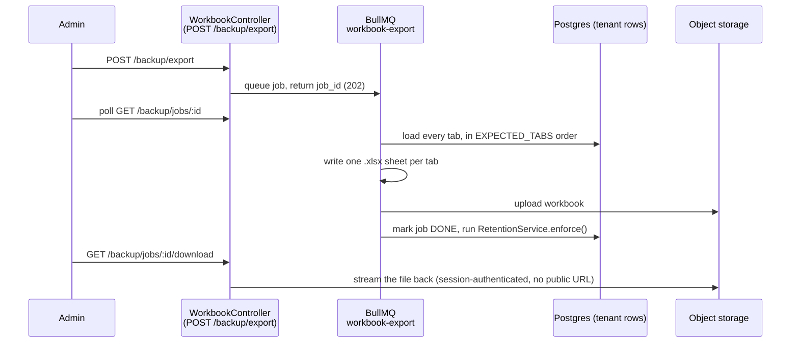
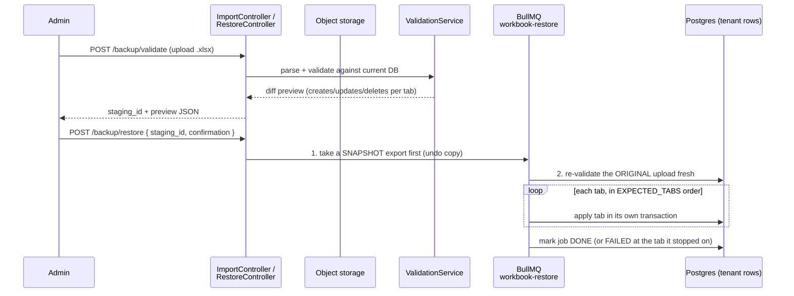

# The school workbook: per-school backup, restore & migration

An admin can export their **own school's data** (not the whole platform) to
one `.xlsx` file, and later restore from one. This is a different thing from
the nightly `pg_dump` covered in
[13-backup-restore.md](13-backup-restore.md) — see "Two kinds of backup" in
that doc for how they relate.

Everything below reflects what shipped in Epic 14 ("School Backup &
Migration", #427), all merged to `main` as of wave 4.

## Export flow



A finished export is a `workbook_jobs` row (`kind: EXPORT`) plus one object
in the bucket. There's never a public or signed link — every download goes
through the authenticated `GET /backup/jobs/:id/download` route, same as how
`13-backup-restore.md` describes school logos.

## Restore flow



Two HTTP round trips, on purpose: `POST /backup/validate` never writes
tenant data — it only stages a dry-run preview an admin reviews before
typing the confirmation phrase. `POST /backup/restore` is the only route
that touches real rows.

## The 18 tabs

Applied (and exported) strictly in this order — a tab may only reference a
tab earlier in the list, so one forward pass is always a valid restore
order (`server/src/modules/workbook/codec/registry.ts`, `EXPECTED_TABS`).

| #   | Tab                   | Natural key                                                                    | Deletes by absence? | Notable exclusions (why)                                                                                                                                                                                                                                                     |
| --- | --------------------- | ------------------------------------------------------------------------------ | ------------------- | ---------------------------------------------------------------------------------------------------------------------------------------------------------------------------------------------------------------------------------------------------------------------------- |
| 1   | `school`              | `name`                                                                         | No                  | `slug`, `domain` — identity/DNS of the destination tenant, never overwritten by a restore. `logo_key` — lives in the bucket, not the workbook. `status`, `status_reason`, `status_changed_at` — destination's own lifecycle                                                  |
| 2   | `academic_years`      | `name`                                                                         | Yes                 | —                                                                                                                                                                                                                                                                            |
| 3   | `classes`             | `name` + `academic_year`                                                       | Yes                 | `numeric_grade` (display-sort hint, derivable)                                                                                                                                                                                                                               |
| 4   | `sections`            | `class` + `academic_year` + `section_name`                                     | Yes                 | —                                                                                                                                                                                                                                                                            |
| 5   | `subjects`            | `code`                                                                         | Yes                 | —                                                                                                                                                                                                                                                                            |
| 6   | `class_subjects`      | `class` + `academic_year` + `subject`                                          | Yes                 | —                                                                                                                                                                                                                                                                            |
| 7   | `holidays`            | `academic_year` + `name` + `start_date`                                        | Yes                 | —                                                                                                                                                                                                                                                                            |
| 8   | `users`               | `email`                                                                        | Yes                 | `password_hash` — a credential never leaves the system; restored users re-onboard via the invitation flow. `email_verified_at`/`phone_verified_at` — proof of ownership belongs to the destination. `status`, `profile_picture_url` (bucket), `preferences`, `last_login_at` |
| 9   | `teachers`            | `employee_id`                                                                  | Yes                 | —                                                                                                                                                                                                                                                                            |
| 10  | `teacher_assignments` | `teacher` + `class` + `academic_year` + `section` + `subject`                  | Yes                 | —                                                                                                                                                                                                                                                                            |
| 11  | `guardians`           | `phone` (falls back to email, then `full_name\|relationship` — see note below) | Yes                 | —                                                                                                                                                                                                                                                                            |
| 12  | `students`            | `registration_number` (globally unique)                                        | Yes                 | —                                                                                                                                                                                                                                                                            |
| 13  | `enrollments`         | `student` + `academic_year`                                                    | Yes                 | —                                                                                                                                                                                                                                                                            |
| 14  | `fee_structures`      | `class` + `academic_year` + `section` + `fee_type` + `month` + `name`          | Yes                 | —                                                                                                                                                                                                                                                                            |
| 15  | `student_fees`        | `student` + `academic_year` + `month` + `year`                                 | Yes                 | —                                                                                                                                                                                                                                                                            |
| 16  | `invoices`            | `invoice_number`                                                               | Yes                 | `issuer_snapshot` — the frozen issuer identity at issue time is never carried forward; a restored row falls back to the live school profile instead (D9 of #508)                                                                                                             |
| 17  | `payments`            | `transaction_reference`                                                        | Yes                 | `issuer_snapshot` (same reasoning as invoices)                                                                                                                                                                                                                               |
| 18  | `payment_allocations` | `payment` + `student_fee`                                                      | Yes                 | —                                                                                                                                                                                                                                                                            |

Every tab except `school` deletes by absence — a row missing from the
uploaded sheet is treated as "the admin deleted this row" and removed on
restore. `school` never deletes because it's a singleton profile row, not a
list.

**`guardians`' natural key isn't a real uniqueness guarantee** — `phone` has
a plain (non-unique) index, so two guardians can legitimately share one
phone number. Restore doesn't fail on that; it matches whichever guardian
the key resolves to rather than silently picking one, and treats it as an
accepted limitation of using a human-meaningful key instead of a database
id.

Most `ref`/`ref-list` columns (`class`, `section`, `academic_year`, ...) are
excluded from the raw column list only in the sense that the _foreign-key
id_ is excluded — the export instead writes the referenced tab's natural
key into the cell, and restore resolves it back to a real id.

## Restore semantics, in plain words

- **One database transaction per tab, not one for the whole restore.** If
  tab 12 (`students`) fails, tabs 1–11 stay committed. The safety net for a
  bad restore is the pre-restore snapshot (below), not an all-or-nothing
  rollback.
- **"Failed at tab X" means:** every tab before X in the 18-tab order is
  fully applied (upserts and deletes both), tab X itself did not commit at
  all, and every tab after X was never attempted. The job row is marked
  `FAILED` with `failed_tab` set to X's name — check `GET /backup/jobs/:id`
  for that field.
- **The snapshot is the undo.** Before touching a single row, `POST
/backup/restore` queues a `SNAPSHOT`-kind export of the tenant's _current_
  data and waits for it to finish. If the restore then fails partway (or
  the admin doesn't like the result), that snapshot is downloadable and
  re-uploadable through the exact same restore flow — there's no separate
  "undo" button, undoing is just restoring the snapshot.
- **Re-validation happens twice.** `POST /backup/validate` checks the
  upload against the DB _at preview time_, purely to build the diff the
  admin approves. `POST /backup/restore` re-validates the same original
  upload _again_, fresh, against whatever the DB looks like right before
  applying — because time has passed and someone else may have changed
  data. If that second validation finds any hard error, nothing is
  touched at all (not even tab 1) rather than risk `deleteByAbsence`
  misreading a parse failure as "the admin deleted this row."
- **A `TEMPLATE`-kind workbook can never delete.** `deleteByAbsence` is
  skipped entirely if the uploaded workbook is a blank template rather than
  a real export/restore round trip.

## Retention, scheduling, and env vars

From `server/src/modules/workbook/schedule/retention.service.ts`, run once
per tenant at the end of every successful export:

| Rule                          | Value                                                                |
| ----------------------------- | -------------------------------------------------------------------- |
| Newest SCHEDULED exports kept | 8 (`KEEP_SCHEDULED_COUNT`)                                           |
| Newest MANUAL exports kept    | 3 (`KEEP_MANUAL_COUNT`)                                              |
| SNAPSHOT max age              | 30 days (`SNAPSHOT_RETENTION_DAYS`)                                  |
| Per-tenant storage cap        | 500 MB (`STORAGE_CAP_BYTES`), oldest unpinned DONE row evicted first |
| Pinned backups                | Exempt from every rule above (still count toward the storage cap)    |

**Scheduling** is a per-tenant setting, not an env var:
`settings.backup.schedule` is one of `OFF` / `DAILY` / `WEEKLY`
(`server/src/modules/workbook/schedule/backup-schedule.service.ts`), cron
`0 2 * * *` (daily) or `0 2 * * 0` (weekly), run in the school's own
timezone (`settings.region.timezone`, default `Asia/Dhaka`).

**Env vars:** the workbook feature reads no dedicated env vars of its own —
it stores to the same S3-compatible bucket every other upload uses. See
[13-backup-restore.md](13-backup-restore.md#env-vars-153x) for
`S3_ENDPOINT`, `S3_BUCKET`, `S3_ACCESS_KEY_ID`, etc. Don't duplicate that
table here.

## Adding a new tab

1. Copy an existing tab in the closest group directory as a starting
   point — `server/src/modules/workbook/tabs/school/school.tab.ts` is the
   simplest example (one row, no natural-key fallback chain).
2. Register the new `TabSpec` in that group's barrel (e.g.
   `tabs/academics/index.ts`), and add its name to `EXPECTED_TABS` in
   `codec/registry.ts` — in dependency order, right after every tab it
   references.
3. Run `codec/registry.completeness.spec.ts` — it fails if any entity
   column is missing from both `columns` and `excluded`, which catches a
   forgotten field immediately.
4. Run `export/export.integration.spec.ts` and
   `restore/restore.integration.spec.ts` — the round-trip tests that export
   real data and restore it back, tab by tab.

## Worked example: a 3-row `students` sheet

Say the uploaded workbook's `students` sheet has:

| id                  | registration_number | full_name    | roll_number | class | academic_year | section | ... |
| ------------------- | ------------------- | ------------ | ----------- | ----- | ------------- | ------- | --- |
| _(blank)_           | STU-2026-101        | Karim Rahman | 12          | Six   | 2026          | A       |     |
| _(blank)_           | STU-2026-102        | Fatima Begum | 5           | Six   | 2026          | A       |     |
| b1c9...-existing-id | STU-2025-044        | Nusrat Jahan | 1           | Six   | 2026          | B       |     |

Two rows are new (blank `id`), one matches an existing student by id. If the
tenant currently has 40 students and this sheet only lists these 3, the
other 37 are absent — `deleteByAbsence: true` means they'll be deleted on
restore.

`POST /backup/validate`'s diff preview for this tab looks like:

```json
{
  "name": "students",
  "present": true,
  "creates": 2,
  "updates": 1,
  "unchanged": 0,
  "deletes": 37
}
```

That's exactly what the admin reviews and must confirm before
`POST /backup/restore` is allowed to run.

## Every `/backup/*` route

All nine tenant-scoped routes require the `BACKUP_MANAGE` permission and
`ADMIN`/`SUPER_ADMIN` roles (`server/src/modules/auth/`).
`/platform/backups/health` is different: it's a cross-tenant,
`SUPER_ADMIN`-only route with no `BACKUP_MANAGE` check at all — see the
controller's own doc comment for why (it reports on every school, not the
caller's tenant).

| Method  | Route                                    | Permission                       | Controller                       |
| ------- | ---------------------------------------- | -------------------------------- | -------------------------------- |
| `POST`  | `/backup/export`                         | `BACKUP_MANAGE`                  | `WorkbookController`             |
| `GET`   | `/backup/jobs`                           | `BACKUP_MANAGE`                  | `WorkbookController`             |
| `GET`   | `/backup/jobs/:id`                       | `BACKUP_MANAGE`                  | `WorkbookController`             |
| `PATCH` | `/backup/jobs/:id/pin`                   | `BACKUP_MANAGE`                  | `WorkbookController`             |
| `GET`   | `/backup/jobs/:id/download`              | `BACKUP_MANAGE`                  | `WorkbookController`             |
| `POST`  | `/backup/restore`                        | `BACKUP_MANAGE`                  | `RestoreController`              |
| `POST`  | `/backup/validate`                       | `BACKUP_MANAGE`                  | `ImportController`               |
| `GET`   | `/backup/validate/:stagingId/errors.csv` | `BACKUP_MANAGE`                  | `ImportController`               |
| `GET`   | `/backup/template`                       | `BACKUP_MANAGE`                  | `TemplateController`             |
| `GET`   | `/platform/backups/health`               | _none — `SUPER_ADMIN` role only_ | `PlatformBackupHealthController` |
