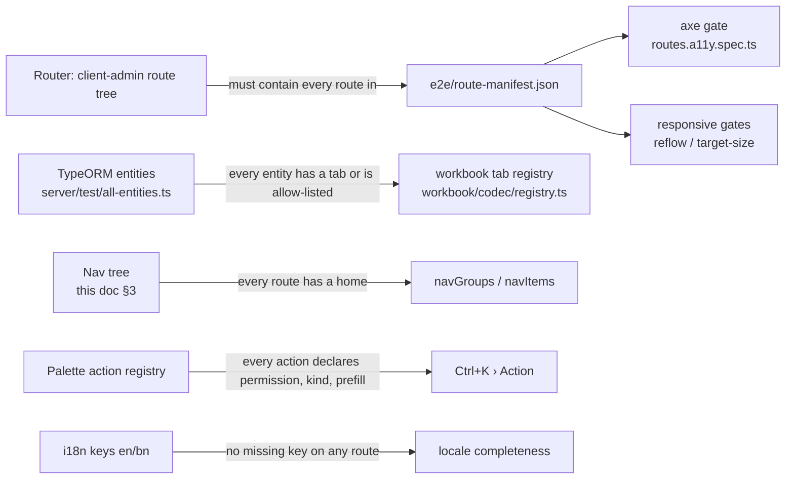
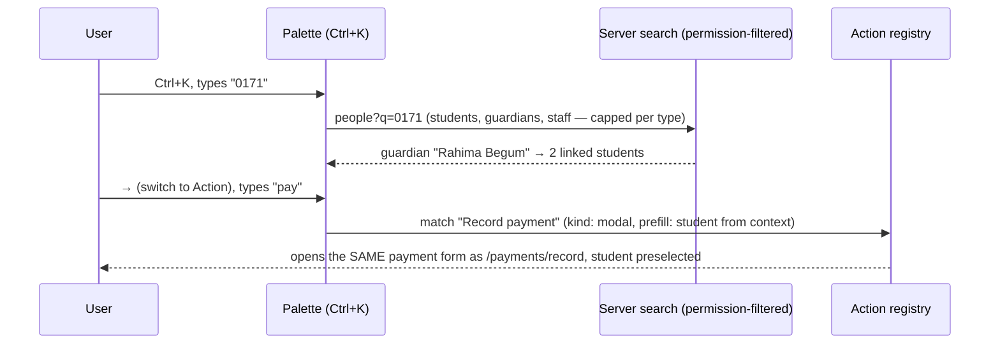

# UX Principles — placement, navigation, keyboard, and "no silent gaps"

Decided 2026-09-17 while planning the academics epics (19.0–29.0) from the
reference-ERP analysis. This doc is the **interaction** contract; the
**visual** contract (type, colour, elevation, motion, focus vocabulary,
table→card grammar) stays in [09-design-direction.md](09-design-direction.md).
Read both before planning any screen.

## 1. The rules in one screen

| #   | Rule                                            | What it means in practice                                                                                                                                                                                          |
| --- | ----------------------------------------------- | ------------------------------------------------------------------------------------------------------------------------------------------------------------------------------------------------------------------ |
| U1  | **Every feature has one natural place.**        | Each screen is placed in the nav tree below (§3). Sub-features nest under their parent; nothing new is a top-level item unless a user job needs it. Every epic states _where each screen lives_ against this tree. |
| U2  | **No silent gaps.**                             | Every registry that enumerates screens, entities or actions has a guard that **fails CI** when a new thing isn't registered (§2). A new screen may be wrong; it can never be _unchecked_.                          |
| U3  | **Keyboard and accessibility are first-class.** | Every screen is fully keyboard-operable; the axe gate stays blocking; a keyboard-journey e2e ships with every new screen; a manual screen-reader pass closes every epic (§6).                                      |
| U4  | **One palette, `Ctrl/Cmd+K`.**                  | Three tabs — _People · Page · Action_ — switchable by keyboard. Actions come from a registry, not from ad-hoc buttons (§4).                                                                                        |
| U5  | **Breadcrumbs mirror the URL.**                 | Derived from the route tree, entity names when loaded, clickable, identical on every screen (§5).                                                                                                                  |
| U6  | **Nothing new is unrecoverable.**               | Any epic that adds an entity ships its workbook tab (export + restore + round-trip test) and seed coverage in its wave-close ticket (§7).                                                                          |
| U7  | **Reuse the shell, reuse the form.**            | New screens use `ui/src/shells/*` (list / detail / form / wizard). A palette action that opens a modal renders the _same_ form component as the page — never a second copy.                                        |

## 2. No silent gaps — the registries and their guards

SchoolManager already has several lists that enumerate "everything". The
problem is that most of them are hand-maintained: adding a route to the
router without adding it to the manifest silently drops that screen out of
the a11y gate. The fix is one guard per registry.



| Registry                                                                                    | Enumerates                                           | Guard today                                                                                                                                                                                                                                     | Guard required                                                                                                                                                                                                           | Owner     |
| ------------------------------------------------------------------------------------------- | ---------------------------------------------------- | ----------------------------------------------------------------------------------------------------------------------------------------------------------------------------------------------------------------------------------------------- | ------------------------------------------------------------------------------------------------------------------------------------------------------------------------------------------------------------------------ | --------- |
| `e2e/route-manifest.json`                                                                   | Routes + overlays for the a11y and responsive suites | `client-admin/src/route-manifest.test.ts` — bidirectional diff between the manifest and the router's own route tree                                                                                                                             | fails on any route missing from the manifest, or any manifest entry with no matching route                                                                                                                               | Epic 30.0 |
| `client-admin/src/route-permissions.ts` (`STAFF_ROUTE_PERMISSIONS`)                         | Which permission gates each staff route              | `client-admin/src/route-permissions.test.ts` — bidirectional diff between the map's keys and the router's route tree                                                                                                                            | fails closed: a route with no entry is refused to everyone, and the test still flags it so it's caught before merge                                                                                                      | Epic 30.0 |
| Workbook tab registry (`server/src/modules/workbook/codec/registry.ts`)                     | Which entities export/restore                        | `registry.completeness.spec.ts` checks every entity in `ALL_ENTITIES` has a tab or sits in `entity-coverage.ts`'s explicit allowlist, with a reason                                                                                             | entity-level check: same as today                                                                                                                                                                                        | Epic 30.0 |
| Nav tree (§3) → `navGroups`/`navItems`                                                      | Where every screen lives                             | `client-admin/src/nav-tree.test.ts` + `nav-not-in-nav.ts` — every route is either in the nav tree or on the explicit `NOT_IN_NAV` allowlist (auth pages, framework plumbing)                                                                    | fails if a route is reachable but appears in neither list                                                                                                                                                                | Epic 30.0 |
| Palette action registry (`client-admin/src/action-registry.ts` + `unregistered-actions.ts`) | Every user-invocable palette action                  | **in review** — the Epic 30.4.2 PR adds `ACTIONS` (registered actions, each with a `run()` and a matching `STAFF_ROUTE_PERMISSIONS` entry) and `UNREGISTERED_ACTIONS` (dialogs not yet wired in, each tagged with the epic that owns wiring it) | once merged: a route-and-permission check on every `ACTIONS` entry, plus a stale-epic check on every `UNREGISTERED_ACTIONS` entry (see the registry table in [06-frontend-architecture.md](06-frontend-architecture.md)) | Epic 30.4 |
| i18n locale files (`en`/`bn`)                                                               | Every user-visible string                            | `ui/scripts/check-i18n-keys.mjs`, blocking in CI ("UI missing-translation-key check", `.github/workflows/ci.yml:220`)                                                                                                                           | fails on a key present in one locale but not the other, or a `t()` call with no matching key in either locale                                                                                                            | Epic 8.7  |
| Route breadcrumbs (`client-admin/src/route-crumbs.ts`)                                      | Breadcrumb label per route                           | **planned, not yet merged** — PR [#873](https://github.com/tareq89/biddaloy/pull/873) adds `route-crumbs.test.ts`, same bidirectional-diff shape as the two guards above                                                                        | once merged: fails if a route has no crumb entry, or an entry points at a route that no longer exists                                                                                                                    | Epic 30.0 |
| Seed data                                                                                   | Demo/dev rows for every entity                       | wave-close convention                                                                                                                                                                                                                           | wave-close ticket checklist item; entity without seed fails the seed smoke test                                                                                                                                          | each epic |

Concrete example of the rule applied: Epic 21.0 adds `/routines/class`.
The wave-close ticket must (a) add it to the route manifest, (b) add it to
the nav tree under _Academics › Timetable & routines_, (c) register
"Open my routine" as a palette action, (d) add `en`/`bn` keys, (e) add a
workbook tab for `routine_slots`. Any of those missing fails CI, not code
review.

## 3. Navigation tree

Built from a full inventory (672 rows: the reference ERP's nav, its
permission catalogue of 169 controllers, the analysis report's 136
features, every existing SchoolManager route, every open epic). 657 rows placed,
15 deliberately excluded (vendor quiz game, application-menu registry,
mobile-app CMS pages, framework plumbing), 0 unplaced. Owners in brackets:
`have` exists today · `partial` exists but thinner than the reference ·
`19.0` etc. = open epic · `N2` etc. = new-epic candidate from the report.

Roles: **A** admin · **Ac** accountant · **E** executive · **T** teacher ·
**G** guardian · **S** student · **P** platform (super-admin).

### 3.1 Staff tree

```text
Dashboard [partial → 8.10.7, 8.15]                                  A Ac E T

People
  Students [have]                                                   A Ac E T
    New student · Import from Excel                                 A E
    Student detail — tabs today: Overview, Enrollment, Guardians, Attendance, Fees, Invoices, Payments, Communication, Activity
      + Results [19.0] · Homework [22.0] · Programs & milestones [N2] · Notes [N11] · Records [N11]
      + Subjects (optional/4th) [19.0] · Fines [N8] · Documents [Print module]
  Guardians [have] → detail: Information, Linked students, Payments, Communication
  Staff [partial] — ONE register (teachers, employees, administration, principal/VP as designations)
    Staff detail — tabs today: Profile, Memberships, Permissions, Login history, Invitation
      + HR record [23.0] · Teaching assignments [29.0+23.0] · Attendance & leave [N5] · ACR [28.0]
      + Documents [Print module] · Website profile [N13]
    Teaching assignments (bulk view) [29.0+23.0]                    A E
  Admissions [27.0] · Admission reports [27.0+N11]                  A E
  Programs & milestones [N2]                                        A E T

Academics
  Academic years & terms [have, 17.0 adds terms]                    A E
  Calendar [17.0] · Holidays [have API, 17.0 UI]                    A Ac E T
  Classes & sections [have] · Groups/streams [have, 33.0] · Classrooms [21.0]
  Subjects [partial → own page; flags: order, unit, effect, merge-with, grade-subject]
  Timetable & routines [21.0]  ("Routines")                         A Ac E T
    Class routine · Auto-generate · Routine setup · Substitutions · Exam routine · My routine (T)
  Homework [22.0] · Defaulters · Homework report                    A E T
  Syllabus [22.0]                                                   A E T
  Online learning [N6] · Online classes · Online exams              A E T

Attendance
  Students [have] · Monthly grid [partial] · Upload device file [partial] · Period/subject-wise [N15]
  Staff [N5] · Leave · Report for payroll                           A E (Ac)
  Reports [have] · Yearly summary [partial] · Defaulters [have] · Submission check-list [N15]
  Printable register [have] · Sheet layout [Print module]
  Fines [N8] — generate, waive, lists, fine SMS (money side reuses Finance › Payments)

Exams & Results
  Exams [19.0]                                                      A E T
  Exam setup [19.0] · Types & heads · Marks distribution · Report-card templates
  Marks entry [19.0+29.0] · Marks view [19.0] · Grading scales [20.0]
  Results [19.0] · Result by student ID
  Analysis [have] · Merit list · Defaulted list · Pass/fail (+ by component)
  Promotion [have] · Draft run · Grid override · Commit                   A E
  Segregation [26.0, not yet shipped]
  Seat plans [25.0] · Exam printables [Print module]

Finance
  Fees · Student dues · Fee structures · Generate fees · Payments (+ Student statement [8.15]) · Record payment · Invoices   [all have]
  Online payments [3.0] · Unmatched receipts [16.0]                 A Ac

Communications
  Send message [have] (+ to staff, role-wise [partial])             A E T
  Fee reminders [have] · Reminder history [have]                    A Ac E
  Notices [have]                                                    A E T
  Automatic notices [partial: absent ✓ · fine N8 · result/marks 19.0 · homework 22.0 · receipt 3.0]

Reports [8.15] — a hub that LINKS to screens that live with their data; no copies
  Communications · Collections [have] · Student dues [have] · Attendance [have]
  Student lists [8.15] · Student count [8.15] · Printables & documents [Print module] · Exports [8.15]

Administration
  Settings [have] → sub-pages:
    Attendance policy & times [partial → N15] · Fine rules [N8] · Communication providers [have]
    School profile & logo [have] · Region & locale [17.0] · Presets & feature toggles [N3]
    Organisation structure [have, 33.0 — Settings section, no new route; a
    shift/version/group field only shows once the tenant has 2+ entries in
    it] · Result templates library [19.0] · Backup & restore [have] · Website sync [N13]
  Users [have, kept here for now — revisit in Epic 24.0]
  Roles & access [24.0] · Audit logs [have] · Security [have]

User menu → My account (profile, password, switch school/role, language, theme, sign out)
```

### 3.2 Guardian / student portal tree

```text
Overview [have]
Fees & invoices [have] · Pay online [3.0] · Statement [8.15]
Attendance [have] · Absent fines [N8]
Results [19.0] · Homework [22.0] · Syllabus [22.0] · Routine [21.0]
Calendar & notices [17.0; notices have]
Online exam & class [N6] · Programs [N2] · Documents [Print module]
Account [have]
```

### 3.3 Platform (super-admin) tree

```text
Schools [have] · Public holiday sets [17.0] · Preset library [N3]
```

### 3.4 Placement decisions (final)

| #   | Decision                                                                                                                                                                     |
| --- | ---------------------------------------------------------------------------------------------------------------------------------------------------------------------------- |
| P1  | Academic years & terms live under **Academics**, next to Calendar.                                                                                                           |
| P2  | Staff is **one register** with a staff-type filter and designations — not five registers.                                                                                    |
| P3  | Subjects get their **own page** under Academics; the class detail keeps a per-class offering tab.                                                                            |
| P4  | Exam setup (types/heads/sub-heads, marks distribution, report-card templates) lives under **Exams & Results**, not Settings.                                                 |
| P5  | Reports is a **hub of links**; a report lives once, where its data lives.                                                                                                    |
| P6  | Notices live under **Communications**.                                                                                                                                       |
| P7  | Fines: generation/waive/lists under **Attendance**; money reuses **Finance › Payments**.                                                                                     |
| P8  | Online learning is **one item** so a tenant toggle (N3) can hide it whole.                                                                                                   |
| P9  | Teaching assignments bulk view lives under **People › Staff**; also a tab on staff detail and class detail.                                                                  |
| P10 | **Users stays under Administration for now**; whether it merges into Staff is decided in Epic 24.0.                                                                          |
| P11 | Coaching centres reuse Class/Section, relabelled Course/Batch via tenant label overrides — not Programs. Programs are supplementary tracks (hifz, trades, labs, attachment). |

## 4. Command palette — `Ctrl/Cmd+K`

One component, three tabs. Each tab is a mode; the shortcut opens the
palette on _People_; `←`/`→` move between tabs, `Ctrl+1`/`Ctrl+2`/`Ctrl+3`
jump directly to People/Page/Action, and typing a prefix jumps to a mode
as a shortcut (`/` Page, `>` Action). **`Tab` deliberately keeps its native
browser meaning** rather than switching tabs — the palette's search input
is a `role="combobox"` that must keep focus for the whole interaction, and
binding `Tab` inside it would break the browser's own focus-trap-escape
that keyboard users rely on (`ui/src/components/command-palette.tsx`'s own
comment block spells this out — **in review**, PR
[epic/30/w4-g1-01-command-palette](https://github.com/tareq89/biddaloy/tree/epic/30/w4-g1-01-command-palette),
not yet merged). The existing
`ui/src/components/global-search.tsx` + `client-admin/src/components/global-search-launcher.tsx`
is the base to generalise — it already has the keyboard model, role
gating and per-entity capped requests.



| Tab        | Matches on                                                                                                | Empty query shows                          | Result row                                                |
| ---------- | --------------------------------------------------------------------------------------------------------- | ------------------------------------------ | --------------------------------------------------------- |
| **People** | name en/bn, student/employee ID, roll, class/section, **phone (a guardian's phone finds their students)** | recently opened records                    | type chip · name · secondary line (class/section or role) |
| **Page**   | nav tree labels en/bn, route paths, synonyms ("routine" → Timetable & routines)                           | most-visited pages                         | group › item breadcrumb                                   |
| **Action** | action labels en/bn, synonyms                                                                             | actions valid for the current page context | label · kind icon · shortcut hint                         |

**Action registry contract** — the only way an operation becomes invocable:

```ts
{
  id: 'payments.record',
  label: { en: 'Record payment', bn: '…' },
  permission: 'payments:create',          // same gating as the nav
  kind: 'modal' | 'navigate' | 'inline',
  context: ['student', 'guardian'],       // what it can prefill from
  run: (ctx) => …                          // opens the shared form or navigates
}
```

Rules: no field-count restriction on modal actions — a modal may hold a
whole flow (pick person → see applied fees → record). Modal actions render
the same form component as the page (U7). Every action carries i18n labels
in both locales. The actual seed list lives in
`client-admin/src/action-registry.ts` (`ACTIONS` — actions already wired
into the palette) and `client-admin/src/unregistered-actions.ts`
(`UNREGISTERED_ACTIONS` — dialogs that exist in the app but aren't in the
palette yet, each tagged with the epic that owns wiring it in); there is
no separately-persisted "first 34 actions" list — that count was never
more than a plan-time estimate.

## 5. Breadcrumbs

- Derived from the TanStack route tree, never hand-written per page.
- Entity segments show the entity name once loaded (`Students › Rahim Uddin › Fees`), the ID as fallback while loading.
- Every crumb but the last is a link. The trail also feeds `document.title` (`Fees · Rahim Uddin · SchoolManager`).
- Sits **above** the page title inside the shell header; on phones only the last two crumbs show.
- Identical placement and behaviour on every screen — staff and portal.

## 6. Accessibility and keyboard gates

| Gate                                          | Today                                     | Rule                                                                                                 |
| --------------------------------------------- | ----------------------------------------- | ---------------------------------------------------------------------------------------------------- |
| axe per route × locale × theme, plus overlays | blocking (`e2e/a11y/routes.a11y.spec.ts`) | stays blocking; manifest guard (§2) makes it complete                                                |
| Keyboard journey per screen                   | some (`e2e/keyboard/*`)                   | one per new screen, in the wave-close ticket: open from nav, do the primary task, leave — mouse-free |
| Focus vocabulary                              | 09-design-direction §12                   | unchanged                                                                                            |
| Screen reader                                 | none                                      | manual VoiceOver/NVDA pass at every epic close, findings filed as issues                             |
| Target size / reflow                          | blocking (`e2e/responsive/*`)             | unchanged                                                                                            |

## 7. Backup and restore coverage

Every epic that adds a tenant-scoped entity ships, in the wave-close ticket
of the wave that adds it: the workbook tab (export + restore), a round-trip
test (`server/test/workbook-roundtrip.integration.spec.ts` pattern), and
seed rows. The entity-level guard (§2) turns "forgot the tab" into a red
CI, and the allowlist (with a one-line reason per entry) is the only way
to opt an entity out. See [14-school-workbook.md](14-school-workbook.md).

## 8. What every epic must state

Three mandatory sections in every epic body (enforced by the `plan-epic`
skill template):

- **UX requirements** — where each screen lives (tree path from §3), the
  keyboard path for the primary task, palette actions it registers,
  breadcrumb shape, empty/error states, phone layout.
- **Backup & restore coverage** — entities added, their tabs, seed rows.
- **No-silent-gaps checklist** — route manifest, nav tree, action registry,
  i18n keys, workbook tab, seed: each ticked with the ticket that does it.

And one **UX round** in the grill (Phase 1): placement, keyboard path,
actions, breadcrumbs, empty states, phone — asked before decisions are
final, so UX is designed, not retrofitted.
