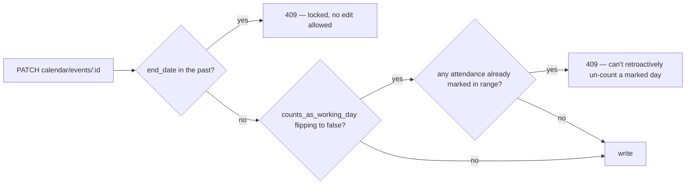
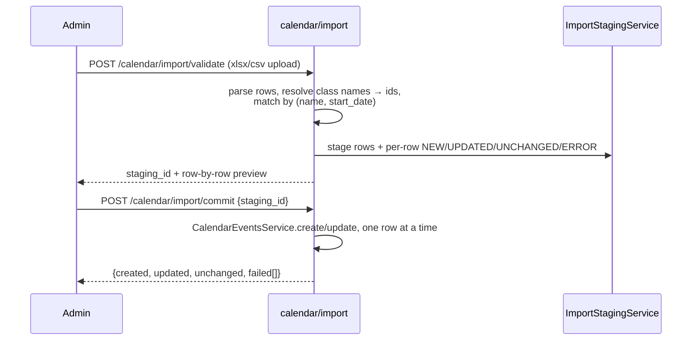
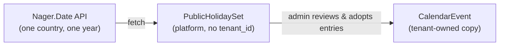

# Academic Calendar

The calendar is the **blueprint** every other module reads to answer "is this
a working day, and what's on it." Attendance subtracts its non-working days
from the denominator. Reminders read it to notify people about what's coming.
Nothing else in the app owns a school's holiday/exam/event list — this is the
one copy.

Everything below uses one running example: **"Half-yearly exam · Class 9, 10
· 10–20 Nov"** — a real `CalendarEvent` a school might create.

## 1. Entities

```mermaid
erDiagram
    School           ||--o{ CalendarEvent      : scopes
    School           ||--o{ AcademicTerm       : scopes
    School           ||--o{ CalendarFeedToken  : scopes
    AcademicYear     ||--o{ CalendarEvent      : "calendar for"
    AcademicYear     ||--o{ AcademicTerm       : "split into"
    CalendarEvent    ||--o{ CalendarEventClass : "scoped to (empty = all classes)"
    Class            ||--o{ CalendarEventClass : "scoped by"
    User             ||--o{ CalendarFeedToken  : "subscribes via"
    PublicHolidaySet ||--o{ PublicHolidayEntry : contains
```

`PublicHolidaySet` has no `tenant_id` — it's a **platform** table (D10): one
fetch of a country's public holidays for one year, shared by every tenant in
that country. A tenant _adopts_ individual entries into its own
`CalendarEvent` rows rather than owning a copy.

| Entity                                    | What it is                                                                                                                                                 |
| ----------------------------------------- | ---------------------------------------------------------------------------------------------------------------------------------------------------------- |
| `CalendarEvent`                           | One calendar entry — `type` is `HOLIDAY`, `EXAM`, `EVENT`, `MEETING`, or `DEADLINE`. Renamed from `SchoolHoliday` (which only meant holidays) in [17.1.2]. |
| `AcademicTerm`                            | A term/semester/trimester inside an `AcademicYear`, ordered by `seq`; two terms in the same year can never overlap dates.                                  |
| `CalendarEventClass`                      | Join row scoping an event to one `Class`. No rows for an event = visible to every class.                                                                   |
| `CalendarFeedToken`                       | A revocable per-user token; its plaintext becomes part of an ICS subscription URL.                                                                         |
| `PublicHolidaySet` / `PublicHolidayEntry` | Platform-level: one country's fetched holiday list for one year.                                                                                           |

Our example, as a `CalendarEvent` row:

```json
{
  "id": "evt_9f2a",
  "type": "EXAM",
  "name": "Half-yearly exam",
  "start_date": "2026-11-10",
  "end_date": "2026-11-20",
  "counts_as_working_day": true,
  "audience": "ALL",
  "published_at": "2026-10-01T09:00:00Z"
}
```

Two `CalendarEventClass` rows link it to Class 9 and Class 10. `EXAM` still
`counts_as_working_day: true` — an exam day is on the calendar, but it isn't
a holiday, so it doesn't shrink the attendance denominator.

## 2. Visibility — who sees what

Resolved once per request by `CalendarEventsService.resolveViewer`, then
enforced by the single `visibilityWhere()` query filter every list/read
route shares — nobody can fetch by id what they couldn't find in a list.

| Role                                         | Sees                                                                                                               |
| -------------------------------------------- | ------------------------------------------------------------------------------------------------------------------ |
| SUPER_ADMIN / ADMIN / EXECUTIVE / ACCOUNTANT | Every event, no filter                                                                                             |
| TEACHER                                      | `audience` is `ALL` or `STAFF`, **or** the event is scoped to a class they teach                                   |
| PARENT / STUDENT                             | `audience = ALL` only, **and** (event has no class scope **or** it includes one of their linked students' classes) |
| Any other role                               | Nothing — fails closed                                                                                             |

`STAFF`-audience events never reach a parent or student, regardless of class
scope. Our example (`audience: ALL`, scoped to Class 9/10) is visible to a
Class 9 parent, a Class 11 teacher (via the `STAFF`-or-`ALL` rule), and every
admin — but not to a Class 11 parent.

## 3. Working-day math

`SchoolCalendarService.getWorkingDays` is the one place that turns a date
range into a working-day count: weekly off-day, minus every **published**
`CalendarEvent` with `counts_as_working_day = false`. Attendance's
percentage formula (see [11-attendance.md §5](11-attendance.md#5-working-days-and-the-percentage))
consumes that number — it never computes holidays itself.

**Draft events never count.** `published_at = null` means the event is
invisible to working-day math and to attendance, no matter what its
`counts_as_working_day` flag says (D9). Publishing is a separate, explicit
step from creating.

## 4. Past-lock and the attendance guard



A locked (past) event can't be touched at all — not even to fix a typo.
Turning a normal day into a non-working day is blocked if attendance was
already recorded for it, so a register a teacher already submitted never
silently stops counting.

## 5. Import flow

An admin can bulk-load a term's calendar from a spreadsheet instead of
clicking through the UI event by event.



Commit reuses `CalendarEventsService.create`/`update` directly — every
past-lock and attendance-guard rule from §4 applies to an imported row the
same as a UI-created one. Commit isn't one DB transaction: a failed row
doesn't roll back rows already written, but re-uploading the same file is
safe — already-committed rows resolve as `UNCHANGED`/`UPDATED` on the next
`validate`, never duplicated.

## 6. Government holidays: platform → school



One `PublicHolidaySet` per `(country, year)` is shared by every tenant in
that country — Bangladesh's 2026 list is fetched once, not per school. A
tenant's admin reviews the platform list and imports the entries it wants;
each import creates its own `CalendarEvent` row, so a school can drop a
holiday it doesn't observe without affecting any other tenant.

## 7. The ICS feed

```mermaid
sequenceDiagram
    participant User
    participant API as calendar/feed
    participant Cal as Calendar app (Google/Apple/Outlook)

    User->>API: GET calendar/feed (authenticated)
    API-->>User: feed URL, embedding a fresh token's plaintext
    Note over API: minting a new token revokes any prior one (D13) —<br/>a leaked URL is cut off by re-generating, not a separate revoke

    Cal->>API: GET calendar/feed/:token.ics (no auth, no tenant header)
    API->>API: look up token_hash; 404 if unknown/revoked/user deactivated
    API-->>Cal: ICS body (only events that token's viewer can see)
```

The feed applies the same §2 visibility rule as the authenticated API — a
parent's feed URL only ever contains events that parent could see in the
app. Our example event renders as one `VEVENT`:

```
BEGIN:VEVENT
UID:evt_9f2a@biddaloy
SUMMARY:Half-yearly exam
DTSTART;VALUE=DATE:20261110
DTEND;VALUE=DATE:20261121
END:VEVENT
```

Excluded from every `VEVENT`: `audience`, `counts_as_working_day`,
`published_at`, and any internal id other than the event's own — nothing
that isn't meaningful to an external calendar app.

## 8. Notify path

Creating or publishing an event can push a reminder (`CalendarNotifyService`,
filling the [17.1.2] stub):

- **Push**: every user who could see the event under §2's rule, sent
  directly via `PushService` — no queue, no per-send cost.
- **SMS**: only for an `ALL`-audience event, only to guardians, via the same
  `ReminderBatch` + `CommunicationLog` primitive `absence-notice.service.ts`
  uses (see [05-communications.md](05-communications.md)). `STAFF`-audience
  events never SMS a guardian.
- **Opt-out**: `notify` / `notify_sms` are per-request flags on
  create/update — omitting them sends nothing; there's no separate
  standing subscription to turn off.

## 9. Settings map

| Setting                     | Lives at                               | Meaning                                                                                         |
| --------------------------- | -------------------------------------- | ----------------------------------------------------------------------------------------------- |
| `region.calendar.termLabel` | tenant (`RegionCalendarDto`, [17.1.1]) | What the tenant calls a grading period — `TERM` / `SEMESTER` / `TRIMESTER`. Defaults to `TERM`. |
| `region.country`            | tenant                                 | Picks the default public-holiday source/country for §6.                                         |
| Weekly off-day              | tenant region settings                 | Read by `getWorkingDays` alongside `CalendarEvent` rows.                                        |

## 10. Deferred, with context

Copied from the epic (#701) so a future Google-Calendar or Routine epic finds
it without re-litigating the call:

- **Two-way Google Calendar sync** — this epic only ships the one-way ICS
  feed (§7). A tenant can subscribe a Google/Apple/Outlook calendar to it,
  but nothing here writes back into `CalendarEvent` from an external
  change. Deferred because two-way sync needs conflict resolution this
  epic's scope didn't budget for.
- **Routine/timetable integration** — a class's daily period timetable is a
  separate, not-yet-built concept; the calendar only knows about
  date-ranged events, not recurring per-period schedules. A future epic
  that adds routines should decide whether they become `CalendarEvent` rows
  or a parallel model that only reads this one for holidays.
