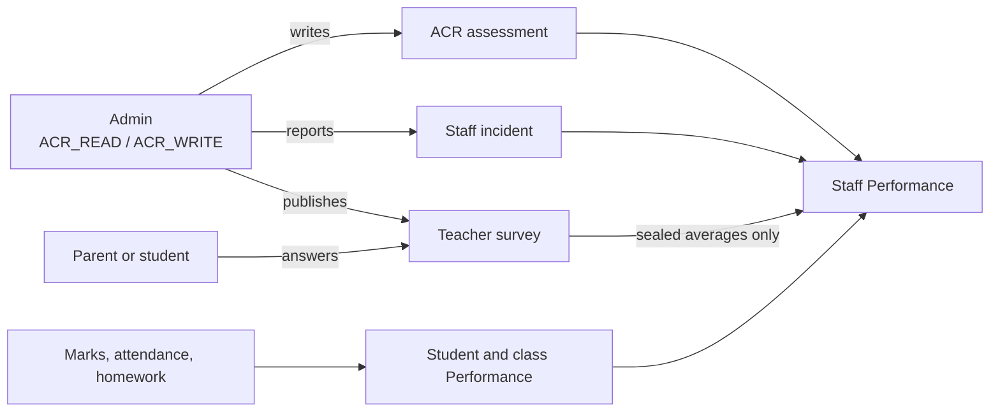
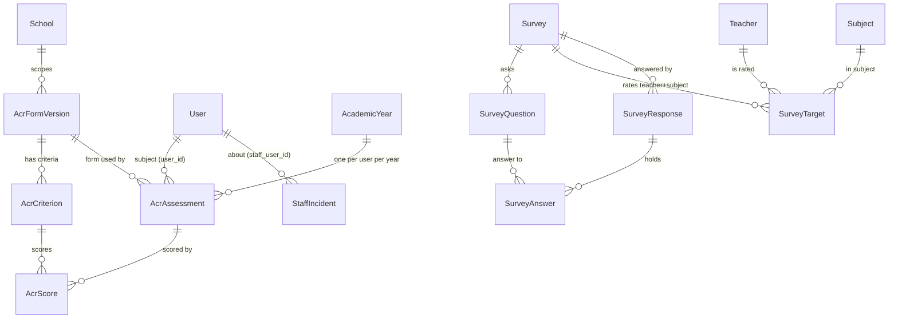
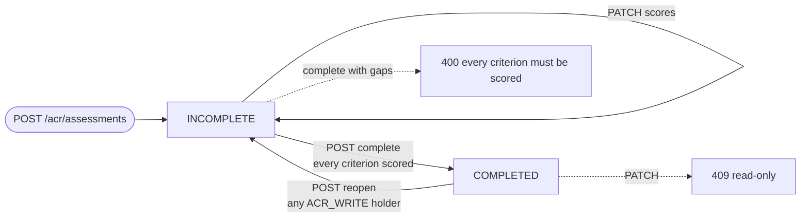
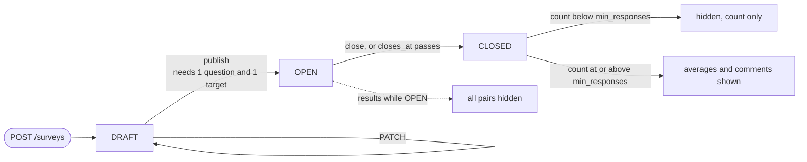
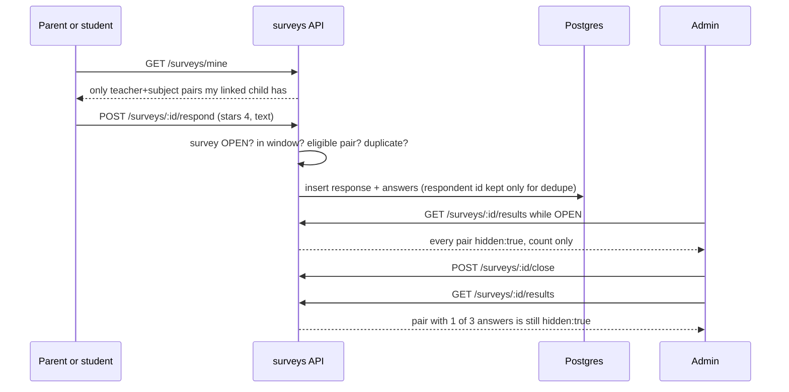

# Evaluations & performance

Epic 28.0. Answers three questions: how is a staff member doing this year
(**ACR**), how do parents and students rate a teacher (**surveys**), and what
do the numbers say about a student, a class or a teacher (**Performance**).
Plus one small ledger: **incidents** reported about a staff member.

> **The one rule behind all of it:** staff evaluation data is sensitive. The
> person being evaluated can never read it, and survey answers can never be
> traced back to the person who gave them.

## 1. The big picture



Code lives in four server modules and one set of screens:

| Part        | Server                            | Screen                                                                   |
| ----------- | --------------------------------- | ------------------------------------------------------------------------ |
| ACR         | `server/src/modules/acr/`         | `client-admin/src/routes/_staff/staff/$userId_.acr.$assessmentId.tsx`    |
| Incidents   | `server/src/modules/incidents/`   | Evaluations page, Incidents tab                                          |
| Surveys     | `server/src/modules/surveys/`     | Evaluations page, Surveys tab; `routes/portal/surveys.tsx` for guardians |
| Performance | `server/src/modules/performance/` | Performance tab on student, class and staff detail                       |

## 2. The 10 new tables

Created by one migration: `server/src/migrations/1790900000000-EvaluationsAndPerformance.ts`.
The same migration adds one column, `student_notes.rating` (1 to 5), which
feeds the student Performance "note rating". Status and type columns are
`varchar` plus a `CHECK`, not Postgres enums.



| Table               | What one row is                        | Key rules (from the migration)                                                                                      |
| ------------------- | -------------------------------------- | ------------------------------------------------------------------------------------------------------------------- |
| `acr_form_versions` | One saved version of the ACR form      | unique `(tenant_id, version)`                                                                                       |
| `acr_criteria`      | One scored line on a form version      | `block` is `BLOCK_2` or `BLOCK_3`                                                                                   |
| `acr_assessments`   | One staff member's ACR for one year    | unique `(tenant_id, user_id, academic_year_id)`; `status` `INCOMPLETE` or `COMPLETED`; `total` is a server-side sum |
| `acr_scores`        | One criterion's score in one ACR       | `score` in 1, 2, 3, 4; unique `(assessment_id, criterion_id)`                                                       |
| `staff_incidents`   | One reported incident                  | `type` BEHAVIOUR, ABSENCE, COMPLAINT, COMMENDATION, OTHER; `severity` LOW, MEDIUM, HIGH; no attachments (D15)       |
| `surveys`           | One survey                             | `status` DRAFT, OPEN, CLOSED; `respondent` STUDENTS, GUARDIANS, BOTH; `anonymous`; `min_responses`                  |
| `survey_questions`  | One question                           | `stars_enabled`                                                                                                     |
| `survey_targets`    | One teacher and subject being rated    | unique `(survey_id, teacher_id, subject_id)`                                                                        |
| `survey_responses`  | One person's answer set for one target | unique `(survey_id, respondent_user_id, teacher_id, subject_id)` so nobody answers twice                            |
| `survey_answers`    | One answer to one question             | `stars` 1 to 5 or null; `text` optional                                                                             |

Every table carries `tenant_id` like the rest of the model (see
[01-domain-model.md](01-domain-model.md)). Child rows use a composite
`(tenant_id, id)` foreign key so a row can never point into another school.

## 3. ACR lifecycle

ACR is the yearly staff assessment. Scores are 4, 3, 2 or 1 (`VALID_SCORES` in
`acr-assessments.service.ts`). Criteria are **copy-on-write**: every save of
the criteria list creates a new `acr_form_versions` row, and an ACR stays on
the version it started with.



Rules, all in `server/src/modules/acr/acr-assessments.service.ts`:

- `start` needs a saved criteria version, else 409. A second ACR for the same
  person and year is a 409.
- Only the **assessor** (`assessed_by`) can edit or complete. Anyone with
  `ACR_WRITE` can reopen.
- `total` is the sum of scores, computed on the server. The browser never sends it.
- Complete and reopen write an audit log row (never with the total in it). Saving criteria does too.

Example: scoring all 25 default criteria with 4 gives `total: 100`.

## 4. Survey lifecycle and the seal



Who can answer what, and what happens, when a guardian answers:



Concrete result, a pair below the minimum (3 is the lowest allowed):

```json
{ "teacherId": "…", "subjectId": "…", "count": 1, "hidden": true }
```

Same pair at 6 answers on a CLOSED survey with `min_responses` 5:

```json
{
  "teacherId": "…",
  "subjectId": "…",
  "count": 6,
  "hidden": false,
  "questions": [
    {
      "questionId": "…",
      "text": "Clear lessons?",
      "averageStars": 4.17,
      "comments": ["Explains well"]
    }
  ]
}
```

Seal rules, from `server/src/modules/surveys/survey-results.service.ts`:

1. Results are sealed until the survey is `CLOSED`. Peeking while open would
   let an admin guess who answered from each new response.
2. A pair needs at least `min_responses` answers (the API refuses a minimum below 3).
3. Each question needs at least `min_responses` **star** ratings to show an
   average. Text-only answers do not count toward that.
4. Comments are sorted by text, never by time, so order cannot reveal who wrote what.

### What "anonymous" means (D10)

**"Anonymous" only means hidden from management.** The database still keeps
`respondent_user_id` on each response, because it is how the system stops
someone answering twice. No results query selects it, and no timestamp is
returned. The screens say "hidden from management" and never say "untraceable".
When `anonymous` is false, the portal tells the guardian their name will be shown.

## 5. Privacy rules

| Rule                                                               | What the caller sees                                    | Where                                                              |
| ------------------------------------------------------------------ | ------------------------------------------------------- | ------------------------------------------------------------------ |
| The subject reads their own ACR, ACR list row, or incident         | **404**, same as "does not exist" (D2)                  | `acr-assessments.service.ts` `findVisible`; `incidents.service.ts` |
| The subject opens their own Performance                            | **404** before any other service runs                   | `staff-performance.service.ts`                                     |
| Respondent identity                                                | Never in any payload                                    | `survey-results.service.ts` selects no `respondent_user_id`        |
| Results while survey is OPEN, or below min N                       | `hidden: true` plus a count only                        | `survey-results.service.ts`                                        |
| A target teacher asks for their own survey's results               | **404** for the whole route                             | `survey-results.service.ts`                                        |
| Wrong role (for example a TEACHER on `GET /performance/staff/:id`) | **401**, not 403                                        | `RolesGuard` in `auth/guards/context.guard.ts`                     |
| Staff Performance survey figure                                    | Sealed average only (`averageStars: null` while sealed) | `SurveyResultsService.teacherAverage`                              |
| Guardian answering a pair they have no child for                   | 403 "not eligible"                                      | `survey-respond.service.ts`                                        |
| Answering twice for one teacher and subject                        | 409                                                     | unique index `UQ_survey_responses_once`                            |

A real check: `e2e/journeys/acr.spec.ts` creates a second admin, makes an ACR
about them, then logs in as that admin and expects 404 on both
`/acr/assessments/:id` and `/acr/staff/:userId`.

## 6. Permissions

| Permission                      | Who has it today          | Gates                                                                                                                                                                                           |
| ------------------------------- | ------------------------- | ----------------------------------------------------------------------------------------------------------------------------------------------------------------------------------------------- |
| `ACR_READ`                      | ADMIN only                | every GET on `/acr/*`, `/incidents`, `GET /surveys`, `GET /surveys/:id`, `GET /performance/staff/:id`; the `/staff/evaluations` routes; the ACR, Incidents and Performance tabs on staff detail |
| `ACR_WRITE`                     | ADMIN only                | start/edit/complete/reopen an ACR, save criteria, report an incident, create/edit/publish/close a survey                                                                                        |
| `MARK_VIEW`                     | ADMIN, EXECUTIVE, TEACHER | student and class Performance (`GET /performance/students/:id`, `/classes/:id`), and their tabs                                                                                                 |
| (role only) `PARENT`, `STUDENT` | portal users              | `GET /surveys/mine`, `POST /surveys/:id/respond`                                                                                                                                                |

Source: `shared/src/enums/permissions.ts` (`ACR_READ`, `ACR_WRITE`, "ADMIN only
(D6, D8)"). The controllers also list `@Roles(UserRole.ADMIN)`, which mirrors
those permissions; `server/src/permission-matrix.e2e-spec.ts` checks the mirror
holds. **ADMIN only until Epic 24.0 (#786)** adds finer roles. Until then a
TEACHER sees student Performance but nothing about staff.

## 7. Incidents

One row per report: `type`, `severity`, `occurred_on`, free text `body`, and
who reported it. After a report is saved, `incident-notify.listener.ts` pushes
a fixed string ("New incident report") to every `ACR_WRITE` holder except the
reporter and the subject. SMS goes out only when the school turned on
`settings.evaluations.incidentSmsEnabled` and has an SMS provider. Default: off.

## 8. Performance

Read-only roll-ups. Nothing is stored; every call computes from marks,
attendance, homework, ACR, incidents and sealed survey data.

Example `GET /performance/staff/:userId?academicYearId=<id>` (shape from
`server/src/modules/performance/dto/performance.dto.ts`):

```json
{
  "userId": "…",
  "acr": [{ "academicYearId": "…", "status": "COMPLETED", "total": 82 }],
  "survey": { "averageStars": null, "surveyCount": 0 },
  "incidentCount": 2,
  "classes": [
    {
      "sectionId": "…",
      "passRate": 91.5,
      "averageMarks": 68.2,
      "attendancePercent": 94,
      "homework": { "totalAssignments": 12, "completed": 9 },
      "exams": []
    }
  ]
}
```

`survey.averageStars: null` means "sealed or not enough answers", never zero.

The staff tab cards use `client-admin/src/routes/_staff/staff/-detail/performance-tab.tsx`.
Shared building blocks live in `ui/src/components/performance/`
(`SummaryCard`, `BarWidget`, `SwipeRow`; bars are CSS only, D24). On a phone the
bar widgets swipe sideways; on desktop they sit in a grid.

## 9. Screens and palette

New nav tree entries (see [15-ux-principles.md](15-ux-principles.md) §3.1):

```text
People
  Staff
    Staff detail tabs: … ACR · Incidents · Performance   (ACR_READ)
  Evaluations  → /staff/evaluations   tabs: ACR · Surveys · Incidents   (ACR_READ)
    Survey detail → /staff/evaluations/surveys/:surveyId (results)
  Students › Student detail › Performance tab            (MARK_VIEW)
  Classes › Class detail › Performance tab               (MARK_VIEW)
Portal
  Surveys → /portal/surveys  (plus a "surveys waiting" card on the portal home)
```

Palette actions (`client-admin/src/action-registry.ts`). Each one only
navigates and sets a one-shot flag; the page opens the dialog and clears the flag.

| Action                                     | Needs       | Navigates to                          |
| ------------------------------------------ | ----------- | ------------------------------------- |
| Start ACR (`acr.start`)                    | `ACR_WRITE` | `/staff/evaluations?startAcr=1`       |
| Report an incident (`incidents.report`)    | `ACR_WRITE` | `/staff/evaluations?reportIncident=1` |
| Publish teacher survey (`surveys.publish`) | `ACR_WRITE` | `/staff/evaluations?publishSurvey=1`  |
| Open performance (`performance.open`)      | `MARK_VIEW` | `/students?openPerformance=1`         |

TanStack Router parses `?startAcr=1` as the number `1`, so the page schema accepts
`z.union([z.string(), z.number()])` (`evaluations.tsx`).

## 10. Known limits

- **No per-version criteria endpoint.** `GET /acr/criteria` returns only the
  latest version. An ACR scored on an older version cannot fetch that
  version's criteria list.
- **Palette actions cannot prefill staff.** A palette action only navigates
  with a flag, so "Start ACR" still asks you to pick the person.
- **Survey results are sealed until CLOSED.** Even the admin who published it
  sees nothing while it is OPEN, by design.
- **401, not 403.** A wrong role gets 401 from `RolesGuard`. Clients should
  treat both as "not allowed" and not retry.
- **Performance averages are unweighted.** The staff tab averages each class's
  pass rate, marks and attendance with equal weight, so a class of 5 counts as
  much as a class of 50.
- **Homework is all-time.** The homework figure ignores the selected year or
  term, and the UI says so.
- **Student Performance needs a current-year enrollment.** The API answers
  404 "no enrollment in this academic year". The student tab shows the same
  "Not enough data yet" empty state as the staff tab. Real errors (500, network)
  still show the error with a Retry button.
- **Wave 6 is blocked** on #786 (finer roles, Epic 24.0) and #812 (print
  module, Epic 32.0).

## 11. Tests that prove it

| What                                        | File                                                    |
| ------------------------------------------- | ------------------------------------------------------- |
| ACR keyboard-only flow                      | `e2e/keyboard/acr-form.spec.ts`                         |
| Subject gets 404                            | `e2e/journeys/acr.spec.ts`                              |
| Survey: publish, answer, sealed             | `e2e/journeys/survey.spec.ts`                           |
| Survey keyboard, palette                    | `e2e/keyboard/survey-publish.spec.ts`                   |
| Performance tabs on a phone, teacher denied | `e2e/journeys/performance-tabs.spec.ts`                 |
| Seal and respond rules                      | `server/src/modules/surveys/survey-respond.e2e-spec.ts` |
