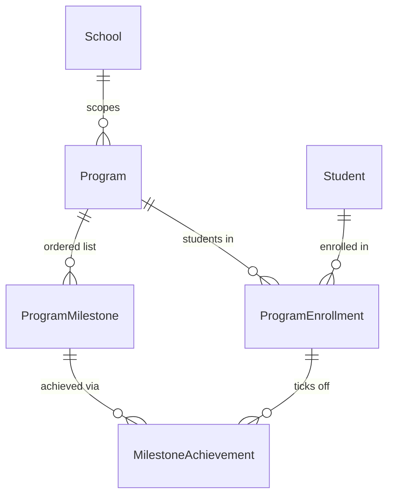
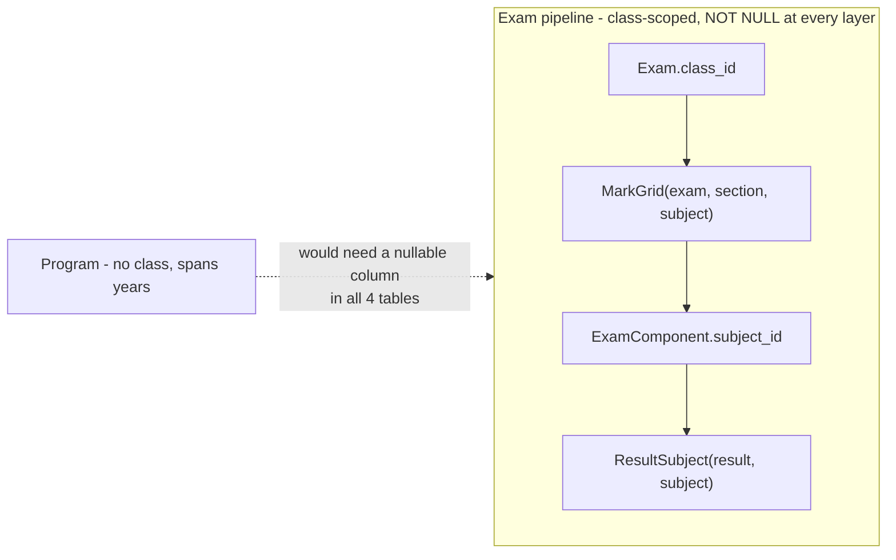
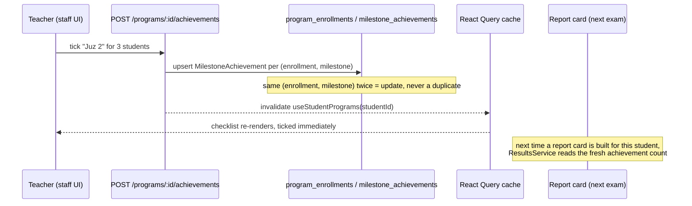

# Programs & Milestones

A **Program** is a track a student follows _beside_ their class — hifz
(Qur'an memorisation), a vocational trade, a school-run coaching batch, a
club. It has an ordered list of **Milestones**. A student enrols, and staff
tick off milestones as the student reaches them. Families see the progress
in the parent/student portal, and a program can optionally add a line to
the report card.

This is Epic 34.0 (D1–D27, issue #814). It is **not** how coaching centres
should relabel Class/Section — that's a tenant label override (Epic 35.0,
P11 in [15-ux-principles.md](15-ux-principles.md)). Programs are for tracks
that don't fit the class/section box at all.

## 1. Entities



| Table                    | What it is                                                                                                                                                                            |
| ------------------------ | ------------------------------------------------------------------------------------------------------------------------------------------------------------------------------------- |
| `programs`               | A tenant-wide track. No `academic_year_id` — hifz spans years (D2). `show_on_report_card` opts it into the report card (D22).                                                         |
| `program_milestones`     | An ordered step within a program, e.g. "Juz 1" for hifz. Deleting one cascades its achievements (D23).                                                                                |
| `program_enrollments`    | A student's enrolment in a program — separate from their class `Enrollment`. `status` is `ACTIVE` / `COMPLETED` / `WITHDRAWN`. At most one `ACTIVE` row per (program, student) (D19). |
| `milestone_achievements` | One row per (enrollment, milestone) that's been ticked — `achieved_on`, and optional `score`/`grade`/`remark` (D21, no `GradingScale` link).                                          |

Example: "Hifz" has 30 milestones ("Juz 1" .. "Juz 30"). Fatima enrols on
2026-01-10. Her teacher ticks "Juz 1" and "Juz 2" over the term — that's two
`MilestoneAchievement` rows against her one `ProgramEnrollment`. Her progress
is `2 / 30`, computed by counting rows, not stored anywhere (D26 — no
`ProgressService`).

## 2. Why not the exam pipeline (D1)

The obvious question: hifz progress looks like an exam. Why not reuse
`Exam` / `MarkGrid` / `Result`?



A program has no class and no subject. Bolting it onto the exam pipeline
means adding a nullable column to four tables that are `NOT NULL` today, and
the report card has no slot for anything but subjects. So D1 keeps them
fully separate: a `MilestoneAchievement` carries its own optional
score/grade, and the report card gets a dedicated Programs block (below)
instead of joining through `Result`.

## 3. Teacher ticks a milestone



`POST /programs/:id/achievements` bulk-records **one milestone** across up
to 500 enrolments in one call (`RecordAchievementsDto`) — the same endpoint
whether a teacher ticks one student from the checklist or an admin bulk-marks
a whole cohort. Recording the same (enrollment, milestone) pair twice
**updates** the row (upsert) — there is never a duplicate achievement.

## 4. Who bills for a program (D17)

A program itself stores no fee amount — it reuses the existing fee
machinery via `RecurringScheduleAudience.program_id` (recurring bills) and
the same targeting for one-off generation. The audience resolver
(`server/src/modules/fees/program-audience.ts`) is one shared SQL fragment
used by both:

```ts
// applyProgramAudience(qb, programId, tenantId) — qb aliases Student as 's'
qb.innerJoin(
  'program_enrollments',
  'pe',
  'pe.student_id = s.id AND pe.program_id = :programId AND pe.tenant_id = :peTenantId AND pe.status = :peStatus',
  { programId, peTenantId: tenantId, peStatus: 'ACTIVE' },
);
```

A student is billed only when they have an **ACTIVE program enrolment**
_and_ an ACTIVE class enrolment in the schedule's academic year — a
withdrawal stops the next generated bill, but bills already generated are
untouched.

## 5. The report card line (D22)

`Program.show_on_report_card` (default `false`) is per-program, not global.
When true, `ResultsService.getStudentResultCard` adds one `ReportCardProgramRow`
per qualifying enrolment — a program counts if the enrolment is still
`ACTIVE`, or was `COMPLETED` with `ended_on` inside the exam's academic year
(so a student who finished hifz mid-year still sees it on that year's card):

```json
{
  "program_name": "Hifz",
  "achieved_count": 2,
  "milestone_total": 30,
  "latest": {
    "milestone_name": "Juz 2",
    "achieved_on": "2026-03-14",
    "score": null,
    "grade": null
  }
}
```

The same `ReportCardData.programs[]` array feeds both the printable report
card and the portal — one shape, D1's "no coupling into the exam tables"
still holds because this is read-only aggregation, not a new join into
`Result`.

## 6. Where it lives on screen

| Screen                                             | Who                         | Route                               |
| -------------------------------------------------- | --------------------------- | ----------------------------------- |
| Programs list + detail (Milestones, Students tabs) | Admin / Executive / Teacher | `/programs`, `/programs/$programId` |
| Student detail — Programs tab                      | Same, per student           | `/students/$studentId?tab=programs` |
| Portal — Programs                                  | Parent / Student            | `/portal/programs`                  |

Access is permission-only (D4): `PROGRAM_READ` (everyone including
STUDENT/PARENT, D24), `PROGRAM_MANAGE` (create/edit/enrol/archive),
`PROGRAM_RECORD` (tick milestones) — TEACHER gets READ + RECORD,
ADMIN/EXECUTIVE get all three. There is no separate "which teacher can
record for which program" table (D4) — add one if a school asks.

## 7. Deliberately not built (D26, out of scope)

- **Program exams through the 19.0 pipeline** — D1, see §2 above.
- **Analytics / completion-rate reports** — needs a term of real data first;
  lands as a Reports-hub link (P5) later.
- **Guardian SMS on achievement** — the portal already shows it; a
  notification trigger is a clone of the existing result-SMS trigger when a
  tenant asks for it.
- **Excel bulk enrol** — the Enrol dialog's class/section filter covers the
  common case; a real bulk-import trigger is a 500+ student program.
- **A students × milestones click-to-tick grid** — the per-row checklist
  (D8) is what shipped; the grid is a later wave if a hifz tenant with 30+
  milestones asks.
- **A `Program.kind` enum** — D6, nothing branches on kind today.
- **Program-teacher assignment** — D4.

See issue #814 for the full decision log (D1–D27).
