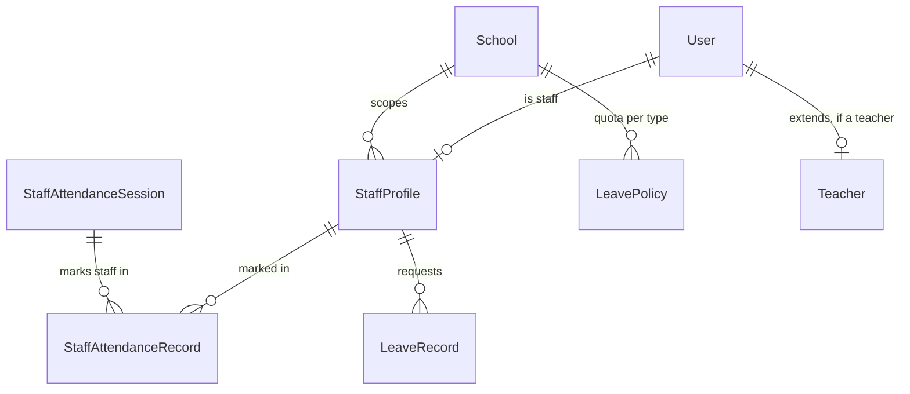

# Staff attendance & leave

Epic 36.0. Answers two questions: was this staff member at school today, and
how many days of each leave type do they have left this year.

This is a **separate model** from student attendance
([11-attendance.md](11-attendance.md)) — no shared tables, no shared code. A
staff member has no section, so there is no register-per-class; instead
there is one register **per day, per tenant**, with one mark per staff
member.

## 1. Entities



- **`StaffProfile`** (`server/src/modules/staff-profiles/entities/staff-profile.entity.ts`)
  — every ADMIN/ACCOUNTANT/TEACHER/EXECUTIVE `User` gets exactly one,
  holding `employee_id` and `joining_date`. This is the generic layer
  attendance and leave both key off — `Teacher` keeps its own
  (globally-unique) `employee_id` too and points at its `StaffProfile` via
  `staff_profile_id`, but a non-teacher staff member (an ADMIN, say) has no
  `Teacher` row at all, so attendance/leave cannot key off `Teacher`.
- **`StaffAttendanceSession`** — one tenant's attendance day. Unique on
  `(tenant_id, date)`.
- **`StaffAttendanceRecord`** — one staff member's mark within one session:
  `PRESENT` / `ABSENT` / `LATE` / `LEAVE` (same enum values as student
  attendance, reused, not shared rows).
- **`LeavePolicy`** — a tenant's annual quota (in days) for one `LeaveType`
  (`CASUAL` / `SICK` / `MATERNITY` / `PATERNITY` / `EARNED`). Seeded with
  D9 defaults for every tenant.
- **`LeaveRecord`** — one leave request: a date range, a status
  (`PENDING` / `APPROVED` / `REJECTED`), and who decided it.

## 2. The balance formula (D12)

**Balance is never stored.** `GET /leave/balance` computes it live, every
call:

```
balance = policy.annual_quota_days − sum(days of every APPROVED
          LeaveRecord for this staff member, this leave type, this
          calendar year)
```

Concrete example: the CASUAL policy default is 10 days/year. A staff member
requests 2026-03-10 → 2026-03-11 (2 days) and it gets approved:

```json
// GET /leave/balance?staff_profile_id=<id>
[{ "leave_type": "CASUAL", "annual_quota_days": 10, "used_days": 2, "balance": 8 }]
```

A `PENDING` or `REJECTED` record contributes nothing — only `APPROVED` rows
count, which is why requesting leave never moves the balance by itself;
only the approval decision does.

## 3. Workbook (backup/restore)

All five tables round-trip through the backup workbook
([14-school-workbook.md](14-school-workbook.md)):

| Tab                         | Natural key                             | Depends on                                    |
| --------------------------- | --------------------------------------- | --------------------------------------------- |
| `staff_profiles`            | `employee_id` (unique per tenant)       | `users`                                       |
| `staff_attendance_sessions` | `date`                                  | —                                             |
| `staff_attendance_records`  | `(session, staff_profile)`              | `staff_attendance_sessions`, `staff_profiles` |
| `leave_policies`            | `leave_type`                            | —                                             |
| `leave_records`             | `(staff_profile, start_date, end_date)` | `staff_profiles`, `users`                     |

`staff_profiles` is registered immediately before `teachers` in
`EXPECTED_TABS` — `teachers.staff_profile_id` now FKs it, even though that
column itself is excluded from the `teachers` tab as system-derived.

## 4. What the client screens do

- **`/attendance/staff`** — one row per staff member, one
  `AttendanceStatusControl` per row, `PUT /staff-attendance/register`
  saves the whole day in one call. Reachable from the command palette
  ("Mark staff attendance").
- **`/attendance/staff/leave`** — "My leave": live balance table +
  a request dialog (`POST /leave/requests`). The approve/reject panel is a
  disclosed placeholder — there is no `GET /leave/requests` list endpoint
  yet, so it shows an honest "not available" message rather than fake data.
  Approving today is API-only: `POST /leave/requests/:id/decide`.
