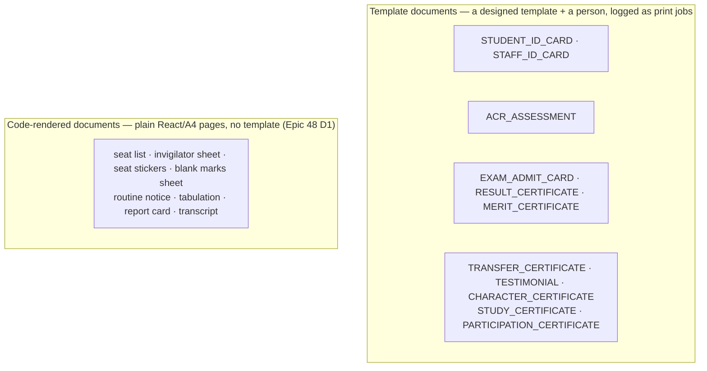
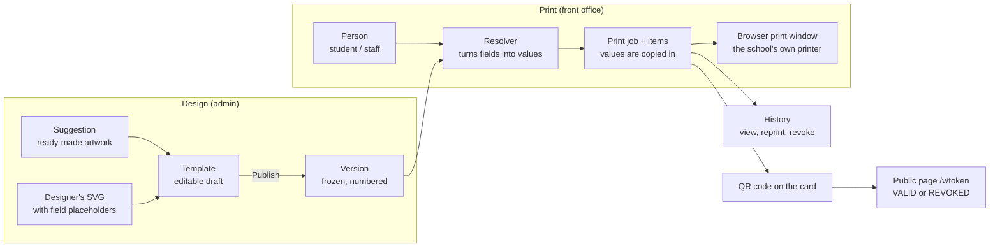
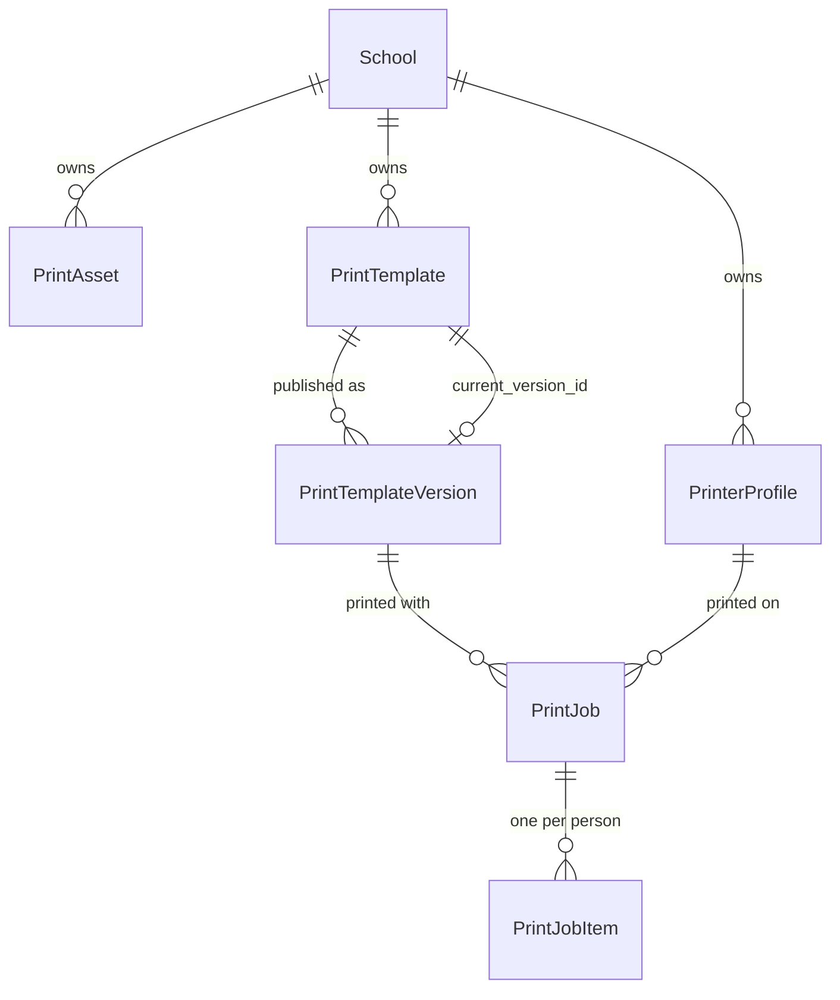
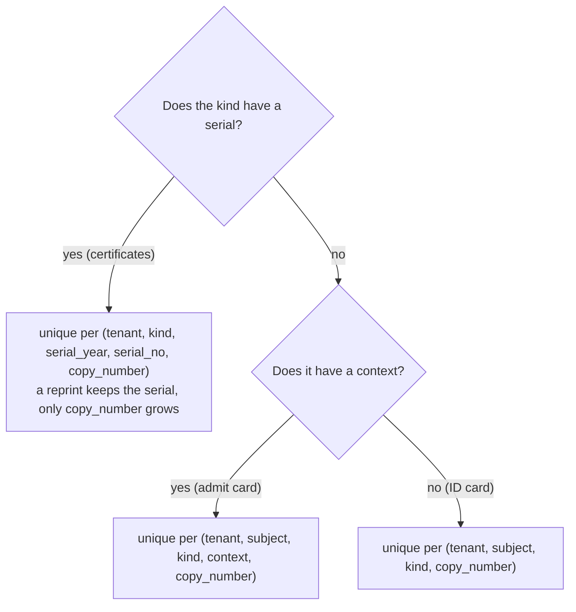
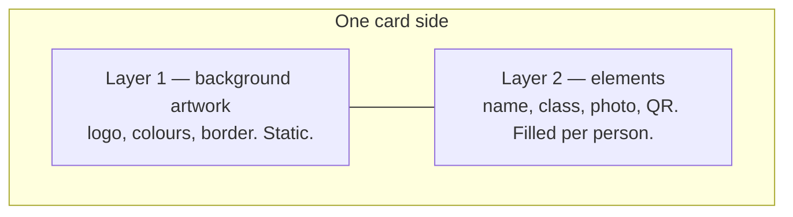
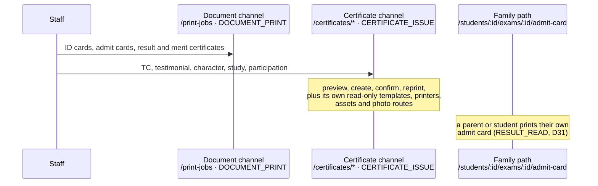
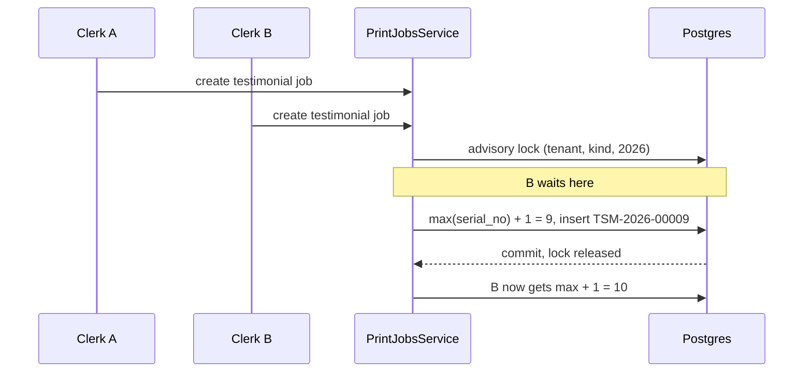
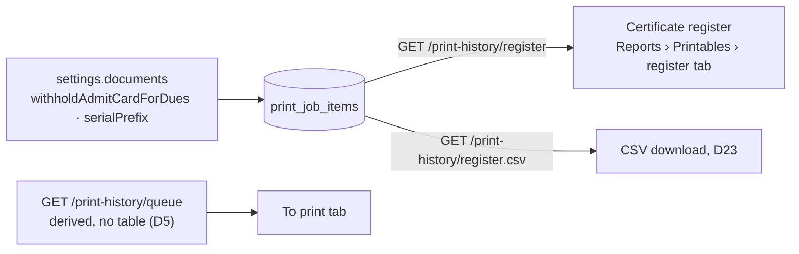

# Print module — templates, certificates, exam documents and print history

The print module turns a **template** plus a **person** (a student or a staff
member) into a printed **document**. Every template print is logged, so a
document can be reprinted, checked (by scanning its QR code) or cancelled later.

It was built in Epic 32.0 (D1–D60, issue #812) for ID cards. Epic 48.0 (issue
#1373) added exam documents and student certificates on the same foundation.

There are **11 document kinds**, in two families:



A **template document** is drawn from a published template. A **code-rendered
document** is built by a React component from live data; it has no template and
no print job. Report cards and transcripts only write one audit row per print
(`POST /students/:studentId/document-prints`, D17, D25, D26). They open at
`/print/document?doc=<name>` (for example
`/print/document?doc=seat-list&exam_id=…`).

## 1. The big picture



**Why the browser prints, not the server.** The server never makes a PDF
(D1, D2). Bangla text needs proper shaping (joined letters) and the browser
already does that correctly with the fonts we load. A server-side PDF would need
its own shaping engine, and would still not know which physical printer the
school picks. So the server stores data and the browser draws the page.

## 2. The six tables



| Table                     | What it is                                                                                                                                                                                                      |
| ------------------------- | --------------------------------------------------------------------------------------------------------------------------------------------------------------------------------------------------------------- |
| `print_assets`            | An uploaded file: card **ARTWORK** (SVG/PNG/JPG), an **IMAGE** (signature, seal) or a **FONT**. SVGs are cleaned on upload.                                                                                     |
| `printer_profiles`        | One physical printer's corrections: margins, X/Y offset, scale (0.9–1.1), duplex order, sheet gap. Type is `CARD` or `OFFICE` (A4).                                                                             |
| `print_templates`         | The editable **draft** (JSON), name, document kind, batch size, `is_default`, and `current_version_id`.                                                                                                         |
| `print_template_versions` | A published, numbered copy of the draft. **Immutable** — a database trigger refuses any update.                                                                                                                 |
| `print_jobs`              | One press of Print: who, which version, which printer, `OPEN` until the user confirms, then `CONFIRMED`.                                                                                                        |
| `print_job_items`         | One row per person in the job: a **snapshot** of the values printed, the copy number, the hashed verify token, outcome, revoked or not. Epic 48 added `serial_no`, `serial_year`, `context_type`, `context_id`. |

Epic 48 (migration 48.1.02) changed `print_job_items` in two ways:

- A certificate gets a **serial** (`serial_no` + `serial_year`), for example
  `TSM-2026-00009`.
- An exam document gets a **context** (`context_type = EXAM`, `context_id` = the
  exam), so the same student can have one admit card per exam.

Two partial unique indexes keep the copy numbers honest:



Every table carries `tenant_id`. Storage keys are tenant-prefixed
(`tenants/<schoolId>/…`), and a restore from another school's workbook rewrites
that prefix so a restored school never points at someone else's files.

## 3. The two-layer template

A template is **artwork** (a picture, drawn by a designer) plus **fields**
(text, photos and QR codes placed on top by the editor).



Layer 2 lives in the template's JSON. A real (trimmed) example:

```json
{
  "page": { "widthMm": 54, "heightMm": 85.6, "sides": ["front", "back"] },
  "front": {
    "background": { "assetId": "0b7c…", "print": true },
    "elements": [
      {
        "id": "front-1",
        "type": "TEXT",
        "x": 4,
        "y": 52,
        "w": 46,
        "h": 7,
        "field": "student.name",
        "fontFamily": "Biddaloy Sans",
        "sizePt": 11,
        "weight": 700,
        "color": "#111111",
        "align": "center",
        "overflow": "SHRINK"
      },
      {
        "id": "front-2",
        "type": "IMAGE",
        "x": 12,
        "y": 14,
        "w": 30,
        "h": 36,
        "field": "student.photo",
        "fit": "COVER",
        "alignY": "top"
      }
    ]
  },
  "copyLabel": { "text": "Copy {n}" }
}
```

- A TEXT element is either **literal text**, **one field**, or (Epic 48, D43) a
  **sentence with `{{field}}` placeholders** inside it. Example, a transfer
  certificate paragraph in Bangla:
  `এই মর্মে প্রত্যয়ন করা যাচ্ছে যে {{student.name_bn}}, পিতা {{student.father_name}},
{{student.class}} শ্রেণির ছাত্র/ছাত্রী ছিল।` Only text fields of that kind's
  catalog are allowed in a placeholder, and the server checks this when the
  template is saved (`validateTemplateDefinition`).
- The **copy label** (D44) is blank on copy 1. From copy 2 the template's
  `copyLabel` text prints; a certificate kind with a blank label still gets the
  default `প্রতিলিপি / DUPLICATE (copy {n})`, so DUPLICATE can never be hidden.
- Positions are in **millimetres**. The same JSON draws the editor canvas, the
  preview and the printed page, so what you see is what prints.
- `overflow` says what happens to a long name: `SHRINK` (smaller text),
  `WRAP`, `CLIP`, or `FLAG` (mark the card as "needs attention" in the preview).
- `background.print: false` keeps the artwork on screen but does not print it —
  for schools that print on pre-printed card stock.
- The schema is `shared/src/print/template-definition.ts`. The server validates
  every save with it; the editor's reducer refuses any change that would make
  the draft invalid.

### The field catalog

`shared/src/print/field-catalog.ts` lists, per document kind, every field a
template may use (`student.name`, `student.photo`, `school.logo`,
`print.verify_qr`, …) with a sample value and a "longest realistic value" (used
by the editor's **Longest values** switch to test overflow).

## 4. One print, step by step

```mermaid
sequenceDiagram
  participant U as Staff
  participant C as Browser (client-admin)
  participant S as Server
  participant W as Print window
  U->>C: Print ID cards
  C->>C: Open blank print tab (must happen inside the click)
  C->>S: POST /print-jobs (template, people, printer)
  S->>S: Resolve fields, copy values into job items,<br/>give each copy a number and a QR token
  S-->>C: job id + items (values, verify links)
  C->>W: Draw pages from the frozen version + values
  W-->>U: Browser print dialog → the school's printer
  U->>C: "Did all print?" — yes / these failed
  C->>S: PATCH /print-jobs/:id/confirm (failed items)
  S->>S: Job becomes CONFIRMED; next batch unlocks
```

### Two print channels

Certificates are more sensitive than ID cards, so they have their own channel
with their own permission (D6). The permission guard checks that the caller holds
**all** of a route's permissions, so one route cannot mean "either of two";
hence a second set of routes.



The certificate channel also serves the template, printer and asset reads it
needs (`/certificates/templates`, `/certificates/printers`, `/certificates/assets`,
`/certificates/photo`), so an office
clerk who cannot manage templates can still issue a certificate. The family
path creates the same kind of job, but only for the caller's own child.

Rules that keep this honest:

- **The job is created first (D9).** If the server says no (no permission, a
  bad template), nothing is drawn. A card is never printed without a log row.
- **Batches are locked in order (D10).** A big class is split into batches
  (the template's `batch_size`, at most 200). Batch 2 unlocks only after batch 1
  is confirmed, so a printer jam cannot silently lose 60 cards.
- **The browser cannot tell which printer was chosen** in its own dialog, so the
  staff member picks the printer profile themselves (D21). It supplies margins,
  offset and scale. The last choice is remembered per school in the browser.
- **A reprint is a new job** with `reprint_of_job_id` set and the next copy
  number. It reuses the stored snapshot, so it looks identical even if the
  student has since changed class. A reprinted certificate keeps its serial and
  prints the DUPLICATE label (D8).

### The serial lock

A serial is the next number in `(tenant, kind, year)`. Two clerks pressing Print
at the same moment must not get the same number, so the server takes a Postgres
advisory lock first, and the database unique index is the safety net.



The year is the **Dhaka calendar year** (D33). The text shown on paper is
`<PREFIX>-<CODE>-<YYYY>-<NNNNN>`: `DAHS-TC-2026-00007` with the school short
code, `TSM-2026-00009` without it (D24). Codes: `TC`, `TSM`, `CHR`, `STD`,
`PRT`, `RES`, `MRT`.

## 5. Invariants

| Rule                                                                                                 | Enforced by                                                                                                                                   |
| ---------------------------------------------------------------------------------------------------- | --------------------------------------------------------------------------------------------------------------------------------------------- |
| A published version never changes.                                                                   | `trg_print_template_versions_immutable` (blocks UPDATE).                                                                                      |
| A version number is never reused within a template (`1, 2, 3…`).                                     | `UNIQUE (template_id, version)`; publish runs in one transaction.                                                                             |
| A job item stores the values it printed. Editing a student later does not change history.            | `data_snapshot` copied at job creation.                                                                                                       |
| Copy numbers per person and document never repeat, even with two people printing at once.            | Advisory lock in `PrintJobsService.insertItem` + a partial unique index; for a kind with a context (admit card) the copy is per (…, context). |
| A certificate serial is unique per (tenant, kind, Dhaka year) and never reused (D7, D24, D33).       | Advisory lock while allocating + the serial partial unique index (section 2).                                                                 |
| A reprint keeps the serial and prints DUPLICATE (D8).                                                | Serial reprint path in `PrintJobsService`; copy label from copy 2 (D44).                                                                      |
| Revoking needs a written reason (D19).                                                               | `POST /print-history/items/:id/revoke` takes the reason; the register shows it.                                                               |
| The QR token is stored only as a hash.                                                               | `verify_token_hash`; the plain token exists only in the response.                                                                             |
| The public page shows **only** document type, holder name, school, issue date, copy, serial, status. | Allow-list in `PublicVerifyService`; never ids or photos (D22). The serial was added by Epic 48 D18.                                          |
| The public route is rate limited and needs no login or tenant header.                                | `PUBLIC_VERIFY_RATE_LIMIT` (30 per minute), `GET /public/verify/:token`.                                                                      |
| Uploaded SVGs cannot carry scripts or remote references.                                             | `svg-sanitize.ts` (allow-list of elements and attributes).                                                                                    |
| A staff card needs the HR permission too.                                                            | `STAFF_HR_READ` checked next to `DOCUMENT_PRINT` (D18).                                                                                       |
| At most one live default template per document kind.                                                 | Partial unique index `UQ_print_templates_default_per_kind`; `setDefault` swaps in one transaction.                                            |

### Who can do what

| Permission              | Admin | Accountant | Executive | Meaning                                              |
| ----------------------- | :---: | :--------: | :-------: | ---------------------------------------------------- |
| `PRINT_TEMPLATE_MANAGE` |   ✔   |            |           | Templates, files, printers                           |
| `DOCUMENT_PRINT`        |   ✔   |     ✔      |           | Print and reprint                                    |
| `PRINT_HISTORY_READ`    |   ✔   |            |     ✔     | See what was printed                                 |
| `DOCUMENT_REVOKE`       |   ✔   |            |           | Cancel a printed card                                |
| `CERTIFICATE_ISSUE`     |   ✔   |            |     ✔     | Issue and reprint student certificates (Epic 48, D6) |

After Epic 24 the roles are wider than these three columns: **Office staff** also
hold `DOCUMENT_PRINT`, `CERTIFICATE_ISSUE` and `PRINT_HISTORY_READ`, and the
**Exam controller** holds `DOCUMENT_PRINT` and `PRINT_HISTORY_READ`. The truth
is `ROLE_PERMISSIONS` in `shared/src/enums/permissions.ts`.

A role that is not allowed gets **403** `Requires permission(s): …` from
`PermissionsGuard`. No print route carries `@Roles` (Epic 24.0 retired them),
and `print.e2e-spec.ts` asserts 403 — for example an ACCOUNTANT on
`GET /print-history` (it lacks `PRINT_HISTORY_READ`).

## 6. Where the code lives

```text
shared/src/print/                 template schema, field catalog (used by server AND client)
server/src/modules/print/
  templates/   assets/   printers/   jobs/   verify/
  jobs/        print-jobs.controller.ts (DOCUMENT_PRINT), certificates.controller.ts (CERTIFICATE_ISSUE),
               print-history.controller.ts (history, register, register.csv, queue)
  exam-documents/  exam-documents.controller.ts (admit-cards, merit-candidates, tabulation),
                   family-admit-card.controller.ts (the parent/student path)
  catalog/     field resolvers: student-card, staff-card, admit-card, student-certificate,
               result-certificate, acr-assessment
  suggestions/ ready-made templates + SVG artwork
ui/src/hooks/print.ts             all API hooks (ui/src/hooks/exam-documents.ts for exam documents)
ui/src/components/…               buildPrintDocument, openPrintWindow (the print page)
ui/src/components/print/exam-documents/   seat list, result and exam sheets (code-rendered)
client-admin/src/components/print/
  library/  editor/  preview/  history/  certificates/  admit-card-picker.tsx
  student-photo-card.tsx  desktop-only-gate.tsx
client-admin/src/routes/_staff/
  print-templates/  print/preview.tsx  print/document.tsx  reports/printables.tsx
client-admin/src/routes/v/$token.tsx   the public verify page
```

The editor and the preview are **chromeless** routes (no sidebar or header): a
route sets `staticData: { chromeless: true }` and `_staff.tsx` skips `AppShell`.
Both need a wide screen; under 768 px `DesktopOnlyGate` shows "open this on a
computer".

## 7. Adding a new document kind (checklist for the next epics)

Example: "Study certificate" (a real kind added in Epic 48).

1. **Enum** — add `STUDY_CERTIFICATE` to `DocumentKind` in
   `shared/src/enums/print.ts`.
2. **Fields** — add its entry to `FIELD_CATALOG` in
   `shared/src/print/field-catalog.ts`: key, type (`text`/`image`/`qr`), sample,
   and a longest sample for text.
3. **Resolver** — write `server/src/modules/print/catalog/<kind>.resolver.ts`
   returning the values for a list of subject ids, and register it in
   `RESOLVERS` (`field-resolver.ts`). Decide the extra permission it needs (like
   `STAFF_HR_READ` for staff cards).
4. **Suggestions** — add ready-made artwork and layout to
   `server/src/modules/print/suggestions/`.
5. **Labels** — `print.field.<key>` and the kind name in `printTemplates.json`,
   `printEditor.json`, `verify.json` (en **and** bn).
6. **Entry points** — a Documents tab or list action that opens
   `/print/preview?kind=…&subject_type=…&ids=…`, and a palette action in
   `action-registry.ts`.
7. **Serial code** — if the document is numbered, add its short code (like `STD`)
   to `CERTIFICATE_SERIAL_CODE` in `shared/src/enums/print.ts`. A kind in that
   map gets a serial; a kind outside it does not.
8. **Issue-time fields** — if the person at the counter must supply details that
   are not on the student profile (conduct, reason for leaving), declare them as
   issue-time fields (D3) so the modal shows them and the job stores them in the
   snapshot.

If a step is skipped, a test fails: the field-catalog spec, the
resolver-registry test and the `en`/`bn` key parity check each guard one step.

## 8. Known limits (honest list)

- Very large selections travel in the URL as comma-joined ids.
- `SHRINK` text is fitted in the editor/preview canvas; the static print output
  uses the same font size, so `FLAG` (or Longest values in the editor) is the
  safe way to catch long names.
- Text/DPI checks are hints; there is no server-side render to verify.
- The register downloads as **CSV only**; there is no Excel export (D23).
- Room and seat are not on the to-print list or the portal admit-card header:
  seats differ per sitting (D35, D45).
- The portal shows the "withheld for dues" state only after the parent taps Print.
- Bulk report-card logging is one request per student.
- **Reset leaves preset templates.** Applying a curriculum preset creates the
  certificate templates; resetting the preset does not remove them (48.4.01).

## 9. Register, to-print queue and settings (Epic 48)



- **Register (D32).** Every issued certificate with serial, kind, holder, date and
  status; filter by kind and year. Example:
  `GET /api/v1/print-history/register?document_kind=TESTIMONIAL&year=2026`.
  The download is **CSV** (D23); revoked rows carry their reason.
- **To-print queue (D5).** "Who is still waiting for a card or document" is
  _computed_ when asked, from students, enrolments and job items. There is no
  queue table to get out of date.
- **Report card and transcript prints** write an audit-log row only (D17, D25,
  D26), not a print job.
- **Settings (D9, D24).** `settings.documents.withholdAdmitCardForDues` (default
  off) marks students with dues on the admit-card list and blocks the family
  path. `settings.documents.serialPrefix` is the school short code, 2 to 8
  capital letters or digits.

### Where the code differs from the plan

- Tabulation needed its own endpoint (`GET /exams/:examId/documents/tabulation`,
  48.3.01); the marks data was too scattered to assemble in the browser.
- The `EXECUTIVE` role needed read access on the certificate channel (48.3.02)
  so it can open the register. It also holds `CERTIFICATE_ISSUE`, but not
  `DOCUMENT_PRINT`, so it does not see the To print tab.
