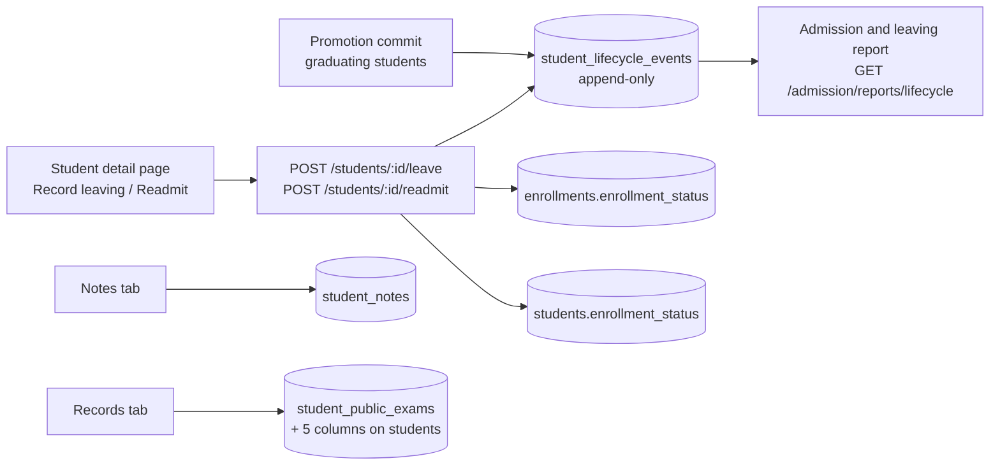
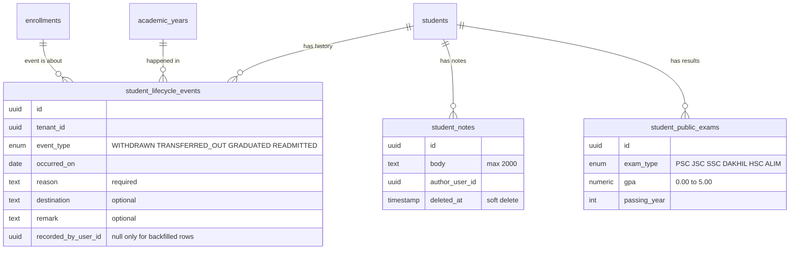
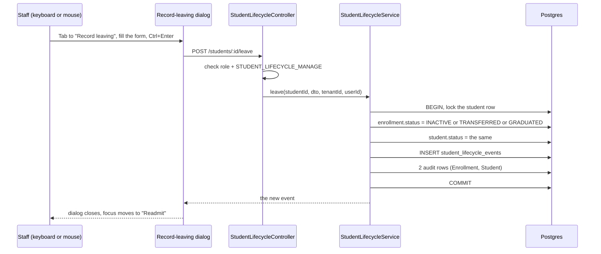
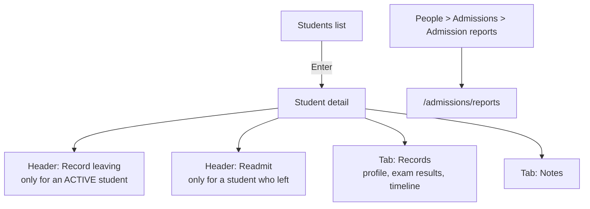

# Student records & lifecycle

Epic 39.0. Answers three questions the old "status dropdown" could not:
**when** did a student leave, graduate or come back, **why**, and **who recorded it**.
It also holds the deeper profile a school needs (religion, birth registration no., health
notes, parents' names), public-exam results, and dated staff notes.

It prints nothing. Epic 43.0 (#1129) prints transfer certificates and testimonials _from_ this
data.

## 1. The big picture



**The one rule that matters:** a student's status changes **only** by recording an event. The
status and the event are written in **one database transaction**, so you can never have one
without the other.

## 2. The data



`students` also gained five nullable columns: `religion`, `birth_reg_no`, `health_notes`,
`father_name`, `mother_name`. `birth_reg_no` is unique per school (a partial unique index).

- Every table has `tenant_id`, and every query filters on it.
- **Events are append-only.** No edit, no delete. A mistaken leave is undone by a `READMITTED`
  event, not by removing the row. (The database does not enforce this; the code just never
  offers an edit. See section 9.)
- The migration is `server/src/migrations/1790800000000-StudentLifecycle.ts`. It also
  **backfills** one event per existing non-ACTIVE enrollment, with `reason` and `remark` both set
  to `backfilled` and no recorder.

## 3. Recording a leaving



The real request and response:

```http
POST /api/v1/students/7c1f.../leave
X-Tenant-ID: <school>

{ "type": "WITHDRAWN", "occurred_on": "2026-09-30", "reason": "Family moved abroad" }
```

```json
{
  "id": "e0a9...",
  "student_id": "7c1f...",
  "enrollment_id": "3b52...",
  "academic_year_id": "9d10...",
  "event_type": "WITHDRAWN",
  "occurred_on": "2026-09-30",
  "reason": "Family moved abroad",
  "destination": null,
  "remark": null,
  "recorded_by_user_id": "a1b2...",
  "created_at": "2026-09-30T10:12:44.000Z"
}
```

What each event does to the status:

| Event             | Student and enrollment become              | Sent as                                               |
| ----------------- | ------------------------------------------ | ----------------------------------------------------- |
| `WITHDRAWN`       | `INACTIVE`                                 | `POST .../leave` with `type`                          |
| `TRANSFERRED_OUT` | `TRANSFERRED` (`destination` is free text) | `POST .../leave` with `type`                          |
| `GRADUATED`       | `GRADUATED`                                | `POST .../leave` with `type`, or the promotion commit |
| `READMITTED`      | `ACTIVE`                                   | `POST .../readmit`                                    |

Rules the server enforces (all covered by tests):

- **`occurred_on` is required** in both `leave` and `readmit` (`YYYY-MM-DD`). The API does **not**
  default it; only the two dialogs pre-fill today's date. Past dates are allowed, **future dates
  are rejected** (there is no scheduler to apply them later).
- **`reason` is required for a leave** (free text, not an enum) but **optional for a readmit**
  (stored as an empty string when omitted).
- Leave closes the student's **latest-year** ACTIVE enrollment. Fee generation only looks at
  ACTIVE students, so a student who has left stops being billed. The leave dialog _warns_ about
  unpaid dues but never blocks.
- **Readmit** reuses the same `students` row and the same registration number. In the **same**
  academic year it reactivates that year's enrollment row. For **another** year it creates a new
  enrollment (`EnrollmentsService.createInTransaction`). The caller picks the class section.
  Readmitting a student who is already ACTIVE is a 409 ("Student is already active"), and so is
  leaving a student who has no ACTIVE enrollment.
- The promotion commit writes a `GRADUATED` event for each graduating student, in the same
  transaction as the status change (`promotions.service.ts`).
- Why not call `EnrollmentsService.update`? It opens its own transaction and cannot join the
  caller's, which would break "status and event commit together". The service writes the
  enrollment and student rows itself through the transaction manager.

## 4. Status can change no other way

Before this epic, `PATCH /students/:id` and `PATCH /enrollments/:id` accepted
`enrollment_status`, so an ACCOUNTANT (who can update students but has no lifecycle permission)
could write `GRADUATED` directly: no reason, no date, no event. Reviews found **four** routes
that could do this or quietly reactivate a student. All are closed:

| Attempt                                                                  | Result now                                                                               |
| ------------------------------------------------------------------------ | ---------------------------------------------------------------------------------------- |
| `PATCH /students/:id` with `enrollment_status`                           | **400** (the field is not in the DTO; the strict validation pipe rejects unknown fields) |
| `PATCH /enrollments/:id` with `enrollment_status`                        | **400**, same reason                                                                     |
| `PATCH /students/:id` with `class_section_id` for a student who has left | **409**: _use "Readmit"_                                                                 |
| `POST /enrollments` for a student who has left                           | **409**: _use "Readmit"_                                                                 |

The only remaining writers of a status are the lifecycle service, the promotion commit, and a
**workbook restore** (an admin-only backup path that loads rows and never replays side effects).
`server/src/modules/students/student-records-access.e2e-spec.ts` proves each row above over HTTP
with real roles.

## 5. Who can do what

| Permission                      | Roles                     | Gates                                                                                                            |
| ------------------------------- | ------------------------- | ---------------------------------------------------------------------------------------------------------------- |
| `STUDENT_LIFECYCLE_MANAGE`      | ADMIN, EXECUTIVE          | leave, readmit, the report                                                                                       |
| `STUDENT_NOTES_READ` / `_WRITE` | ADMIN, EXECUTIVE, TEACHER | the Notes tab (a TEACHER also needs to teach the student's section)                                              |
| `STUDENT_RECORDS_READ`          | ADMIN, EXECUTIVE, TEACHER | seeing `health_notes` and the lifecycle history (`GET /students/:id/lifecycle-events`, the Records tab timeline) |
| `STUDENT_RECORDS_WRITE`         | ADMIN, EXECUTIVE          | `PATCH /students/:id/records`                                                                                    |

ACCOUNTANT has none of these. A role that is not in a route's role list is refused with **401**
(for example an ACCOUNTANT or TEACHER calling `POST .../leave`).

**Notes never reach a guardian or student.** `health_notes` is stripped from every response
unless the caller has `STUDENT_RECORDS_READ`, including the student routes _and_ the guardian
routes that embed a student (`redactHealthNotes` in `students.service.ts` recurses into
`students`). `guardians.e2e-spec.ts` proves an ACCOUNTANT never sees it.

**Profile edits have their own route.** The Records tab saves through
`PATCH /students/:id/records`, which accepts only the five profile fields. That lets an
EXECUTIVE edit records without being given general student updates.

Every student edit writes an audit row with the changed fields only. `health_notes` is recorded
as _changed_ but its content is never copied into the log.

## 6. The screens



- **Tabs are query state, not routes** (`?tab=records`, via `useDetailShellTab`). So the only
  route this epic added is `/admissions/reports`. The plan first said tabs would be routes; the
  detail page already used `?tab=` for every tab (decision D28).
- **The keyboard path:** Students, `Enter`, detail, `Tab` to "Record leaving", form,
  `Ctrl+Enter`. After the dialog closes, focus moves to the new action ("Readmit"), never to
  `<body>`. The report is reached by `Tab` to its sidebar link.
- **Report:** `GET /admission/reports/lifecycle?academic_year_id=...&class_id=...` returns
  `counts` (`admitted`, `withdrawn`, `transferred_out`, `graduated`, `readmitted`), up to 500
  `rows`, and `truncated`. No export (Epic 8.15 owns exports). Two honest limits: an _admitted_
  row has no registration number (applicants are not linked to a student), and an applicant's
  year comes from intake, class, academic year, not from the admit date.
- **Palette actions are deferred.** The plan wanted "Add note", "Record leaving" and "Readmit"
  in the `Ctrl+K` palette. The palette can only _navigate_ and cannot carry a student id, so
  they are listed in `client-admin/src/unregistered-actions.ts` with `owningEpic: '31.0'`
  (decision D26; same precedent as `fines.log`).

## 7. Backup and restore

The workbook has three new tabs (`student_lifecycle_events`, `student_notes`,
`student_public_exams`) and the five new `students` columns.

- Restore **loads rows; it never replays the lifecycle service**, so it cannot fire events or
  status changes a second time.
- The events tab sets `allowDuplicateKeys`: two same-type events on one day are legitimate data
  (leave, readmit, leave, readmit in one day) and the export must restore.
- A `gpa` outside 0.00 to 5.00 becomes a per-row error, not a failure halfway through a restore.
- Open question: restore removes events that are absent from the workbook.

## 8. Where the code lives

| What                     | Where                                                                                                                                                     |
| ------------------------ | --------------------------------------------------------------------------------------------------------------------------------------------------------- |
| Leave / readmit / events | `server/src/modules/students/student-lifecycle.{service,controller}.ts`                                                                                   |
| Notes, public exams      | `server/src/modules/students/student-notes.*`, `student-public-exams.*`                                                                                   |
| Records route            | `students.controller.ts` (`PATCH students/:id/records`)                                                                                                   |
| Report                   | `server/src/modules/admission/admission-reports.*`                                                                                                        |
| Promotion hook           | `server/src/modules/promotions/promotions.service.ts`                                                                                                     |
| Workbook tabs            | `server/src/modules/workbook/tabs/people/student-*.tab.ts`                                                                                                |
| Student detail UI        | `client-admin/src/routes/_staff/students/-detail/` (`leave-dialog`, `readmit-dialog`, `records-tab`, `notes-tab`)                                         |
| Report UI                | `client-admin/src/features/admission/AdmissionReports.tsx`, route `routes/_staff/admissions/reports/index.tsx`                                            |
| Hooks                    | `ui/src/hooks/student-lifecycle.ts`, `admission-reports.ts`                                                                                               |
| Demo data                | `server/src/scripts/seed.lifecycle.ts` (all in the demo year `2026-2027`)                                                                                 |
| Tests                    | `student-lifecycle.e2e-spec.ts`, `student-records-access.e2e-spec.ts`, `e2e/keyboard/student-lifecycle.spec.ts`, `e2e/keyboard/admission-reports.spec.ts` |

## 9. Known gaps (honest list)

- **Leave closes only the latest-year ACTIVE enrollment.** A promoted student can keep an older
  year's enrollment ACTIVE (promotion does not close the source year). Billing is unaffected, but
  readmitting into that older year is a 409. Needs a product decision.
- **Append-only is a convention, not a database rule.** Nothing at the database level blocks an
  `UPDATE` or `DELETE` on `student_lifecycle_events`.
- **Notes and exam edits are audited as entity `Student`.** The shared `AuditEntityType` has no
  dedicated value for them yet.
- **Other responses that embed a `Student`** may still expose `health_notes`. The student and
  guardian routes are covered; an audit of the rest is open.
- **The `/exams` sidebar link fails the a11y and target-size sweeps on every route.** Not from
  this epic; found while running the sweeps on the report route.
- The migration timestamp is `1790800000000`, not the planned `1790700000000` (Epic 32's print
  module already owned that one).
