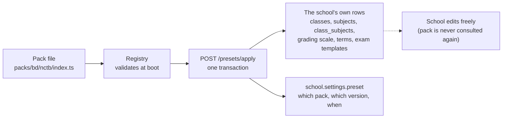
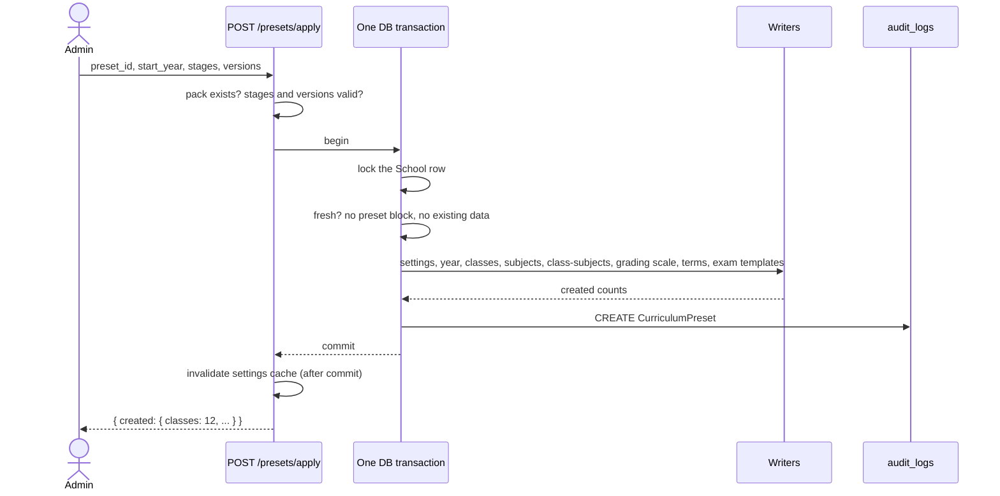
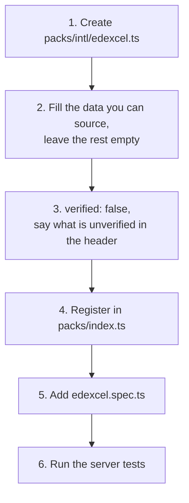
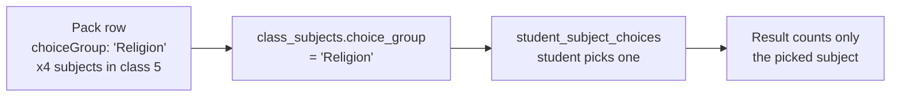

# Curriculum presets

A **preset** (also called a **pack**) is a ready-made school setup: classes,
subjects, a grading scale, terms and exam templates for one curriculum, such as
the Bangladesh NCTB curriculum. A new school picks one and gets a working
academic setup in one click, instead of typing hundreds of rows by hand.

This doc explains how presets work and how to add a new board or country.

Code lives in three places:

- `shared/src/presets/` — the `PresetPack` type and `validatePresetPack()`.
- `server/src/modules/presets/` — the packs, the apply and reset engine, the API.
- `client-admin/src/pages/curriculum-preset/` — the Settings screen.

## 1. What a preset is

A pack is **plain TypeScript data**, not database rows. Applying it **copies**
the data into the school's own rows, once. After that the school owns those
rows and can edit them freely. There is no live link back to the pack.



Why copy and not link? A school's published results must never change because
someone later edited a pack file. Pack edits only reach schools that apply
**after** the edit.

Packs shipped today (all in `server/src/modules/presets/packs/`):

| Pack id            | File                                                | `verified`                  |
| ------------------ | --------------------------------------------------- | --------------------------- |
| `bd/nctb`          | `bd/nctb/index.ts` (+ `primary.ts`, `secondary.ts`) | `false`                     |
| `bd/alia-madrasa`  | `bd/alia-madrasa.ts`                                | `false`                     |
| `bd/qawmi-madrasa` | `bd/qawmi-madrasa.ts`                               | `false`                     |
| `intl/cambridge`   | `intl/cambridge.ts`                                 | `false`                     |
| `blank`            | `blank.ts`                                          | `true` (it invents nothing) |

## 2. The API

All preset routes need role `ADMIN` and permission `CURRICULUM_PRESET_APPLY`,
except reset, which is `SUPER_ADMIN` only.

| Route                                      | What it does                                                                                   |
| ------------------------------------------ | ---------------------------------------------------------------------------------------------- |
| `GET /presets`                             | List packs (`PresetSummary[]`: id, version, names, `verified`, `country`, stages, versions).   |
| `GET /presets/status`                      | `{ state: 'AVAILABLE' \| 'APPLIED' \| 'CUSTOM', preset?, blockers? }` for the caller's school. |
| `GET /presets/{id}`                        | Preview one pack.                                                                              |
| `POST /presets/apply`                      | Apply a pack to a fresh school.                                                                |
| `POST /platform/schools/{id}/preset/reset` | Undo an applied preset (super-admin).                                                          |

**Pack ids contain a slash.** `bd/nctb` in a URL path must be encoded, or the
router sees two segments:

```ts
fetch(`/presets/${encodeURIComponent('bd/nctb')}`); // GET /presets/bd%2Fnctb
```

`GET /presets/{id}` returns a **preview**, not the raw pack: summary, stages,
classes, subjects, groups, grading scale, terms, `{ name, rowCount }` per exam
template, certificates and a `counts` block. It does not return the
`classSubjects` rows (see Known limits).

The three `status` states:

- `AVAILABLE` — no preset block and nothing in the school yet. Can apply.
- `APPLIED` — a preset block exists in `school.settings.preset`. Read-only summary.
- `CUSTOM` — no preset block, but the school already has data. The UI shows a
  read-only message and what blocks, never an apply button. There is no
  backfill for old schools.

## 3. Apply and reset

### Apply



Request:

```json
POST /presets/apply
{
  "preset_id": "bd/nctb",
  "start_year": 2026,
  "stages": ["PRIMARY"],
  "versions": ["bangla"]
}
```

- `stages` (at least one) picks which stages to create. Classes, subjects and
  templates of unselected stages are skipped.
- `versions` is required when the pack declares `versions` (NCTB: `bangla`,
  `english`) and forbidden when it does not. One class is created per class
  per selected version.

Response:

```json
{
  "created": {
    "settings": 1,
    "academicYears": 1,
    "classes": 5,
    "subjects": 9,
    "classSubjects": 40,
    "academicTerms": 0,
    "gradingScales": 0,
    "gradingBands": 0,
    "examTemplates": 0,
    "examTemplateComponents": 0
  }
}
```

(Shape is illustrative; every key is always present, `0` when a writer made nothing.)

**Order of writers** (in `preset-apply.service.ts`, `WRITERS`). Order matters
because later writers need ids from earlier ones:

1. `settings` — vocabulary (`organisation.versions`, `organisation.groups`), the
   `region` block, and the `preset` block. Runs first.
2. `year` — one current academic year. Named `2026` when `yearShape.startMonth`
   is 1, otherwise `2026-2027`.
3. `classes` — selected stages x selected versions. **No sections** are created.
4. `subjects`
5. `class-subjects` — also copies `group` to `group_name` and `choiceGroup` to
   `choice_group`.
6. `grading scale` — the year's default scale (no class) and its bands.
7. `terms` — a month earlier than the start month falls in the next calendar year.
8. `exam templates` — only rows for selected classes whose subject exists;
   templates left with no rows are skipped.

An apply writes only the caller's `tenant_id`. If any writer throws, the whole
transaction rolls back and nothing is left behind.

### The guards

| Guard                 | Rule                                                                                                                                   | Error                                            |
| --------------------- | -------------------------------------------------------------------------------------------------------------------------------------- | ------------------------------------------------ |
| Fresh only            | No academic years, classes, subjects, students, exams, grading scales or exam templates, and no preset block (`FRESH_TENANT_ENTITIES`) | `409`, `details.code = 'PRESET_NOT_FRESH'`       |
| Once                  | A school with a preset block cannot apply again                                                                                        | same `PRESET_NOT_FRESH`                          |
| One at a time         | The `School` row is locked (`pessimistic_write`) so two applies serialise                                                              | second one sees the first's result               |
| Reset: super-admin    | **Platform** `SUPER_ADMIN` only (`PlatformSuperAdminGuard`), mandatory `reason` (10 to 500 characters), audited                        | `401` wrong role, `403` not platform (see below) |
| Reset: needs a preset | Nothing to reset                                                                                                                       | `409`, `details.code = 'PRESET_NOT_APPLIED'`     |
| Reset blockers        | Any operational data exists (list below)                                                                                               | `409`, `details.code = 'PRESET_RESET_BLOCKED'`   |

A wrong **role** is `401`, not `403`: `RolesGuard` throws `UnauthorizedException`
(project issue #729), so an `ADMIN` calling reset gets `401`. `403` is only for
a missing **permission**. The reset route also runs `PlatformSuperAdminGuard`
(added in #1310): it needs genuine platform authority (`isPlatformSuperAdmin`,
set by `ContextGuard`), so a legacy tenant-local `SUPER_ADMIN` passes the role
check but gets `403`. (`presets.e2e-spec.ts` asserts these.)

The error payload is under `details` (the global error filter forwards only
`message` and `details`):

```json
HTTP 409
{
  "message": "A curriculum preset can only be applied to a fresh school",
  "details": {
    "code": "PRESET_NOT_FRESH",
    "blockers": [ { "entity": "classes", "count": 3 } ]
  }
}
```

### Reset

```json
POST /platform/schools/<school-uuid>/preset/reset
{ "reason": "Applied the wrong board during onboarding" }
```

```json
200 { "deleted": { "examTemplateComponents": 0, "examTemplates": 2, "classSubjects": 40, "classes": 5, ... } }
```

Reset is one transaction. It locks the `School` row, then:

- **Hard-deletes** `exam_template_components` (they have no `deleted_at`).
- **Soft-deletes** (children first): `exam_templates`, `class_subjects`,
  `class_sections`, `classes`, `grading_bands`, `grading_scales`, `subjects`,
  `academic_terms`, `academic_years`.
- Removes `settings.preset` and puts `settings.organisation` back to its defaults.
- Writes an audit row (`DELETE` on `CurriculumPreset`, reason in `new_values`).
- Invalidates the settings cache after commit.

After that the school is fresh again and may re-apply.

**Reset is blocked while any of these exist** (`RESET_BLOCKER_ENTITIES` in
`preset-blockers.ts`): students, enrolments, exams, fee structures, homework,
syllabus topics, routine slots, calendar events, promotion runs, attendance
sessions, teacher assignments, routines, admission intakes, recurring fee
schedules, fine rules. The 409 lists each with its count.

## 4. A pack file

The type is `PresetPack` in `shared/src/presets/pack.types.ts`. Here is the
smallest real pack, `server/src/modules/presets/packs/blank.ts` (trimmed), with
every field explained:

```ts
export const BLANK_PACK: PresetPack = {
  id: 'blank', // unique, matches the file; 'region/board' for real boards
  schemaVersion: 1, // always 1 today
  version: '2026.1', // bump when you change the data; stored on the school
  country: 'INTL', // ISO 3166-1 alpha-2 ('BD'), or 'INTL' for no country
  name: { en: 'Blank / custom setup', bn: 'কাস্টম সেটআপ' }, // both languages, always
  board: { en: 'None', bn: 'কোনোটি নয়' },
  description: { en: '...', bn: '...' },
  verified: true, // false = "starting point, check before trusting" (section 8)
  yearShape: { startMonth: 1 }, // academic year starts in January
  stages: [{ key: 'ALL', name: { en: 'All', bn: 'সব' } }], // admin picks stages
  groups: [], // vocabulary for group-only subjects (Science, ...)
  classes: [], // { name, numericGrade, stage }
  subjects: [], // { code, nameEn, nameBn }
  classSubjects: [], // which subject is taught in which class
  gradingScale: null, // or { name, bands[] }
  terms: [], // { name, seq, start:{month,day}, end:{month,day} }
  examTemplates: [], // { name, kind, rows[] }
  certificates: [], // 'TESTIMONIAL' | 'TRANSCRIPT' | 'CHARACTER' | 'TRANSFER'
};
```

Optional fields: `region` (country, locale, timezone, currency... a partial
`RegionSettings`) and `versions` (e.g. NCTB's Bangla / English medium; the
value lands in `Class.version`).

Each `classSubjects` row says "class `classGrade` teaches `subjectCode`":

| Field                     | Meaning                                                                 |
| ------------------------- | ----------------------------------------------------------------------- |
| (nothing)                 | Compulsory for everyone in that class                                   |
| `group: 'Science'`        | Only for students in that group (must be listed in the pack's `groups`) |
| `optional: true`          | Optional "4th subject"                                                  |
| `gradedOnly: true`        | Graded but not counted in totals                                        |
| `choiceGroup: 'Religion'` | One of a set of subjects, see section 6                                 |

`group`, `optional` and `choiceGroup` never combine. `classGrade` and
`subjectCode` point at a class `numericGrade` and a subject `code` in the same
pack. Exam templates use the same two keys, not database ids, so they keep
working every year.

### What `validatePresetPack()` rejects

It returns a list of readable errors; empty means valid. The registry runs it on
every pack at server boot, so a bad pack fails the **boot**, not a user's apply.

- empty `id` or `version`; `yearShape.startMonth` not 1 to 12
- duplicate stage keys, `numericGrade`s, subject codes, class-subject rows
- a class pointing at an unknown stage; a class-subject pointing at an unknown
  grade, subject or group
- `group` with `optional`; `choiceGroup` with `optional` or `group`;
  `choiceGroup` empty or over 50 characters;
  a choice group with fewer than 2 subjects in a class
- grading bands that overlap, leave a gap, do not start at 0 or end at 100, or
  have a fail band above a pass band
- duplicate template names, duplicate components, `full` not above 0,
  `pass` outside 0 to `full`
- duplicate term `seq`, or a term whose start is not before its end

## 5. Add a board or a country

### Add a board

Example: add **Edexcel** (an international board) next to Cambridge.



1. **Create the file** `server/src/modules/presets/packs/<region>/<id>.ts`.
   Region folders are `bd/` and `intl/`; a single-board country can be one file.
   Export a `PresetPack`, e.g. `export const EDEXCEL_PACK`, with
   `id: 'intl/edexcel'`. Start by copying `packs/blank.ts` and filling it in,
   or `packs/intl/cambridge.ts` for a pack that has classes, subjects and a scale.
2. **Fill in only what you can source.** Skeleton (illustrative: the subject, class and
   names below are placeholders, not real Edexcel data):

   ```ts
   import type { PresetPack } from '@biddaloy/shared';

   /**
    * Edexcel International pack.
    * UNVERIFIED (pack is `verified: false`): <list every guess here>
    */
   export const EDEXCEL_PACK: PresetPack = {
     id: 'intl/edexcel',
     schemaVersion: 1,
     version: '2026.1',
     country: 'INTL',
     name: { en: 'Edexcel International', bn: 'এডেক্সেল ইন্টারন্যাশনাল' },
     board: { en: 'Pearson Edexcel', bn: 'পিয়ারসন এডেক্সেল' },
     description: { en: '...', bn: '...' },
     verified: false,
     yearShape: { startMonth: 1 },
     stages: [{ key: 'IGCSE', name: { en: 'IGCSE', bn: 'আইজিসিএসই' } }],
     groups: [],
     classes: [{ name: 'Year 10', numericGrade: 10, stage: 'IGCSE' }],
     subjects: [{ code: 'E-1', nameEn: 'English Language', nameBn: 'ইংরেজি ভাষা' }],
     classSubjects: [{ classGrade: 10, subjectCode: 'E-1' }],
     gradingScale: null, // null until you have a sourced scale
     terms: [],
     examTemplates: [],
     certificates: [],
   };
   ```

3. **Mark `verified: false`** unless every number comes from an official
   source. Put the unverified items in the file's header comment (see
   `alia-madrasa.ts` for the format: "Verified: ..." then "UNVERIFIED: ...").
4. **Register it** in `server/src/modules/presets/packs/index.ts`: import it and
   add it to the `PRESET_PACKS` array. A pack not in this array does not exist
   as far as the API is concerned. Test packs never go here.
5. **Add a spec** next to it (`edexcel.spec.ts`), like `alia-madrasa.spec.ts`:
   assert `validatePresetPack(EDEXCEL_PACK)` is `[]`, the stages are the ones you
   expect, and `verified` is `false`. Also bump the count in
   `packs/packs.spec.ts` (`registers five packs`), which also checks every
   registered pack is valid and has both `en` and `bn` text.
6. **Run** `npx vitest run presets` from `server/`.
   Also try an apply: `packs-apply.integration.spec.ts` applies every
   registered pack to a fresh school.

Rules that save you time:

- **Both languages, always.** `name`, `board`, `description`, stage names and
  `nameEn`/`nameBn` of subjects. Bangla names that are translations rather than
  official terms should say so in the header (Cambridge does).
- **Subject codes** must be unique inside the pack. If the board has no public
  codes, use your own prefix (`E-1`, `Q-1`) and say so.
- **`Class.name` is a single string** (no `en`/`bn` pair).
- **Packs never import each other.** Copy shared data (Alia copies the GPA
  bands on purpose).
- **What NOT to invent.** If you cannot find a source, leave it empty:
  `gradingScale: null`, `terms: []`, `examTemplates: []`, `classSubjects: []`.
  An empty list is honest; a plausible-looking guess becomes a school's real
  marks. Qawmi ships structure and subjects only and leaves marks, scale,
  templates and terms blank for exactly this reason.

### Add a country

A country is just a board folder plus the `country` and `region` fields. **No
application code changes.**

| Change                                                 | Where                                                                                         |
| ------------------------------------------------------ | --------------------------------------------------------------------------------------------- |
| New folder                                             | `packs/<region>/` (e.g. `packs/in/`)                                                          |
| `country: 'IN'`                                        | ISO 3166-1 alpha-2. Used to pick the default public-holiday source for the school's calendar. |
| `region: { country, locale, timezone, currency, ... }` | A partial `RegionSettings`. Merged over the defaults on apply.                                |
| `gradingScale`                                         | The country's scale (percent bands, optional GPA).                                            |
| `yearShape.startMonth`                                 | When the academic year starts (e.g. `4` for April). The year is then named `2026-2027`.       |

**Weekly off days (Friday) are not in a pack.** `RegionSettings` has no
weekly-off field. The tenant-wide attendance default is
`weeklyOffDays: [5]` (Friday, `0` is Sunday) in
`server/src/modules/schools/settings/tenant-settings-defaults.ts`, and apply
**never touches attendance settings**. A country with a Saturday and Sunday
weekend still needs a school admin (or a future change) to set it under
attendance settings.

What does **not** change when you add a country: the apply engine, the
writers, the API, the database. If a new country needs a field that
`PresetPack` cannot express, that is a code change, not a data change: ask
before extending the type.

## 6. Choice groups: "exactly one of"

In NCTB class 5 every student takes Religion, but Islam, Hindu, Christianity
and Buddhism are separate subjects. Each student takes **exactly one**. A choice
group models that.



In the pack, mark each member:

```ts
{ classGrade: 5, subjectCode: 'P-01', choiceGroup: 'Religion' }, // Islam
{ classGrade: 5, subjectCode: 'P-02', choiceGroup: 'Religion' }, // Hindu
{ classGrade: 5, subjectCode: 'P-03', choiceGroup: 'Religion' }, // Buddhist
{ classGrade: 5, subjectCode: 'P-04', choiceGroup: 'Religion' }, // Christian
```

(These are the real codes from `packs/bd/nctb/primary.ts`.) NCTB uses two groups: `Religion` (classes 1 to 10) and
`Agriculture / Home Science` (classes 6 to 8). In classes 9 and 10,
Agriculture and Home Science stay the optional 4th subject.

Rules, all enforced:

- At least **2 members per class** (`validatePresetPack`).
- A member is never `optional` and never has a `group` (`validatePresetPack`,
  and the DB `CHK_class_subjects_choice_group_exclusive`).
- The name is 1 to 50 characters.

Database (migration `1791100000000-SubjectChoiceGroups.ts`):

- `class_subjects.choice_group` and `student_subject_choices.choice_group`, both nullable.
- Trigger `trg_ssc_copy_choice_group` copies `choice_group` from the class
  subject onto every pick, so a pick can never disagree with its subject.
- Partial unique index `IDX_student_subject_choices_one_per_choice_group` on
  `(student_id, academic_year_id, choice_group)` where `choice_group IS NOT NULL`:
  **one pick per student, per year, per group.**
- `CHK_student_subject_choices_group_not_fourth`: a choice-group pick is never
  the optional 4th subject.
- Trigger `trg_cs_cascade_choice_group` keeps picks in step when a group is
  renamed. A rename that would leave a student with two picks in one group is
  refused by the database.

Where choice groups show up:

| Place                           | Behaviour                                                                                                                                                                                                                                  |
| ------------------------------- | ------------------------------------------------------------------------------------------------------------------------------------------------------------------------------------------------------------------------------------------ |
| Student **Subject choices** tab | The one place to pick, per student. No default pick is made at admission, create or bulk upload.                                                                                                                                           |
| Results `process()`             | A student with no pick in an examined group blocks processing: `409`, `details.code = 'CHOICE_GROUP_UNPICKED'`. `force` does **not** bypass it. Recompute of an already-processed exam skips the check.                                    |
| Results, streams                | The same block-when-unassigned rule for `class_subjects.group_name` (Science, ...): a student in a section with no group, in a class with group-only subjects, gives `details.code = 'STREAM_UNASSIGNED'`. Choice-group wins if both fire. |
| Promotion                       | A pick carries forward when the target class offers the same subject in a choice group of the **same name**. Otherwise the student has no pick and must choose again.                                                                      |
| Workbook                        | `class_subjects` tab has a `choice_group` column; `student_subject_choices` tab is exported too.                                                                                                                                           |

Blocked result payload:

```json
HTTP 409
{
  "message": "3 student(s) have not picked a subject in a choice group.",
  "details": { "code": "CHOICE_GROUP_UNPICKED", "total": 3, "missing": [ ... ] }
}
```

(`missing` is capped at 50 entries; `total` is the real count.)

Deleting or detaching a subject also deletes its 4th-subject picks.

## 7. Exam templates

A pack's `examTemplates` become `exam_templates` plus
`exam_template_components` rows in the school (one row per class grade,
subject code and component name). They are keyed by **class `numeric_grade` and
subject `code`, not ids**, so one template works for every year.

Schools manage templates at `exam-templates` (`GET`, `GET :id`, `POST`,
`PATCH :id` which replaces all rows, `DELETE :id`), role `ADMIN`, permission
`EXAM_MANAGE`.

Creating an exam can start from a template: `POST /exams` accepts an optional
`template_id`. The template's components for that class's grade are **copied by
value** onto the new exam. Later edits to the template never change an exam that
already exists. Subjects the class does not offer are skipped.

An `ATTENDANCE` component is a computed (`DERIVED`) mark, not typed in. A
subject may have at most **one** per template and per exam; the server refuses
a template with two, because they would double-count attendance.

## 8. Unverified packs

`verified: false` means: **a person must check this against the board's own
syllabus before trusting it.** In the UI, the pack card carries a badge ("Structure only — marks and grading
set by your school"), and the options form and the review step show a note:
"This preset has not been checked against the official curriculum. It sets up
classes and subjects only. Your school must set marks and grading itself." It
does not block apply.

Where the data came from, and what is missing:

| Pack               | Why unverified                                                                                                                                                                                                   |
| ------------------ | ---------------------------------------------------------------------------------------------------------------------------------------------------------------------------------------------------------------- |
| `bd/nctb`          | Per-class subject lists need re-checking class by class (see the UNVERIFIED lists in `primary.ts` and `secondary.ts`).                                                                                           |
| `bd/alia-madrasa`  | Stage names and the Dakhil/Alim GPA scale are sourced. Which subject is taught in which class and which subjects belong to each group were not confirmable. No Fazil/Kamil subjects, no exam templates.          |
| `bd/qawmi-madrasa` | Structure and subjects only. One class per stage (real boards run several years). `classSubjects` is empty. Subject codes `Q-<n>` are our own. Marks, grading scale, templates and terms are deliberately blank. |
| `intl/cambridge`   | Percent bands are illustrative (real boundaries change each session); one scale for all stages; years 10 to 13 subjects are "typical, not exhaustive"; Bangla names are translations.                            |

**Where marks come from for a school.** If a pack has no templates or scale,
the school enters its own: grading scale under grading settings, exam
components when creating an exam. A pack never invents marks.

To flip a pack to `verified: true`, check every UNVERIFIED line in its header,
fix the data, delete the list, and change the flag in the same PR.

## 9. Known limits

- **Unverified data.** Four of the five packs are `verified: false` (section 8).
  Treat them as a starting point.
- **Copy once, no re-apply.** There is no "update to the new pack version" and no
  merge. A school with a preset block cannot apply again. Reset-then-apply is the
  only way, and reset is blocked once the school has real data.
- **Fresh schools only.** Apply refuses a school that already has any academic
  year, class, subject, student, exam, grading scale or exam template. A school
  without a preset block is "custom setup" and sees a read-only message.
- **Reset blockers are strict.** One enrolment or one fee structure blocks reset
  for good (list in section 3). That is intentional: reset would orphan that data.
- **Reset clears vocabulary.** It puts `settings.organisation` (versions,
  groups, shifts) back to defaults. The `region` block that apply wrote is left
  as is.
- **No sections.** Apply creates classes but no sections; the school makes its own.
- **No group-transition rules.** A pack cannot say "commerce students cannot enter
  science at class 11". That is a separate epic (Epic 26).
- **Preview has no class-subject rows.** `GET /presets/{id}` returns only
  `counts.classSubjects`, not the rows. The preview sheet is built to show a
  line like "One of: Islam / Hindu / Christianity / Buddhism" per class, but it
  reads `classSubjects` and that field is absent from the server response, so
  the line does not show today. Fixing it means adding `classSubjects` to
  `PresetPreview` in `presets.controller.ts`.
- **Weekly off is not in a pack.** Friday is the tenant default; apply never
  touches attendance (section 5).
- **Certificates are a list of kinds only** (`TESTIMONIAL`, `TRANSCRIPT`,
  `CHARACTER`, `TRANSFER`). They suggest print templates; they are not templates.
- **Not patchable.** `settings.preset` cannot be set through the settings API.
  Only apply and reset write it.

## Why it is built this way

- **Packs are TypeScript, not JSON or database tables** — the server build has no
  asset pipeline, and there is nothing to administer in a UI yet.
- **Applied state is `school.settings.preset` plus the audit log** — no
  `presets` or `preset_applications` tables.
- **Apply and reset use the transaction manager's repositories directly** — no
  existing service has a variant that joins an outside transaction. Settings are
  merged with `tenant-settings-merge.util`, and the settings cache is invalidated
  only after commit, so a rolled-back apply never evicts a good cache entry.
- **Fresh-only** — merging a pack into a running school was rejected as too risky.
- **One pack per tenant** — a school that mixes curricula is two tenants.
