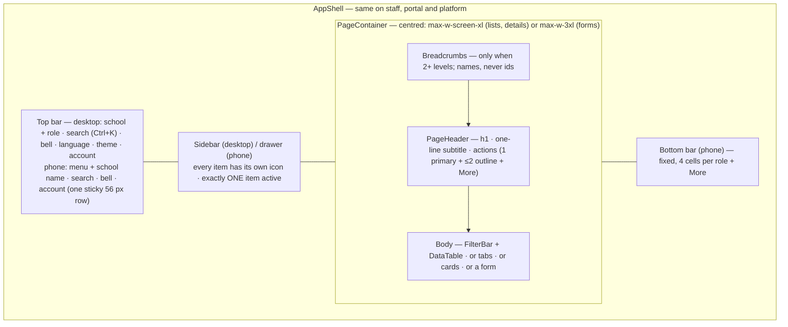
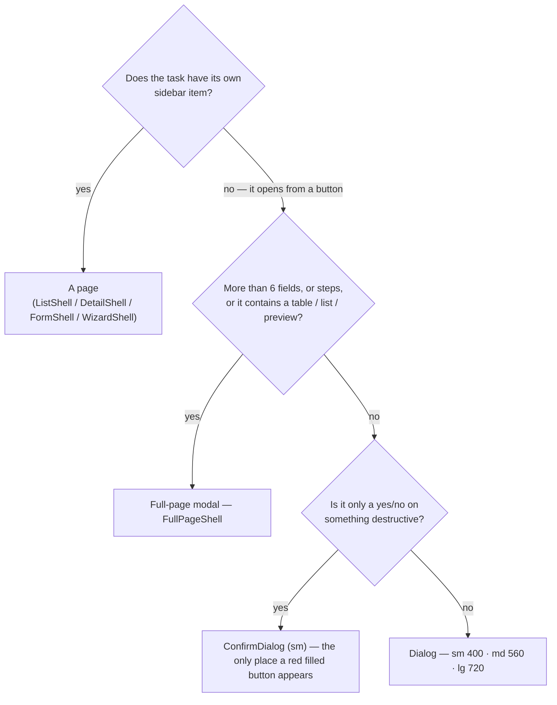
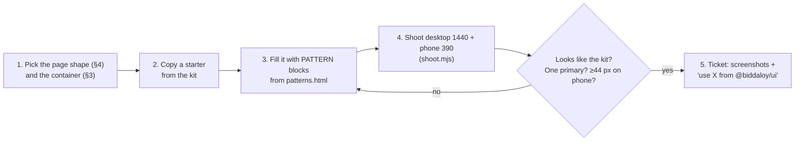

# UI patterns — how every screen is put together

Decided 2026-10-04 while planning Epic 31.0 (UX retrofit, #811). This is the
**pattern** contract: which building block a screen uses, and the rules that
make every screen look and behave like the same product.

It sits between two older contracts. Read the one you need:

| Question | Doc |
|---|---|
| Which colour, font size, border, shadow, motion token? | [09-design-direction.md](09-design-direction.md) |
| Where does a screen live in the nav? Palette, breadcrumbs, registries, a11y gates? | [15-ux-principles.md](15-ux-principles.md) |
| **Which component, which layout, which wording, which format?** | **this doc** |

> **Status — read this first.** These rules are the target. The components
> marked *new* in §10 are built by Epic 31.0 (#811, waves 1–8). Until that
> lands, **plan and design every new screen to this contract** — a screen
> designed any other way becomes retrofit work the day it merges. The last
> ticket of the epic (31.5.4) corrects this doc wherever the built result
> differs.

## 1. The rules on one screen

| # | Rule | In practice |
|---|---|---|
| P1 | **One kit.** | Every mockup starts from the kit in `.claude/skills/redesign-page/` (5 shell starters + `patterns.html`). You copy patterns; you do not invent one. A pattern that is missing is added to the kit first, then used. |
| P2 | **Fix it in the shared component.** | A look or behaviour that more than one screen needs lives in `ui/`, never copied into a route file. |
| P3 | **A page owns only itself.** | A page ticket edits its route files, its feature folder and its own locale namespace. Shared code (`ui/src/**`, layouts, `nav-tree.ts`, `route-crumbs.ts`, `action-registry.ts`, `nav.json`, `common.json`) changes only in a ticket made for that. |
| P4 | **Nothing raw on screen.** | No UUID, no i18n key, no enum constant (`CASH`, `Father`), no regex or locale code, no English server message. Show the name, a translated label, a translated sentence. |
| P5 | **One primary action per view.** | One filled button. Others are outline. Rare ones go into a "More" menu. |
| P6 | **The phone is designed, not shrunk.** | One column, tables become cards, filters hide behind one button, every control is at least 44 px tall. |
| P7 | **Title = breadcrumb = sidebar label.** | One name per thing, in plain words, in Bangla and English. |

## 2. Anatomy of a page

- Gutters are 16 px on phone and 24 px on desktop and belong to the shell. A
  route file never sets its own `max-w-*`, `mx-auto` or page padding.
- The bottom bar is on every signed-in page on phone. The page reserves its
  height, so content never hides behind it and a short page shows no stray gap.
  It is hidden only inside a full-page modal, which has its own action footer.
- The phone drawer is a full-height sheet with a sticky header: brand on the
  left, a 44 px close button on the top right that never scrolls away.
- Language, theme, security, switch school and sign out live in the account menu.

## 3. Which container does a task get?

| Container | Rules | Example |
|---|---|---|
| **Page** | Lives in the nav tree. `PageHeader` on top. | `/students`, `/communications/send` |
| **Full-page modal** | Covers the app chrome. **Is in the address bar**: its own route when one exists, otherwise a search param on the host route. Sticky header: title left, a very visible Close (X + word, 44 px) top right. Body centred. Sticky footer: secondary left, primary right. Esc and Close ask before discarding changes. Closing returns to where the user came from. | Add student `/students/new`, record payment `/payments/record`, generate fees `/fees/generate?generate=1` |
| **Dialog** | Cancel (outline), then the primary on the right. 20 px padding on every side; header, body and footer share it. | Add guardian, rename |
| **ConfirmDialog** | Says what will be lost. Cancel + red filled confirm. | Delete student |

## 4. The four page shapes

| Shape | Built from | Must have |
|---|---|---|
| **List** | `ListShell` → `PageHeader` + `FilterBar` + `DataTable` | visible total, row actions as icons, empty state, error state |
| **Detail** | `DetailShell` → header (name, status badge, key facts, actions) + tabs | tabs switch (one panel visible), tab in the URL |
| **Form / task** | `FormShell` (page) or `FullPageShell` (opened from a button) | visible label on every field, one Save, cancel/close |
| **Wizard** | `WizardShell` or `FullPageShell` with steps | step indicator, Back / Next in the footer |

Signed-out pages (login, reset, public receipt, public admission form) use
`AuthLayout`: logo, a centred card, the language switcher top right.

## 5. Lists and tables

- **Row actions** are icon buttons with a tooltip that names the action — never
  underlined text. At most 3 icons; more go into a "More" menu with icon + text.
  On phone cards the same actions show icon + visible label (there is no hover).

  | Intent | Icon | Colour |
  |---|---|---|
  | view / open | `eye` | neutral |
  | edit | `pencil` | brand |
  | pay / approve | `hand-coins` / `circle-check` | success |
  | send (message, reminder) / restore | `send` / `archive-restore` | brand |
  | reject | `circle-x` | danger |
  | print / download | `printer` / `download` | neutral |
  | delete (the record is gone) / remove (taken out of this list only) | `trash-2` / `circle-minus` | danger |

- **Every table shows its total.** Paginated: "Showing 1–25 of 312" + rows per
  page + pager. Short and unpaginated: "Total 12".
- **Default page size is 25** (options 25 / 50 / 100). A route does not pass its own.
- **Empty table** → `EmptyState` and no pager. **Failed load** → `ErrorState` with Retry.
- **Numbers are right-aligned.** **Status is always a `StatusBadge`** with a tone
  and an icon (success / warning / danger / info / neutral) — never plain text.
- **Phone:** `DataTable` card mode. A short unpaginated table becomes compact two-line rows.

## 6. Filters and forms

- **Every control has a visible label** — filters too. A placeholder is not a label.
- Date and select fields show a placeholder (`তারিখ বাছুন`, `বাছুন`). Required
  fields are marked. An empty select keeps its full width.
- **No browser-native `<select>`, date, time or month input.** Use `Select`,
  `Combobox`, `DatePicker`, `MonthPicker`, `TimeInput`.
- **FilterBar on phone:** the search field plus one "Filter (n)" button that opens
  a bottom sheet. Active filters show as removable chips, with one "Clear all".
- Field gap 16 px, label-to-control 6 px. Help text under the control; the error
  replaces it.

## 7. Formats — one function each (`ui/src/utils`)

| What | English | Bangla | Function |
|---|---|---|---|
| Date | `9th September, 2026` | `৯ই সেপ্টেম্বর, ২০২৬` | `formatDate` |
| Date + time | `9th September, 2026, 3:45 PM` | `৯ই সেপ্টেম্বর, ২০২৬, বিকাল ৩:৪৫` | `formatDateTime` |
| Month | `October 2026` | `অক্টোবর ২০২৬` | `formatMonth` |
| Time (12-hour, no seconds) | `8:00 AM` | `সকাল ৮:০০` | `formatTime` |
| Number / count | `1,250` | `১,২৫০` | `formatNumber`; `{{count}}` in translations follows it |
| Money | `৳500.00` | `৳৫০০.০০` | `formatCurrency` / `formatServerAmount` |
| Phone | `01711-000004` | `01711-000004` | `formatPhone` |

- Bangla day ordinals: ১লা, ২রা, ৩রা, ৪ঠা, ৫ই–১৮ই, ১৯শে–৩১শে.
- **Never mix digits** inside one value. Numerals follow the school's numeral
  setting everywhere — except things a person copies or dials, which stay Latin:
  registration / invoice / receipt numbers, phone numbers, emails, codes.
- ISO strings (`2026-09-09`) appear only in exports, URLs and API calls. Use
  `toIsoDate` for those — never `formatDate` output as data.

## 8. Calendar and dates

One month component serves the date picker and the calendar page.

- Header: the month in words (`অক্টোবর ২০২৬`), icon prev/next, a "Today" button.
- Today is ringed; the selected day is filled; today is selected by default.
- **Desktop calendar page:** month grid with event chips + a panel for the selected day.
- **Phone:** full-width month grid with event dots; the selected day's events are
  listed under it. No grid/agenda toggle.

## 9. Spacing, buttons, states

| Where | Value |
|---|---|
| Page gutter | 16 px phone / 24 px desktop |
| Between sections of a page | 24 px |
| Card padding | 16 px phone / 20 px desktop |
| Dialog padding | 20 px on every side |
| Control height | 44 px on phone; 32 px on desktop for staff, 44 px for portal and signed-out pages |
| Radius | controls 8 px, cards and dialogs 12 px |

- **Buttons:** one filled primary per view; outline = secondary; ghost = tertiary;
  red filled only inside a `ConfirmDialog`; underlined links only for navigation
  inside a sentence.
- **Anything clickable shows a pointer cursor;** disabled shows `not-allowed`.
- **Empty state:** icon, title, one sentence, one (outline) action.
  **Error state:** a translated sentence + Retry.
  **Loading:** a skeleton shaped like the content.
- **Settings-like pages** with many sections use a category side list
  (`?section=`); on phone the category list comes first, then the section with a
  back control. Each section keeps its own Save. Technical fields sit under "Advanced".
- **Notification badge:** a pill that holds four digits, with real contrast in
  both themes.

## 10. Component catalogue

"Use" means import it from `@biddaloy/ui`. Props and exact classes are in
`.claude/skills/redesign-page/patterns.md`.

| Component | Use it for | Status |
|---|---|---|
| `AppShell`, `BottomNav`, `Breadcrumbs` | the frame of every signed-in page | existing — changed by 31.2.9a, 31.2.10 |
| `PageContainer`, `PageHeader` | width and the title row of every page | *new* — 31.2.5a |
| `ListShell`, `DetailShell`, `FormShell`, `WizardShell` | the four page shapes | existing — changed by 31.2.5a–c |
| `FullPageShell`, `useCloseFullPage` | task forms opened from a button | *new* — 31.2.6 |
| `Dialog` (`size`), `ConfirmDialog` | short forms, destructive confirms | changed / *new* — 31.2.6 |
| `DataTable` + `RowActions` + `TableCount` | every table | changed / *new* — 31.2.4a, 31.2.4b |
| `FilterBar` + `FilterSheet` | every filter row | changed / *new* — 31.2.7a |
| `Select`, `Combobox`, `FormField`, `Label` | form controls | existing — changed by 31.2.7b |
| `DatePicker`, `MonthPicker`, `TimeInput` | every date, month, time input | changed / *new* — 31.2.2 |
| `MonthGrid`, `DayPanel`, `AgendaList` | calendar views | changed / *new* — 31.2.3a |
| `StatusBadge` (`tone`) | every status | existing — changed by 31.2.8b |
| `EmptyState`, `ErrorState`, `Skeleton` | the three states | existing — changed by 31.2.8a |
| `AuthLayout` | signed-out pages | *new* — 31.2.12 |
| `formatDate`, `formatDateTime`, `formatMonth`, `formatTime`, `formatNumber`, `formatPhone`, `toIsoDate` | every value on screen | changed / *new* — 31.1.2b, 31.2.1a, 31.2.1b |

## 11. Wording

- Write for a school clerk. No "batch", "run", "commit", "slug", "token",
  "provider", "step-up approval".
- One word per thing in each language (`শ্রেণি`, never also `ক্লাস`).
- The glossary (old → new, English + Bangla) is maintained with `nav.json` and
  `common.json`; ticket 31.3.4a holds the first full table. A new screen takes its
  words from there and adds to it — it does not coin a second name.
- Every string exists in `en` and `bn`. Bangla is often longer and taller: never
  fix a width to an English word.

## 12. How to design a new screen (or redesign one)

The kit lives in `.claude/skills/redesign-page/`:

| File | What it is |
|---|---|
| `starter.html` | staff shell (sidebar, top bar, phone bottom bar) |
| `starter-portal.html` · `starter-platform.html` | guardian portal and platform console shells |
| `starter-fullpage.html` | full-page modal frame |
| `starter-guest.html` | signed-out card (`AuthLayout`) |
| `patterns.html` | every pattern once, between `PATTERN: Name` comments |
| `patterns.md` | component names, props, exact classes |
| `nav-icons.md` | icon per nav item, bottom-bar cells per role |

A concrete example — the Students list (`/students`) mapped to the kit:

| Part of the page | Pattern | What the ticket says |
|---|---|---|
| Title + "Add student" | `PageHeader` | one primary; "Import" is outline; "Upload photos" goes into More |
| Search, class, section, status, date of birth | `FilterBar` | every field labelled; phone: search + "Filter (2)" |
| Rows | `DataTable` + `RowActions` | view (neutral), edit (brand), collect fee (success) |
| Footer | `TableCount` | "১–২৫ দেখানো হচ্ছে, মোট ৪৮" |
| No students yet | `EmptyState` | title, one sentence, outline "Add student" |

Planning a large UI epic (many screens at once)? Follow the method Epic 31.0
used, so tickets cannot collide and nothing is built twice:

1. Kit first (or extend it) — the spec for shared tickets and the parts bin for page mockups.
2. Shared code in *foundation* tickets; each page in its own ticket that only says "use".
3. What a page needs from shared code is written down as a request and decided
   **before** tickets are created.
4. Tickets that share a file form one lane and run in order; lanes of a wave share
   no file — check it with a script over every `## Files` list, not by eye.

## 13. What a ticket with a screen must state

In addition to the three sections [15-ux-principles.md](15-ux-principles.md) §8 asks for:

- the **page shape** (§4) and the **container** of each task (§3);
- the **kit patterns** it uses, by name — and any pattern it needs that the kit lacks;
- **desktop and phone** screenshots of a mockup built from the kit;
- the **one primary action** of each view;
- that it follows §7 formats and §11 wording — and the glossary words it adds.
