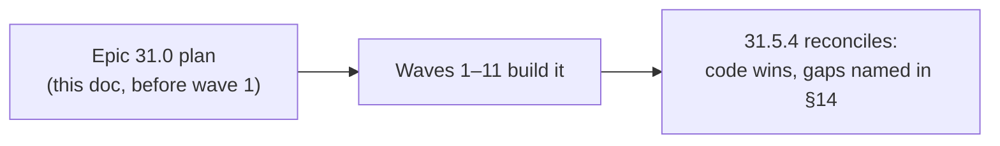
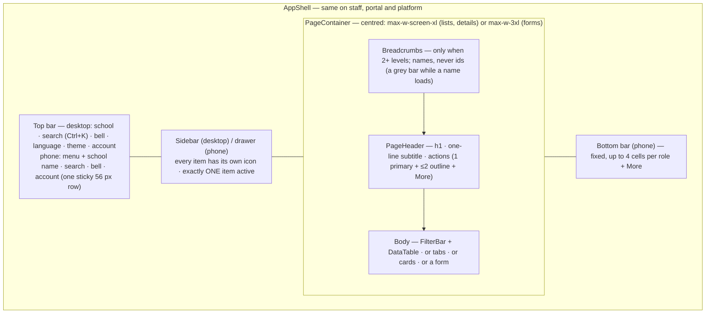
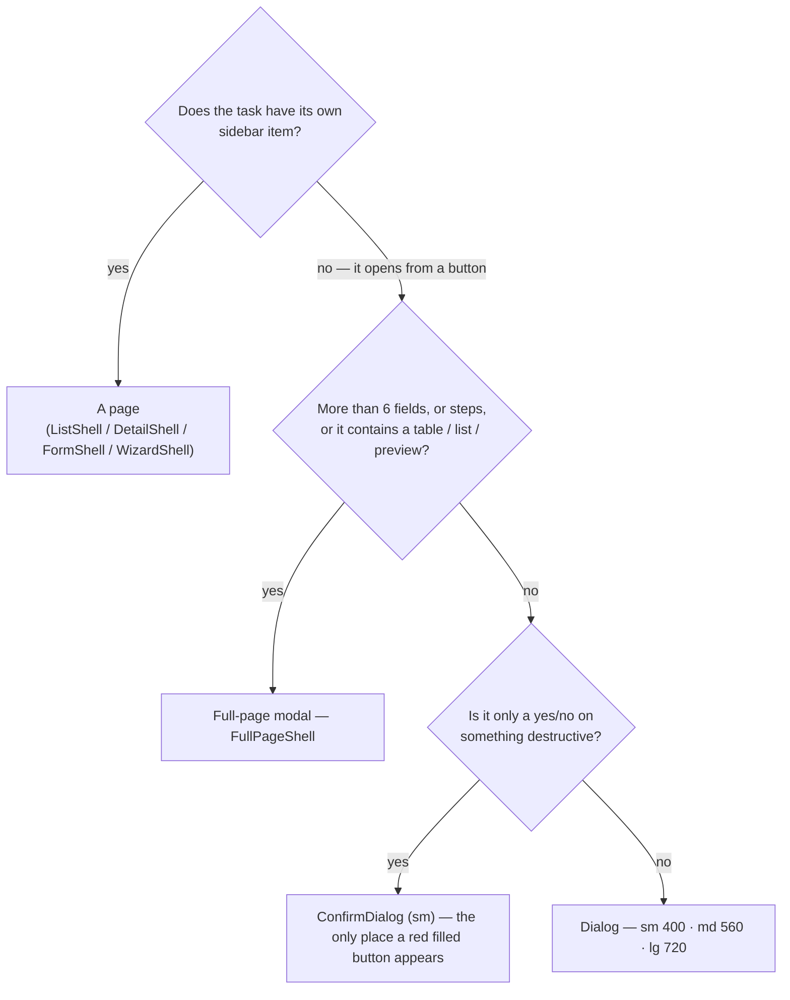
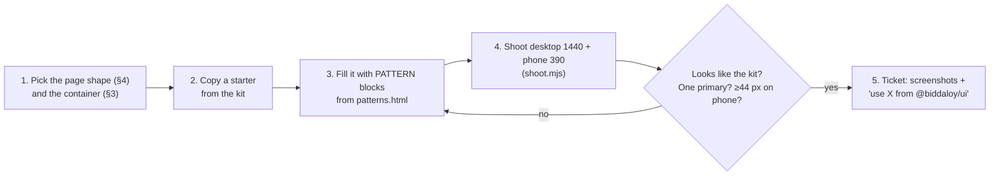
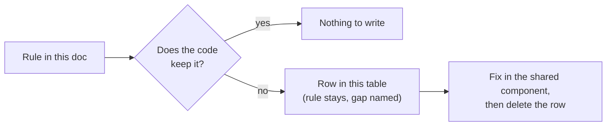
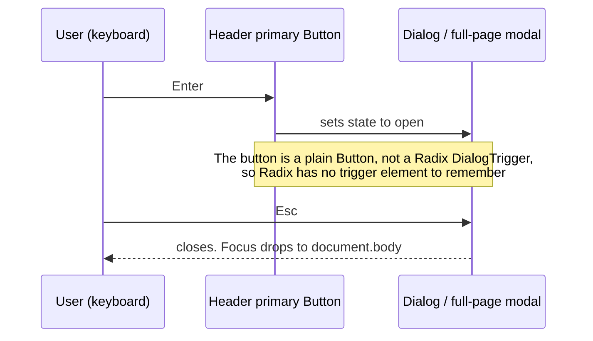
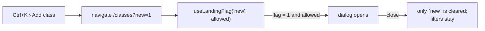

# UI patterns — how every screen is put together

Decided 2026-10-04 while planning Epic 31.0 (UX retrofit, #811); reconciled
with the shipped code by 31.5.4 (#1458). This is the **pattern** contract: which building block a screen uses, and the rules that
make every screen look and behave like the same product.

It sits between two older contracts. Read the one you need:

| Question                                                                           | Doc                                              |
| ---------------------------------------------------------------------------------- | ------------------------------------------------ |
| Which colour, font size, border, shadow, motion token?                             | [09-design-direction.md](09-design-direction.md) |
| Where does a screen live in the nav? Palette, breadcrumbs, registries, a11y gates? | [15-ux-principles.md](15-ux-principles.md)       |
| **Which component, which layout, which wording, which format?**                    | **this doc**                                     |

> **Status — read this first.** Epic 31.0's foundation is **built**. Every
> component in §10 exists in `ui/` (or `client-admin/`, where §10 says so). Plan
> and design every new screen to this contract. Where the code and this doc
> disagree, **the code is right**: fix the doc. Rules the code still breaks are
> listed in [§14 Known gaps](#14-known-gaps) — the rule stays, the gap is named.

## 1. The rules on one screen

| #   | Rule                                    | In practice                                                                                                                                                                                                                                         |
| --- | --------------------------------------- | --------------------------------------------------------------------------------------------------------------------------------------------------------------------------------------------------------------------------------------------------- |
| P1  | **One kit.**                            | Every mockup starts from the kit in `.claude/skills/redesign-page/` (5 shell starters + `patterns.html`). You copy patterns; you do not invent one. A pattern that is missing is added to the kit first, then used.                                 |
| P2  | **Fix it in the shared component.**     | A look or behaviour that more than one screen needs lives in `ui/`, never copied into a route file.                                                                                                                                                 |
| P3  | **A page owns only itself.**            | A page ticket edits its route files, its feature folder and its own locale namespace. Shared code (`ui/src/**`, layouts, `nav-tree.ts`, `route-crumbs.ts`, `action-registry.ts`, `nav.json`, `common.json`) changes only in a ticket made for that. |
| P4  | **Nothing raw on screen.**              | No UUID, no i18n key, no enum constant (`CASH`, `Father`), no regex or locale code, no English server message. Show the name, a translated label, a translated sentence.                                                                            |
| P5  | **One primary action per view.**        | One filled button. Others are outline. Rare ones go into a "More" menu.                                                                                                                                                                             |
| P6  | **The phone is designed, not shrunk.**  | One column, tables become cards, filters hide behind one button, every control is at least 44 px tall.                                                                                                                                              |
| P7  | **Title = breadcrumb = sidebar label.** | One name per thing, in plain words, in Bangla and English.                                                                                                                                                                                          |

## 2. Anatomy of a page

- Gutters are 16 px on phone and 24 px on desktop (`p-4 md:p-6` on the shell's
  `<main>`). `PageContainer` sets width only. A route file never sets its own
  `max-w-*`, `mx-auto` or page padding — the `no-page-max-width` lint rule
  ([15 §2](15-ux-principles.md)) checks it.
- Portal and platform use the **same `AppShell`** as staff (D33): same top bar,
  same phone row, same drawer, same bottom bar. Only the items differ.
- The bottom bar is on every signed-in page on phone. `AppShell` puts it in a
  `fixed inset-x-0 bottom-0` wrapper and adds matching bottom padding to the
  page, so content never hides behind it. It is hidden only inside a full-page
  modal, which has its own action footer. A cell is never empty or duplicated:
  most roles get 4 cells, SUPER_ADMIN's platform console 3, COMMITTEE 2 — plus
  "More", which opens the drawer.
- The phone drawer is a full-height sheet with a sticky header: brand on the
  left, a 44 px close button on the top right that never scrolls away.
- **On phone**, language, theme, security, switch school and sign out live in
  the account menu. On desktop language and theme are buttons in the top bar and
  the account menu holds the rest.

## 3. Which container does a task get?

| Container           | Rules                                                                                                                                                                                                                                                                                                                                                                                                              | Example                                                                                                   |
| ------------------- | ------------------------------------------------------------------------------------------------------------------------------------------------------------------------------------------------------------------------------------------------------------------------------------------------------------------------------------------------------------------------------------------------------------------ | --------------------------------------------------------------------------------------------------------- |
| **Page**            | Lives in the nav tree. `PageHeader` on top.                                                                                                                                                                                                                                                                                                                                                                        | `/students`, `/communications/send`                                                                       |
| **Full-page modal** | Covers the app chrome. **Is in the address bar**: its own route when one exists, otherwise a search param on the host route. Sticky header: title left, a very visible Close (X + word, 44 px) top right. Body centred. Sticky footer: secondary left, primary right. When the page passes `dirty`, Esc and Close ask before discarding changes. Closing returns to where the user came from (`useCloseFullPage`). | Add student `/students/new`, record payment `/payments/record`, generate fees `/fees/generate?generate=1` |
| **Dialog**          | Cancel (outline), then the primary on the right. 20 px padding on every side; header, body and footer share it.                                                                                                                                                                                                                                                                                                    | Add guardian, rename                                                                                      |
| **ConfirmDialog**   | Says what will be lost. Cancel + red filled confirm.                                                                                                                                                                                                                                                                                                                                                               | Delete student                                                                                            |

## 4. The four page shapes

| Shape           | Built from                                                             | Must have                                                     |
| --------------- | ---------------------------------------------------------------------- | ------------------------------------------------------------- |
| **List**        | `ListShell` → `PageHeader` + `FilterBar` + `DataTable`                 | visible total, row actions as icons, empty state, error state |
| **Detail**      | `DetailShell` → header (name, status badge, key facts, actions) + tabs | tabs switch (one panel visible), tab in the URL               |
| **Form / task** | `FormShell` (page) or `FullPageShell` (opened from a button)           | visible label on every field, one Save, cancel/close          |
| **Wizard**      | `WizardShell` or `FullPageShell` with steps                            | step indicator, Back / Next in the footer                     |

Signed-out pages (login, reset, public receipt, public admission form) use
`AuthLayout`: logo, a centred card, the language switcher top right.

## 5. Lists and tables

- **Row actions** are icon buttons with a tooltip that names the action — never
  underlined text. At most 3 icons; more go into a "More" menu with icon + text.
  On phone cards the same actions show icon + visible label (there is no hover).

  | Intent                                                             | Icon                          | Colour  |
  | ------------------------------------------------------------------ | ----------------------------- | ------- |
  | view / open                                                        | `eye`                         | neutral |
  | edit                                                               | `pencil`                      | brand   |
  | pay / approve                                                      | `hand-coins` / `circle-check` | success |
  | send (message, reminder) / restore                                 | `send` / `archive-restore`    | brand   |
  | reject                                                             | `circle-x`                    | danger  |
  | print / download                                                   | `printer` / `download`        | neutral |
  | duplicate / archive                                                | `copy` / `archive`            | neutral |
  | delete (the record is gone) / remove (taken out of this list only) | `trash-2` / `circle-minus`    | danger  |

- **Every table shows its total.** Paginated: "Showing 1–25 of 312" + rows per
  page + pager. Short and unpaginated: "Total 12".
- **Default page size is 25** (options 25 / 50 / 100, `PAGE_SIZE_OPTIONS` in
  `ui/src/utils/page-size.ts`). The list-state hook owns it; a route does not pass its own.
- A table column with `id: 'actions'` must render `<RowActions>` (the
  `row-actions-column` lint rule). Pass `data-focus-anchor` on the "view" action
  so Back returns focus to the row.
- **Empty table** → `EmptyState` and no pager. **Failed load** → `ErrorState` with Retry.
- **Numbers are right-aligned.** **Status is always a `StatusBadge`** with a tone
  and an icon (success / warning / danger / info / neutral) — never plain text.
- **Phone:** `DataTable` card mode. A short unpaginated table becomes compact two-line rows.

## 6. Filters and forms

- **Every control has a visible label** — filters too. A placeholder is not a label.
- Date and select fields show a placeholder (`তারিখ বাছুন`, `বাছুন`). Required
  fields are marked. An empty select keeps its full width.
- **No browser-native `<select>`, date, time, month, week or datetime-local
  input.** Use `Select`, `Combobox`, `DatePicker`, `MonthPicker`, `TimeInput`.
  The `no-native-picker` lint rule fails the build otherwise.
- `DatePicker` needs the tenant `config` (`useRegionConfig()`) and an
  `aria-label`. `MonthPicker` takes `"2026-10"`, `TimeInput` takes `"08:00"`.
- **FilterBar on phone:** the search field plus one "Filter (n)" button that opens
  a bottom sheet. Active filters show as removable chips, with one "Clear all".
- Field gap 16 px, label-to-control 6 px. Help text under the control; the error
  replaces it.

## 7. Formats — one function each (`ui/src/utils`)

Every formatter takes the tenant's `RegionConfig` (`useRegionConfig()`), so the
school's numeral setting is applied for you. Empty or missing values show `—`.
None of them throws while rendering.

| What                       | English                        | Bangla                            | Function                                                                             |
| -------------------------- | ------------------------------ | --------------------------------- | ------------------------------------------------------------------------------------ |
| Date                       | `9th September, 2026`          | `৯ই সেপ্টেম্বর, ২০২৬`             | `formatDate`                                                                         |
| Date + time                | `9th September, 2026, 3:45 PM` | `৯ই সেপ্টেম্বর, ২০২৬, বিকাল ৩:৪৫` | `formatDateTime`                                                                     |
| Date range                 | `8th – 10th October`           | `৮ই – ১০ই অক্টোবর`                | `formatDateRange`                                                                    |
| Month                      | `October 2026`                 | `অক্টোবর ২০২৬`                    | `formatMonth`                                                                        |
| Time (12-hour, no seconds) | `8:00 AM`                      | `সকাল ৮:০০`                       | `formatTime`                                                                         |
| Number / count             | `1,250`                        | `১,২৫০`                           | `formatNumber(value, config, { decimals? })`; `{{count}}` in translations follows it |
| Money                      | `৳500.00`                      | `৳৫০০.০০`                         | `formatCurrency` (minor units) / `formatServerAmount` (server decimal)               |
| Phone                      | `01711-000004`                 | `01711-000004`                    | `formatPhone`                                                                        |

- `formatNumber` always groups by thousands and has one option, `decimals`.
  There is no "no separator" switch. A year is not a number: write it through
  `formatDate` / `formatMonth`.
- **Phone rules:** the display form is `01711-000004` and always uses Latin
  digits (D6). `formatPhone` strips the country code or a leading `0`, checks
  the number against the region's pattern, then applies the region's mask
  (`config.phone.displayFormat`). A number it cannot parse is shown **as the
  user typed it** — never hidden, never an error. `parsePhone` accepts Bangla or
  Latin digits.
- Bangla day ordinals: ১লা, ২রা, ৩রা, ৪ঠা, ৫ই–১৮ই, ১৯শে–৩১শে.
- **Never mix digits** inside one value. Numerals follow the school's numeral
  setting everywhere — except things a person copies or dials, which stay Latin:
  registration / invoice / receipt numbers, phone numbers, emails, codes.
- ISO strings (`2026-09-09`) appear only in exports, URLs and API calls. Use
  `toIsoDate` for those — never `formatDate` output as data. The
  `no-raw-date-display` lint rule catches hand-rolled `toISOString().slice(…)`
  and `toLocale…String()` on dates.

## 8. Calendar and dates

One month component serves the date picker and the calendar page.

- Header (`MonthHeader`): the month in words (`অক্টোবর ২০২৬`), icon prev/next, a
  "Today" button. `MonthGrid` draws it itself when you pass `onMonthChange`.
- Today is ringed; the selected day is filled; today is selected by default.
- **Desktop calendar page:** month grid with event chips + a panel for the selected day.
- **Phone:** full-width month grid with event dots; the selected day's events are
  listed under it. No grid/agenda toggle.

## 9. Spacing, buttons, states

| Where                      | Value                                                                             |
| -------------------------- | --------------------------------------------------------------------------------- |
| Page gutter                | 16 px phone / 24 px desktop                                                       |
| Between sections of a page | 24 px                                                                             |
| Card padding               | 16 px phone / 20 px desktop                                                       |
| Dialog padding             | 20 px on every side                                                               |
| Control height             | 44 px on phone; 32 px on desktop for staff, 44 px for portal and signed-out pages |
| Radius                     | controls 8 px, cards and dialogs 12 px                                            |

- **Buttons:** one filled primary per view; outline = secondary; ghost = tertiary;
  red **filled** (`Button variant="danger"`) only inside a `ConfirmDialog`;
  underlined links only for navigation inside a sentence. A `PageHeader` action
  with `priority: 'destructive'` is the _tinted_ `destructive` variant, not the
  filled one.
- **Anything clickable shows a pointer cursor;** disabled shows `not-allowed`.
  One global rule in `ui/src/styles/globals.css` does it (buttons, `a[href]`,
  `role=tab|menuitem|option`, `summary`, `label[for]`) — never add `cursor-pointer` by hand.
- **Empty state:** icon, title, one sentence, one (outline) action.
  **Error state:** a translated sentence + Retry.
  **Loading:** a skeleton shaped like the content.
- **Settings-like pages** with many sections use a category side list
  (`?section=`) — `SettingsLayout` + `SettingsSection` in
  `client-admin/src/pages/settings/` (not in `ui/`; seven categories: school,
  academics, finance, communication, printing, security, backup); on phone the category list comes first, then the section with a
  back control. Each section keeps its own Save. Technical fields sit under "Advanced".
- **Notification badge:** a pill that holds four digits, with real contrast in
  both themes.

## 10. Component catalogue

All of these are **shipped**. "Use" means import from `@biddaloy/ui/components`,
`@biddaloy/ui/shells` or `@biddaloy/ui/utils` (the root `@biddaloy/ui` barrel
re-exports all three). Props and exact classes are in
`.claude/skills/redesign-page/patterns.md`.

The last column is the ticket and the commit that shipped it. Foundation tickets
landed on the accumulating Epic 31.0 stack, so most have no PR number of their
own; where one exists it is shown.

| Component                                                                                                                  | Folder (`ui/src/…`)                | Use it for                            | Shipped by                                                 |
| -------------------------------------------------------------------------------------------------------------------------- | ---------------------------------- | ------------------------------------- | ---------------------------------------------------------- |
| `AppShell`, `BottomNav`                                                                                                    | `components/`                      | the frame of every signed-in page     | 31.2.9a `aa974a18`, 31.2.10 `86cd013b`, 31.3.8a `17a52938` |
| `Breadcrumbs`                                                                                                              | `components/`                      | the trail above the title             | 31.3.5 `8ccaec56`                                          |
| `PageContainer`, `PageHeader`                                                                                              | `shells/`                          | width and the title row of every page | 31.2.5a `33306cf9`                                         |
| `ListShell`, `DetailShell`, `FormShell`, `WizardShell`                                                                     | `shells/`                          | the four page shapes                  | 31.2.5a–c                                                  |
| `FullPageShell`, `useCloseFullPage`                                                                                        | `shells/`                          | task forms opened from a button       | 31.2.6 `fa6351a7` (#1418)                                  |
| `Dialog` (`size`), `ConfirmDialog`                                                                                         | `components/`                      | short forms, destructive confirms     | 31.2.6 `fa6351a7` (#1418)                                  |
| `DataTable` + `RowActions` + `TableCount`                                                                                  | `components/`                      | every table                           | 31.2.4a `b085d981` (#1414), 31.2.4b `91bccacf` (#1415)     |
| `FilterBar`                                                                                                                | `shells/`                          | every filter row                      | 31.2.7a `9dd79756`                                         |
| `FilterSheet`                                                                                                              | `components/`                      | the phone filter bottom sheet         | 31.2.7a `9dd79756`                                         |
| `Select`, `Combobox`, `FormField`, `Label`                                                                                 | `components/`                      | form controls                         | 31.2.7b `5bac961c`                                         |
| `DatePicker`, `MonthPicker`, `TimeInput`                                                                                   | `components/`                      | every date, month, time input         | 31.2.2 `0b2e79b9`                                          |
| `MonthGrid`, `DayPanel`, `AgendaList`                                                                                      | `components/calendar/`             | calendar views                        | 31.2.3a `78cf6d9c`                                         |
| `StatusBadge` (`tone` + `label`, or `domain` + `status`)                                                                   | `components/`                      | every status                          | 31.2.8b `853dc892` (#1421)                                 |
| `EmptyState` (`headingLevel`), `ErrorState`, `Skeleton`                                                                    | `components/`                      | the three states                      | 31.2.8a `f6f82059`                                         |
| `AuthLayout`                                                                                                               | `components/`                      | signed-out pages                      | 31.2.12 `5d98e1c3`                                         |
| `formatDate`, `formatDateTime`, `formatDateRange`, `formatMonth`, `formatTime`, `formatNumber`, `formatPhone`, `toIsoDate` | `utils/`                           | every value on screen                 | 31.2.1a `08da25db`, 31.2.1b `b34e6abf`, 31.1.2b            |
| `CommandPalette`                                                                                                           | `components/`                      | `Ctrl+K`                              | Epic 30.4                                                  |
| `CommandPaletteLauncher`, `StaffUserMenu` (`securityTo`)                                                                   | `client-admin/src/components/`     | the staff / portal / platform top bar | 31.3.1 `a1633389`, 31.3.2 `ac3ecb0a`, 31.3.3 `2ed4ceff`    |
| `SettingsLayout`, `SettingsSection`                                                                                        | `client-admin/src/pages/settings/` | settings pages                        | 31.4 admin lane                                            |

Shell and shared props that tripped people (read the source, not the plan):

- `AppShell` takes `mobileTitle` + `mobileActions` for the phone row.
  `mobileHeaderActions` and `drawerHeader` are **gone** (31.3.8a).
- `BottomNav` takes `items` (max 4) and `more: { label, icon?, active? }`. The
  "More" cell is a `<button>` that sets `data-active="true"`; it never carries
  `aria-current`. A current cell carries `aria-current="page"`.
- `BreadcrumbItem` has `loading?: boolean`: a grey bar shows and the crumb is never a link.
- `EmptyState`'s `headingLevel` defaults to `2`; a whole-route placeholder passes `1`.
  `secondaryAction` renders as a ghost button.
- `Button` variants: `default`, `outline`, `secondary`, `ghost`, `destructive`
  (tinted), `danger` (filled red, `ConfirmDialog` only), `link`.
- `CommandPaletteLauncher` takes `pages` (the palette's Page tab for portal and platform).

## 11. Wording

- Write for a school clerk. No "batch", "run", "commit", "slug", "token",
  "provider", "step-up approval".
- One word per thing in each language (`শ্রেণি`, never also `ক্লাস`).
- There is no separate glossary file. The words live in
  `ui/src/i18n/locales/{en,bn}/nav.json` and `common.json` (31.3.4a, #1439, put
  the shared labels there). A new screen takes its words from those files and adds
  to them — it does not coin a second name.
- Every string exists in `en` and `bn`. Bangla is often longer and taller: never
  fix a width to an English word.

## 12. How to design a new screen (or redesign one)

The kit lives in `.claude/skills/redesign-page/`:

| File                                            | What it is                                           |
| ----------------------------------------------- | ---------------------------------------------------- |
| `starter.html`                                  | staff shell (sidebar, top bar, phone bottom bar)     |
| `starter-portal.html` · `starter-platform.html` | guardian portal and platform console shells          |
| `starter-fullpage.html`                         | full-page modal frame                                |
| `starter-guest.html`                            | signed-out card (`AuthLayout`)                       |
| `patterns.html`                                 | every pattern once, between `PATTERN: Name` comments |
| `patterns.md`                                   | component names, props, exact classes                |
| `nav-icons.md`                                  | icon per nav item, bottom-bar cells per role         |

A concrete example — the Students list (`/students`) mapped to the kit:

| Part of the page                              | Pattern                    | What the ticket says                                             |
| --------------------------------------------- | -------------------------- | ---------------------------------------------------------------- |
| Title + "Add student"                         | `PageHeader`               | one primary; "Import" is outline; "Upload photos" goes into More |
| Search, class, section, status, date of birth | `FilterBar`                | every field labelled; phone: search + "Filter (2)"               |
| Rows                                          | `DataTable` + `RowActions` | view (neutral), edit (brand), collect fee (success)              |
| Footer                                        | `TableCount`               | "১–২৫ দেখানো হচ্ছে, মোট ৪৮"                                      |
| No students yet                               | `EmptyState`               | title, one sentence, outline "Add student"                       |

Planning a large UI epic (many screens at once)? Follow the method Epic 31.0
used, so tickets cannot collide and nothing is built twice:

1. Kit first (or extend it) — the spec for shared tickets and the parts bin for page mockups.
2. Shared code in _foundation_ tickets; each page in its own ticket that only says "use".
3. What a page needs from shared code is written down as a request and decided
   **before** tickets are created.
4. Tickets that share a file form one lane and run in order; lanes of a wave share
   no file — check it with a script over every `## Files` list, not by eye.

## 13. What a ticket with a screen must state

In addition to the three sections [15-ux-principles.md](15-ux-principles.md) §8 asks for:

- the **page shape** (§4) and the **container** of each task (§3);
- the **kit patterns** it uses, by name — and any pattern it needs that the kit lacks;
- **desktop and phone** screenshots of a mockup built from the kit;
- the **one primary action** of each view;
- that it follows §7 formats and §11 wording — and the glossary words it adds.

## 14. Known gaps

The rules above are the target. The code, as built by Epic 31.0, still breaks a
few of them. The rule stays; the gap is named here so nobody copies it as if it
were the pattern. Each row was checked in the source on the Epic 31.0 stack.

### Shared components

| Component               | Gap                                                                                                                               | Where                                                                                                 | Until it is fixed                                                                                             |
| ----------------------- | --------------------------------------------------------------------------------------------------------------------------------- | ----------------------------------------------------------------------------------------------------- | ------------------------------------------------------------------------------------------------------------- |
| `ConfirmDialog`         | No error slot. A failed confirm cannot show its message inside the dialog.                                                        | `ui/src/components/confirm-dialog.tsx`                                                                | Close the dialog and show the error on the page behind it.                                                    |
| `FullPageShell`         | The footer `secondary` button calls its own `onClick` directly. It **skips** the "discard changes?" check that Close and Esc run. | `ui/src/shells/full-page-shell.tsx` (`secondary` is wired to `secondary.onClick`, not `requestClose`) | Make the secondary's `onClick` call the same close handler you pass as `onClose`, and check `dirty` yourself. |
| `FullPageShellAction`   | No `icon` prop (`PageAction` has one).                                                                                            | same file                                                                                             | Footer buttons are label-only; do not mock an icon there.                                                     |
| `RowActions`            | No per-row name. Every row's "view" icon has the same `aria-label` ("View"), so a screen reader hears ten identical buttons.      | `ui/src/components/row-actions.tsx` (`RowAction.label` only)                                          | Make the label name the row: `"View Rahim Uddin"`.                                                            |
| `PageHeaderActions`     | No `print:hidden`. Header buttons print with the page. (`DataTable`'s footer has it.)                                             | `ui/src/shells/page-header.tsx`                                                                       | Hide the header row in the page's own print styles.                                                           |
| `WizardShell`           | No `subtitle`, unlike `PageHeader`.                                                                                               | `ui/src/shells/wizard-shell.tsx`                                                                      | Put one line of help text in the first step; do not mock a subtitle.                                          |
| `StatusBadge`           | No `className`. Its props are the `tone` / `domain` union only.                                                                   | `ui/src/components/status-badge.tsx`                                                                  | Wrap it in a `` for layout.                                                                             |
| `MutationErrorMessage`  | Prints the raw `error.message`. That breaks P4 ("no English server message on screen") when the server sends English.             | `client-admin/src/components/MutationErrorMessage.tsx`                                                | Show a translated sentence from the API error `code` instead.                                                 |
| `useWarnUnsavedChanges` | Guards only the browser `beforeunload` (closing the tab, reload). It does **not** block in-app navigation.                        | `ui/src/shells/use-form-shell.ts`                                                                     | `FullPageShell` covers its own Close / Esc; a plain page needs a router blocker of its own.                   |

### Focus does not return after a dialog closes

The page-header primary `Button` only sets state. It is not a Radix
`DialogTrigger`, so when the dialog or full-page modal closes there is no
trigger to refocus and focus drops to `<body>`. The keyboard e2e helper
`e2e/keyboard/keyboard-utils.ts` carries `FOCUS_RETURN_KNOWN_BROKEN = true`, so
its "focus returns to the trigger" assertion is skipped. Flip the flag to
`false` when the bug is fixed; every primary-task journey then checks it.

### Palette landing flags

A palette action can land on a page with a one-shot search flag. Example:
`classes.create` runs `navigate({ to: '/classes?new=1' })`, the Classes page
opens its create dialog, and closing the dialog removes `new` from the URL.

Every page uses the shared hook `useLandingFlag(key, allowed)` in
`client-admin/src/routes/_staff/-use-landing-flag.ts`. Do not write a second
copy. `action-registry.test.ts` checks that the page declares each flag a
palette action navigates to.

### UX lint stragglers

`ui/eslint-rules/ux-guards.mjs` holds four rules (`no-native-picker`,
`no-raw-date-display`, `no-page-max-width`, `row-actions-column`; see
[15 §2](15-ux-principles.md)). Files that still break one are allow-listed in
the `ignores` of the config block in `ui/eslint.config.mjs` and
`client-admin/eslint.config.mjs`, each with a comment. There are **14**
entries today: the `toISOString()` slices that need a UTC-versus-local choice,
three dialogs and three student pages that size themselves with `max-w-*`, one
command-palette false positive, and the print editor (`src/components/print/editor/**`).
Remove an entry when its file is fixed; never add one without a reason comment.
