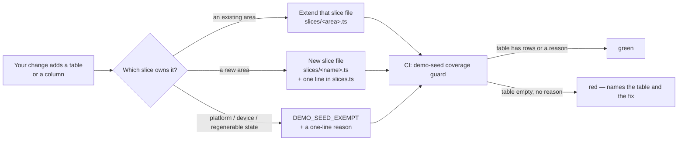

# Demo seed — the demo school every change must keep complete

Biddaloy has **two** seeds. They have different jobs, and this doc is about the
second one.

|            | Dev seed                                        | Demo seed                                                                                        |
| ---------- | ----------------------------------------------- | ------------------------------------------------------------------------------------------------ |
| Command    | `yarn workspace @biddaloy/server seed`          | `yarn workspace @biddaloy/server seed:demo`                                                      |
| Code       | `server/src/scripts/seed.ts`, `seed.util.ts`, … | `server/src/scripts/demo-seed/` (one file per _slice_)                                           |
| For        | e2e tests and local dev                         | the public demo site, staging, load tests, screenshots                                           |
| School     | `default-school` + 3 small test schools         | **Bangladesh Model School & College** — 3 branches (`bmsc-primary`, `bmsc-high`, `bmsc-college`) |
| Size       | 18 students, one month of attendance            | 1,200 students, ~55 staff, **10 years** of history (`--scale` changes the size)                  |
| Dates      | some fixed (`2026-03`)                          | every date derived from `--anchor` (default: today)                                              |
| Pinned by  | `e2e/seed-contract.ts` — don't rename anything  | `server/src/modules/demo/demo-accounts.ts` (the demo login cards)                                |
| Guarded by | review only                                     | a CI **coverage guard**: every table must have demo rows                                         |

The demo seed is built by Epic 58.0 (#1732). The rule below applies **today**;
the tooling it points at lands in Epic 58 Wave 1 (#2159 runner, #2161 guard).

## The rule

> **Any change that adds or changes a database table or column also updates
> the demo seed so the feature has realistic data in the demo school.**
> That includes epics, single tickets and bug fixes.

Why: the demo site is how customers first see Biddaloy. A feature with an empty
screen in the demo looks broken, and nobody notices until a sales call.



### Until the guard is on main (before #2161 merges)

There is nothing to run yet. Instead:

1. In your PR description, add a line: `Demo seed: <entity> — needs rows for <story>`.
2. Comment the same line on #2177 (Epic 58's wave-close). Epic 58 absorbs
   everything that lands before its Wave 3 (decision D39 on #1732).

### After the guard is on main

1. Find the slice that owns your area. The table of slices and the entities
   each one `covers` is in `server/src/scripts/demo-seed/slices.ts`.
2. Add your entity to that slice's `covers` list and write its rows in `run()`.
   Use a new slice file if no area fits.
3. Run the guard locally:
   `yarn workspace @biddaloy/server vitest run src/scripts/demo-seed/demo-seed.coverage.integration.spec.ts`.

A minimal slice looks like this:

```ts
// server/src/scripts/demo-seed/slices/notices.ts
export const slice: DemoSlice = {
  name: 'notices',
  covers: [Notice, NoticeAudience],
  run: async (ctx) => {
    for (const tenantId of ctx.ids.tenants) {
      const today = ctx.anchor;                      // never a literal date
      await ctx.app.get(NoticesService).create(...); // "today" via the real service
      await insertChunked(ctx.ds.getRepository(Notice), history(ctx, tenantId), 1000); // history in bulk
    }
  },
};
```

## Safety rules for anyone touching the demo seed

These hold for every slice, forever. Reviewers reject a diff that breaks one.

| #   | Rule                                                                                                                                                                                                                                   | Why                                                                                            |
| --- | -------------------------------------------------------------------------------------------------------------------------------------------------------------------------------------------------------------------------------------- | ---------------------------------------------------------------------------------------------- |
| 1   | **No literal dates.** Derive every date from `ctx.anchor` (`dates.ts` helpers).                                                                                                                                                        | The site resets nightly; a fixed date goes stale on day 2. #1981 is this bug in the dev seed.  |
| 2   | **Fresh DB only.** No "find or update" logic, and never move existing rows to make dates fit.                                                                                                                                          | The runner refuses a non-empty DB. Atomicity comes from building a side DB and swapping it in. |
| 3   | **Randomness only from `ctx.rng`.** No `Math.random()`, no `Date.now()`.                                                                                                                                                               | Same anchor + same scale gives the same business data, so a failure is reproducible.           |
| 4   | **"Today" and anything with a hard invariant goes through the real service** (routine slots, fee generation, payments, promotions, result publishing). **Bulk history** uses `insertChunked` with the same columns the service writes. | Services enforce rules a raw insert skips (e.g. teacher double-booking).                       |
| 5   | **No real people or contacts.** Names come from `seed-data/demo-bn/`; phones run from `01700-000001`, emails end in `@bmsc.example`.                                                                                                   | The site is public.                                                                            |
| 6   | **Never call an SMS, email or push provider directly.** Messages go through the normal path; `DEMO_MODE` turns them into log rows.                                                                                                     | Nothing may leave the demo server.                                                             |
| 7   | **Stay inside the `bmsc-*` tenants.** Read ids from `ctx.ids`; never look rows up by display name.                                                                                                                                     | Tenant isolation, and names change.                                                            |
| 8   | **Money adds up.** Per student: fees = allocations + discounts + waivers + outstanding. The validator checks it.                                                                                                                       | Finance screens are the first thing a principal opens.                                         |
| 9   | **Stay inside the time budget.** The PR CI run (scale 0.05, 2 years) must stay under 90 s. The nightly full run (scale 1, 10 years) must stay under 20 min.                                                                            | A slow seed misses the 02:00 swap.                                                             |
| 10  | **Exempt only with a reason** in `DEMO_SEED_EXEMPT` (device-bound, platform-only, regenerable).                                                                                                                                        | An exemption without a reason is a hidden empty screen.                                        |
| 11  | **Fees, payments and invoices slices are money-tier review.**                                                                                                                                                                          | Same tier as the fees module itself.                                                           |
| 12  | **Don't change the dev seed to feed the demo**, and don't change the demo seed to feed e2e.                                                                                                                                            | They are pinned by different contracts.                                                        |

## What the CI guard checks

The guard is `server/src/scripts/demo-seed/demo-seed.coverage.integration.spec.ts`.
It is built in #2161 and is a copy of the workbook coverage guard
(`server/src/modules/workbook/codec/entity-coverage.ts`).

- Every entity in `ALL_ENTITIES` is covered by exactly one slice, or is exempt with a reason.
- A covered entity has at least one row after a small run.
- A slice still marked `owedBy: '<ticket>'` has no rows yet. When it gets rows, the `owedBy` line goes.
- `ALL_ENTITIES` matches the `@Entity` files on disk.
- The invariant validator finds nothing. It checks: no double-booked teacher (also across branches), one current year per branch, money sums, attendance only on school days, every demo login works.
- The run stays inside the time budget.

## Where this rule is also written

- Root `CLAUDE.md`, "Seed data rule".
- `.claude/skills/plan-epic/SKILL.md`: every epic that adds a table carries a demo-seed slice ticket.
- `.claude/agents/issue-reviewer.md`: a diff that changes the schema without a slice change is a finding.
- `docs/architecture/15-ux-principles.md` §2: the "Seed data" registry row.
