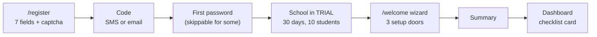
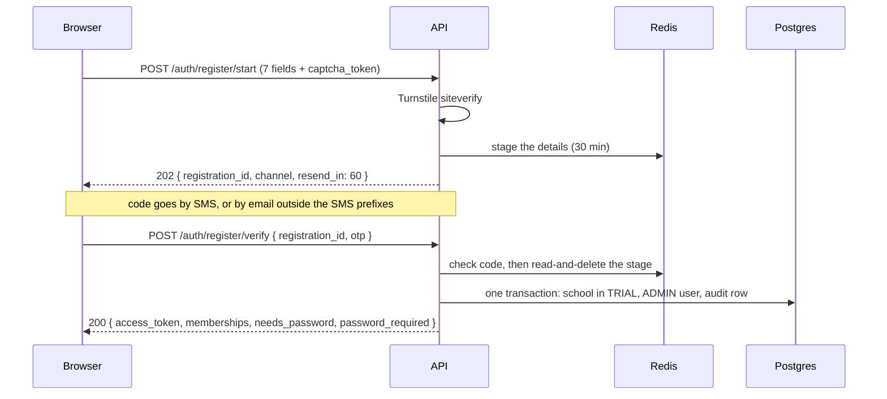
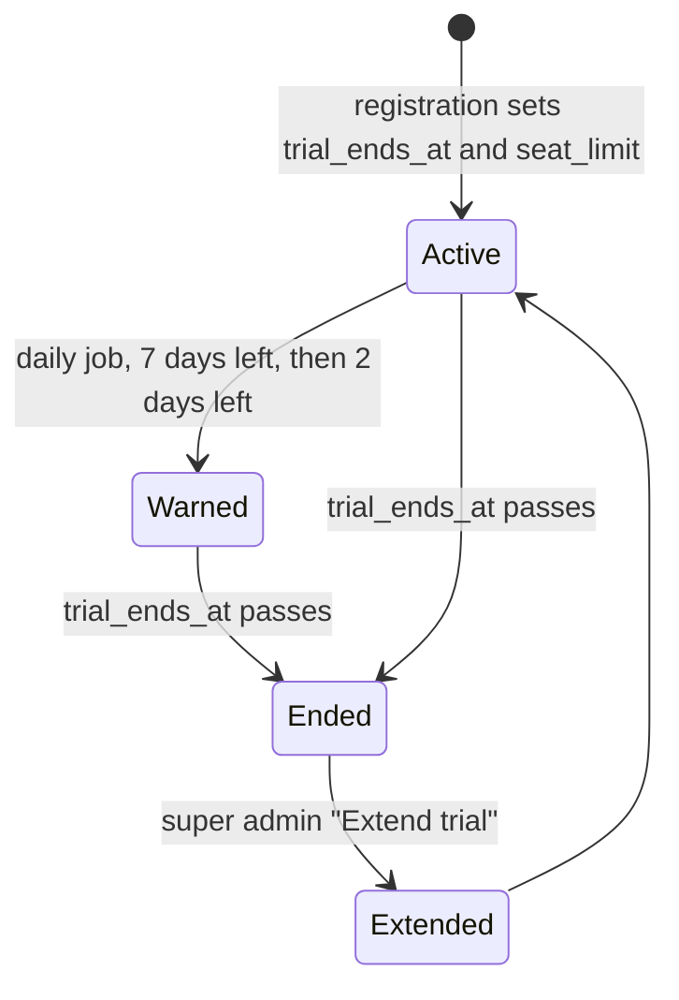
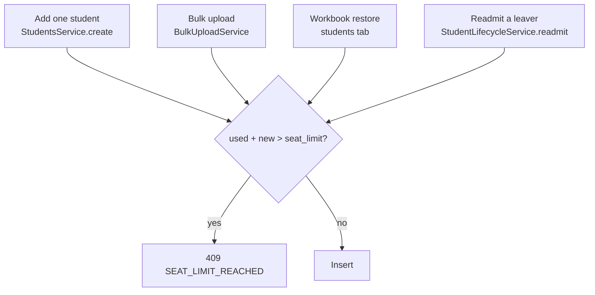
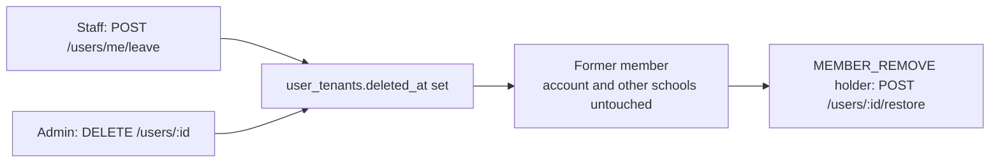

# Onboarding, registration, trial and sign-in methods

How a stranger becomes the admin of a working school, and what keeps the free
trial honest. Epic 13.0 (#416). Decisions D1–D42 live on the epic.

## The journey



Nothing is created until the code is proven. Until then the form answers sit
in Redis for 30 minutes under `registration:<uuid>`
(`server/src/modules/registration/registration-staging.service.ts`).

`/register` and `/auth/social/done` are public paths
(`client-admin/src/routes/__root.tsx`, `PUBLIC_PATHS`).

## Registration: `/register/start` → `/register/verify`

The routes are `POST /auth/register/start`, `/resend` and `/verify`
(`server/src/modules/registration/registration.controller.ts`). They sit under
`auth/` so the social-ticket cookie, scoped to `/api/v1/auth`, reaches `verify`.



Example `start` body (`RegisterStartDto`):

```json
{
  "admin_name": "Rahim Uddin",
  "school_name": "Green Valley School",
  "country_code": "BD",
  "address": "Road 4, Dhanmondi, Dhaka",
  "phone": "01712345678",
  "email": "rahim@example.com",
  "terms_accepted": true,
  "captcha_token": "<Turnstile token>"
}
```

| Rule | What happens | Where |
| --- | --- | --- |
| Code channel (D31) | A phone with an allowed prefix gets an SMS. Any other phone gets the code by email. Env `OTP_SMS_ALLOWED_PREFIXES`, default `+880`. | `registration.service.ts` `start` |
| Resend | 60 s cooldown, at most 3 extra codes per stage. | `MAX_RESENDS` |
| Existing account (D30) | After the code, the new school is attached to that user. One open trial per user, else `409 TRIAL_ALREADY_OPEN`. | `createSchool` |
| Contact held by someone else | `409 CONTACT_IN_USE`. If any school of the user turned code sign-in off: `409 SIGN_IN_REQUIRED`. | `createSchool` |
| Consent (D24) | `terms_accepted_at` and `country_code` go into one `Registration` audit row. | `createSchool` |
| Country (D35) | The form preselects from `?country=`, else the browser time zone. There is no IP lookup. | `register-details-form.tsx` |

`CONTACT_IN_USE` and `SIGN_IN_REQUIRED` reveal that an account exists. That is
a known, accepted product call. See [08-security.md](08-security.md).

The register form sends the phone as typed (`01712345678`), the same string
sign-in uses. The server does not normalise it yet: #1701.

## Password step and the first-password gate

After `verify` (and after code sign-in) the API says whether a password is
wanted:

- `needs_password`: the account has no password.
- `password_required`: no password, a staff role, and no linked social account
  (D34: a staff user who joined with Google may skip).

The gate is client-side. It is remembered per account (the token `sub`) and
cleared on logout and when a password is set. The server does not enforce it
yet: #1697. Setting it is `POST /account/first-password` (`409` if a password
already exists). The account API has no `has_password` flag yet: #1694.

| Account's roles | Rules | Example that passes |
| --- | --- | --- |
| Any staff role, or a mix | 8+ characters, upper, lower, digit, special | `Green#2026` |
| Only PARENT / STUDENT | 8+ characters, a digit | `sunflower7` |

Strictest wins across all of a user's memberships. The rules apply when a
password is set or changed, never at sign-in, so old passwords keep working
(`server/src/modules/auth/password-policy.ts`,
`shared/src/auth/password-rules.ts`). A failure is
`400 PASSWORD_TOO_WEAK` with `details.failed` listing the rule ids.

## The trial



- Length and seats are env values: `TRIAL_DAYS` (default 30) and
  `TRIAL_SEAT_LIMIT` (default 10) (D32).
- A daily job (`server/src/modules/schools/trial/trial.service.ts`, `runDaily`)
  warns at 7 and 2 days left. Sent warnings are remembered in
  `schools.onboarding.trial_warnings`.
- An ended trial is a suspension, not a delete (D39). The job sets
  `status = SUSPENDED`, `status_reason = 'TRIAL_EXPIRED'`. `deleted_at` is
  never touched.
- The admin then sees "your trial has ended, contact us" (D33).
- Extend is `PATCH /schools/:id/trial` with `{ days, seat_limit?, reason }`.
  Platform SUPER_ADMIN only, audited. `seat_limit: null` means unlimited.

### The support link

Every request is refused once a trial has ended, so the ended screen cannot ask
the server for the link. The client bundle carries it, set at build time:

```text
SUPPORT_CONTACT_URL=https://example.com/support   # server env; Compose also uses it below
VITE_SUPPORT_URL=https://example.com/support       # build arg; Compose fills it from SUPPORT_CONTACT_URL
```

`isSafeSupportUrl` (`ui/src/utils/support-url.ts`) lets only `https:` and
`mailto:` through. `GET /onboarding/status` also returns the server's
`SUPPORT_CONTACT_URL` as `support_url`. Under Compose an unset value arrives as
`""`, not `null`: #1702.

## Seat limit (D29)

A seat is a student with `enrollment_status = ACTIVE` and no `deleted_at`.
`schools.seat_limit = NULL` means unlimited. Every path that adds an active
student takes the school row lock (`FOR NO KEY UPDATE`) first, so two parallel
adds cannot both pass the limit
(`server/src/modules/schools/trial/seat-limit.service.ts`).



The ticket names three guarded paths (create, bulk upload, workbook restore).
The code guards a fourth: a readmit takes a seat too
(`student-lifecycle.service.ts:167`).

Example (limit 10, 9 in use, an upload of 3):

```json
{
  "message": "Seat limit reached: 9 of 10 seats in use",
  "details": { "code": "SEAT_LIMIT_REACHED", "used": 9, "limit": 10, "requested": 3 }
}
```

## Welcome wizard and checklist

`/welcome` opens once for an ADMIN of an unfinished school, and only when they
land on the dashboard (D36, `welcome-gate.ts`). The migration
`1791400000000-OnboardingFoundation` marks every school that existed then as
finished.

The three doors:

- **Guided**: name + logo, curriculum preset, sections per class.
- **Excel**: the starter workbook, see [14-school-workbook.md](14-school-workbook.md).
- **Do this later**.

Progress lives in the `schools.onboarding` jsonb column, not in
`schools.settings`, which goes through encryption, masking and a DTO whitelist
(D42).

### `GET /onboarding/status`

ADMIN or SUPER_ADMIN, with the tenant header
(`server/src/modules/onboarding/onboarding.controller.ts`).

```http
GET /api/v1/onboarding/status
X-Tenant-ID: <school id>
Authorization: Bearer <token>
```

```json
{
  "finished_at": null,
  "dismissed_at": null,
  "seen": true,
  "setup_path": "guided",
  "items": [
    { "id": "profile", "done": true },
    { "id": "structure", "done": true },
    { "id": "sections", "done": false },
    { "id": "students", "done": false },
    { "id": "staff", "done": false },
    { "id": "feeStructures", "done": false },
    { "id": "guardianInvites", "done": false },
    { "id": "messageSettings", "done": false }
  ],
  "counts": { "classes": 4, "sections": 0, "students": 0, "staff": 1 },
  "trial": {
    "ends_at": "2026-11-05T09:30:00.000Z",
    "days_left": 30,
    "seats": { "used": 0, "limit": 10 }
  },
  "support_url": "https://example.com/support"
}
```

`trial` is `null` for a school that never had one. `seats.limit` is `null` for
unlimited. `seen` is true when the caller is in `onboarding.seen_by`.
`PATCH /onboarding` takes `setup_path`, `finished`, `dismissed`, `seen` and
writes nothing else.

### How each checklist item is derived

Items are computed from real rows on every call, never stored
(`onboarding.service.ts`, `getStatus`). A class made outside the wizard still
ticks `structure`.

| Item | Done when |
| --- | --- |
| `profile` | the school has `name_bn` or a logo |
| `structure` | 1+ class |
| `sections` | 1+ class section |
| `students` | 1+ student |
| `staff` | 2+ distinct people with an employee role (COMMITTEE does not count; ADMIN + TEACHER is one person) |
| `feeStructures` | 1+ fee structure |
| `guardianInvites` | 1+ PARENT membership |
| `messageSettings` | the SMS or the email communications setting is on |

## People who leave



The membership row is soft-deleted, never removed. Details in
[02-auth-and-multitenancy.md](02-auth-and-multitenancy.md).

## Where the plan and the code differ

| Plan said | What was built | Why |
| --- | --- | --- |
| Ended trial is stored as `deleted_at` | `SUSPENDED` + `TRIAL_EXPIRED` (D39) | suspension is already enforced everywhere and is reversible |
| Country from an IP lookup | `?country=`, else browser time zone (D35) | no IP service to depend on |
| Three guarded seat paths | four: readmit checks too | a readmit takes a seat |
| Google and Facebook at sign-up | Google only. Facebook (#1647) is **planned, not built**: no provider class exists | Meta review must not block (D9) |

## Open follow-ups

Not done. Do not rely on them.

| Issue | What |
| --- | --- |
| #1694 | account API has no `has_password` flag |
| #1695 | social link callback always returns to `/security` |
| #1696 | staff bulk-upload errors carry no row codes |
| #1697 | enforce `password_required` on the server |
| #1698 | server-side `create_only` for the Excel restore |
| #1700 | captcha rejection needs its own error code |
| #1701 | normalise phone numbers on the server |
| #1702 | `support_url` is `""`, not `null`, under Compose |
| #1703 | "registration expired" needs its own error code |
| #1704 | platform schools list: "Trial ended" label vs the Ended / Active filters |
