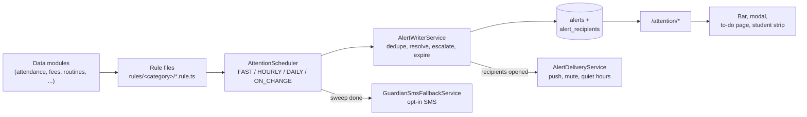
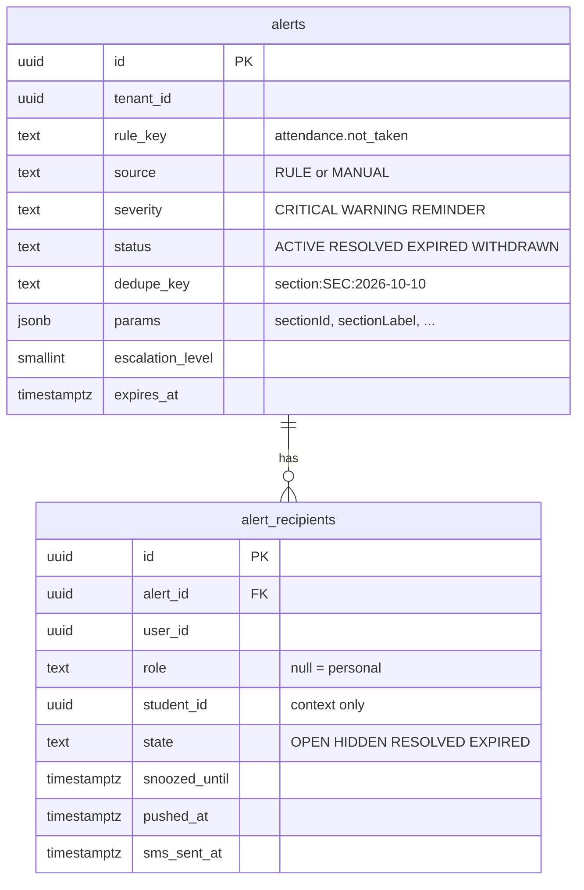
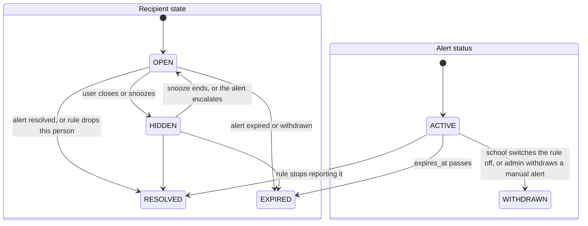
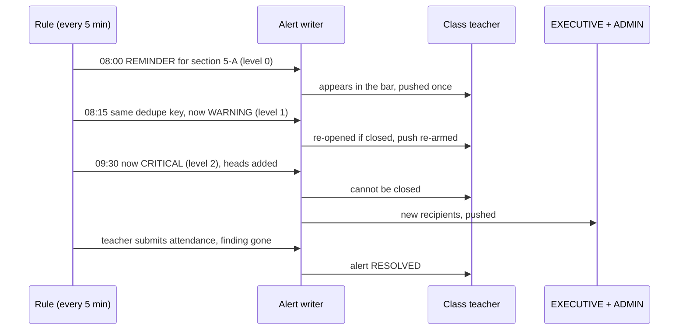
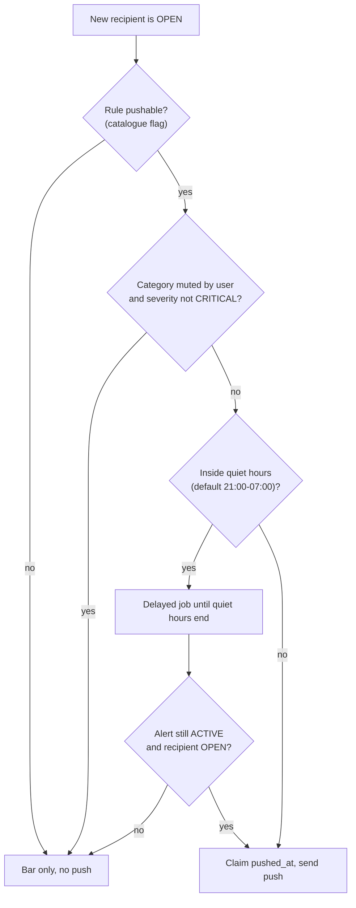
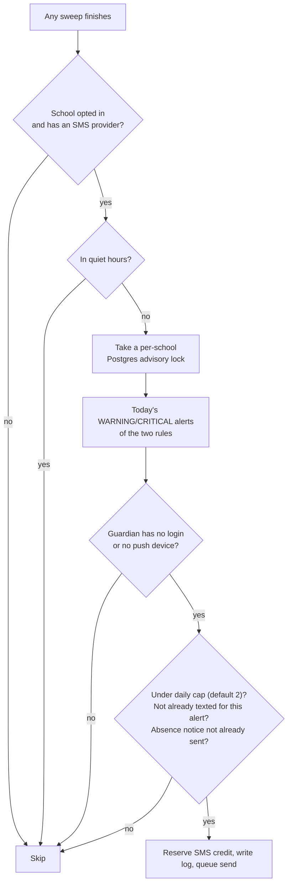
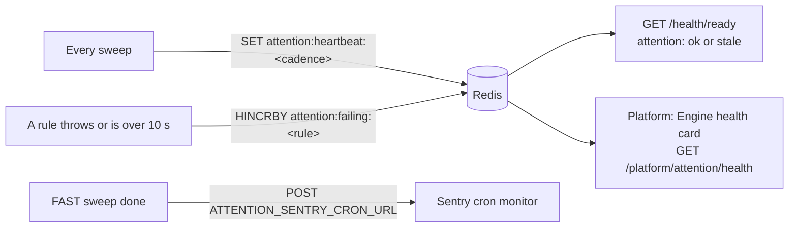
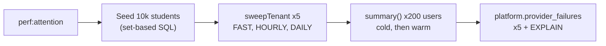

# Attention: alerts, the bar, and the to-do list

> Epic 67 (#2043). This doc describes what is **on the branch**, not the
> original plan. Where the code differs from the plan, the "Where the plan and
> the code differ" section says so, with the reason.

## What it is

The **attention engine** watches the school's data and tells each person what
needs them _now_. A teacher who has not taken attendance sees it. A parent whose
child is absent sees it. Every shell (staff, portal, platform) shows the same
thing: a thin **bar** under the top bar, a **modal** that opens from it, and a
full **to-do / history page**.


Three words to know:

- **Rule** — one small class that answers "who needs to do what right now?".
  Example: `attendance.not_taken`.
- **Alert** — one row in `alerts`: "section 5-A has no attendance today".
- **Recipient** — one row in `alert_recipients`: "teacher Rahim has this alert,
  and has/hasn't closed it". One alert has many recipients.

## Engine flow



The real files, all under `server/src/modules/attention/`:

| Step                       | File                                                                                         |
| -------------------------- | -------------------------------------------------------------------------------------------- |
| Rule list, rule base       | `rules/rule-registry.service.ts`, `rules/rule.types.ts`, `rules/attention-rule.decorator.ts` |
| Context handed to a rule   | `rules/rule-context.service.ts`                                                              |
| Schedules and sweeps       | `engine/attention-scheduler.ts`                                                              |
| Turning findings into rows | `engine/alert-writer.service.ts`                                                             |
| "Run this rule soon"       | `engine/attention-events.ts` (`emitRecheck`)                                                 |
| Read API                   | `api/attention.controller.ts`, `api/attention-query.service.ts`                              |
| Push                       | `delivery/alert-delivery.service.ts`                                                         |
| Guardian SMS               | `delivery/guardian-sms-fallback.service.ts`                                                  |
| Manual alerts, report      | `manual/*`, `report/*`                                                                       |
| Health                     | `health/attention-health.service.ts`, `health/platform-attention-health.controller.ts`       |

Rule keys, severity, cadence, roles and flags live in one table shared by
server and UI: `shared/src/attention/rule-catalogue.ts`.

On the front end: hooks in `ui/src/hooks/attention/`, components in
`ui/src/components/attention/` (bar, modal, item card, student strip), screens in
`client-admin/src/features/attention/`.

## The two tables



There can be only **one ACTIVE alert per tenant + rule + dedupe key**. The
database enforces it with a partial unique index
(`UQ_alerts_active_dedupe ... WHERE status = 'ACTIVE'`). That is why a rule that
runs every 5 minutes never creates the same alert twice.

Both tables are derived data. No soft delete. The migration is
`server/src/migrations/1791600000000-AttentionAlerts.ts`.

## States

An **alert** has one status. A **recipient** has one state. They move
separately.



| What the user does            | What happens                                                                                                                                                   |
| ----------------------------- | -------------------------------------------------------------------------------------------------------------------------------------------------------------- |
| Opens the modal               | `POST /attention/items/seen` stamps `seen_at`. State stays `OPEN`.                                                                                             |
| Closes a WARNING / REMINDER   | `POST /attention/items/:id/hide` -> `HIDDEN`. Other recipients are untouched.                                                                                  |
| Snoozes                       | `POST /attention/items/:id/snooze` `{ "choice": "TWO_HOURS" }` -> `HIDDEN` with `snoozed_until`. Other choices: `TOMORROW_MORNING`, `NEXT_SCHOOL_DAY`, `DATE`. |
| Tries to close a CRITICAL     | `400 not closable`. Critical items cannot be hidden (D4).                                                                                                      |
| Does nothing, fixes the cause | The next rule run no longer reports it -> alert `RESOLVED`, recipient `RESOLVED`.                                                                              |
| Alert escalates               | Everyone still `OPEN` or `HIDDEN` goes back to `OPEN` and the push is re-armed.                                                                                |

A snooze that ends wakes the item quietly. It is not pushed again (D28).

Someone else's row answers `404`, never `403`, so row ids do not leak.

## Cadences

There are four ways a rule runs. Each rule lists its cadences in the catalogue.

| Cadence     | When it runs                                                                                                                 | Example rules                                  | Guard                                                                                                                                      |
| ----------- | ---------------------------------------------------------------------------------------------------------------------------- | ---------------------------------------------- | ------------------------------------------------------------------------------------------------------------------------------------------ |
| `FAST`      | every 5 minutes                                                                                                              | `attendance.not_taken`, `class.starting`       | Skipped unless today is a working day **and** it is school hours. Expiry and snooze wake-ups still run first.                              |
| `HOURLY`    | every 60 minutes                                                                                                             | `comms.sms_credit_low`, `system.backup_failed` | None.                                                                                                                                      |
| `DAILY`     | a tick every 15 minutes; a rule fires once it is past `dailyAt` (default 07:00), or `eveningAt` (17:00) for "tomorrow" rules | `fees.overdue_family`, `exams.tomorrow`        | Redis marker `tenant:<id>:attention:daily:<rule>:<date>` set with `NX`. A failing rule is retried on the next tick, at most 3 times a day. |
| `ON_CHANGE` | 5 seconds after the owner service calls `emitRecheck`                                                                        | `leave.staff_pending`, `results.published`     | Bursts for the same tenant + rule collapse into one run (BullMQ deduplication).                                                            |

The DAILY sweep also **prunes** old alerts once a day (see Retention).

Three schedulers are registered with `upsertJobScheduler`, so a restart never
duplicates them. Tenants run 4 at a time with a little random jitter.

## Escalation

`attendance.not_taken` is the example. It turns up the heat as the morning goes
on. The times below use the defaults (first bell 08:00, grace 15 minutes, absence
cut-off 09:30). Each school's own times are used.



The ladder is in `attendanceStep()` in
`rules/attendance/attendance-not-taken.rule.ts`. `pickEscalation()` in
`rules/rule.types.ts` picks the highest step reached.

**Leave delegation (D22).** If every class teacher of a section is on approved
leave, the alert goes to the assistant teachers who are not on leave, plus
whoever is substituting for the class teacher's periods that day.

## Delivery

Push only. The engine never sends SMS from this path.



CRITICAL alerts ignore the mute. Quiet hours still hold them until the window
ends. Details: `delivery/alert-delivery.service.ts`.

**Who sets the mute.** Each user mutes categories for themselves. The mute is
stored on the account, not the school membership, so it applies in every
school the user belongs to. Quiet hours are a school setting and are only shown
here.

| Who            | Page              | Route                                               |
| -------------- | ----------------- | --------------------------------------------------- |
| Staff          | `/security`       | `GET` / `PATCH /users/me/preferences/notifications` |
| Parent/student | `/portal/account` | same                                                |

```http
PATCH /users/me/preferences/notifications
{ "mutedCategories": ["HOMEWORK"] }

200 { "mutedCategories": ["HOMEWORK"], "quietHours": { "start": "21:00", "end": "07:00" } }
```

The user id comes from the login token, so a user can only change their own mute.

### Guardian SMS fallback (D29)

Some guardians have no login, or never turned push on. For two rules
(`child.absent_today`, `fees.overdue_family`) a school can opt in to text them.



Real example of the idempotency key: `attention:5d0c...:9a41...`
(`attention:<alertId>:<guardianId>`). A replay hits the unique index on
`communication_logs (tenant_id, reference_key)` and does nothing.

## Manual alerts and the report

An ADMIN or EXECUTIVE can send a one-off alert to a chosen audience. Four routes,
all under `/attention/manual`, all needing the `ALERT_SEND` permission:

| Route                            | Does                                         |
| -------------------------------- | -------------------------------------------- |
| `POST /attention/manual`         | Send (WARNING or REMINDER only).             |
| `POST /attention/manual/preview` | Count how many people the audience reaches.  |
| `GET /attention/manual`          | The school's sent alerts, newest first.      |
| `DELETE /attention/manual/:id`   | Withdraw from every recipient (`WITHDRAWN`). |

Request and response:

```http
POST /attention/manual
{
  "severity": "WARNING",
  "title": "Rain: buses leave early",
  "body": "Buses leave at 1 pm today. Parents, please be at the gate.",
  "actionUrl": "/portal",
  "audience": { "roles": ["PARENT"], "guardiansOfSectionIds": ["<section uuid>"] },
  "expiresOn": "2026-10-12"
}

201 { "id": "<alert uuid>", "severity": "WARNING", "title": "Rain: buses leave early", ... }
```

Limits: 20 manual sends per school in any rolling 24 hours, end date at most 30
days out, `actionUrl` must be an app-relative path, 200 ids per audience list.
The cap check runs inside the same lock as the insert, so two parallel sends
cannot both slip under it. Withdrawn alerts still count toward the 20.

The send route has two different 429s: the per-minute request throttle, and the
daily cap. The daily cap's error carries `details.code: "MANUAL_DAILY_LIMIT"`
(with `details.limit`), so the page can tell them apart. The two service 400s
carry `MANUAL_NO_RECIPIENTS` and `MANUAL_EXPIRES_RANGE`.

The two pages:

| Page                         | Permission          | What it shows                                       |
| ---------------------------- | ------------------- | --------------------------------------------------- |
| `/communications/send-alert` | `ALERT_SEND`        | The send form (full page) and the sent-alerts list. |
| `/reports/alerts`            | `ALERT_REPORT_READ` | The monthly report with a CSV download.             |

**The report** (`GET /attention/report?month=2026-10`, `ALERT_REPORT_READ`, add
`format=csv` for a file) counts rule alerts per rule and per section. The
section is read from **`params.sectionId`** (and `params.sectionLabel`). An
alert without it counts in the "no section" column. So a rule that is about a
section must put `sectionId` in its `params`.

## Monitoring



- **Heartbeat** per cadence: `attention:heartbeat:FAST` holds
  `{"at":"2026-10-10T08:15:02Z","durationMs":412,"tenants":3,"failures":0}`.
- **Stale** means: missing, older than 15 minutes, or every tenant failed.
- **`/health/ready`** adds `attention: "ok" | "stale"`. A stale engine makes the
  status `degraded`, never `fail`, so the API stays in the load balancer.
- **Rule budget:** each rule gets 10 seconds. A rule that throws or times out is
  logged and counted under `attention:failing:<rule>` (kept 24 hours). Other
  rules and other schools carry on. Each tenant is its own try/catch.
- **Sentry cron check-in** after each FAST sweep, if `ATTENTION_SENTRY_CRON_URL`
  is set. Unset means no check-ins.
- **Platform card** (super admin, Schools list): last sweep, duration and failing
  rules per cadence.

Runbook: [12-operations.md §3.4](12-operations.md#34-attention-engine-stale-or-slow).

## Retention (D31)

Closed alerts (`RESOLVED`, `EXPIRED`, `WITHDRAWN`) are deleted after **12
months** by the DAILY sweep (`AttentionScheduler.prune`). Their recipients go
with them (cascade). `ACTIVE` alerts are never pruned.

The school workbook ([14-school-workbook.md](14-school-workbook.md)) does **not**
include these tables. They are derived data: after a restore, the next sweep
rebuilds what is current.

## How to add a rule

Example: `staff.invite_pending`, the shortest shipped rule
(`server/src/modules/attention/rules/setup/staff-invite-pending.rule.ts`).

1. **Catalogue.** Add the key to `ALERT_RULE_KEYS` and one row to `ROWS` in
   `shared/src/attention/rule-catalogue.ts` (category, severity, cadence, roles,
   pushable, canDisable, guardianSmsFallback).
2. **Rule file.** Create `rules/<category>/<key>.rule.ts` with `@AttentionRule()`,
   `meta`, `messages` in **both** `bn` and `en`, and `evaluate(ctx)`. Use set
   based SQL: one query for the whole school, never one per student.
3. **Register.** Add the class to `providers` in
   `rules/<category>/<category>-rules.module.ts` (for example
   `setup-rules.module.ts`). That module is already imported by
   `attention.module.ts`.
4. **Params.** Put `sectionId` / `sectionLabel` / `studentId` / `studentName` in
   `params` when they apply. The API filters and the report groups by them.
5. **Recheck.** For an `ON_CHANGE` rule, the owner service calls
   `emitRecheck(attentionEvents, { tenantId, ruleKey, actorUserId })` **after**
   its own transaction commits (`engine/attention-events.ts`).
6. **Spec.** Copy the spec of a shipped rule in the same folder. Test one firing
   case and one empty case.
7. **Seed.** Make `yarn seed` produce one firing case, so a developer sees it.

A trimmed excerpt of the real file:

```ts
@AttentionRule()
export class StaffInvitePendingRule implements AttentionRuleShape {
  readonly meta = alertRuleMeta('staff.invite_pending');
  readonly messages = {
    en: {
      title: '{count} staff have not accepted their invitation',
      why: 'They cannot sign in until they open the invitation link and set a password.',
      steps: ['Open Staff.', 'Find the people marked as invited.', 'Resend the invitation ...'],
      action: 'Open staff list',
    },
    bn: {/* same four keys in Bangla */},
  };

  constructor(@InjectDataSource() private readonly dataSource: DataSource) {}

  async evaluate(ctx: RuleContext): Promise<RuleFinding[]> {
    const [{ n }] = await this.dataSource.query(/* count invited, not yet signed in */);
    if (n === 0) return []; // nothing wrong -> alert resolves
    const recipients = await this.admins(ctx.tenantId);
    if (!recipients.length) return [];
    return [
      {
        dedupeKey: 'school:' + ctx.tenantId,
        subject: { type: 'school', id: ctx.tenantId },
        params: { count: n },
        actionUrl: '/staff',
        recipients,
      },
    ];
  }
}
```

One `RuleFinding` value, as the writer sees it:

```json
{
  "dedupeKey": "school:2f0d...",
  "subject": { "type": "school", "id": "2f0d..." },
  "params": { "count": 3 },
  "actionUrl": "/staff",
  "recipients": [{ "userId": "8c11...", "role": "ADMIN" }]
}
```

The rule returns the **whole picture right now**. The writer works out what is new,
what changed and what disappeared. A rule never writes to the tables itself.

## Performance

Measured by hand, never in CI (#2094). Both runs of the same script on identical
data are shown, because the numbers moved a lot between them.

**How to run it again.** It seeds 10,000 students into the default school, so it
only runs on a throwaway database whose name ends in `_perf`:

```bash
TEST_ENV_RUN_ID=my_perf yarn test-env run -- sh -c \
  "yarn workspace @biddaloy/server migration:run && \
   yarn workspace @biddaloy/server seed && \
   yarn workspace @biddaloy/server perf:attention --confirm-db=biddaloy_test_run_my_perf"
```

The script is `server/src/scripts/perf-attention.ts`. It refuses without
`--confirm-db=<name>` or if the name does not end in `_perf`.

**Environment.** 2026-10-10, Apple M1 Pro (10 cores), 16 GB RAM, PostgreSQL 16.14,
Node 24.20, git `fbab99403`. Other agents were running tests on the same Docker
Postgres at the same time, so treat the timings as "about", not exact.

**Data.** 10,018 students in 48 sections, 500,070 `communication_logs` rows, a
routine for every section, 20 sections with no day register today, 5 % of the
others absent, 200 homework assignments due today (30 % not submitted), 1,000
overdue fees. After the sweeps the school had about 7,800 active alerts (21
`attendance.not_taken`, 240 `child.absent_today`, 7,500
`guardian.profile_incomplete`) and no failing rule. `homework.not_submitted`
raised nothing on this data, so its 130 ms is the cost of its queries only.



| Measurement                                  | Budget    | Measured                                                        | Date       |
| -------------------------------------------- | --------- | --------------------------------------------------------------- | ---------- |
| FAST sweep per school (10k students)         | <= 300 ms | **Missed.** steady runs 315-553 ms (see below)                  | 2026-10-10 |
| HOURLY sweep, same school                    | none yet  | steady 84-118 ms                                                | 2026-10-10 |
| DAILY sweep, same school                     | none yet  | first run (writes 7,500 alerts) 17-21 s; steady 1.0-2.1 s       | 2026-10-10 |
| `GET /attention/summary` p95, cold cache     | <= 150 ms | **Met.** 4.1 ms and 10.7 ms (two runs); warm p95 2.2 and 5.5 ms | 2026-10-10 |
| `platform.provider_failures` (500k log rows) | none yet  | 34 ms median, 49 ms max (run 1); 56 ms and 151 ms (run 2)       | 2026-10-10 |

All five runs of each sweep, in milliseconds (the first run writes the alerts and
warms the caches):

| Run                  | 1     | 2    | 3    | 4    | 5    |
| -------------------- | ----- | ---- | ---- | ---- | ---- |
| FAST, `test-env run` | 1889  | 1423 | 553  | 545  | 451  |
| FAST, second run     | 937   | 555  | 350  | 339  | 315  |
| HOURLY, first run    | 215   | 96   | 86   | 84   | 90   |
| HOURLY, second run   | 184   | 118  | 98   | 91   | 86   |
| DAILY, first run     | 17014 | 1056 | 1031 | 1350 | 1852 |
| DAILY, second run    | 21068 | 2087 | 1355 | 1304 | 1787 |

**What this says.**

- **FAST misses its budget.** The steady path is 315-553 ms against 300 ms.
  Four rules are most of it: `class.starting` (178 ms), `homework.not_submitted`
  (130 ms), `attendance.not_taken` (65 ms), `routine.uncovered_periods` (39 ms),
  each timed alone in run 1. A sweep is a background job every 5 minutes, so
  users do not wait on it; the budget protects API headroom. Follow-up: #2189.
- **The summary is far inside its budget.** It is one indexed query and a 60 s
  cache. The 200 users were 177 parents, 22 teachers and the 1 admin that had
  open alerts. A user with hundreds of open alerts was not measured.
- **DAILY is slow only once a day, when it writes.** 7,500 parents each get a
  `guardian.profile_incomplete` alert, and the first run inserts all of them.
- **`platform.provider_failures` has no index and scans the table.** EXPLAIN
  shows a parallel sequential scan of `communication_logs`, 8,198 buffers, about
  30 ms at 500k rows. It runs once an hour, once for the whole platform, so
  30-150 ms is fine today. A partial index would help a lot: with
  `ON communication_logs (updated_at) WHERE status = 'FAILED'` on the same data,
  the same query took 0.2-0.4 ms (a bitmap index scan, 74 buffers). The index was
  dropped again; it is **not** in a migration. Add it if `communication_logs`
  grows past a few million rows. The scan grows with the table, the index does not.

### Run-to-run noise

The numbers moved by about 40 % between the two runs (FAST steady 545 ms, then
339 ms) on identical data. That is the shared machine, not the code. The
conclusion (FAST over budget, summary well under) held in both.

## Rules owned by other epics

These keys are reserved in the catalogue so the bar and settings already know
them. The owning epic writes the rule file.

| Key                              | Epic  | What it will say                                |
| -------------------------------- | ----- | ----------------------------------------------- |
| `study_plan.unreported`          | #1828 | A teacher has not reported on a study plan day. |
| `study_plan.behind`              | #1828 | A student is behind their study plan.           |
| `admin.mfa_missing`              | #1752 | An admin has no second sign-in step.            |
| `approvals.pending`              | #1726 | Applications are waiting for a decision.        |
| `print.queue_pending`            | #1373 | Documents are waiting to be printed.            |
| `billing.renewal_due`            | #1649 | The subscription is due for renewal.            |
| `students.at_risk`               | #169  | Students flagged by the performance briefing.   |
| `committee.monthly_report_ready` | #169  | The monthly committee report is ready.          |

## Shipped choices worth knowing (and why)

Where the code differs from what the epic first described, the code is right and
this table says why.

| What the code does                                                                                                                                                                                                                           | Why                                                                                                                                                                                                                                                                                                                      |
| -------------------------------------------------------------------------------------------------------------------------------------------------------------------------------------------------------------------------------------------- | ------------------------------------------------------------------------------------------------------------------------------------------------------------------------------------------------------------------------------------------------------------------------------------------------------------------------ |
| The manual and report routes use **`@RequirePermissions` only**, with no `@Roles`. `/attention/*` has no role guard either; `user_id` scoping decides what a caller sees. The one `@Roles` is `SUPER_ADMIN` on `/platform/attention/health`. | The permission map already gives `ALERT_SEND` and `ALERT_REPORT_READ` to exactly ADMIN and EXECUTIVE. A `@Roles` line would only repeat the map, and the two could drift apart.                                                                                                                                          |
| The guardian SMS fallback takes a Postgres **session advisory lock** per school (`pg_try_advisory_lock`) on a dedicated connection.                                                                                                          | Every server replica listens for "sweep done". Two runs at once would each read the daily cap and reserve credit, and both would send. A transaction lock cannot be held across the long job, and a pooled connection cannot unlock what another connection locked. An overlapping run skips; the next sweep catches up. |
| Every credit reservation gets a fresh **UUID `reference_id`**.                                                                                                                                                                               | Credit settlement caps itself by summing every debit/release that shares a `reference_id`. A second reservation for the same alert (a later sweep, another replica) under the same id would be capped by the first one. The alert id stays in `reference_key` and the log `metadata`.                                    |
| The report reads **`params.sectionId` only**.                                                                                                                                                                                                | One rule, one place to look. A section-scoped rule that forgets `sectionId` lands in "no section", so set it.                                                                                                                                                                                                            |
| e2e specs that call `runRules` by hand first run `app.get(AttentionScheduler).worker.close()` (see `rules/attention-w3.e2e-spec.ts`).                                                                                                        | The app boots its real BullMQ worker. It runs every rule on the real clock and can add alerts (for example `setup.incomplete`) between the spec's write and read, making the spec flaky. Closing the worker leaves the spec as the only writer.                                                                          |
| The escalation times come from the school: first bell of the routine, `attendanceGraceMinutes`, and the absence `cutoffTime`.                                                                                                                | Schools run different shifts. The 08:00 / 08:15 / 09:30 in the diagram are only the defaults.                                                                                                                                                                                                                            |
| A stale engine makes `/health/ready` `degraded`, not `fail`.                                                                                                                                                                                 | A slow engine must not pull the API out of the load balancer.                                                                                                                                                                                                                                                            |
