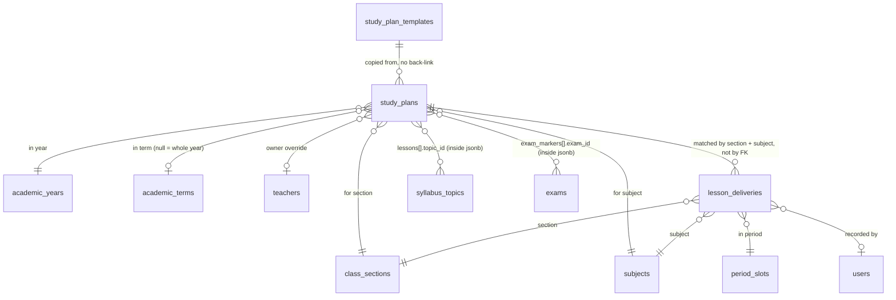
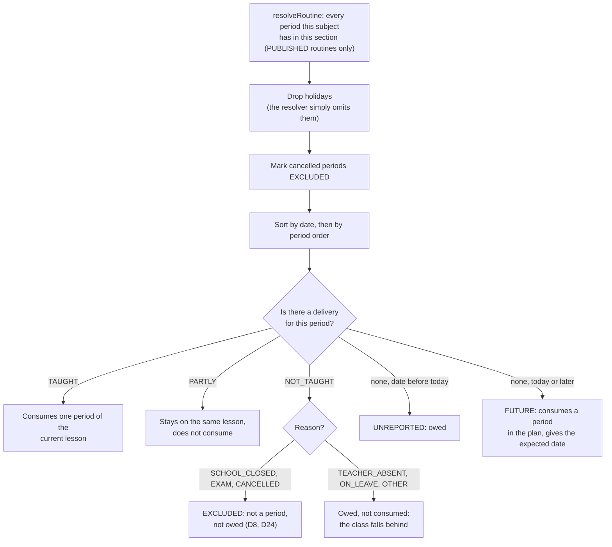
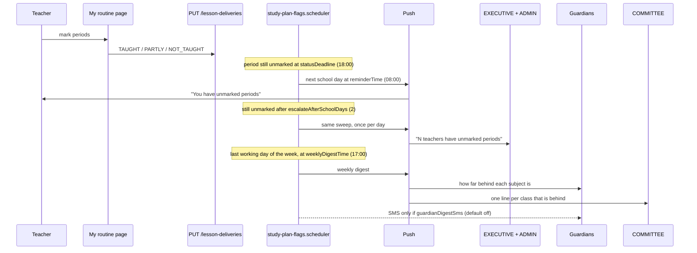
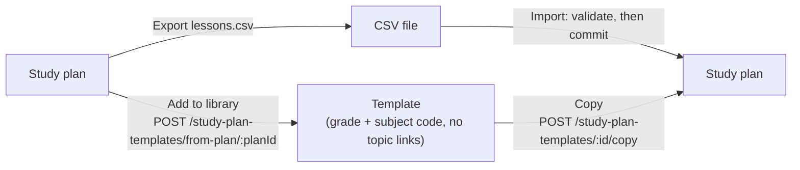

# Study plans

Epic 66.0. Answers: "what will this class learn, in what order, and are we on
track?" A **study plan** is an ordered list of lessons for one section and one
subject (and one term, or the whole year). Teachers mark each period as taught
or not. The system works out the rest: expected dates, how far behind a class
is, and who to nudge.

Server code: `server/src/modules/study-plans/`. Related docs:
[21-routines](03-backend-modules.md#routines-module) gives the periods a plan
is laid over, [16-academic-calendar.md](16-academic-calendar.md) gives holidays,
and [18-staff-attendance-leave.md](18-staff-attendance-leave.md) gives teacher
leave.

## 1. What it is

- One plan per **section × subject × term** (a null term means the whole year).
  A live plan is unique on that key (`UQ_study_plans_scope`, `NULLS NOT DISTINCT`).
- A plan is an ordered list of **lessons**. Each lesson takes 1 or more
  **periods** (1 to 20).
- The plan is owned by whoever the routine says teaches that subject in that
  section. An admin can set `owner_override_teacher_id` to change that.
- **Dates are never stored.** Only what happened ("Tue period 2: partly
  taught") is stored. Every date you see is computed on read.

## 2. Data model



Note: `lesson_deliveries` has **no foreign key to a plan**. A delivery belongs to
a (section, date, period). The plan is found by section + subject. That is why
deleting and re-creating a plan never loses history.

### `study_plans`

`lessons` and `exam_markers` are **jsonb** columns (checked to be arrays).
`lessons` holds the shared `StudyPlanLesson` shape:

```json
[
  {
    "id": "9b1f...",
    "title": "Fractions: adding",
    "periods": 2,
    "topic_id": "c4d2...",
    "notes": "Use paper strips"
  },
  { "id": "5a7e...", "title": "Fractions: subtracting", "periods": 1 }
]
```

`exam_markers` says "this exam covers lessons up to this one" (the exam
syllabus):

```json
[{ "exam_id": "e11a...", "up_to_lesson_id": "5a7e..." }]
```

**Why jsonb, not a lessons table (D32).** A plan is always read and saved as a
whole, a lesson never needs its own foreign key, and Epic 22's syllabus already
does it this way. The cost: a `topic_id` can go stale. When a topic is deleted,
the link is **dropped on read**, the lesson stays.

### `lesson_deliveries`

One row per (tenant, section, date, period slot) (`UQ_lesson_deliveries_slot`).

| Column     | Meaning                                                                                                      |
| ---------- | ------------------------------------------------------------------------------------------------------------ |
| `status`   | `TAUGHT`, `PARTLY`, `NOT_TAUGHT`                                                                             |
| `reason`   | Set if and only if `NOT_TAUGHT`: `TEACHER_ABSENT`, `SCHOOL_CLOSED`, `EXAM`, `ON_LEAVE`, `CANCELLED`, `OTHER` |
| `is_extra` | An extra class on a free period. Never `NOT_TAUGHT`                                                          |
| `auto`     | Written by the system, not a person (section 5)                                                              |
| `note`     | Up to 500 characters                                                                                         |

No `deleted_at`: a correction is an update.

### `study_plan_templates`

A reusable lesson list for a **class grade + subject code** (for example
grade 6, `MATH`), unique by name. Its lessons have **no `topic_id`**, because
topics belong to one class and year (D4).

Workbook: all three are tabs, in this order after the survey tabs:
`study_plan_templates` (key `name`), `study_plans` (key `section` + `subject` +
`term`), `lesson_deliveries` (key `section` + `date` + `period_slot`). See
[14-school-workbook.md](14-school-workbook.md).

## 3. How a lesson gets its date

The pure function `mapLessonsToPeriods` in `plan-schedule.service.ts` does it.
No database, no clock. `GET /study-plans/:id/schedule` feeds it and returns the
result.



Rules worth knowing:

- A lesson with `periods: 2` takes two consuming periods. A **double class**
  (two periods on one day) can finish a 2-period lesson in one day, or finish
  two 1-period lessons (D5).
- `periods_behind = owed by today - taught`. Negative means ahead.
- An **extra class** (D40) consumes one period but is not owed.
- A plan created mid-term does not owe periods before its creation day (a
  period that was recorded still counts).
- Periods after the end of the term (or year) are ignored. A lesson that
  does not fully fit gets `overflow: true`, and `capacity.fits` is false.

### Worked example

This is the fixture in `plan-schedule.service.spec.ts`
("worked example: 3 periods behind"). Today is **Thu 2026-10-15**. The plan:
L1 (2 periods), L2 (1), L3 (1). The subject has one period on each routine
day.

| Date  | Day         | What the routine says | What the teacher recorded  | Result                             |
| ----- | ----------- | --------------------- | -------------------------- | ---------------------------------- |
| 10-04 | Sun         | period                | TAUGHT                     | L1 gets 1 of 2 periods             |
| 10-06 | Tue         | period                | PARTLY                     | L1 stays current, nothing consumed |
| 10-08 | Thu         | holiday               |                            | not a period, nothing owed         |
| 10-11 | Sun         | period                | NOT_TAUGHT, TEACHER_ABSENT | owed, not consumed                 |
| 10-13 | Tue         | period                | nothing                    | UNREPORTED, owed                   |
| 10-15 | Thu (today) | period                | nothing yet                | FUTURE: L1 gets its 2nd period     |
| 10-18 | Sun         | period                |                            | FUTURE: L2                         |
| 10-20 | Tue         | period                |                            | FUTURE: L3                         |

Result: owed by today = 4 (the 04, 06, 11, 13), taught = 1, so
**`periods_behind` = 3**. Lessons come out as:

| Lesson | `taught_periods` | `status`      | `expected_date` | `expected_end_date` |
| ------ | ---------------- | ------------- | --------------- | ------------------- |
| L1     | 1                | `IN_PROGRESS` | 2026-10-04      | 2026-10-15          |
| L2     | 0                | `UPCOMING`    | 2026-10-18      | 2026-10-18          |
| L3     | 0                | `UPCOMING`    | 2026-10-20      | 2026-10-20          |

and `unreported = { periods: 1, school_days: 1, oldest_date: "2026-10-13" }`.

The response shape of `GET /study-plans/:id/schedule`:

```json
{
  "range": { "from": "2026-10-01", "to": "2026-12-31" },
  "today": "2026-10-15",
  "periods": [
    {
      "date": "2026-10-13",
      "period_slot_id": "...",
      "kind": "ROUTINE",
      "status": "UNREPORTED",
      "lesson_id": null
    }
  ],
  "lessons": [
    {
      "id": "L1",
      "title": "L1",
      "periods": 2,
      "taught_periods": 1,
      "status": "IN_PROGRESS",
      "expected_date": "2026-10-04",
      "expected_end_date": "2026-10-15",
      "overflow": false,
      "in_extra_class": false
    }
  ],
  "summary": {
    "lessons_done": 0,
    "lessons_total": 3,
    "periods_behind": 3,
    "lessons_behind": 1,
    "unreported_periods": 1,
    "unreported_school_days": 1,
    "oldest_unreported_date": "2026-10-13",
    "last_reported_at": "2026-10-12T04:10:00.000Z",
    "capacity": { "periods_left": 3, "periods_needed": 3, "fits": true },
    "routine_missing": false
  }
}
```

(`periods` and `summary.last_reported_at` are trimmed or illustrative; the
field names are the real ones from `plan-schedule.dto.ts`. `periods[].status`
is one of `TAUGHT`, `PARTLY`, `NOT_TAUGHT`, `UNREPORTED`, `FUTURE`, `EXCLUDED`.)

`lessons_behind` counts the leading lessons whose periods fit inside the owed
periods (here L1, 2 periods, so 1), minus the lessons actually done (0): **1**.

## 4. Marking

Teachers mark on **My routine** (`routines/my.tsx`):

- `PUT /lesson-deliveries` records or corrects one period.
- `POST /lesson-deliveries/today-all-taught` marks all of today's periods taught.
- `POST /lesson-deliveries/extra` records an extra class.

Rules (`lesson-deliveries.service.ts`): never a future date; the plan owner (or
that day's substitute) or an ADMIN only; a teacher can only go back **7
days** (`STUDY_PLAN_LIMITS.teacherEditDays`), an ADMIN any past date (D29).

### Auto rows (D8)

`study-plan-auto-deliveries.scheduler.ts` runs every 15 minutes. Once per
school day after `statusDeadline` it writes `auto: true` `NOT_TAUGHT` rows for
periods that could not happen: the teacher is on approved leave with no
substitute (`ON_LEAVE`), or the period is cancelled (`CANCELLED`). It uses
`ON CONFLICT DO NOTHING`, so it never overwrites a person's row.

## 5. Late-marking escalation

`study-plan-flags.scheduler.ts` is a BullMQ job that runs every 15 minutes and
sweeps each school. It skips non-working days entirely.



Settings live in `schools.settings.studyPlans` (`StudyPlansSettings` in
`shared/src/types/tenant-settings.types.ts`; edited in
`client-admin/src/pages/settings/StudyPlansSection.tsx`). Defaults:

```json
{
  "statusDeadline": "18:00",
  "reminderTime": "08:00",
  "escalateAfterSchoolDays": 2,
  "weeklyDigestTime": "17:00",
  "guardianDigestSms": false
}
```

- **Idempotent.** Each send claims a Redis marker first
  (`tenant:<id>:study-plans:reminder:<date>`, `:escalate:<date>`,
  `:digest:<iso-week>`) with `SET NX EX`, so the 15-minute loop sends once.
  If the digest read fails, the marker is deleted so the next sweep retries.
- **Times are school-local.** They are compared with the school's
  `region.timezone` clock. In Asia/Dhaka (UTC+6) a `statusDeadline` of 18:00
  fires at 12:00 UTC.
- A push that fails is logged and never stops the sweep.

## 6. Templates and CSV



A copy is a **new plan with its own lessons**. There is no link back to the
template, so editing the template later changes nothing already copied.

CSV header, in file order (`STUDY_PLAN_CSV_COLUMNS`). Required: `title`,
`periods`. `topic` is a syllabus topic **name**. Row order is lesson order.

```csv
title,periods,topic,notes
Fractions: adding,2,Fractions,Use paper strips
Fractions: subtracting,1,,
```

- **Carry-over (D27).** `GET /study-plans/:id/carry-over` returns the lessons
  not yet done, with fresh ids, to start next term's plan.
- **Copy to section (D18).** `POST /study-plans/:id/copy-to-section` copies a
  plan to another section of the same class.

## 7. Families

`GET /students/:studentId/study-plans` (the link between the caller and
the student is checked with `assertLinked`). Progress only: **never notes and never unreported
counts** (D20). Trimmed real shape:

```json
{
  "section": { "id": "...", "name": "A", "class_name": "Class 6" },
  "term": { "id": "...", "name": "Term 2" },
  "subjects": [
    {
      "subject": { "id": "...", "name_en": "Mathematics", "name_bn": "গণিত" },
      "plan_id": "...",
      "teacher_names": ["Rahim Uddin"],
      "last_taught": { "number": 3, "title": "Fractions: adding", "date": "2026-10-11" },
      "next": [{ "number": 4, "title": "Fractions: subtracting", "expected_date": "2026-10-18" }],
      "expected_finish_date": "2026-12-20",
      "periods_behind": 3,
      "lessons_behind": 1,
      "lessons_done": 3,
      "lessons_total": 20,
      "exam_syllabus": [
        {
          "exam_id": "...",
          "exam_name": "Mid term",
          "exam_date": "2026-11-15",
          "lessons_in_syllabus": 8,
          "lessons_taught": 3
        }
      ]
    }
  ],
  "subjects_without_plan": []
}
```

| Page                                                  | Shows                                                                                             |
| ----------------------------------------------------- | ------------------------------------------------------------------------------------------------- |
| `portal/syllabus.tsx` (and `-study-plan-subject.tsx`) | `last_taught`, `next`, `expected_finish_date`, behind counts, `exam_syllabus`                     |
| `portal/routine.tsx`                                  | per-slot lesson label from `GET /students/:studentId/lessons` (`number`, `title`, `part` of `of`) |

## 8. Permissions

| Action                                                                 | Permission                   | Extra server check                                        |
| ---------------------------------------------------------------------- | ---------------------------- | --------------------------------------------------------- |
| Read plans, schedule, templates                                        | `SYLLABUS_READ`              | Teachers see their own scope; ADMIN and EXECUTIVE see all |
| Create / edit own plan, lessons, exam markers, copy a template or plan | `SYLLABUS_MANAGE`            | Must own that section × subject (D28)                     |
| Mark a delivery                                                        | `SYLLABUS_MANAGE`            | Plan owner or that day's substitute; not the future       |
| Change a delivery older than 7 days                                    | `SYLLABUS_MANAGE`            | ADMIN only (D29)                                          |
| Create / edit / delete templates, add to library                       | `STUDY_PLAN_TEMPLATE_MANAGE` | ADMIN and EXECUTIVE hold it                               |
| Family endpoints                                                       | `SYLLABUS_READ`              | `assertLinked`: the student must be linked to the caller  |

## 9. Where the code lives

- Server module: `server/src/modules/study-plans/`. Services:
  `study-plans.service.ts`, `plan-schedule.service.ts`,
  `lesson-deliveries.service.ts`, `study-plan-templates.service.ts`,
  `study-plan-csv.service.ts` (+ `study-plan-csv.parser.ts`),
  `family-study-plans.view.ts`. Jobs: `study-plan-flags.scheduler.ts`,
  `study-plan-auto-deliveries.scheduler.ts`. Entities in `entities/`.
- Shared: `shared/src/enums/study-plans.ts`,
  `shared/src/types/study-plans.types.ts`,
  `shared/src/types/tenant-settings.types.ts` (`StudyPlansSettings`).
- Workbook tabs: `server/src/modules/workbook/tabs/academics/study-plans.tab.ts`,
  `lesson-deliveries.tab.ts`, `study-plan-templates.tab.ts`.
- UI hooks: `ui/src/hooks/study-plans.ts`.
- Client routes (`client-admin/src/routes/`):
  `_staff/academics/syllabus/` (Plans and Library tabs, create-plan wizard),
  `_staff/academics/study-plans/$planId.tsx`, `_staff/routines/my.tsx`,
  `portal/syllabus.tsx`, `portal/routine.tsx`.
- Settings section: `client-admin/src/pages/settings/StudyPlansSection.tsx`.

## 10. Known limits

- **No homework from a lesson.** Homework (Epic 22) stays separate; linking is a
  later call.
- **No auto-substitute.** A missing teacher is recorded as `ON_LEAVE`; picking a
  replacement is a routine substitution (Epic 21), made by a person.
- **No board-wide packs.** Templates are per school. Curriculum packs belong to
  presets ([20-presets.md](20-presets.md)).
- **No file attachments on lessons** until Epic 22's attachment upload (#1012) lands (D20).
- **In-memory sort on the plan list.** `listWithSummary` sorts the filtered set
  in memory; fine for a few hundred plans, revisit near ~1000.
