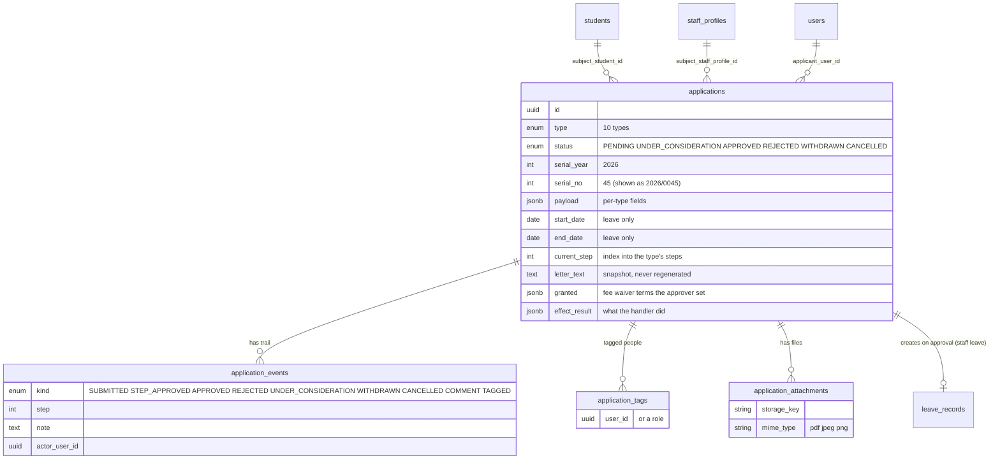
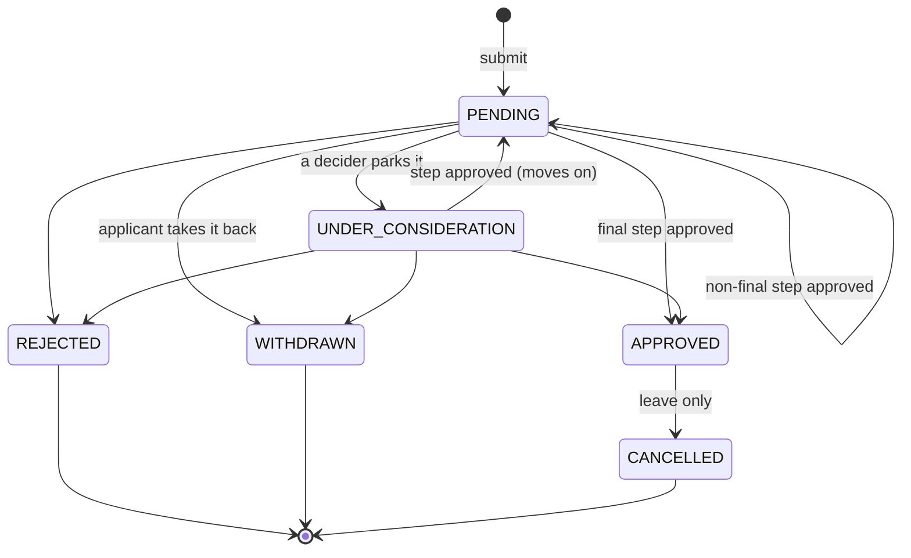
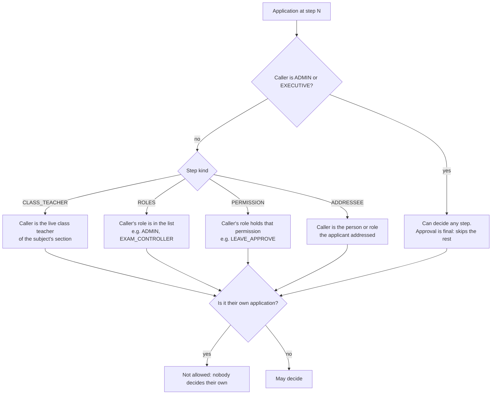
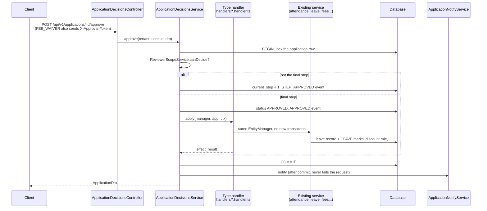
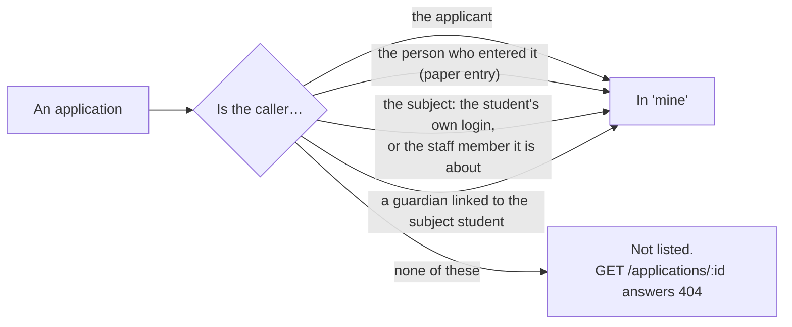

# Applications

Epic 52.0. One place for every request a parent, student or staff member makes to the
school: a day of leave, a fee waiver, a certificate, a plain letter. Someone files it, the
right person decides it, and for most types approving it **does the work for you** (marks
attendance, creates the discount rule, records the leaving).

It replaces the old staff-only leave request flow (`POST /leave/requests`, Epic 36.0). Leave
is now just two of the ten types.

## 1. What it is

An **application** is a short letter with a type, a subject (a student or a staff member), a
status and a trail of events. The school writes no code per type: each type is one row in
`APPLICATION_TYPES` (`shared/src/enums/applications.ts`).

| Type                   | About            | Who decides (in order)                         | What approval does                                                                     |
| ---------------------- | ---------------- | ---------------------------------------------- | -------------------------------------------------------------------------------------- |
| `STAFF_LEAVE`          | staff            | anyone with `LEAVE_APPROVE`                    | **Auto:** an approved `leave_records` row, `LEAVE` marks                               |
| `STUDENT_LEAVE`        | student          | the class teacher                              | **Auto:** `LEAVE` marks in the class register                                          |
| `FEE_WAIVER`           | student          | class teacher, then `DISCOUNT_RULE_MANAGE`     | **Auto:** creates the student's discount rule                                          |
| `TESTIMONIAL`          | student          | class teacher, then ADMIN                      | **Manual:** staff print it themselves                                                  |
| `TRANSFER_CERTIFICATE` | student          | class teacher, then `STUDENT_LIFECYCLE_MANAGE` | **Auto:** records the leaving (see [19-student-lifecycle.md](19-student-lifecycle.md)) |
| `READMISSION`          | student          | `STUDENT_LIFECYCLE_MANAGE`                     | **Auto:** readmits the student                                                         |
| `SECTION_CHANGE`       | student          | class teacher, then ADMIN                      | **Auto:** moves the student to the new section                                         |
| `SCRIPT_RECHECK`       | student          | class teacher, then EXAM_CONTROLLER            | **Manual:** the exam controller follows up                                             |
| `ID_CARD_REPRINT`      | student or staff | OFFICE_STAFF or ADMIN                          | **Manual:** the office reprints the card                                               |
| `GENERAL`              | student or staff | the addressee the applicant picked             | **Nothing:** the decision is the answer                                                |

- **Auto** means the handler runs inside the approval (see [section 5](#5-approve-in-one-transaction)).
- **Manual** means approval is only a record. A "follow-up" hint on the detail page tells the
  approver what to do next.
- "Class teacher" means the `CLASS_TEACHER` assignment on the student's section, **never** the
  assistant.

## 2. The data



Two details worth knowing:

- **The serial** looks like `2026/0045`: the year, then a running number. Each school counts
  on its own, and the count restarts each year (the school is not part of the text). `nextApplicationSerial` (`server/src/modules/applications/application-serial.ts`)
  takes a Postgres advisory lock first, so two people submitting at once cannot get the same
  number. Digits are always Latin, even in a Bangla school.
- **The letter is a snapshot.** The text is written once, at submit, into `letter_text`
  (`letter_locale` records the language). Renaming the student later does not rewrite an old
  letter.

Attachments: up to 3 files, 5 MB each, PDF/JPEG/PNG (`ATTACHMENT_LIMITS`).

## 3. Life of an application



- **Under consideration** is a parking spot. The step does not advance.
- **No "return for changes."** A decider can only approve, reject or park. If the letter is
  wrong, the applicant withdraws it and files a new one.
- **Cancel** exists only for approved leave (`cancellable` in the type row). It undoes the
  effect: the days go back to the balance and future `LEAVE` marks are removed.
  Nobody can cancel their own application.

## 4. Who decides

One rule, one file: `ReviewerScopeService` in
`server/src/modules/applications/reviewer-scope.ts`. The inbox list, the pending count and the
per-row "can I decide?" check all call it, so they cannot disagree.



- **Live class teacher.** Looked up at decision time, not stored. Move a student to another
  section and the new class teacher sees the application.
- **Skipped step.** If the student has no class teacher, or the subject is staff, a leading
  `CLASS_TEACHER` step is skipped. The last step is never skipped: ADMIN and EXECUTIVE can
  still decide it.
- **Final auto approval also needs the effect permission.** For a type with an AUTO effect
  (for example `STUDENT_LIFECYCLE_MANAGE` for a transfer certificate), the approver must hold
  it, even if they are an override role. `STUDENT_LEAVE` has none: the class teacher alone is
  enough.

## 5. Approve in one transaction



- **All or nothing.** The handler uses the decision's own `EntityManager`. If it throws
  (say, a leave overlaps an approved one), the approval rolls back too. There is no
  "approved but nothing happened" state.
- **Fee waiver is step-up.** Final approval spends a fresh `X-Approval-Token`
  (scope `DISCOUNT_RULES_MANAGE`), the same re-authentication that creating a discount rule
  directly needs. The approver may also change the terms (`granted`); the terms they set win
  over what the parent asked for.
- **Bulk approve.** `POST /applications/bulk-approve` takes up to **50** ids. Each row is
  its own transaction, so one failure does not block the rest. `FEE_WAIVER` is never bulk
  approvable. The response lists `{ id, ok, error_code }` per row.

What each AUTO handler writes:

| Handler                | Effect                                                                     |
| ---------------------- | -------------------------------------------------------------------------- |
| `staff-leave`          | `leave_records` row (APPROVED, `application_id` set) + staff `LEAVE` marks |
| `student-leave`        | student `LEAVE` marks, see [11-attendance.md](11-attendance.md)            |
| `fee-waiver`           | a discount rule for the student                                            |
| `transfer-certificate` | a lifecycle leaving event                                                  |
| `readmission`          | a lifecycle readmit event                                                  |
| `section-change`       | moves the student to the new section (through the enrollment service)      |
| `manual`               | nothing (MANUAL and NONE types)                                            |

## 6. A real example

A parent files a sick-leave letter for their child. The server fills in the serial and the
letter.

```http
POST /api/v1/applications
Authorization: Bearer <parent token>

{
  "type": "STUDENT_LEAVE",
  "subject_student_id": "5b0c2e7a-3f6d-4c1e-9a52-0d8f1e2b7c11",
  "payload": {
    "reason_kind": "SICK",
    "start_date": "2026-10-12",
    "end_date": "2026-10-13",
    "details": "Karim has a fever and the doctor advised rest."
  }
}
```

```json
{
  "id": "7c1e0000-0000-4000-8000-000000000001",
  "serial": "2026/0045",
  "type": "STUDENT_LEAVE",
  "status": "PENDING",
  "applicant_name": "Rahim Uddin",
  "subject_kind": "STUDENT",
  "subject_name": "Karim Uddin",
  "subject_class_name": "Class 7",
  "subject_section_name": "B",
  "start_date": "2026-10-12",
  "end_date": "2026-10-13",
  "current_step": 0,
  "step_count": 1,
  "can": { "decide": false, "consider": false, "withdraw": true, "cancel": false, "comment": true },
  "letter_locale": "en",
  "events": [{ "kind": "SUBMITTED", "actor_name": "Rahim Uddin" }]
}
```

The `can` block is what the buttons on the detail page read. The same response, seen by the
class teacher, has `"decide": true` and `"withdraw": false`.

When the class teacher approves, the two dates become `LEAVE` marks in the class register, and
`effect_result` becomes `{ "days": 2, "attendance_dates": ["2026-10-12", "2026-10-13"] }`.

## 7. Notifications

| Event                      | Who gets a push                                            | SMS?                                               |
| -------------------------- | ---------------------------------------------------------- | -------------------------------------------------- |
| Submitted                  | the people who can decide the **current** step             | no                                                 |
| Step approved (moves on)   | the people who can decide the **next** step                | no                                                 |
| Approved / rejected / etc. | applicant, the student, their guardians, the staff subject | **final decision only**, only if the setting is on |
| Tagged                     | the tagged person                                          | no                                                 |
| Comment                    | the people tagged on it                                    | no                                                 |

- **SMS switch.** `settings.applications.smsOnDecision` (default off). It lives at
  **Settings › Academics › আবেদনপত্র** (`client-admin/src/pages/settings/ApplicationsSection.tsx`).
  It sends to guardians of a student subject, through the usual SMS credit check.
- **In-app** means the "Applications" nav badge and the inbox. There is no notifications
  table.
- **Attention alert (not built yet).** Epic 67 will show pending applications as an
  `approvals.pending` alert on the dashboard. Ticket #2126 adds the rule, but it is blocked
  on Epic 67 wave 1 and #2076, so **today there is no such alert**. The pending count already
  exists: `GET /applications/pending-count` feeds the nav badge. Link the attention doc here
  once it exists.

## 8. Screens

| Route                                 | Shape                                       | Primary action                              |
| ------------------------------------- | ------------------------------------------- | ------------------------------------------- |
| `/applications`                       | list with tabs: Inbox, Mine, All            | open a row; select rows, then Bulk approve  |
| `/applications/new`                   | stepper: type, subject, form, attachments   | Submit (`?type=STAFF_LEAVE` pre-picks type) |
| `/applications/$applicationId`        | the letter, trail, side panel               | Approve / Reject / Consider                 |
| `/applications/reports`               | filters, summary tiles, tables              | read, filter by year and dates              |
| student detail `?tab=applications`    | that student's applications                 | read that student's applications            |
| staff detail `?tab=applications`      | that person's applications                  | read that person's applications             |
| `/portal/applications`                | the guardian's or student's own list        | open one, or start a new application        |
| `/portal/applications/new`            | stepper: type, details, attachments, letter | Submit (child comes from `?student=`)       |
| `/portal/applications/$applicationId` | status, letter and trail; never a decision  | comment; Withdraw (applicant, while open)   |

- **Portal form.** There is no child picker on the form. The list's "New application" link
  carries the child, e.g. `/portal/applications/new?student=8b7e…`. Without `?student=`, or
  with a child who is not yours, the form sends you back to the list. A family never gets the
  tag step (the tag list names school staff).
- **Nav.** "Applications" is a top-level staff item above the groups
  (`client-admin/src/nav-tree.ts`, gate `APPLICATION_SUBMIT`). The report is also in the
  Reports hub. In the portal it sits under **More**, not in the bottom bar.
- **Command palette actions:** `applications.new`, `applications.inbox`,
  `applications.apply-leave` (`client-admin/src/action-registry.ts`).

### What a family sees in the portal

The portal list asks for `GET /applications?view=mine&student_id=<child>`. `view=mine` is one
rule in `applications.service.ts`; `student_id` only narrows it further, it never widens it.
An application is in a caller's `mine` when **any** of these is true (D43):



Example, one family: the guardian `parent@` and their child Rahim, whose own login is
`student@`.

| Application                                                      | Guardian sees it? | Rahim sees it?  | Who may withdraw |
| ---------------------------------------------------------------- | ----------------- | --------------- | ---------------- |
| Leave the guardian filed for Rahim                               | yes (applicant)   | yes (subject)   | the guardian     |
| Leave Rahim filed himself                                        | yes (linked)      | yes (applicant) | Rahim            |
| Paper entry the office made for the guardian                     | yes (applicant)   | yes (subject)   | the guardian     |
| Paper entry under a typed name only (`applicant_name`, no login) | yes (linked)      | yes (subject)   | nobody           |
| Another family's leave                                           | no (404)          | no (404)        | —                |

- **Withdraw is applicant-only.** The service checks `applicant_user_id`; seeing an
  application is not enough to take it back.
- **Never a decision.** The detail page shows only Withdraw and Print, whatever `can` says,
  and the server's reviewer rules never let a family decide anyway.
- **Addressees.** For `GENERAL`, `GET /applications/addressees?student_id=` lists class
  teacher, headmaster and office, and only for a child linked to the caller. A family is never
  offered a named staff member (`STAFF_USER`), and create refuses one.

**The keyboard path for a decider** (a rule that every step stays reachable without a mouse):

1. Open `/applications`. The Inbox tab is first.
2. Arrow to a row and press `Enter`. The detail page opens and focus lands on **Approve**.
3. Press `Enter` to open the decision dialog. The note field is a single line inside a
   form, so `Enter` submits.
4. After the decision the app returns to the list with `?decided=<id>`.
5. Focus moves to the row now sitting where the decided one was, so the next
   application is one keypress away.

## 9. Workbook and seed

Four tabs round-trip through the backup workbook ([14-school-workbook.md](14-school-workbook.md)),
registered in `server/src/modules/workbook/codec/registry.ts` before `leave_records`, which now
references applications:

| Tab                       | Needs first                                             |
| ------------------------- | ------------------------------------------------------- |
| `applications`            | `users`, `students`, `staff_profiles`, `academic_years` |
| `application_events`      | `applications`                                          |
| `application_tags`        | `applications`                                          |
| `application_attachments` | `applications`                                          |

Demo data: `server/src/scripts/seed.applications.ts`.

## 10. Deviations from the plan

- **#2126 (`approvals.pending` alert) is not built.** The rule key is named in section 7 but
  no code exists. It waits on Epic 67 wave 1 and #2076.
- **`23-attention.md` does not exist yet**, so section 7 has no link to it.
- **Withdraw covers `PENDING` and `UNDER_CONSIDERATION`**, and only the applicant can do it
  (the service checks `applicant_user_id`).
- **The state diagram shows `UNDER_CONSIDERATION → PENDING`** because approving a non-final
  step puts the application back to `PENDING` at the next step.
