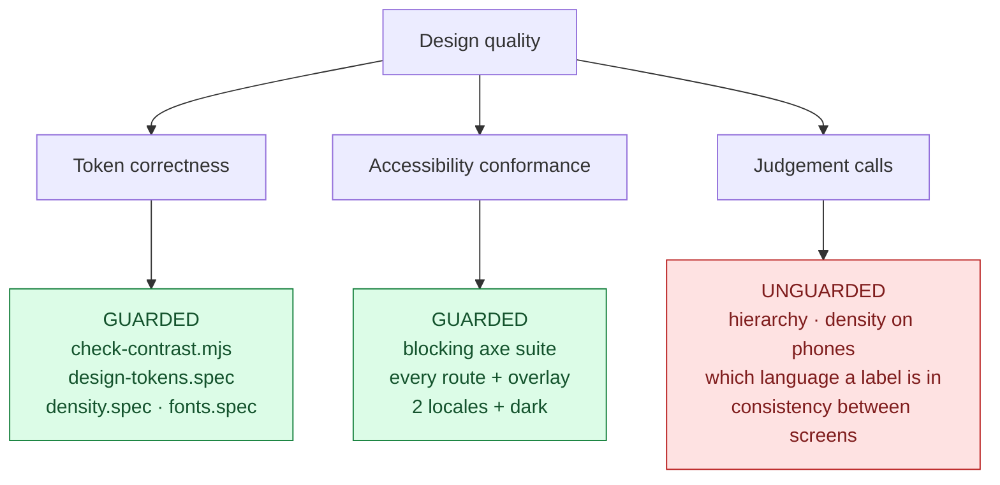
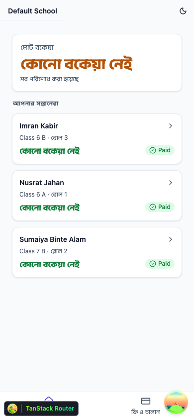
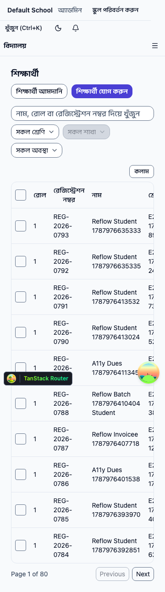
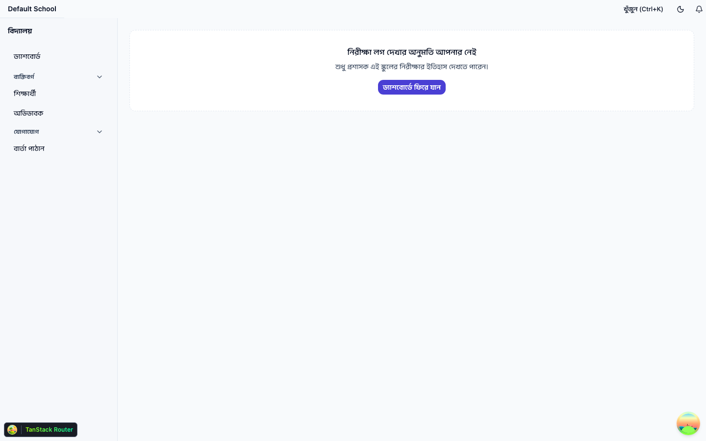

# Biddaloy Frontend Design Audit

**Date:** 2026-09-02
**Scope:** `client-admin/` (the whole SPA) + `ui/` (the shared design system)
**Method:** live rendering — 122 screenshots at 1440 / 768 / 390 / 360 px across
three roles, plus 12 Storybook Foundations captures. Nothing below is inferred
from JSX unless explicitly tagged `[code-inferred]`.

---

## 0. Read this first

Biddaloy is **not an un-designed product**. Epic 8.13 ("Visual Design Layer")
landed a 663-line token system, dark mode, density modes, an elevation rollout
across ~50 components, and a 1,124-line written design contract at
[`docs/architecture/09-design-direction.md`](../architecture/09-design-direction.md).

So this audit is not "propose a design system." It is: **where did 8.13 stop,
and what can only be seen by looking at real screens?**

The most useful framing is this — the project has strong _automated_ gates and a
strong _component_ story, and the gaps cluster in the space those gates
structurally cannot reach:



**Every finding in section B lives in the red box.** That is not a coincidence,
and it is the single most important conclusion of this audit.

---

## A. Current state — what this frontend does well

These are real strengths. Several are better than typical for a product this size.

### A1. The token system is genuinely rigorous

`ui/src/styles/globals.css` (663 lines) defines a three-layer system: a raw scale
with fixed _values_, semantic roles with fixed _meanings_, and a shadcn
vocabulary bridge that only ever references existing tokens — never a new literal.

It is guarded character-for-character. `ui/tailwind.preset.ts` mirrors the same
values for TS/test consumption, and `scripts/check-contrast.mjs` parses **both**
files and fails the build if they drift (`0.10` may not even be shortened to
`0.1`).

One decision deserves specific credit — the elevation indirection
(`globals.css:398–423`). Tailwind v4 inlines `--shadow-*` at build time, so a
dark-mode override of it would be dead CSS. Declaring `--shadow-e1` as a one-hop
reference to a runtime `--elevation-e1` makes `.shadow-e1` compile to
`var(--elevation-e1)`, which the dark block _can_ re-theme. That is a real
engineering insight, documented in place.

### A2. Bangla is a first-class citizen, not a translation layer

**`DEFAULT_LOCALE` is `bn`.** A fresh browser renders Bangla. The font work
reflects that:

- **Anek** (SIL OFL), self-hosted and committed, no third-party origin ever contacted.
- One CSS family, two scripts, split by `unicode-range` — the browser picks the
  face per character, with no `lang`-based CSS.
- The Bangla range includes `U+200C-200D` (ZWNJ/ZWJ, essential for conjunct
  control) and `U+25CC` (dotted circle), not just the Bengali block.
- Metric-matched `local()` fallbacks with real `size-adjust` / `ascent-override`
  numbers computed from the actual font tables, to protect CLS during swap.

**Verified visually:** conjuncts render as proper ligated forms, not
letter + hasant + letter.

> ক্ষ জ্ঞ ন্ত স্ত্র দ্ধ শ্ব — all correct (`sb-typography_conjunct-shaping.png`)

### A3. Accessibility is enforced, not aspirational

`e2e/a11y/routes.a11y.spec.ts` runs **axe over every manifest route and every
named overlay state**, at the five-tag WCAG 2.2 AA set, in **both locales**, plus
a third dark-mode variant. It is **blocking**. Suppressions are only possible
through a time-boxed `a11yException` that _throws once its recheck date passes_ —
and **none are currently in effect**.

Alongside it: `e2e/keyboard/`, `e2e/responsive/reflow.spec.ts`,
`e2e/responsive/target-size.spec.ts`, `e2e/focus-management.spec.ts`,
`e2e/reduced-motion.spec.ts`, `e2e/color-scheme.spec.ts`.

`StatusBadge` encodes "never convey status by colour alone" as a component:
every status renders **colour + text + a distinct icon shape**.

### A4. The density system is elegant

Two variables, one selector. `compact` is the default _by absence_ — there is
deliberately no `:root { --control-h }` — so components read
`h-[var(--control-h,2rem)]` and one variable expresses eight different compact
heights. Set on `document.documentElement` (not a wrapper) so Radix portals
inherit it.

Auth screens use `comfortable` on the reasoning that pre-authentication nobody
knows whether the visitor is an administrator on a desktop or a guardian on a
360px phone — so the 44px target is the safe default for the unknown user. That
is exactly the right instinct.

### A5. There are real page archetypes

`ui/src/shells/` provides `list-shell`, `detail-shell`, `form-shell`,
`wizard-shell`, each with URL-synced state (`?tab=`, `?step=`) and each with
stories _and_ tests. `e2e/route-manifest.json` records the archetype per route
and is drift-guarded against `routeTree.gen.ts`.

### A6. The guardian portal is the quality bar

`/portal` at 390px is genuinely good: one card per child, clear status, real
hierarchy, comfortable targets, bottom nav. Whoever designed this understood the
audience.



### A7. The design contract is honest about its own gaps

`09-design-direction.md` §10 lists what it deliberately did _not_ decide,
including "Anek at 13–14 px … if it reads poorly, the pre-agreed fallback is Noto
Sans + Noto Sans Bengali." A document that records its open risks is worth more
than one that pretends to be complete.

---

## B. Problems

Severity reflects **user impact for this product's stated priorities** (clarity,
speed, operational efficiency, small screens, low-end Android, poor connectivity).

---

### B1 · CRITICAL — `DataTable` has no small-screen strategy

**Problem.** The table renders an identical column set at every width and simply
overflows into a horizontal scroller. At 360px, columns crush to three-line
wraps and adjacent columns are clipped mid-character.

**Evidence.** `screenshots/bn-admin-students-narrow.png` — the registration
number wraps as `REG- / 2026- / 0793`, the name wraps to two lines, and the class
column is sliced vertically mid-glyph.



`ui/src/components/data-table.tsx:386` is the whole responsive story:

```
className="w-full overflow-x-auto rounded-lg border border-border-subtle …"
```

**Blast radius.** Ten routes use `ListShell` + `DataTable`
(`students`, `guardians`, `staff`, `classes`, `academic-years`,
`fee-structures`, `fees/dues`, `invoices`, `audit-logs`,
`communications/batches`) plus three more that use `DataTable` directly. This is
the core of the staff product.

**Why the gates missed it.** WCAG 2.2 SC 1.4.10 (Reflow) **explicitly exempts
data tables** from the no-horizontal-scroll requirement. So
`e2e/responsive/reflow.spec.ts` and the axe suite both pass, correctly, while the
screen is close to unusable on a phone. This is the clearest possible case of a
conformance gate and a quality gate not being the same thing.

**User impact.** A teacher or accountant on a mid-range Android cannot scan a
roster or a dues list without two-axis scrolling and per-cell reading.

**Severity: Critical** — it contradicts a stated top-three product priority, on
the product's most-used screens.

**Direction.** Give `DataTable` a per-column priority/visibility contract and a
stacked card presentation below a breakpoint. The portal already demonstrates the
target pattern (A6) — the work is to generalise it, not invent it.

---

### B2 · HIGH — English leaks through a Bangla-default UI

**Problem.** The product's default language is Bangla, but several shared
components hardcode English strings that reach production screens.

**Evidence — visual.** Every list screenshot shows it. In
`bn-admin-students-desktop.png`, inside otherwise fully-Bangla chrome:
`Active` · `Previous` · `Next` · `Page 1 of 80`.
In `bn-accountant-fees_dues-desktop.png`: `Pending`.
In `bn-parent-portal-mobile.png`: `Paid`.

**Evidence — code.** The components admit it:

| File                                 | Line     | Problem                                                                                                                      |
| ------------------------------------ | -------- | ---------------------------------------------------------------------------------------------------------------------------- |
| `ui/src/components/status-badge.tsx` | 50       | comment: _"real i18n, just a readable fallback until a translated-label lookup"_ — `humanizeStatus` title-cases the raw enum |
| `ui/src/components/pagination.tsx`   | 22–23    | `previousLabel = 'Previous'`, `nextLabel = 'Next'`                                                                           |
| `ui/src/components/data-table.tsx`   | 172, 174 | `columnsMenuLabel = 'Columns'`, `expandRowLabel = () => 'Expand row'`                                                        |
| `ui/src/components/data-table.tsx`   | 367      | `{selectedIds.size} selected` — hardcoded, **no override prop at all**                                                       |

Note the pattern: most are _defaults_ that a caller may override (and some
callers do — the Columns button renders as `কলাম`). But a default that is wrong
for the default locale will leak wherever anyone forgets, and `selected` cannot
be fixed by the caller at all.

**Why the gates missed it.** `ui/scripts/check-i18n-keys.mjs` verifies that keys
_exist and match across locales_. It cannot detect a component that never asks
for a key.

**User impact.** For the primary audience this reads as an unfinished product,
and status is precisely the information a guardian most needs to understand.

**Severity: High.**

---

### B3 · HIGH — Detail pages have no action hierarchy

**Problem.** The student detail header renders five actions, four of them as
solid brand-filled buttons of identical weight.

**Evidence.** `screenshots/bn-admin-students__studentId-desktop.png`:

> সম্পাদনা · ফি আদায় · রিমাইন্ডার পাঠান · স্থানান্তর / অবস্থা পরিবর্তন · মুছে ফেলুন

Four solid `brand` fills compete for the same attention; only the destructive
action is visually differentiated (a light red fill). There is no primary /
secondary / tertiary distinction, so the eye has no entry point.

**Impact.** On a screen used dozens of times a day, the operator re-reads five
equally-loud labels every time instead of moving to a known primary.

**Severity: High** — this is a repeated-task-efficiency cost, and it is the
single most visible violation of the hierarchy the design contract otherwise
argues for.

---

### B4 · HIGH — The money-alignment rule is applied inconsistently

**Problem.** The design contract requires money to align on the decimal. One
screen obeys it, the accountant's busiest screen does not, and the shared table
provides no way to comply.

**Evidence.**

- `client-admin/src/routes/_staff/invoices/index.tsx:169` — complies, with the
  rule quoted in a comment:
  `// tabular-nums: money columns align on the decimal (design contract §2).`
- `client-admin/src/routes/_staff/fees/dues.tsx` — no `tabular-nums`, amounts
  left-aligned. Confirmed visually in `bn-accountant-fees_dues-desktop.png`.
- `ui/src/components/data-table.tsx:398, 403, 426` — **every** `th`/`td` is
  hardcoded `text-start`. The `DataTableColumn` API has no alignment option, so
  a caller cannot right-align a column even if they want to.
- The guardian portal, by contrast, uses `tabular-nums` in nine places
  (`portal/fees.tsx`, `portal/index.tsx`).

So the **guardian-facing** screens are more numerically rigorous than the
**accountant-facing** one.

**Impact.** Comparing or summing a column of taka amounts by eye requires aligned
decimals. Left-aligned money in a dues table is a direct operational cost for the
exact user whose job is reconciling those numbers.

**Severity: High.**

_(Verified and dismissed: the numerals themselves are correct. `৳৫০০.০০` uses
Bengali zeros throughout — `renderDigits` works. At normal zoom Bengali ০ is
easily mistaken for Latin 0; magnified inspection confirmed no mixing.)_

---

### B5 · MEDIUM-HIGH — Three competing focus-ring vocabularies

**Problem.** Keyboard focus looks like three different design systems depending
on which control you land on.

| Pattern | Style                                                   | Components                                                                                           |
| ------- | ------------------------------------------------------- | ---------------------------------------------------------------------------------------------------- |
| **A**   | `ring-2 ring-ring ring-offset-2 ring-offset-background` | `primitives/button.tsx:54`, `primitives/select.tsx:51`, `components/skip-link.tsx:24` (no offset)    |
| **B**   | `border-ring` + `ring-3 ring-ring/50`                   | `primitives/input.tsx:11`, `textarea.tsx:10`, `checkbox.tsx:23`, `radio-group.tsx:27`, `tabs.tsx:57` |
| **C**   | `outline outline-2 outline-ring`                        | `components/data-table.tsx:386, 498, 526`, `components/date-picker.tsx:260`                          |

Pattern A is the _migrated_ one — `button.tsx:44–46` and `select.tsx:39–41`
document the move away from `ring-ring/50` explicitly. The migration simply
stopped after two components.

**Trap for whoever fixes this:** `tabs.tsx:57` deviates even within Pattern B —
it uses `ring-[3px]` (arbitrary value, not `ring-3`) _and_ uniquely stacks
`focus-visible:outline-1 focus-visible:outline-ring` on top. A find-and-replace
of `ring-3 ring-ring/50` will silently miss it.

**Why the gates missed it.** All three patterns are _visible and pass contrast_.
axe checks that a focus indicator exists, not that the product has only one.

**Severity: Medium-High** — invisible to most users individually, corrosive in
aggregate, and cheap to fix.

_(Do not confuse these with two legitimate non-focus uses of `ring-*`: the
elevated-surface hairline `ring-1 ring-foreground/10 dark:ring-border-subtle`,
and the `aria-invalid:ring-3 ring-destructive/20` invalid state — which **is**
already uniform across all six form controls.)_

---

### B6 · MEDIUM — Two nav-linked routes are placeholders

`/dashboard` and `/fees` both render a bare `EmptyState`, and both occupy prime
navigation positions. `/dashboard` is worse than a dead link: it is the
**post-login landing route for every staff role** (`routes/index.tsx` redirects
there).

Evidence: `client-admin/src/routes/_staff/dashboard.tsx`,
`client-admin/src/routes/_staff/fees/index.tsx` — both self-described as
placeholders. Visual: `screenshots/bn-admin-dashboard-desktop.png`.

Every staff user's first impression of the product, every session, is an empty
state.

**Severity: Medium** (design-scope) — building a real dashboard is a product
feature, not a design-epic ticket. But the _first-run impression_ is in scope,
and at minimum these should not be the landing route and a top-level nav item.

---

### B7 · MEDIUM — Repeated 401s on every accountant navigation

**Evidence — observed live**, not inferred. Driving `/fees` → `/fees/dues` →
`/fees/generate` → … as `accountant@biddaloy.test`, every client-side navigation
emitted:

```
HTTP 401  /api/v1/schools/{tenantId}/settings   (×2 per navigation)
```

The accountant role lacks `SETTINGS_MANAGE`, but something in the shell requests
school settings on every route change regardless, and retries once.

**Impact.** Wasted requests on every navigation — which matters most on the poor
connectivity this product targets — plus console noise that will mask real errors.

**Severity: Medium.** Flagged as a defect for triage; the fix is a permission
check before the request, not a design change. `[needs owner confirmation on
intended behaviour]`

---

### B8 · MEDIUM — The detail shell wastes horizontal space

At 1440px the student overview tab renders four fields spread across the full
width, so a label and its value can sit ~300px apart, followed by ~700px of empty
vertical space. There is no measure constraint on the field grid.

Evidence: `screenshots/bn-admin-students__studentId-desktop.png`.

**Severity: Medium** — hurts scannability on exactly the screens meant for fast
lookup.

---

### B9 · MEDIUM — Two divergent navigation vocabularies

The staff sidebar renders **text-only** items in four collapsible groups. The
portal sidebar and bottom nav render **icon + label**. Same `AppShell`, two
visual languages, and nav content is declared inline in each layout route rather
than in a shared config (`routes/_staff.tsx`, `routes/portal.tsx`).

Also: no nav item leads to `/students/new` or `/students/import`; they are
reachable only from inside pages. That is defensible, but undocumented.

**Severity: Medium.**

---

### B10 · MEDIUM — The portal has no shared table primitive

`portal/fees.tsx` and `portal/index.tsx` build bespoke `Card` + `StatusBadge`
layouts for tabular data (invoice history, fee breakdown) rather than using any
shared component. The result is _better_ on mobile than `DataTable` (B1) — but it
means the codebase now solves "show rows of records" twice, in two unrelated ways.

Resolving B1 should reuse what the portal proved, and then reunify the two.

**Severity: Medium.**

---

### B11 · MEDIUM-LOW — Contrast margins are razor-thin

Read live from the compiled stylesheet (`sb-colors_colors.png`):

| Pair                           | Ratio    | Required | Headroom |
| ------------------------------ | -------- | -------- | -------- |
| Due `#b45309` on `#fef3c7`     | **4.51** | 4.5      | **0.01** |
| Paid `#15803d` on `#dcfce7`    | **4.57** | 4.5      | 0.07     |
| Partial `#0e7490` on `#cffafe` | **4.79** | 4.5      | 0.29     |
| Overdue `#b91c1c` on `#fee2e2` | 5.30     | 4.5      | 0.80     |

These pass, and `check-contrast.mjs` keeps them passing. But a 0.01 margin means
any future hue nudge breaks the build, and the failure will look like an
unrelated regression to whoever trips it.

**Severity: Medium-Low** — not a current defect; a maintenance trap worth
documenting.

---

### B12 · LOW — Component coverage gaps

| Component                                    | Stories | Test    |
| -------------------------------------------- | ------- | ------- |
| `ui/src/components/label.tsx`                | missing | missing |
| `ui/src/components/popover.tsx`              | missing | missing |
| `ui/src/components/notification-bell.tsx`    | missing | present |
| `ui/src/components/route-error-boundary.tsx` | missing | present |

Every other component in `ui/src/components/` (49 total) has both.

---

### B13 · LOW — Disabled filter controls are very low contrast

The disabled "সকল শাখা" filter reads as near-invisible grey-on-grey in both the
students and dues toolbars. Disabled controls are exempt from WCAG contrast
minimums, so this passes the gate — but users cannot tell it is a control at all.

Evidence: `bn-admin-students-desktop.png`, `bn-accountant-fees_dues-desktop.png`.

---

### B14 · LOW — Stale artefact and stale docs

`client-student/` exists on disk as **untracked build output only** (`dist/`,
`node_modules/`, no `src/`, no `package.json`). `git ls-files client-student`
returns zero files; it was removed in `a111d8e` when the app became one SPA.

`docs/architecture/00-overview.md` still describes it as a package. That is a
documentation defect that will mislead the next person (it briefly misled this
audit).

---

### B15 · CLOSED — Anek at 13–14px reads correctly

Design contract §10 item 2 left open whether Anek Bangla survives the `label`
(13px) and `caption` (12px) steps, with a pre-agreed fallback to Noto Sans
Bengali.

**Answered from real screens: keep Anek.** At 4× magnification of live renders,
conjuncts remain correctly formed and distinguishable at both steps —
শিক্ষার্থী (ক্ষ + reph) at 13px, জন্ম / লিঙ্গ (ন্ম, ঙ্গ) at 12px. No clipping of
the reph, no collision between vowel signs and adjacent glyphs.

**Recommendation: close this open item, do not switch fonts.** The contract notes
switching gets expensive after every screen is hand-verified — that point has
passed, and there is no reason to pay it.

---

## C. Preserve list — must NOT change

### C1. Accessibility implementations (non-negotiable)

- The **blocking** axe suite and its coverage matrix (every route × every overlay
  × 2 locales × dark). Do not narrow it.
- The time-boxed `a11yException` protocol, including that expiry **throws**.
  Currently zero live exceptions — keep it that way.
- `StatusBadge`'s colour + text + **distinct icon shape** contract.
- Keyboard suites, `focus-management.spec.ts`, `reduced-motion.spec.ts`,
  `color-scheme.spec.ts`, `target-size.spec.ts`, `reflow.spec.ts`.
- `SkipLink`, `RouteAnnouncer`, and `form-shell`'s focused error summary.
- The 44px comfortable-density targets on `/portal` **and on auth screens**,
  including the reasoning that pre-auth users are unknown.
- Checkbox/radio `::after` hit-area expansion, and the pinned arithmetic
  `1 + inset×2 = 2.75`.

### C2. Token architecture

- Three-layer structure; dark mode overriding **only** semantic roles, never the
  raw scale.
- The `--shadow-*` → `--elevation-*` indirection (it exists for a real Tailwind v4
  reason — see A1).
- `--motion-*` in plain `:root` rather than `@theme` (it would be tree-shaken).
- Density as `[data-density]` on `documentElement`, compact-by-absence, with
  per-variant fallbacks.
- Dark elevated surfaces carrying **border + shadow**, never shadow alone.
- The `check-contrast.mjs` dual-file drift gate and all three token spec files.

### C3. Typography and fonts

- Self-hosted Anek, **no third-party font origin**, ever.
- The dual-`unicode-range` single-family wiring, including ZWNJ/ZWJ and U+25CC.
- Metric-override fallback faces and their computed numbers — **do not hand-tune
  these to make a CLS number pass**.
- Deliberate non-preloading of the 170KB font payload.
- The Bangla 400–700 weight axis (narrowed to fit the byte budget).
- `--font-sans` stack **order** (`system-ui` first would void the overrides).

### C4. Architecture and behaviour

- `ui/src/primitives/` stays vendored shadcn and stays out of the public
  `exports` map.
- The four shells and their URL-synced state (`?tab=`, `?step=`).
- `e2e/route-manifest.json` and its drift guard against `routeTree.gen.ts`.
- The three-layer role gating, and that it is **UX-only** — the server's
  `RolesGuard` is the real boundary.
- The single-SPA-split-by-route decision (8.9.10).
- The guardian portal's mobile layout — it is the reference, not a rewrite target.

### C5. Documentation

- `09-design-direction.md` is the design record. Amend it in the same PR as any
  value change, exactly as its §10.3 instructs. Do not fork a competing doc.

---

## D. Top 10, ranked

| #   | Finding                                                        | Severity    |
| --- | -------------------------------------------------------------- | ----------- |
| 1   | `DataTable` has no small-screen strategy (13 routes)           | Critical    |
| 2   | English leaks through a Bangla-default UI                      | High        |
| 3   | No action hierarchy on detail pages                            | High        |
| 4   | Money alignment inconsistent; `DataTable` has no alignment API | High        |
| 5   | Three competing focus-ring vocabularies                        | Medium-High |
| 6   | `/dashboard` + `/fees` are nav-linked placeholders             | Medium      |
| 7   | Repeated 401s on every accountant navigation                   | Medium      |
| 8   | Detail shell wastes horizontal space                           | Medium      |
| 9   | Staff vs portal navigation vocabularies diverge                | Medium      |
| 10  | Portal duplicates "rows of records" outside `DataTable`        | Medium      |

---

## E. Method and limits

**Environment.** Postgres + Redis via `docker compose`; migrations + seed; API on
`:3000`, SPA on `:5174`, Storybook on `:6006`. Screenshots driven by Playwright,
logging in through the **real sign-in form** per role and navigating
**client-side** (a full reload per route re-runs the token refresh and trips
reuse detection after ~3 hops).

**Coverage.** 122 app screenshots — 30 of 32 manifest routes × 4 widths × 3 roles
(`admin`, `accountant`, `parent`), plus the login page. Verified programmatically
that no screenshot is a mislabelled login screen (115 distinct images; the only
byte-identical groups are `/` and `/select-school` correctly resolving to
`/dashboard`).

**Limits — stated plainly:**

1. **Roles not captured:** `teacher`, `executive`, `student`, `super_admin`. The
   manifest assigns every route to `admin`/`accountant`/`parent`, so no _route_
   is unseen — but role-specific nav filtering was not visually verified.
2. **`/communications/batches/$batchId` was never captured** — the seed creates no
   reminder batch, so no id exists to resolve.
3. **Dark mode was not captured in-app.** Token-level dark is covered by
   Storybook captures and by the blocking dark axe variant, but dark-mode _visual
   quality_ on real pages is unverified.
4. **Overlay/dialog states were not captured** (the manifest names 8).
5. **Seeded data is thin and synthetic** (`Reflow Student 1787…`), so real-world
   text lengths — long Bangla names, long class names — are untested. Truncation
   behaviour is therefore **not** assessed.
6. **No low-end device or throttled-network testing.** B1's severity rests on
   rendered layout at 360px, not on measured performance.
7. TanStack Router / React Query devtools badges appear in the corners of every
   screenshot. Dev-only; ignore them.

---

## F. Addendum — all seven roles, and Epic 8.14 overlap

Added after the initial checkpoint, once credentials for all seven seed roles
were available and Epic **#364** was reviewed.

### F1. Role coverage — nav hides, routes don't

All seven roles were driven through the staff route set (or the portal, for
guardian roles). **Navigation filtering is correct.** Route access is not.

| Role                 | Nav items shown   | Staff pages that render by URL |
| -------------------- | ----------------- | ------------------------------ |
| `super_admin`        | 17                | 17 (correct — full access)     |
| `teacher`            | **4**             | **25 of 27**                   |
| `executive`          | **2**             | **25 of 27**                   |
| `admin`              | 17                | 17                             |
| `accountant`         | (finance + comms) | as permitted                   |
| `parent` / `student` | 2 (portal)        | portal only ✓                  |

Only **two** staff routes refuse a role that lacks the permission:

- `/audit-logs` → "নিরীক্ষা লগ দেখার অনুমতি আপনার নেই — শুধু প্রশাসক এই স্কুলের নিরীক্ষার ইতিহাস দেখতে পারেন।"
- `/settings` → "এই পাতাটি দেখার অনুমতি আপনার নেই।"

**The other 25 render fully, with live data.** Verified visually:

- A **teacher** on `/fees/dues` sees every student's billed / paid / outstanding
  amounts — 46 pages (`screenshots/bn-teacher-fees_dues-desktop.png`).
- A **teacher** on `/staff` sees the whole staff directory including **email
  addresses**, with working links into each person's detail page
  (`screenshots/bn-teacher-staff-desktop.png`).
- An **executive**, whose sidebar shows **two** items, reaches the same 25 pages.

### F2. The good news: the pattern already exists and is well designed



The `/audit-logs` denial is a genuinely good state — a clear headline, an
explanation of _who_ may view the page, and a recovery action, **fully
localized with no English leak**. Nothing needs designing. It needs _applying_.

### F3. Root cause, in code

- **Exactly one** staff route defines a `beforeLoad` guard —
  `client-admin/src/routes/_staff/settings.tsx`. The other 26 rely on
  nav-hiding plus optional inline `useHasPermission` gates.
- `RequireRole`'s default is `redirectTo = '/forbidden'`
  (`ui/src/routes/require-role.tsx:39`) — and **`/forbidden` is not a route**
  (zero matches in `routeTree.gen.ts`, no `forbidden.tsx`). Both live call sites
  override the default, so it is latent, not firing; any new caller that forgets
  lands on NotFound.
- Permission gates protect _row actions_ but not the page or its data: on the
  teacher's dues view the "কার্যক্রম" (Actions) column header renders with its
  links removed.
- The server returned the data in every case. This matches drift already
  documented in `_staff.tsx`'s own comments (server `@Roles` broader than
  `ROLE_PERMISSIONS`).

### F4. Ownership — do not build this twice

| Half                                                                      | Owner                                        |
| ------------------------------------------------------------------------- | -------------------------------------------- |
| Server-side enforcement + resolving each UI-vs-server drift               | **#380 / #399** (Epic 10.0) — already exists |
| Deciding which routes show the denied state, and applying it consistently | **unowned** — a design/UX contract           |

The severity of F1 is a **security** judgement (PII reaching lower-privileged
roles) and belongs to #399. Recorded here because it was found while auditing,
and because the _design_ half — a route-level access-state contract — is real
and currently belongs to nobody.

### F5. Epic 8.14 (#364) overlap

#364 is a strong, evidence-based epic (a 9-agent audit with `file:line`
citations). It **independently found the same `reflow.spec.ts` loophole** this
audit found — the suite asserts only that the _page_ doesn't scroll, so an
inner-scrolling table passes CI while being unusable on a phone.

| This audit                                     | #364                                                       |
| ---------------------------------------------- | ---------------------------------------------------------- |
| B1 `DataTable` no mobile strategy              | **Owned** — #371 card mode                                 |
| B9 nav vocabularies diverge                    | **Owned** — #365, #367                                     |
| B6 `/fees` dead-end                            | **Owned** — #377.1                                         |
| B6 `/dashboard` placeholder                    | Out of scope by design → #378 / #169                       |
| B7 accountant 401s                             | Adjacent → #380 / #399                                     |
| B2 English leaks                               | **Partial** — cross-cutting AC binds only _new_ components |
| B3 action hierarchy                            | **Not covered**                                            |
| B4 money alignment / `DataTable` alignment API | **Not covered**                                            |
| B5 three focus-ring vocabularies               | **Not covered**                                            |
| B8, B11, B12, B13, B14, F1–F4                  | **Not covered**                                            |

Verified by scanning all 14 issue bodies for `StatusBadge`, `humanizeStatus`,
`Pagination`, `tabular`, `focus-visible`, `ring-ring`, `action hierarchy`,
`text-right`. The only hits are #371 and #374 referring to StatusBadge and
Pagination _incidentally_ (as existing components, and as the page-size
control) — neither retrofits a hardcoded string nor touches focus or alignment.

#364 also independently confirms three findings of ours: no logout in the shell
(`logout()`'s only UI call site is `select-school.tsx:76`), no post-login
language switcher in a Bangla-first product, and `<html lang="en">` with an
English `<title>` (`client-admin/index.html:2,6`).

**Conclusion: any new design epic must be scoped to the complement of #364** —
the primitives' visual grammar (focus, hierarchy, numeric alignment), the
i18n retrofit of already-shipped `ui/src` strings, and the route access-state
contract. Everything shell-, nav-, table- and motion-shaped is already owned.

### F6. Limits retired and remaining

**Retired:** all seven roles are now covered (limit 1 of §E).

**Still open:** `/communications/batches/$batchId` (no seeded batch); in-app dark
mode; overlay/dialog states; thin synthetic seed data, so truncation with long
Bangla names remains untested; no low-end-device or throttled-network testing.
