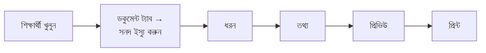

# সনদ

**কারা পারবেন:** অ্যাডমিন, এক্সিকিউটিভ ও অফিস স্টাফ।

একজন শিক্ষার্থীকে পাঁচ ধরনের সনদ দেওয়া যায়: **ছাড়পত্র (টিসি)**, **প্রশংসাপত্র**,
**চারিত্রিক সনদপত্র**, **অধ্যয়ন প্রত্যয়নপত্র** ও **অংশগ্রহণ সনদপত্র**। প্রতিটির একটি
**ক্রমিক নম্বর** থাকে এবং রেকর্ড রাখা হয়, তাই পরে খুঁজে পাওয়া, আবার প্রিন্ট করা বা
বাতিল করা যায়।

কারিকুলাম প্রিসেট প্রয়োগ করলে ছাড়পত্র, প্রশংসাপত্র ও চারিত্রিক সনদের বাংলা ও ইংরেজি
টেমপ্লেট আগে থেকেই তৈরি থাকে। না থাকলে আগে একটি টেমপ্লেট বানান ([টেমপ্লেট](templates.md))।

## সনদ ইস্যু করুন

1. শিক্ষার্থীকে খুলে **ডকুমেন্ট** ট্যাবে যান।
2. **সনদ ইস্যু করুন** চাপুন।
3. **ধরন:** কোন সনদ বাছুন। যে ধরন এখন দেওয়া যাবে না, তার কারণ লেখা থাকে।
4. **ভাষা:** বাংলা বা ইংরেজি বাছুন। পুরো সনদ এক ভাষায় ছাপা হবে। স্কুলের ডিফল্ট আগে
   থেকে বাছা থাকে।
5. **তথ্য:** সনদের জন্য যা লাগে লিখুন (যেমন আচরণ)। এগুলো শুধু এই সনদে থাকবে,
   শিক্ষার্থীর প্রোফাইলে জমা হবে না। প্রোফাইলের কিছু ভুল থাকলে **শিক্ষার্থীর
   প্রোফাইলে ঠিক করুন** চেপে ঠিক করে ফিরে আসুন।
6. **প্রিভিউ:** দেখে নিন। **পরের ধাপ** চাপুন।
7. **প্রিন্ট:** প্রিন্টার বেছে **প্রিন্ট করুন** চাপুন। "সব ঠিকমতো ছাপা হয়েছে?" প্রশ্নের
   উত্তর দিন।

ক্রমিক নম্বর **প্রিন্ট করুন** চাপলে খরচ হয়। তার আগে বন্ধ করলে নম্বর খরচ হয় না।

## ছাড়পত্র (টিসি)

ছাড়পত্রের জন্য আগে শিক্ষার্থীর **ছাড়ার তথ্য রেকর্ড** (বদলি বা প্রত্যাহার) করতে হয়।
না থাকলে ছাড়পত্র ধূসর থাকে এবং **ছাড়ার তথ্য রেকর্ড করুন** বোতাম দেখায়।

## প্রশংসাপত্র, চারিত্রিক, অধ্যয়ন ও অংশগ্রহণ

- প্রশংসাপত্র ও চারিত্রিক সনদ: বর্তমান বা উত্তীর্ণ শিক্ষার্থীদের জন্য।
- অধ্যয়ন ও অংশগ্রহণ সনদ: বর্তমান শিক্ষার্থীদের জন্য।

## ক্রমিক নম্বর

ক্রমিক দেখতে এমন: `TSM-2026-00009`। মানে সনদের ধরন (`TSM`), সাল ও চলতি নম্বর। স্কুল
সংক্ষিপ্ত কোড দিলে (সেটিংস → ডকুমেন্ট) সেটি সামনে বসে: `DAHS-TC-2026-00007`। নম্বর
প্রতি ধরন ও প্রতি সালে আলাদা চলে, আর কখনো পুনরায় ব্যবহার হয় না।

## পুরো শ্রেণির জন্য একসাথে

প্রথম ধাপে **পুরো Class 6-A-র জন্য** চাপুন। সবার একই তথ্য থাকবে, ক্রমিক নম্বর পরপর বসবে।
যারা সেই সনদ পাবে না তাদের বাদ দিয়ে তালিকা দেখানো হবে।

## আবার প্রিন্ট ও প্রতিলিপি

শিক্ষার্থীর **ডকুমেন্ট** ট্যাব (বা রেজিস্টার) থেকে **আবার প্রিন্ট** চাপুন। নতুন কপিতে
**একই ক্রমিক নম্বর** থাকে এবং সবসময় **প্রতিলিপি / DUPLICATE** লেখা ছাপা হয় (টেমপ্লেটের
লেবেল ফাঁকা থাকলেও), যাতে কেউ আসল বলে ভুল না করে।

## সনদ বাতিল করুন

**কারা পারবেন:** অ্যাডমিন।

**রিপোর্ট → প্রিন্টেবল ও ডকুমেন্ট**-এ সনদটি খুলে **বাতিল করুন** চাপুন। একটি **কারণ**
লিখতেই হবে। রেজিস্টারে সনদটি কারণসহ "বাতিল" দেখাবে। যাচাইয়ের পাতায় শুধু "বাতিল" অবস্থা দেখা যায়।

## রেজিস্টার

**রিপোর্ট → প্রিন্টেবল ও ডকুমেন্ট → সনদ রেজিস্টার**-এ ইস্যু করা প্রতিটি সনদ দেখা যায়:
ক্রমিক, ধরন, শিক্ষার্থী, তারিখ ও অবস্থা। ধরন ও সাল দিয়ে ছাঁকুন। **Excel-এ নামান** চাপলে
Excel-এ খোলার মতো ফাইল (CSV) পাবেন।

**প্রিন্ট বাকি** ট্যাবে দেখা যায় কার কার্ড এখনো ছাপা হয়নি। এটি শুধু যাঁরা ডকুমেন্ট প্রিন্ট করতে পারেন
(এক্সিকিউটিভ নন) তাঁরা দেখেন।

## কিউআর কোড

প্রতিটি সনদে একটি কিউআর কোড থাকে। স্ক্যান করলে একটি খোলা পাতা আসে, যেখানে শুধু
সনদের ধরন, ধারকের নাম, স্কুল, ক্রমিক নম্বর, তারিখ এবং সনদটি **বৈধ** না **বাতিল** তা
দেখা যায়। আর কিছু দেখা যায় না।
