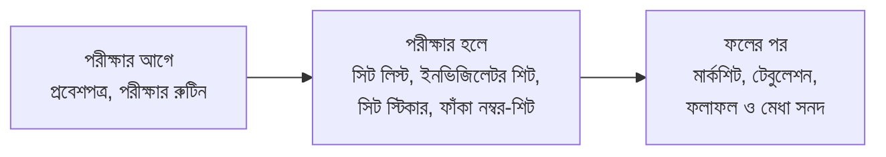

# পরীক্ষার কাগজপত্র

**কারা পারবেন:** অ্যাডমিন, অফিস স্টাফ ও পরীক্ষা নিয়ন্ত্রক। মার্কশিটের জন্য ফল
দেখার অনুমতিও লাগে।

পরীক্ষার সব কাগজ এক জায়গা থেকে প্রিন্ট হয়। **পরীক্ষা** খুলুন, পরীক্ষাটি খুলুন,
তারপর **প্রিন্ট** ট্যাবে যান। ট্যাবে তিনটি ভাগ আছে, যে ক্রমে লাগে সেই ক্রমে।

পরীক্ষার পাতায় থাকা অবস্থায় **Ctrl+K** চেপে "প্রবেশপত্র প্রিন্ট" লিখলেও হয়।

## প্রবেশপত্র

1. পরীক্ষার **প্রিন্ট** ট্যাবে **প্রবেশপত্র প্রিন্ট করুন** চাপুন।
2. কাদের জন্য বাছুন: **সবাই**, **শুধু বাকিরা**, অথবা **একটি শাখা**।
3. **প্রিভিউ** চাপুন, দেখে নিন, তারপর **প্রিন্ট** করুন।

প্রতি A4 পাতায় ২টি প্রবেশপত্র থাকে। তাতে আসন, কক্ষ ও প্রতি সিটিংয়ের সময়সূচি আছে।
অভিভাবক চাইলে পোর্টাল থেকে নিজের সন্তানের প্রবেশপত্র নিজেই প্রিন্ট করতে পারেন (নিচে দেখুন)।

**বকেয়ার সতর্কতা।** স্কুল যদি **বকেয়া থাকলে প্রবেশপত্র আটকান** চালু করে (সেটিংস →
ডকুমেন্ট), বকেয়াওয়ালা শিক্ষার্থীদের পাশে চিহ্ন থাকবে। আপনি তবুও প্রিন্ট করতে পারবেন।
অভিভাবক বকেয়া মেটানোর আগে প্রিন্ট করতে পারবেন না।

## সিট লিস্ট, ইনভিজিলেটর শিট ও সিট স্টিকার

আগে একটি **প্রকাশিত সিট প্ল্যান** লাগবে।

| কাগজ           | কী                                                |
| -------------- | ------------------------------------------------- |
| সিট লিস্ট      | দরজায় লাগানোর জন্য, প্রতি কক্ষ ও সিটিংয়ে ১ পাতা |
| ইনভিজিলেটর শিট | উপস্থিতি, খাতা নম্বর ও স্বাক্ষরের ঘর              |
| সিট স্টিকার    | বেঞ্চে লাগানোর জন্য রোল, নাম ও শ্রেণি             |

কার্ডের বোতাম চাপুন। নতুন পাতায় কাগজটি খুলবে। **প্রিন্ট করুন** চাপুন, তারপর
**বন্ধ করুন** চাপলে পরীক্ষার পাতায় ফিরবেন।

## ফাঁকা নম্বর-শিট

শিক্ষক হাতে নম্বর লিখবেন, পরে আপনি এন্ট্রি দেবেন। প্রতি শাখায় একটি শিট। পরীক্ষার
নম্বর বিভাজন আগে করা থাকতে হবে।

## পরীক্ষার রুটিন নোটিশ

নোটিশ বোর্ডের জন্য A4 নোটিশ, পরীক্ষার সময়সূচি থেকে তৈরি।

## ফলের পর

ফল **প্রক্রিয়া ও প্রকাশ** হলে এগুলো খোলে।

- **মার্কশিট (রিপোর্ট কার্ড):** প্রতি শিক্ষার্থীর বিষয়ভিত্তিক নম্বর ও জিপিএ।
- **টেবুলেশন:** পুরো শাখার নম্বর এক A4 আড়াআড়ি পাতায়।
- **ফলাফল সনদ:** শুধু উত্তীর্ণদের জন্য।
- **মেধা সনদ:** কারা পাবে বাছুন (শ্রেণির মেধাস্থান, শাখার মেধাস্থান, বা সেরা কয়েকজন),
  তারপর **এগিয়ে যান** চাপুন।

## কার্ড ধূসর কেন?

ব্যবহার করা না গেলে কার্ডে কারণ ও ঠিক করার লিংক দেখা যায়।

| কারণ                               | কী করবেন                                        |
| ---------------------------------- | ----------------------------------------------- |
| এখনো কোনো সিট প্ল্যান প্রকাশ হয়নি | **সিট প্ল্যান তৈরি করুন** চাপুন                 |
| পরীক্ষার সময়সূচি এখনো নেই         | **সময়সূচি যোগ করুন** চাপুন                     |
| ফল প্রক্রিয়া বা প্রকাশ হয়নি      | **অগ্রগতি দেখুন** বা **ফলাফল ট্যাবে যান** চাপুন |
| প্রকাশিত টেমপ্লেট নেই              | **টেমপ্লেট তৈরি করুন** চাপুন                    |
| নম্বর বিভাজন করা হয়নি             | **নম্বর বিভাজন করুন** চাপুন                     |

## অভিভাবক কী দেখেন

অভিভাবক পোর্টালে **পরীক্ষার সময়সূচি**-তে গিয়ে পরের পরীক্ষার **প্রবেশপত্র প্রিন্ট করুন**
চাপেন। কার্ডে শুধু তাঁর সন্তানের তথ্য থাকে। স্কুল বকেয়ার জন্য আটকালে অভিভাবক একটি
বার্তা ও বকেয়া দেখার লিংক পান।

## কে কী করতে পারেন

| ভূমিকা                                   | কী করতে পারেন            |
| ---------------------------------------- | ------------------------ |
| অ্যাডমিন, অফিস স্টাফ, পরীক্ষা নিয়ন্ত্রক | পরীক্ষার সব কাগজ প্রিন্ট |
| অভিভাবক বা শিক্ষার্থী                    | নিজের প্রবেশপত্র প্রিন্ট |
