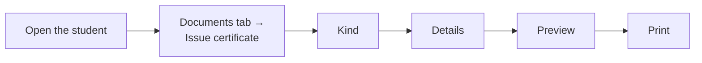

# Certificates

**Who can do this:** Admin and Office staff. The Executive can see the register
but not issue.

You can issue five kinds of certificate to a student: **Transfer certificate
(TC)**, **Testimonial**, **Character certificate**, **Study certificate** and
**Certificate of participation**. Every one gets a **serial number** and is
recorded, so you can find, reprint or cancel it later.

If you applied a curriculum preset, ready-made Bangla and English templates for
the TC, testimonial and character certificate are already there. Otherwise
create a template first (see [Templates](templates.md)).

## Issue a certificate

1. Open the student and choose the **Documents** tab.
2. Press **Issue certificate**.
3. **Kind**: choose the certificate. A kind that cannot be used says why.
4. **Language**: choose Bangla or English. The whole certificate prints in one
   language. The school default is pre-selected.
5. **Details**: fill in what the certificate needs (for example conduct). These
   go on this certificate only; they are not saved to the student's profile.
   If something from the profile is wrong, press **Fix it in the student's
   profile** and come back.
6. **Preview**: check it. Press **Next**.
7. **Print**: choose your printer and press **Print**. Answer **Did all print
   correctly?**

The serial number is taken only when you confirm the print. If you close before
that, no number is used up.

## Transfer certificate (TC)

A TC needs the student's **leaving recorded first** (a transfer or withdrawal).
If it is not, the TC is greyed out with **Record leaving**.

## Testimonial, character, study and participation

- Testimonial and character certificates are for current or graduated
  students.
- Study and participation certificates are for current students.

## Serial numbers

A serial looks like `TSM-2026-00009`: the kind (`TSM`), the year, and a running
number. If your school set a short code (Settings → Documents), it comes first:
`DAHS-TC-2026-00007`. Numbers run per kind and per year, and are never reused.

## A whole class at once

On the first step press **For all of Class 6-A**. Everyone gets the same details
with consecutive serial numbers. Students who cannot get that certificate are
left out and listed.

## Reprint and DUPLICATE

Open the student's **Documents** tab (or the register) and press **Reprint**.
The reprint keeps the **same serial number** and prints the word **DUPLICATE**
so nobody mistakes it for the original.

## Cancel a certificate (revoke)

**Who can do this:** Admin.

Open the certificate in **Reports → Printables & documents** and press
**Revoke**. You must write a **reason**. The certificate shows as Revoked, with
the reason, in the register and on its verify page.

## The register

**Reports → Printables & documents → Certificate register** lists every
certificate issued: serial, kind, student, date and status. Filter by kind and
year. Press **Download for Excel** to get a file that opens in Excel (it is a
CSV file).

The **To print** tab lists who is still waiting for a card.

## The QR code

Each certificate has a QR code. Scanning it opens a public page that shows the
document type, the holder's name, the school, the serial number, the date and
whether it is still **Valid** or **Revoked**. It shows nothing else.
