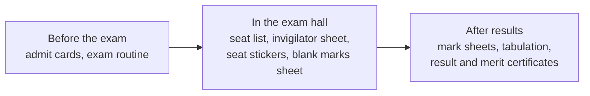

# Exam documents

**Who can do this:** Admin, Office staff and Exam controller (they can print
exam papers). Report cards also need permission to read results.

Everything you print for an exam starts in one place: open **Exams**, open the
exam, then choose the **Print** tab. The tab has three parts, in the order you
need them.

You can also press **Ctrl+K** and type "Print admit cards" while you are on the
exam page.

## Admit cards

1. Open the exam's **Print** tab and press **Print admit cards**.
2. Choose who: **Everyone**, **Not printed yet**, or **One section**.
3. Press **Preview**, check the pages, and press **Print**.

Each A4 page holds 2 admit cards, with the seat, the room and the timetable
for each sitting. A parent can also print their own child's admit card from the
portal (see below).

**Dues warning.** If your school turned on **Withhold admit cards when fees are
due** (Settings → Documents), students who owe fees are marked in the list. You
can still print them. A parent cannot print until the fees are paid.

## Seat list, invigilator sheet and seat stickers

These need a **published seat plan** first.

| Paper             | What it is                                    |
| ----------------- | --------------------------------------------- |
| Seat list         | For the door: one page per room per sitting   |
| Invigilator sheet | Attendance, script number and signature boxes |
| Seat stickers     | Roll, name and class, for the desks           |

Press the button on the card. A new page opens with the document. Press
**Print**, then **Close** to come back to the exam.

## Blank marks sheet

Teachers write marks by hand and you enter them later. One sheet per section.
Needs the marks parts to be set up for the exam.

## Exam routine notice

An A4 notice for the notice board, made from the exam schedule.

## After results

These open once results are **processed and published**.

- **Mark sheet (report card)**: each student's subject marks and GPA.
- **Tabulation sheet**: a whole section's marks on one A4 landscape page.
- **Result certificate**: only for students who passed.
- **Merit certificate**: choose who gets it (class position, section position,
  or the top few), then press **Continue**.

## Why is a card greyed out?

A card that cannot be used shows the reason and a link to fix it.

| Reason shown                               | How to fix                                  |
| ------------------------------------------ | ------------------------------------------- |
| No published seat plan yet                 | Press **Make a seat plan**                  |
| The exam has no schedule yet               | Press **Add the schedule**                  |
| Results are not processed or published yet | Press **See progress** or **Go to Results** |
| No published template for this document    | Press **Create one**                        |
| No marks parts are set up yet              | Press **Set up marks**                      |

## What a parent sees

A parent opens the portal, goes to **Exam schedule** and presses **Print admit
card** for the next exam. The card shows only their own child. If the school
withholds admit cards for dues, the parent sees a message with a link to see
and pay the dues instead.

## Who can do what

| Role                                 | What they can do           |
| ------------------------------------ | -------------------------- |
| Admin, Office staff, Exam controller | Print every exam document  |
| Parent or student                    | Print their own admit card |
