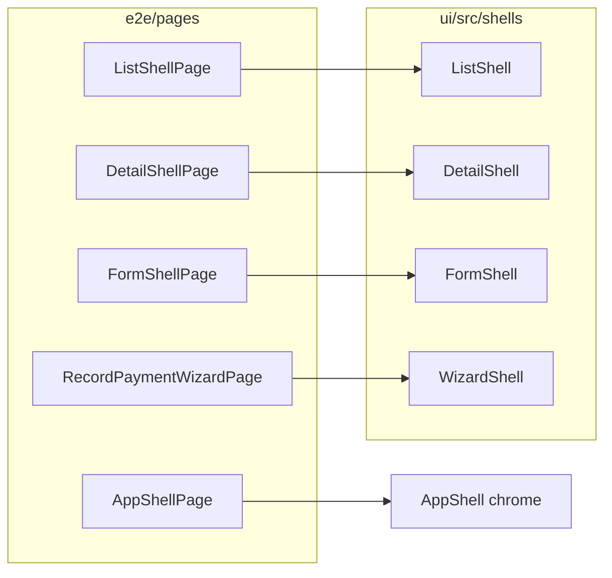

# E2E page objects ([8.5.3])

One page object per **archetype** (`ui/src/shells/`), not per route. A new
list route needs a `ListShellConfig` — two translation keys — and zero new
table-driving code.



## Locator policy (this is an accessibility decision)

- **`getByRole` / `getByLabel` only.** These resolve through the
  accessibility tree, so the suite fails on inaccessible markup before a
  screen-reader user does — the E2E suite doubles as an a11y canary.
- **Strings come from `e2e/i18n.ts`**, which imports the app's own
  message catalogs (`ui/src/i18n/locales`). Default locale is `bn` (what
  a fresh browser renders). Never hardcode Bangla in a spec.
- **`data-testid` requires a written justification comment at the
  locator** explaining why no accessible locator can work. If you can't
  write that sentence, fix the markup instead.

## Driving a new list page — worked example

The guardians list needed exactly this and nothing else:

```ts
const list = new ListShellPage(page, {
  titleKey: 'guardians.list.title',
  searchLabelKey: 'guardians.list.searchLabel',
});
await page.goto('/guardians');
await list.expectLoaded();
await list.search('Rahima');
await list.expectResultCount(1);
await list.openRowByText('Rahima');
```

Helpers available on every list: `expectResultCount(n)`,
`expectEmptyState(key)`, `expectErrorState(key?)`, `nextPage()`,
`previousPage()`, `row(text)`.

## URL state

The shells persist state in the URL (`?search=`, `?tab=`, `?step=`), so
specs assert state with `expectUrlParam(page, 'tab', 'fees')`
(`assertions.ts`) — never by poking component internals.

## Route manifest

`e2e/route-manifest.json` lists every navigable route with its role,
archetype, and named overlay states.
`client-admin/src/route-manifest.test.ts` fails when the generated route
tree and the manifest drift.

## Test data

`e2e/api.ts` seeds data over the API with the same headers the SPA sends
(Bearer + `X-Tenant-ID`). `createStudent` builds the academic-year →
class → section chain a student requires.
