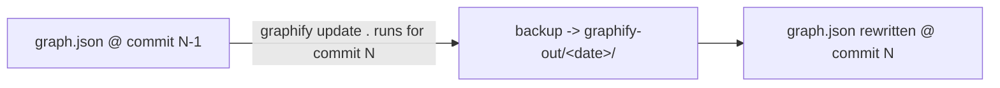

# graphify-out/

`graph.json`, `graph.html`, `GRAPH_REPORT.md`, and `manifest.json` in this
directory are the **current** knowledge graph — always built from the
commit that last touched them.

The dated subfolders (`2026-07-18/`, `2026-08-23/`, ...) are **historical
snapshots**, not a second copy of the current graph. Each one is a backup
`graphify update .` takes automatically of the *previous* curated graph,
right before writing the new one — so a dated folder's `GRAPH_REPORT.md`
is always built from the commit just before the one that created the
snapshot, one step behind whatever landed alongside it. That's expected:
they exist to let you diff "graph before this change" against "graph
after," not to mirror `HEAD`.

Do not "fix" a dated folder to match current `HEAD` — that would destroy
the snapshot it exists to preserve. If a dated folder looks wrong, check
what commit it was backed up *from* (`grep 'Built from commit' <date>/GRAPH_REPORT.md`)
rather than assuming it should match the latest commit.
