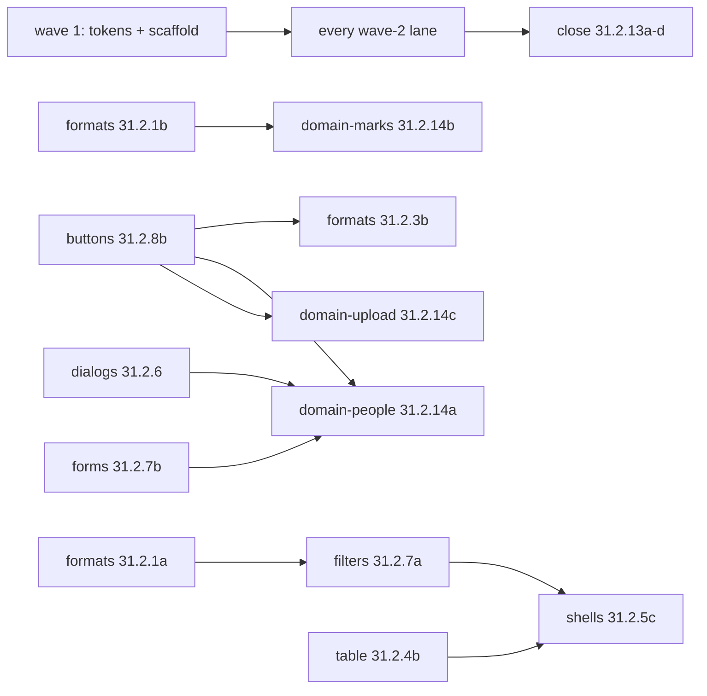

# Epic 31.0 — waves 1 and 2: lanes

A **lane** is a queue of tickets that runs in order on one branch chain. Tickets in different lanes
share no file (checked by `scratchpad/tools/files_overlap.py` over every `## Files` list: wave 1 —
31 files, 0 shared; wave 2 — 229 files, the only files named twice are inside one lane, listed below).
An **edge** "A → B" means B merges after A (B uses something A adds); the lanes still run in parallel.

## Wave 1 — scaffold

| Lane | Tickets (in order) | Territory |
|---|---|---|
| tokens | 31.1.1 | `globals.css` tokens + phone density + cursor rule, `cn()` type ramp, input/textarea radius, dropdown cursor, `09-design-direction.md` |
| scaffold | 31.1.2b → 31.1.2a | formatter signatures + `toIsoDate` + the three B19 call sites; every new component stub, `components/index.ts`, `shells/index.ts`, `utils/index.ts`, both `common.json` (52 keys), Button `danger` variant, `BulkUploadPreviewController` type |

Edge: tokens (31.1.1) → scaffold (31.1.2a) is visual only (`text-destructive-foreground` needs the token); nothing fails if merged the other way.

## Wave 2 — ui foundation

| Lane | Tickets (in order) | Territory |
|---|---|---|
| formats | 31.2.1a → 31.2.1b → 31.2.3a → 31.2.3b | `utils/{date,number,currency,phone}.ts`, i18n numeral formatter + region config; `components/calendar/**`; `routine-grid`, `routine-agenda`, `attendance-month-grid` |
| pickers | 31.2.2 | `date-picker` (+ year jump), `month-picker`, `time-input`, `month-header`; `e2e/journeys/calendar.spec.ts:48-49` |
| table | 31.2.4a → 31.2.4b | `row-actions`, `tooltip`, `data-table(-cards)`, `pagination`, `table`, `table-count`, `routes/use-list-url-state.ts`, `e2e/pages/list-shell.ts` |
| shells | 31.2.5a → 31.2.5b → 31.2.5c | `page-container`, `page-header`, list / form / wizard / detail shells, `primitives/tabs.tsx`, `e2e/pages/detail-shell.ts` |
| dialogs | 31.2.6 | `primitives/dialog.tsx`, `components/dialog.tsx`, `confirm-dialog`, `full-page-shell` (+ `useCloseFullPage`) |
| filters | 31.2.7a | `shells/filter-bar.tsx`, `use-filter-bar-state.ts`, `filter-sheet` |
| forms | 31.2.7b | `primitives/{select,label}.tsx`, `select`, `combobox`, `form-field` |
| states | 31.2.8a | `empty-state`, `access-denied-state`, `error-state`, `route-status-state`, `route-error-boundary`, `skeleton`; `client-admin/src/routes/__root.tsx` (one prop) |
| buttons | 31.2.8b | `primitives/button.tsx` base, `button`, `status-badge`, `toast`, `card` |
| appshell | 31.2.9a → 31.2.10 | `app-shell`, `app-header`, `breadcrumbs`, `bottom-nav`, `notification-bell` |
| account | 31.2.9b → 31.2.12 | `user-menu`, `tenant-bar`, `locale-switcher`, `theme-toggle`; `auth-layout`, sign-in / OTP / set-password forms, `school-picker` |
| notifications | 31.2.11 | `api/notification-state.ts`, `notification-list` |
| domain-people | 31.2.14a | `student-picker`, `session-list`, `profile-form`, `guardian-contact-form`, `change-password-form`, `push-notification-settings` |
| domain-marks | 31.2.14b | `marks-grid`, `marks-stepper`, `print/report-card`, `programs/milestone-checklist` |
| domain-upload | 31.2.14c | `file-upload`, `bulk-upload-preview`, `admin-verification-modal`, `client-admin/src/components/SecretField.tsx` |
| hooks | 31.2.14d | `hooks/exams.ts`, `hooks/fee-generations.ts`, `hooks/index.ts` |
| close | 31.2.13a ∥ (31.2.13b → 31.2.13c), then 31.2.13d | new story files; client-admin test fallout (dates, pickers, page size, tabs, headings) |

Files named by two tickets — all inside one lane, in lane order:
`data-table.tsx`, `data-table.test.tsx`, `data-table-cards.tsx` (table: 4a → 4b) · `app-shell.tsx`,
`app-shell.test.tsx` (appshell: 9a → 10) · `detail-shell.tsx` (shells: 5a names it, 5b edits it) ·
`list-shell.tsx`, `list-shell.test.tsx` (shells: 5a → 5c) · `region-config.spec.ts` (formats: 1a `:83` → 1b `:96`).

### Edges between lanes (merge order)

| Edge | Why |
|---|---|
| formats 31.2.1a → filters 31.2.7a | chip tests expect the long `formatDate` |
| formats 31.2.1b → domain-marks 31.2.14b | null-safe `formatNumber`, `{{count}}` numerals |
| buttons 31.2.8b → formats 31.2.3b, domain-people 31.2.14a, domain-upload 31.2.14c | `StatusBadge tone/label`, `Card padded` |
| dialogs 31.2.6 → domain-people 31.2.14a | real `ConfirmDialog` (alertdialog) for "sign out everywhere" |
| forms 31.2.7b → domain-people 31.2.14a | `FormLabel required` |
| table 31.2.4b, filters 31.2.7a → shells 31.2.5c | `emptyState` test, `FilterBar resultCount` |
| every wave-2 ticket → close (31.2.13a–d) | stories and test fallout of all of the above |
| table 31.2.4b ↔ I-2's e2e owner | `e2e/journeys/url-state.spec.ts` + `list-transitions.spec.ts` assume 10 rows per page; their fix must merge together with 31.2.4b |

Removed edge: dialogs 31.2.6 no longer waits on buttons 31.2.8b — the `danger` variant moved to wave 1 (31.1.2a step 16).
